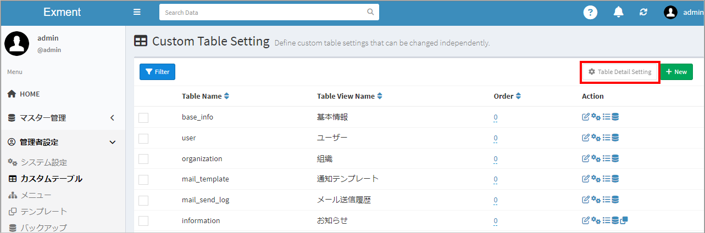
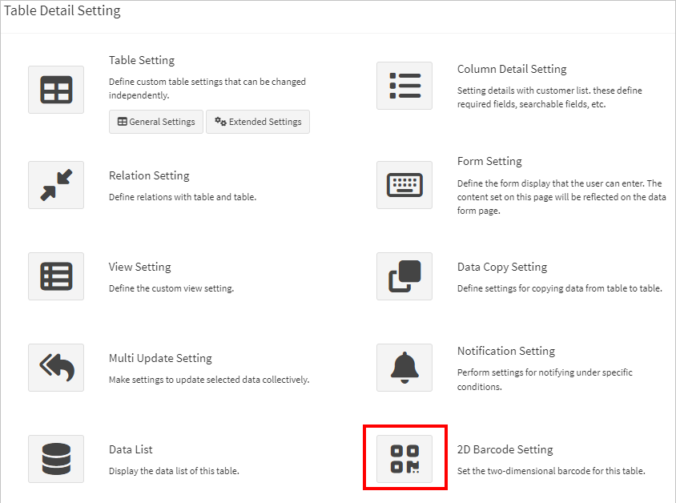
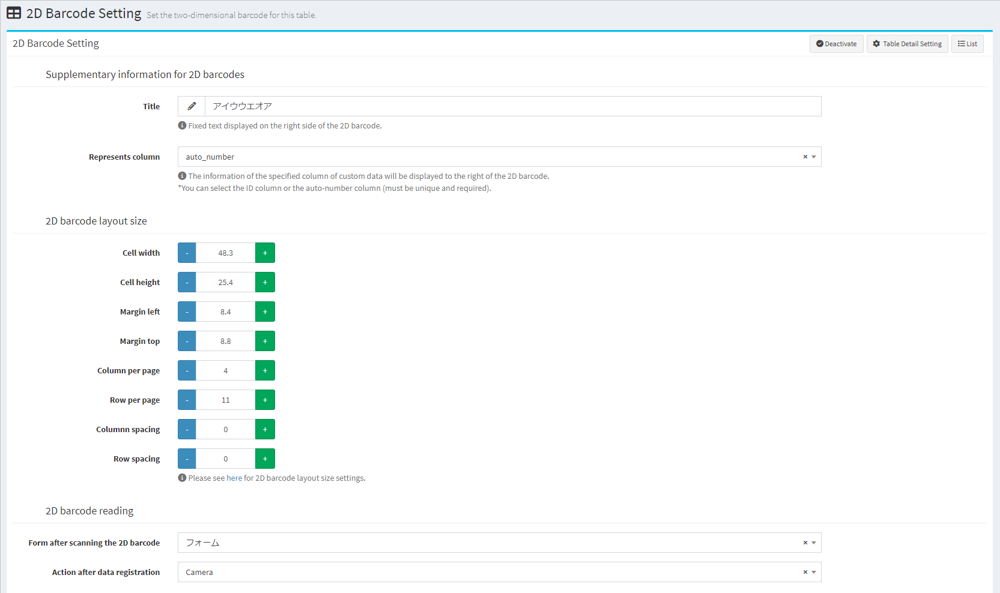
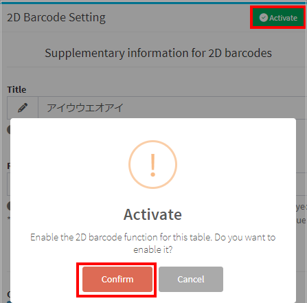
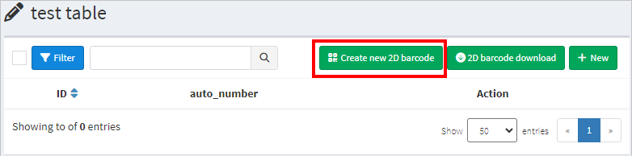
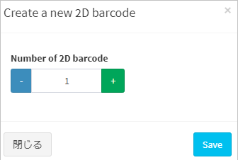
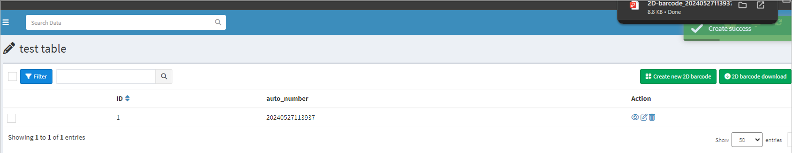
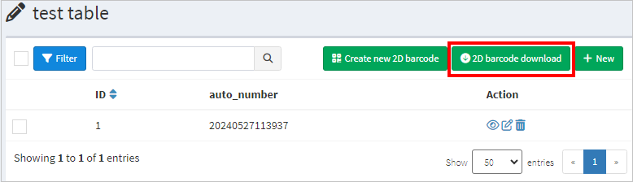
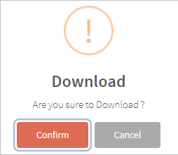
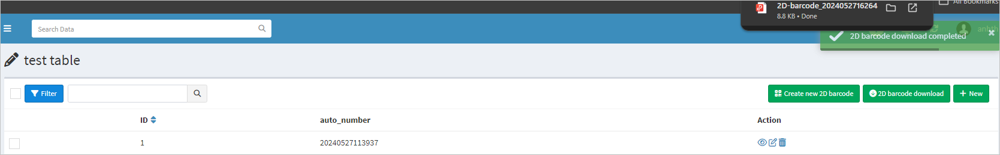

# 2D Barcode settings
Configure the 2D barcode settings for the table.

## Overview of the 2D Barcode Functionality
For an overview of the 2D barcode functionality, please refer to the [official website post](https://exment.net/release_v6-1-0/).

## Page display
- In the custom table list, check the table you want to configure and click "Table details settings" in the upper right corner.  

> ※ It is also possible to transition directly from the data list screen or data registration screen of the target custom table. In that case, please click "Table details settings" in the upper right corner.  

- On the displayed table details settings screen, click the 2D barcode settings icon to display the 2D barcode settings.  

## 2D Barcode setting items

### Supplementary information for 2D barcodes
Set the information displayed on the right side of the 2D barcode.

- #### Title
Enter the fixed wording that will be displayed on the right side of the 2D barcode.  

- #### Represents column
Sets the specified column of custom data to the right of the 2D barcode.    
You can choose an ID column or an auto-number column (must be unique and required).

### 2D barcode layout size
Set the layout size of the 2D barcode.  
Please refer to the table below.

| Case | Cell width | Cell height | Margin right | Margin top | Column per page | Row per page | Column spacing | Row spacing |
| ---- | ---- | ---- | ---- | ---- | ---- | ---- | ---- | ---- |
| 2x5 | 84 | 52 | 17 | 10.5 | 2 | 5 | 8 | 4 |
| 2x6 | 83.8 | 42.3 | 19.3 | 21.5 | 2 | 6 | 3.8 | 0 |
| 2x7 | 83 | 32 | 20 | 24 | 2 | 7 | 4 | 4 |
| 3x6 | 63.5 | 46.5 | 7.2 | 9 | 3 | 6 | 2.55 | 0 |
| 3x7 | 63.5 | 38 | 7.2 | 15.5 | 3 | 7 | 2.55 | 0 |
| 3x8 | 56 | 30 | 17 | 14.5 | 3 | 8 | 4 | 4 |
| 3x9 | 62 | 31 | 9 | 9 | 3 | 9 | 3 | 0 |
| 3x10 | 53.3 | 25.4 | 19 | 21.5 | 3 | 10 | 3.8 | 0 |
| 3x12 | 60 | 20 | 12 | 12 | 3 | 12 | 3 | 3 |
| 4x11 | 48.3 | 25.4 | 8.4 | 8.8 | 4 | 11 | 0 | 0 |

### 2D barcode reading
Sets information for reading two-dimensional barcodes. 

- #### Form after reading 2D barcode
Set up the registration form after reading the 2D barcode.  
You can select from custom forms registered in the target table. 

- #### Actions after data registration  
Set the display screen after data registration.  
You can select the TOP screen, list screen, details screen, edit screen, or camera startup screen.

After setting, click the "Save" button.

### Enable 2D barcode settings  
- In order to expose the 2D barcode function of the target table, it must be "enabled". Once saved, click the "Activate" button at the top right of the page.

## Create a new 2D barcode
- After enabling the 2D barcode function, the "Create new 2D barcode" button will be displayed in the data list of the target table.  
You can change the display name of the "2D barcode" on the "Create new 2D barcode" button by changing "EXMENT_TEXT_QR_BUTTON_JA/EN" in the .env file.

- Click "Create new 2D barcode" to display the new 2D barcode creation screen.

- If you enter the number of 2D barcodes and save, data will be created with the entered number and the 2D barcodes will also be output as PDF.

## 2D barcode download
- After enabling the 2D barcode function, a "2D barcode download" button will be displayed in the data list of the target table.  
You can change the display name of the "2D barcode" on the "2D barcode download" button by changing "EXMENT_TEXT_QR_BUTTON_JA/EN" in the .env file.

- Select the target data and click "Download 2D barcode" to output the 2D barcode of the selected data as a PDF.

## Launching the camera screen from Exment
- From the Exment dashboard, you can launch the camera screen to read 2D barcodes.

- For instructions on how to add the item "2D barcode reading" to the Exment dashboard, please see [here](/dashboard#_2d-barcode).