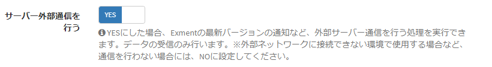

# Server external communication off
In Exment, communication may be performed from the Exment server to other servers.  
Specifically, it is executed for the following purposes.  
- Communicates with the package system and obtains the latest version information to determine if the Exment has the latest version.  

However, there may be cases where communication to other servers is not performed, such as when building in a completely on-premises environment.  
Describe the settings in that case.  

### Setup steps 
> This procedure has been changed from v1.3.0.

- From the left menu, transition to the "system settings" screen.  

- From the list, set the "Perform external server communication" item to NO.    

- Save and complete the settings.

[←Back to list of additional settings](/quickstart_more)