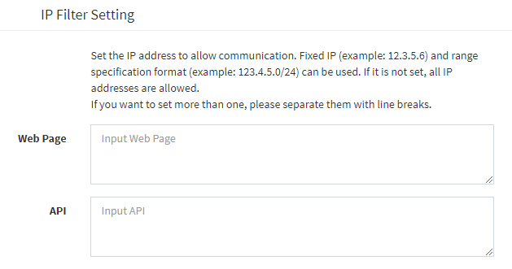

# IP filter
You can restrict the IP addresses that are allowed to access the Exment Web page and API.  
The IP addresses to be registered are of the white list type, and only the IP addresses to which access is permitted are registered.  
Also, register the allowed IP addresses separately for Web pages and APIs. Therefore, it is also possible to say, for example, "Only API, restrict the IP addresses that can be executed."  

### Setup steps
- Set Exment to expert mode.  
If you are not already in expert mode, open the ".env" file and add the following values:  

~~~
EXMENT_EXPART_MODE=true
~~~

- By opening the system settings screen, the IP filter item has been added.  

#### Setting details

- If you want to specify a fixed IP address, enter the IP address directly.
    - Example： 123.4.5.6

- If you want to specify a range of IP addresses, enter the IP address in subnet mask format.  
    - Example 1： 123.4.0.0/16 → access permission from 123.4.0.0 to 123.4.255.255  
    - Example 2： 123.4.10.0/24 → access permission from 123.4.10.0 to 123.4.10.255

- To allow access from localhost on a server built on localhost, enter ":: 1".

- To allow multiple IP addresses, enter them separated by line feeds. If any of the IP addresses match, access is allowed.

#### Forcibly disable IP restrictions
This is the procedure for disabling IP restrictions in cases such as when access to the Web page becomes impossible due to failure of IP address restrictions.  

- Open the ".env" file and add the following values:

~~~
EXMENT_DISABLE_IP_FILTER=true
~~~

[←Back to list of additional settings](/quickstart_more)