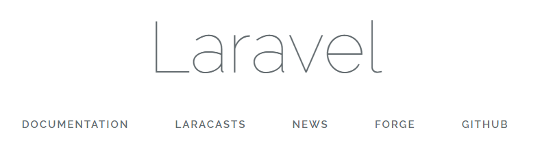

# Change / delete "admin" included in URL
By default, Exment includes the path "admin" in the URL.  
Example： http://localhost/admin  

Without "admin" ([http: // localhost] (http: // localhost)), the following page will be displayed. This is the specification of the framework used.  
  
By this specification, it is possible to build another site that can be viewed by general users who do not need to log in, if the URL does not have "admin".  
  
However, in some cases, there are also the following cases.  

1. If you want to configure Exment alone. When displaying Exment with a URL without "admin"
1. If you want to change the path name "admin"

Here are the steps for these cases.

### Change procedure

- In the root directory of Exment, open the ".env" file.

- Add one of the following values:

~~~
### 1.If you want to completely delete "admin"
ADMIN_ROUTE_PREFIX=
# "http://localhost" becomes the URL of Exment

### 2.To change "admin" to another name
ADMIN_ROUTE_PREFIX=admin184628
# "http://localhost/admin184628" becomes the URL of Exment
~~~

※Please note that this manual assumes that "admin" is added.  

[←Back to list of additional settings](/quickstart_more)