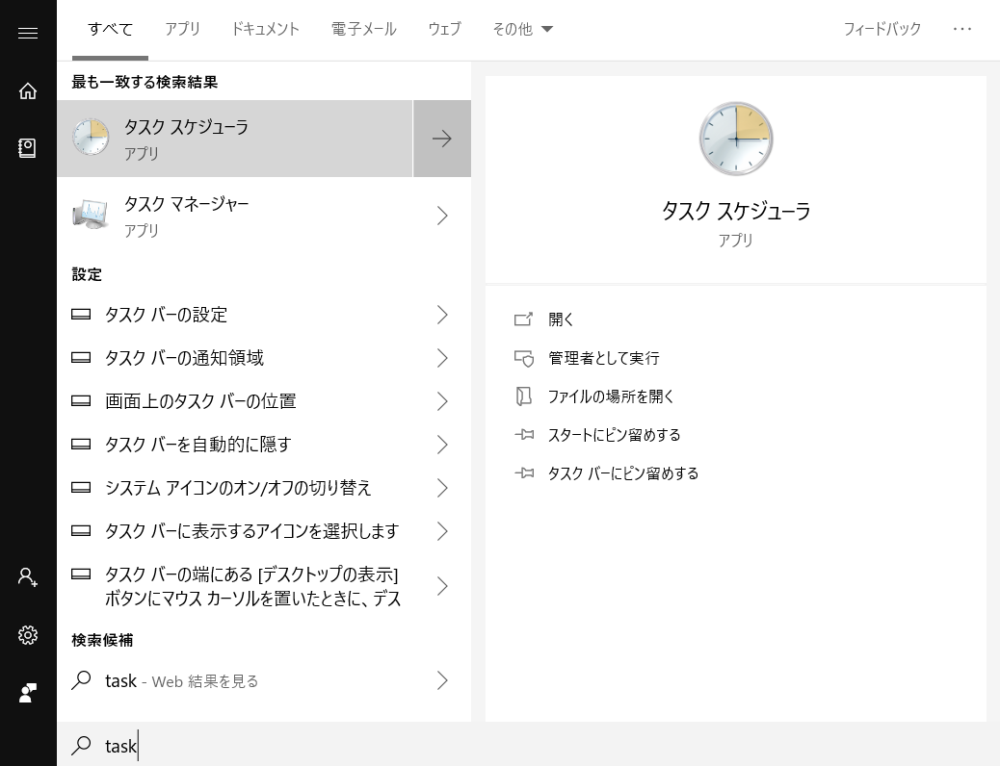
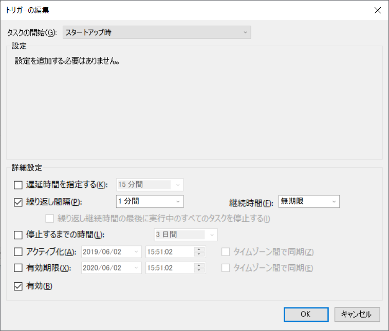
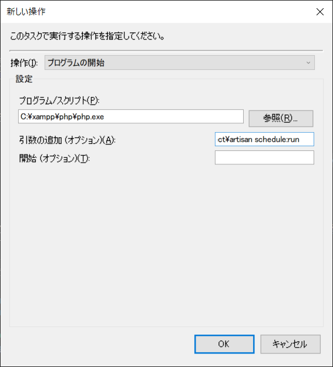
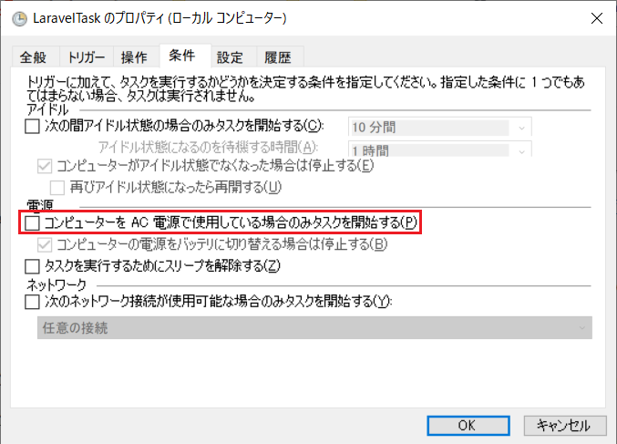
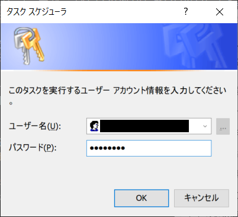

# Task schedule
Exment has a task scheduling function.  
Specifically, it is used for the following purposes.  
- Back up databases and files daily at a fixed time.
- Send e-mail at a specific time to a person who is interested in data that matches specific conditions, based on the notification settings that are set in advance.  

Performing these functions requires additional work on the server side.  
The procedure differs depending on Linux and Windows.  

### Setup steps(Linux)
- Execute the following command.

~~~
crontab -e
~~~

- The Cron setting screen will be displayed. Fill in the following information.  
With this setting, the artisan schedule command is executed every minute.  
After that, the Exment system will execute the task at a fixed time.  

~~~
* * * * * cd /(Exment root directory) && php artisan schedule:run >> /dev/null 2>&1
~~~

### Setup steps(Windows)
- Execute the following command and copy the path where the php.exe file is located.  

~~~
where php
// C:\xampp\php\php.exe
~~~

- In the windows menu, enter "task" to start the task scheduler.  

- In Task Scheduler, click Create Task.

- On the "General" tab, set as follows. ("Name" is an arbitrary name)

- Click the Triggers tab. Create two triggers.  
    (1)Click the "New" button.  
    Then make the following entries:  
    - Start task: At startup
    - Repeat interval: 1 minute
    - Duration: Indefinite
    - Check "Enable"
    Click OK when done.  

- (2)Click the "New" button again.  
    Then make the followingTask start: when creating / modifying a task entries:  
    - Task start: when creating / modifying a task  
    - Repeat interval: 1 minute  
    - Duration: Indefinite  
    - Check "Enable"  
    Click OK when done.  

- On the Operations tab, click the New button.  
    Then make the following entries:  
    - Operation: Start program
    - Program / Script: Path to php copied earlier
    - Add arguments: (Exment root directory)/artisan schedule:run

- On the "Settings" tab, check "Execute task immediately if task could not be started at scheduled time".

- For laptops, on the Conditions tab, uncheck "Start task only when computer is running on AC power". 

- When you have completed these settings, click OK.  
After that, you will be prompted to enter your user credentials, please enter your password.  

- After completing the settings, select the created task in “Task Scheduler Library” and click “Execute”.

This completes the settings.

[←Back to list of additional settings](/quickstart_more)