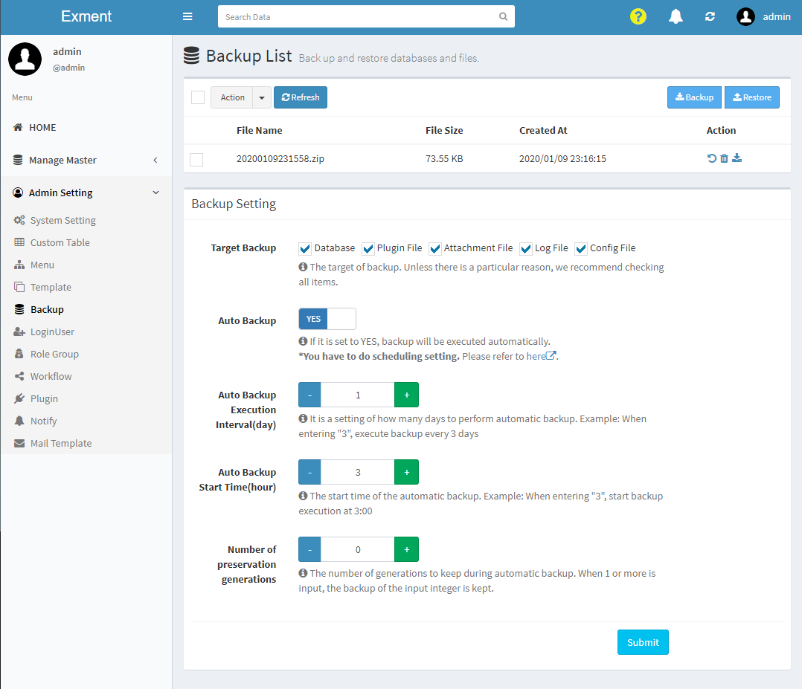
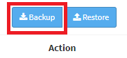
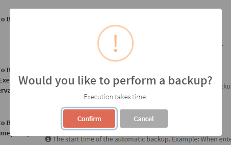
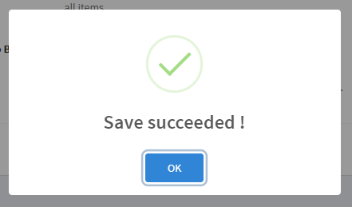
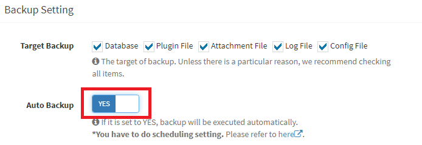
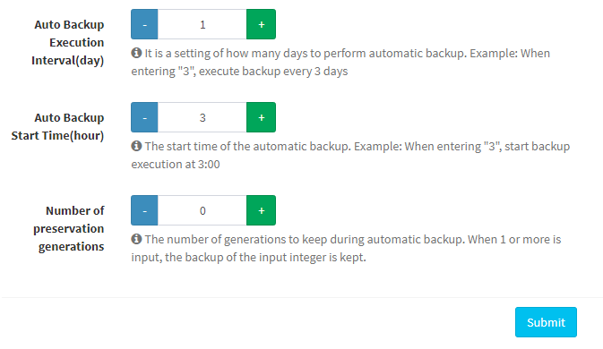
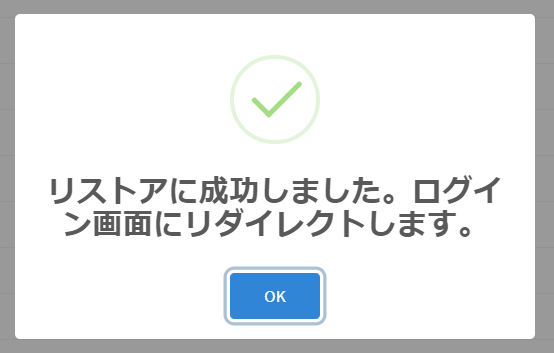
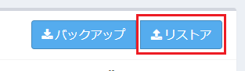
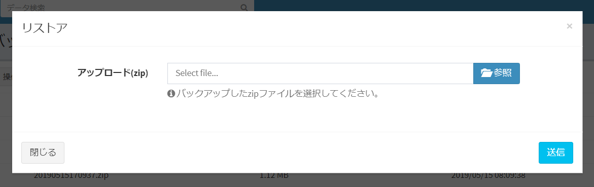

# Backup and Restore
Exment data can be backed up and restored.

## Overview
Exment allows you to backup and restore your data.  
For example, you can do the following:  

- Before making large data updates, make backups in advance and restore them if anything goes wrong.
- Keep a backup every day to guard against unexpected failures.
- Migrate all data from one environment to another. (Be sure to check the operation before implementation.)

The backup target is as follows.
- Database
- Plugin file
- Attachments
- logfile
- setting file 

## screen
- From the left menu, select "Admin Settings> Backup".
Or access the following URL.  
http(s)://(Exment URL)/admin/backup  
This will bring up the backup screen.  

## Backup
There are two types of backup methods: "manual" and "automatic".  

### Perform manual backup
This is the procedure to perform backup manually.  
You can perform backup at any time.    

- Click the "Backup" button at the top right of the page.    
  

- A confirmation dialog is displayed. Click "Confirm" and wait.  
**※Backups are very time consuming. Please wait without operation.**
  

- When complete, a message is displayed.  
After that, a file with the creation date and time of execution is created in the backup list.  
  
  

- The created backup file can be downloaded.  
Click the "Download" link in the backup row.  
  

### Automatic backup execution
Exment allows you to automatically back up at a fixed time.  
By making regular backups, it is possible to restore data in the event of a major data update error.  
**※It is necessary to set [Task Schedule](/quickstart_more#Task-Schedule) in advance.**

    
As an example, it is a method of setting "backup for seven generations" at "3:00 at night", "every other day".  

- Select "YES" for "Auto Backup" from "Backup Settings".
  

- Change the option settings.
  

- Then, click the "Save" button at the bottom of the page.  

### (Advanced) Command backup
Backup by command is also possible. Execute the following command in the root directory of the project.

~~~
php artisan exment:backup
~~~

## Restore
There are two ways to restore (restore) data: "Select from backup list" and "Upload".  

### Notes on Restoration
- If the version of Exment at the time of backup and the version of Exment currently installed are different, it is necessary to update the database after restoration.  
Example： Version at the time of backup: v1.1.6 Current version: v1.2.0 → Database needs to be updated.
In this case, execute the following command after restoration.

~~~
php artisan exment:update
~~~

- After restoration, you will be automatically signed out.  
Log in with the user ID and password that were backed up.

### Select from backup list
This is a method of restoring data by selecting a file to be backed up from a list of backups performed in the past.  

- From the backup list, click the "Restore" link.  
  

- A confirmation dialog is displayed. Click "Confirm" and wait.  
**※Restore is very time consuming. Please wait without operation.**
  

- When the completion message is displayed, the environment will be restored to the state at the time of backup.  
You will be automatically redirected to the login page.  
  

### Upload
This is a method to upload a locally stored backup to Exment and restore the data.  
**※If the size of the uploaded file is too large, it may not complete successfully.**  
In that case, please refer to the following menu "If the file size is too large to upload".    

- Click the "Restore" button at the top right of the page.  
  

- A file upload dialog will be displayed. Select the locally downloaded backup file and click "Send".  
  

- Click the "Send" button and wait.  
**※Restore is very time consuming. Please wait without operation.**

- When the completion message is displayed, the environment will be restored to the state at the time of backup.  
  

### When uploading is not possible due to large capacity
When restoring using the "Upload" method, if the size of the backup file is too large, the restoration may fail.  
In such a case, perform restoration according to the following procedure.  

- Place the downloaded backup file in the following path on the server:  

~~~
(Project root directory)/storage/app/backup/list
~~~

- Reload Backup screen.  

- The placed backup file has been added to the backup list. Restore from "Select from backup list" in the above menu.  

### (Advanced) Restore by command
Restoration by command is also possible. Execute the following command in the root directory of the project.

~~~
php artisan exment:restore (zip file name)
~~~

### (For advanced users) Change backup destination
Normally, backup files are located on a web server.  
However, there may be requests to place the backup files in a different location.  
If you put it in another location, you can download a backup file from another location and restore Exment if the web server goes down for some reason and can't start.  
  
※The setting procedure has been moved to [here](/additional_file_saveplace).  

### Notes
- Depending on the server, the above backup destination change may not be possible.  

Especially in the case of a rental server, **There may be restrictions on FTP etc. depending on the setting of the provider.** Please note.