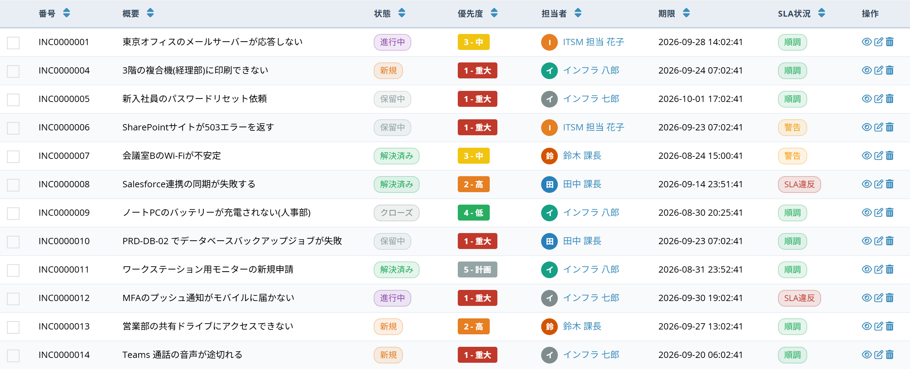
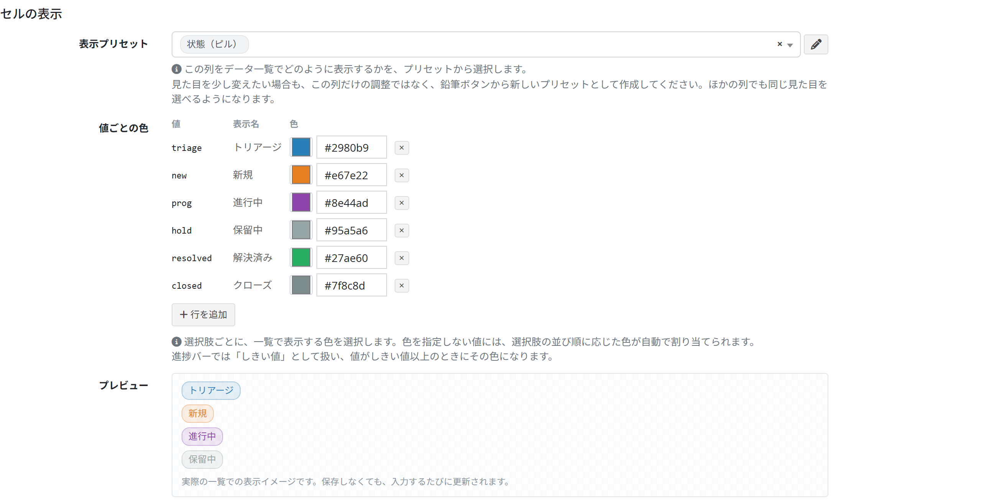
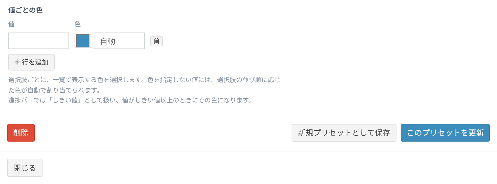

# Cell style presets

Save how a cell looks (colour, shape, icon) under a name, and reuse it on any column of any table. The same look is worn by the data list and by the cards of a kanban view.

## What a preset is

Until now the look of a cell was set **one column at a time**. The same "status pill" had to be rebuilt by hand on every table and every column that needed it.

A preset is that work done once. The column, or the view column, stores only *which preset to use*, so:

- the same look can be picked from a list on any other column, on any other table
- editing one preset repaints every column that points at it, all at once

## Where presets are used

| Screen | What it does | Permission |
| --- | --- | --- |
| Cell style presets (the library) | List, create, edit and delete presets | System permission |
| Custom column setting &gt; Cell appearance | Pick the default look of that column | Table setting permission |
| Custom view setting &gt; Select view columns | Pick the look for that view only | Table setting permission |
| Kanban view setting &gt; Card columns &gt; Style | Pick the look the card draws | Table setting permission |

A preset does not belong to a table. Create it once and it can be picked from any table.  
A preset picked on a view **wins over the column setting**.

## The library screen

### Opening the page

Open `(your Exment address)/admin/cell_style_preset` in the browser.

To reach it at any time, add it to the [menu](/menu.md).

1. Open "Administrator setting" &gt; "Menu".
2. Click [New] at the top right.
3. Choose "System" as the menu type and "Cell style presets" as the menu name.
4. Choose the parent menu to show it under, and save.

| Column | Content |
| --- | --- |
| Preset name | The name shown in the pickers |
| Preview | How the data list will paint it |
| Column types | The column types the preset is offered on |
| Order | Position in the pickers (smaller comes first) |
| Updated | Last update |

A fresh installation already carries 14 presets.

| Preset name | Main column types |
| --- | --- |
| Status (pill) | Choices |
| Status (badge) | Choices |
| Label (tag) | Choices |
| Choices (dot) | Choices |
| Priority (square dot) | Choices, choices (value and label) |
| Level (round dot) | Choices, choices (value and label) |
| YES/NO (badge) | YES/NO, two-value choice |
| Assignee (avatar) | User, organization |
| Progress (bar) | Integer, decimal |
| Number (bold) | Integer, decimal, currency |
| Date (no wrap) | Date, datetime, time |
| Code (monospace) | Single line text, auto number, URL, e-mail |
| Alert (red, bold) | All column types |
| Fill the whole cell | All column types |

The presets shipped with Exment can be edited and deleted on this screen too.

### Creating and editing a preset

Click [New] at the top right of the list, or the edit icon of a row.

#### Preset name
The name shown in the pickers. Required.

#### Cell style

| Option | What it draws |
| --- | --- |
| Plain | No decoration (the previous behaviour) |
| Text colour only | Colours the text |
| Tag (small radius) | A bordered tag with slightly rounded corners |
| Pill (large radius) | A tag with fully rounded corners |
| Badge (filled) | A filled badge |
| Square dot + text | A square colour mark before the value |
| Round dot + text | A round colour mark before the value |
| Monospace | Fixed width characters (codes, IDs) |
| Avatar (initial circle) | The initial in a circle (assignees) |
| Progress bar (0-100) | The value as a horizontal bar |
| Fill the whole cell | Paints the whole cell background |

#### Text colour
The colour of the value.  
On a choice column with no "colour per value" set, a colour is assigned automatically following the order of the choices.

#### Background colour
The background of a tag, pill or filled cell. Built from the text colour when left empty.

#### Border colour
The border of a tag, pill or filled cell. Built from the text colour when left empty.

#### Font weight
Normal, semibold or bold.

#### Icon
An icon drawn before the value, chosen from the button.  
Not drawn for "Avatar", "Progress bar" and "Fill the whole cell".

#### No wrap
Set YES to stop the text wrapping inside the cell. Useful for dates and numbers.

#### Column types
The preset is offered on the checked column types. Check none to offer it on every type.

#### Order
Position in the pickers. Smaller comes first.

## Assigning a preset to a column

1. Open the table, then [Table detail setting] &gt; [Custom column setting].
2. Open the column and scroll to "Cell appearance".

3. Pick a preset from "Appearance preset". Each option is drawn in its own style.

4. The "Preview" below follows the choice immediately - nothing has to be saved first.

5. Save with the button at the bottom of the form.

### Colour per value

On a choice column, "Colour per value" gives each choice its own colour.  
Values with no colour get one automatically, following the order of the choices.

On a progress bar the value is read as a **threshold**: the bar takes that colour once the value reaches it.

## Creating or editing a preset without leaving the form

The pencil button next to "Appearance preset" opens the preset editor in place.

Everything typed on the left updates the preview on the right straight away.

| Button | What it does |
| --- | --- |
| Save as new preset | Adds the current settings as **another** preset. The original is untouched. |
| Update this preset | Overwrites the preset being edited. **Every other column using it changes too.** |
| Delete | Deletes the preset. Press twice to confirm. |
| Close | Closes without saving. |

> To use an existing look with small changes, use **"Save as new preset"**, not "Update this preset" - updating changes every column that picked it.

## Assigning a preset to a view column

The same table often has to be shown differently from one view to the next.  
Pick the preset in "Select view columns" on the custom view setting.

Choose a preset per row in the "Cell appearance preset" column. The pencil button opens the same editor.

A preset picked here **wins over the custom column setting**. Leave it empty to follow the column setting.

## Questions

#### What happens to a column when its preset is deleted
It falls back to the plain, undecorated look. The data is not affected.

#### The preset is missing from the picker
Its "Column types" probably does not include that column's type. Open the preset on the library screen and check it; leave every box unchecked to offer it on all types.

#### Changing one look changed another table too
Presets are shared across the whole installation. To change one table only, use "Save as new preset" and pick the new preset there.

## See also

- [Custom columns](/column.md)
- [Custom views](/view.md)
- [List of data](/data_grid.md)
- [Kanban view](/view_kanban.md)
