# Custom column management
Set the columns of the custom table, "custom columns".  

## Settings screen
- In the custom table list, put a check in the table you want to set, and click "Custom column setting" on the upper right.   
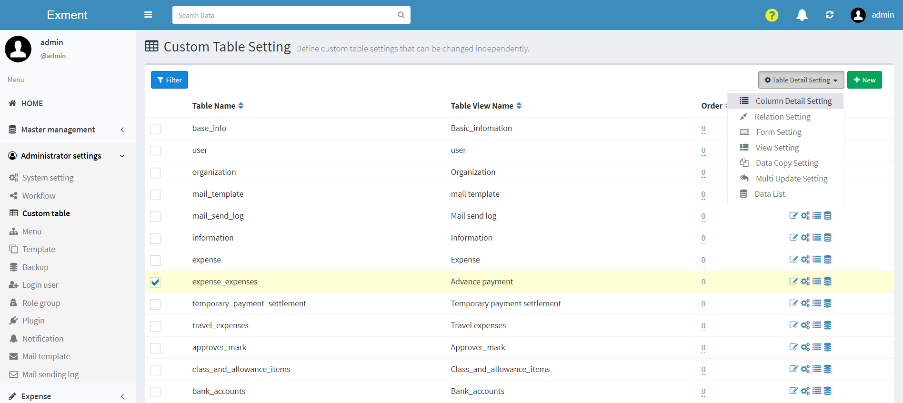

- Or, after selecting the table you want to set from the menu, similarly click "Custom column setting" on the upper right.  
※ A setting to display the corresponding table on the menu is required in advance.  
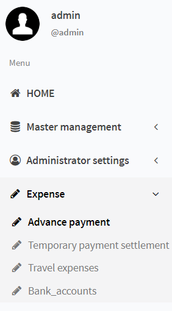

- This will display the list of columns of the checked custom table.  
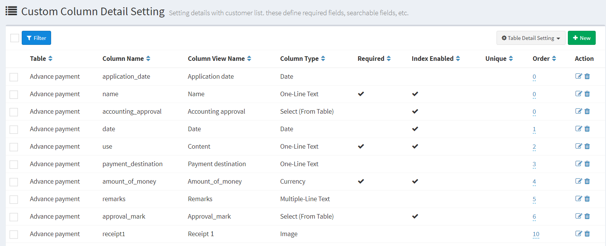

## Add new column
- On the "Custom column setting" screen, click the "New" button at the top right of the page.

- The screen for adding a new custom column is displayed. Enter the necessary information.
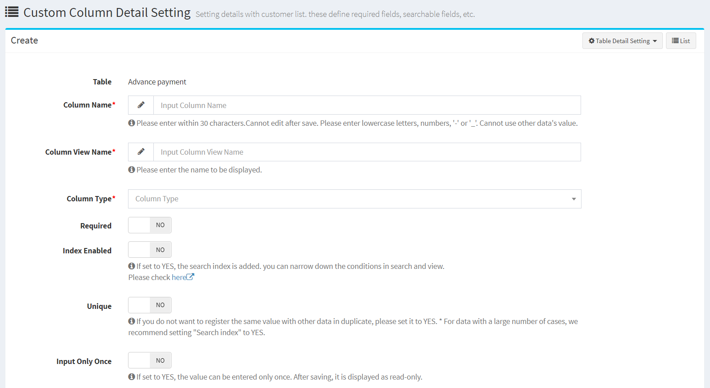

## Save
After entering the settings, click “Submit”.

## Edit
If you want to edit a column, click the "Edit" button in the corresponding row.    
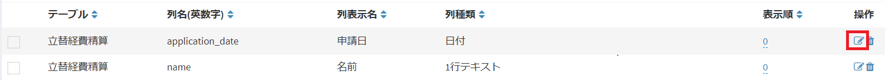

## Delete
If you want to delete a column, click the "Delete" button in the corresponding row.
  
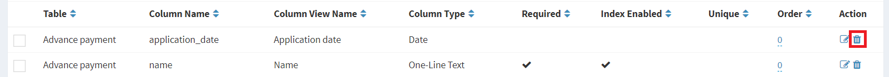
**※However, the columns installed in the system cannot be deleted.**

## Entry details (common)
- Column name (alphanumeric): The name of the column used in the system.  
Enter with alphanumeric characters or "-" or "_".  
It can only be set once and cannot be changed.  
**The following names cannot be used.**  
id, suuid, parent_id, parent_type, created_at, updated_at, deleted_at, created_user, updated_user, deleted_user

- Column display name: The name of the column displayed on the screen.

- Column type: The type of column to be set. The contents registered in this item will be applied to the form at the time of data registration.  
    - One line text: One line text (text box).
    - Multiline text: Multiline text (text area).  
    - URL: URL.  
    - Email address: Email address.  
    - Integer: A form where only integers can be entered. In the data registration form, "+" and "-" buttons are displayed on the left and right of the item, and the value can be increased or decreased by clicking.  
    - Decimal point: This is a form where only decimal numbers can be entered. By setting the percentage display to YES,% will be displayed when displaying data.  
    - Date: Date item. In the form at the time of data registration, you can change the date from the calendar.  
    - Time: Time item. In the data registration form, you can change the time from the clock.  
    - Date and time: Date and time items. In the data registration form, you can change the date and time from the calendar and clock.  
    - Choice: The value and the heading are the same choice list.  
    - Choice (Register value / heading): A list of choices with different values ​​and headings.  
    - Choice (select from a list of values ​​in another table): Create a choice where the choice is an item in another table.  
    - YES / NO: Create a switch to switch between “YES” and “NO”. When registering data, YES is registered as 1 and NO is registered as 0.  
    - Binary selection: Creates a switch that switches between two values. You can also change the value at the time of data registration.  
    - Automatic numbering: Create values ​​such as UUIDs and random character strings when creating data.    
    - Image: An item to upload an image.  
    - File: An item to upload a file.  
    - User: An option to select a user for the system.  
    - Organization: An option to select the organization of the system.  

- Required: Select whether the field is required.  
If set to YES, it will be a required item on the data entry screen, and if not entered, an error will be displayed.

- Search index: See "[Search index](#Search-index)" below. 

- Unique (unique): If set to YES, you will not be able to register values that duplicate other data when registering data.  
Please refer to [Compound unique key setting](/table.md#Compound-unique-key-setting) if you want to prevent duplicate registration in a specific combination by multiple column values.  

- Enter once only: If you set YES, you can make it a column where data can be registered only at the time of new registration.  
It is for display only when editing data.

- Initial value: Value to be entered as an initial value in the form item.  

- Placeholder: A character string registered as a placeholder in a form item.    

- Help: Content displayed as information below the form item.  

- Display order: Specify the display order on the custom column list screen.  

- Add to default form view: If YES, add columns to the default form view as new ones are created.  
It can be set only when creating a new column. When updating, please change from [form screen](/form.md) and [view screen](/view.md).

## Detailed explanation of entry items (by column type)
- Maximum number of characters (single line text, multiple line text): The maximum number of characters that can be entered in form items.  If it exceeds, an error will occur.  

- Suggest input (single line text): Displays values ​​that match the input content as input candidates from the data values ​​already registered in the same custom column.
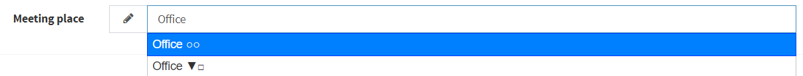

- Regular expression (1 line text): The input contents can be validated by regular expression. See [Regular Expression](#Regular-Expression) for details.

- Minimum value (integer, decimal): The minimum value that can be entered in the form item. If you send below that value, an error will occur.  
If left blank, the minimum value will not be checked.  

- Maximum value (integer, decimal): The maximum value that can be entered in the form item. If you send more than that value, you will get an error.  
If not entered, the maximum value will not be checked.  

- Choices (Choices, Choices (Register values ​​/ headings)): Register choices to be displayed as candidates in form items.  
Register multiple candidates with line breaks.  
If "Choice (Register value / heading)" is selected for the column type, the first column will be the value and the second column will be the heading, with a comma as the column separator.  
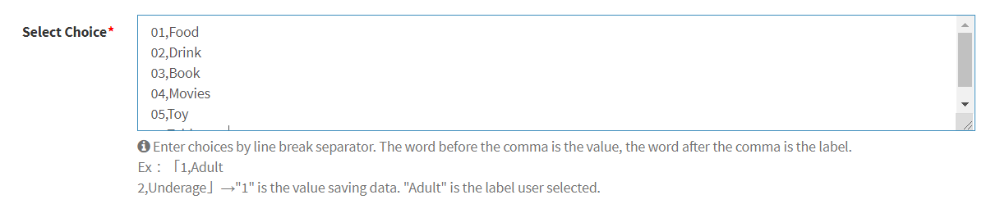
↓  
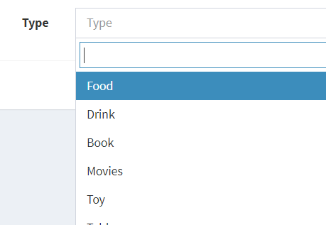  
When saving data in the form, the value of the first column is saved in the database.  

- Target table (Choices (select from a list of values ​​in another table)): In the form field, specify the table to be displayed as a choice candidate.  

- Numbering type (automatic numbering): Select the type of numbering when registering data.
    - Format: Register the numbering in the format specified by the user.  
    - Random (license code): Register a random character string of 5 characters x 5 and 25 characters.  
    - Random (UUID): Register a random string of 32 digits in total.  

- Number of digits (automatic numbering): The number of digits to be registered as data at the time of automatic numbering.  
Register the missing part with zero padding.  

- Allow multiple selections: Set YES if you want to make multiple selections for items such as images, files, and options.  

## Automatic numbering format rules
If you set the column type to "Automatic numbering" and the numbering type (automatic numbering) to "Format", you can register automatic numbering with your own rules.  

- See the following pages for the parameter variables that can be set.  
[Parameter variables](/params)

## Search index
"Search index" is a function that is set in the database in advance to improve the performance of data search.  
"Index" is also called "index".  
In Exment, some functions are enabled only when this search index is set to YES.  
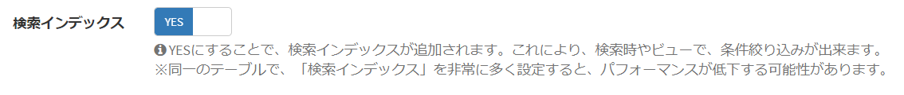    

When set to YES, the following functions are enabled.    
- [Custom View](/view)is displayed in "Target column" in "Display condition" setting.  

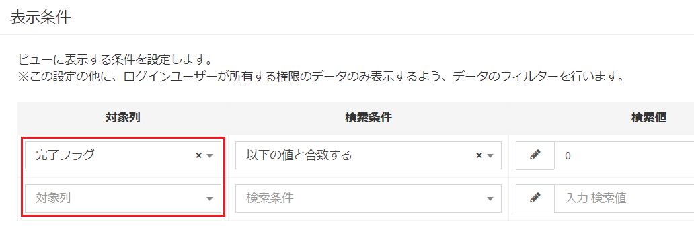    

- [Custom view](/view) "Sort" setting, it is displayed in "Target column".  

    

- It is displayed in the item of "Filter" setting of [List of data](/data_grid).  

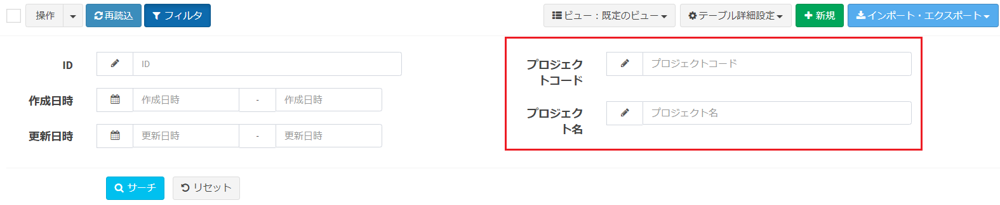    

- [Data list](/data_grid) "sort" icon is displayed.  
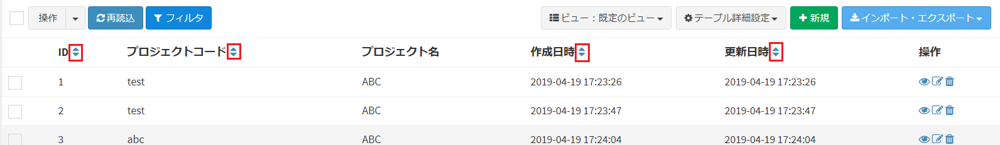    
- When a user enters a word in the search bar at the top of the page, it becomes a search target for data search.  
Set YES for columns that you want to search on the search screen, such as various codes and various names.  

※ If you set a large number of "search indexes" in the same table, performance may decrease when new data is created or updated.  
Up to 10 "search indexes" can be set in the same table.  

## Use in labels
> This setting method has been changed to [Extended setting of custom table](/table#Extended-setting-of-custom-table) in v1.3.0.

## Regular expression
> This setting is displayed only when [Expert mode](/quickstart_more#Expert-mode) is enabled.  

If the custom column setting is "1 line text", you can perform validation by regular expression.  

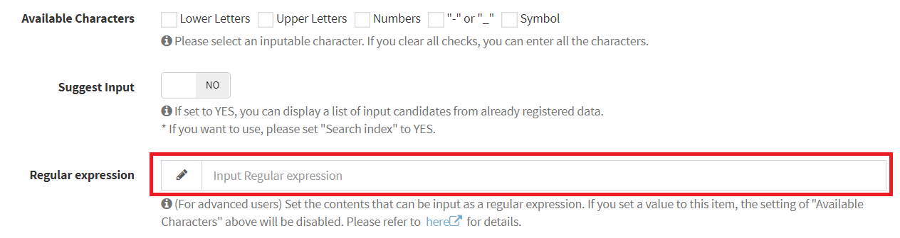  

#### Regular expression example
~~~
# Phone number  
^0\d{2,3}-\d{1,4}-\d{4}$

# Postal code  
^\d{3}-\d{4}$

# Hiragana only
^[ぁ-ん]+$

# Katakana only
^[ァ-ヴ]+$
~~~

#### Other
- If a regular expression has been set, "Usable characters" will be invalid.  
- Judgment of regular expression uses PHP function.  
When searching for a regular expression sample, please search based on PHP regular expressions.  
- The "/" at the beginning and end of the sentence and the "u" at the end of the sentence are not required.  
- The contents of regular expressions are not eligible for free inquiry. Please note.

