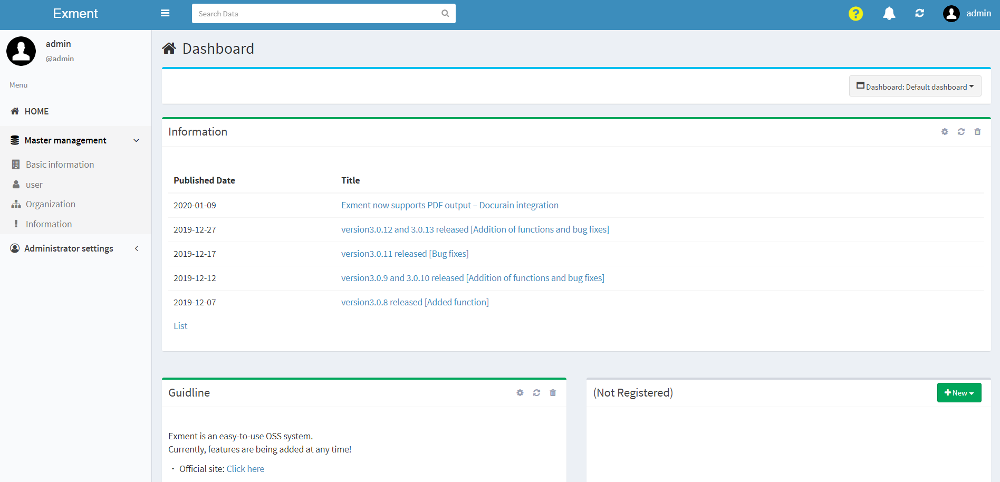
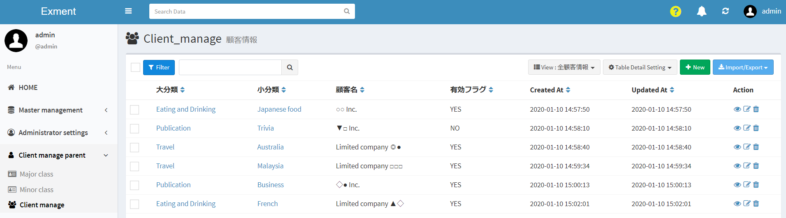
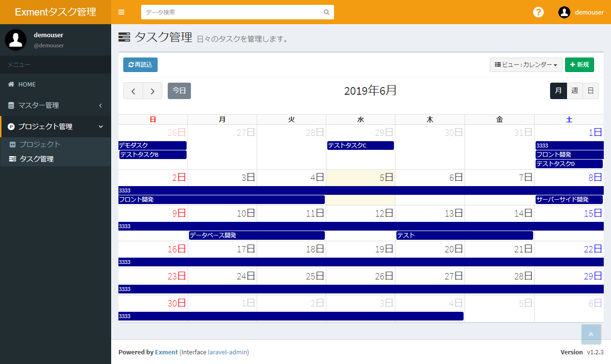

# Exment concept
Exment is a "Web database that can manage anything".  
By adding the content you want to manage to the Exment system, you can take on various roles.  
  
This can be easily understood by comparing with Excel.  
If you create a new file in Excel, an empty sheet will be displayed. At this point, the Excel file has no role.   
  

Users add meaning to this sheet by adding columns and sheets.  

  
      
In this case, by adding information such as "id", "customer name", "zip code", and "address", it will have the role of "customer management".  

Exment is the same concept.  
By default, Exment has minimal features, such as user management and notification management.  
From here, users will add various functions themselves.  

    

For example, the system administrator configures the settings for "Customer Management", and this Exment has the role of "Customer Management".  

    

In addition, this Exment has the role of "task management" when the system administrator configures the settings related to "task management".  

    
  
In this way, the system administrator can freely set up various roles.  
The possibilities are endless. The usage is endless.  
In addition, there are various advantages by managing with Exment.  
Please check [here](https://exment.net/merit) for the benefits.