# Dashboard
This screen is displayed when you log in to Exment or when you click "HOME" or "site name displayed in the upper left".  
By freely customizing the display method, information managed by Exment can be displayed in various formats.  
### Dashboard display example

## Creating a new dashboard
- Click "Create New Dashboard" at the top right of the dashboard screen.  

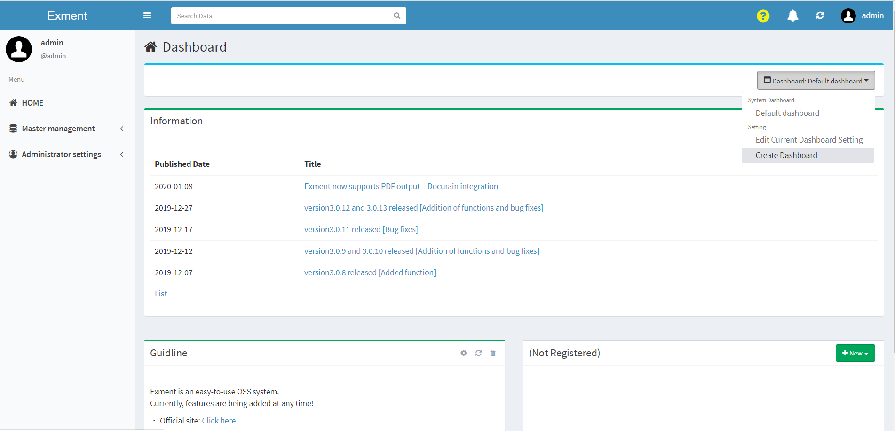
  
- Set the necessary items on the dashboard.  

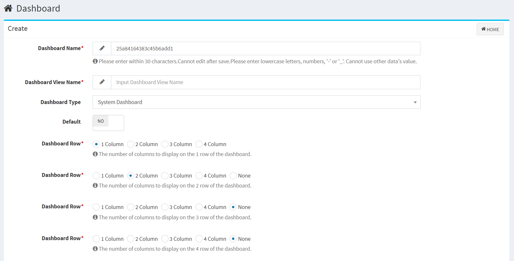

## Dashboard settings
#### Dashboard name (alphanumeric)
Indicates the name of the dashboard.
It cannot be changed after saving.

#### Dashboard display name
The name to display on the screen when selecting a dashboard.  
Japanese settings are available and can be changed after saving.  

#### Dashboard type
Select either "System Dashboard" or "User Dashboard".  

"System Dashboard":  
Only the system administrator can make settings.  
The dashboard will be available to all users.  
  
"User Dashboard":  
Dashboard settings that can be set by anyone other than the system administrator.  
The dashboard will only be available to the user who created it.    

※"System Dashboard" cannot be changed to "User Dashboard" later.  

**"User Dashboard" created by the system administrator** can be changed to "System Dashboard" later.  
※By setting [Disable User Dashboard](/config.md?id=Disable-User-Dashboard),general users cannot create dashboards.

#### default
Select either "YES" or "NO".  
If you have created multiple dashboards, the dashboard displayed when you open the dashboard will be the dashboard set to "YES".  
※By selecting from the list, the dashboard set to "NO" can also be displayed.  
※"Default" can be set to "YES" only for one dashboard.  
If "YES" is specified for two or more dashboards, the dashboard will be changed to "NO" except for the dashboard that was last set to "YES".

#### Select number of columns
Select the number of columns to display in each row of the dashboard.  
Up to 4 columns can be displayed per line. 
※The number of columns and the display area per one are inversely proportional.  

### Example of displaying four columns in one line
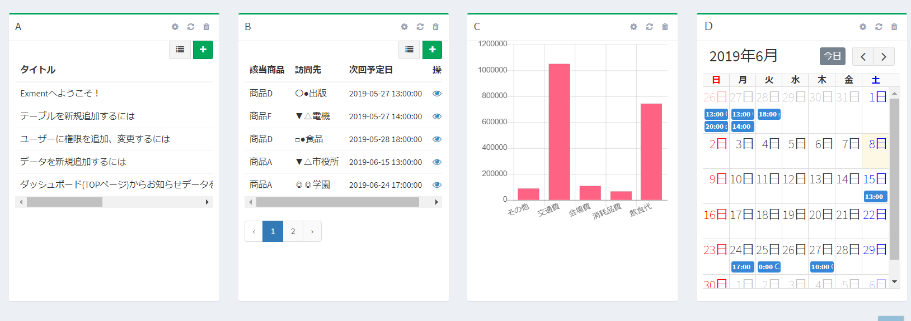  

# Select items to display
You can select the item you want to display from these four types,
"Data List", "System", "Chart", "Calendar" in the upper right "New" of each column of the created dashboard.  

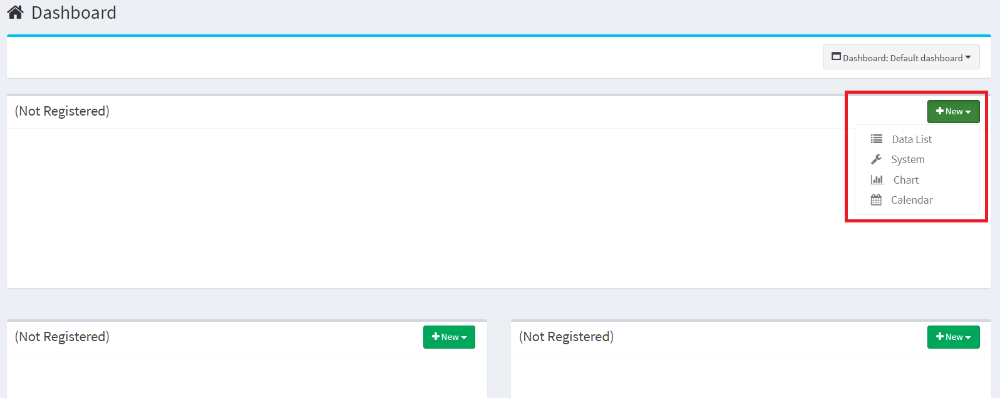  

Next, set the specific display contents for each item.

## List of data
A data list can be displayed on the dashboard by specifying any table or view from the information managed by Exment.

### Display example of data list
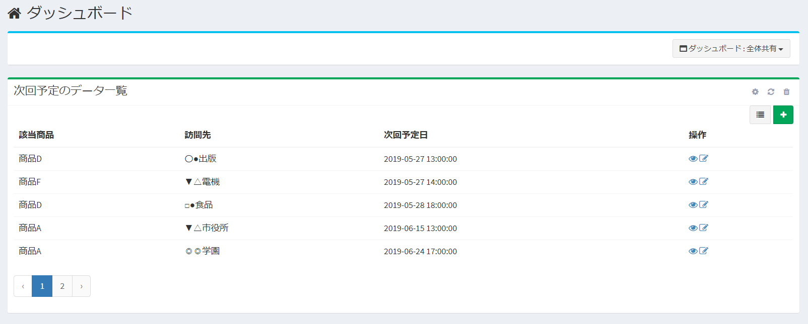

### Data list setting items
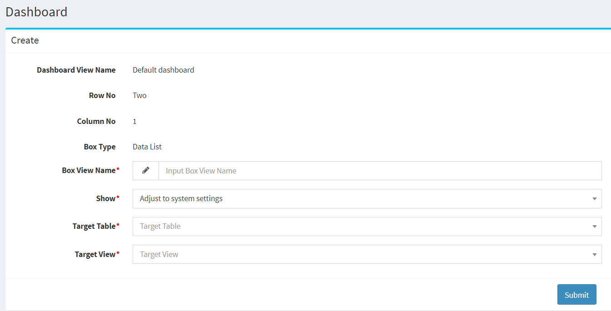

#### Item display name
Enter the name of the item to be displayed on the screen.  

#### display
Select how many data to display at one time.  

#### Target table
Select the target to be displayed from the created tables in [Custom table settings](/table.md).

#### Target view
Select the target to be displayed from [View](/view.md) in the selected target table.  

## system
You can display system-related information on the dashboard.  
※ Currently, you can display "Guidelines," "List of latest Exment information," "Editor," "HTML," "Notifications list," and "2D/JAN barcode"

### System settings
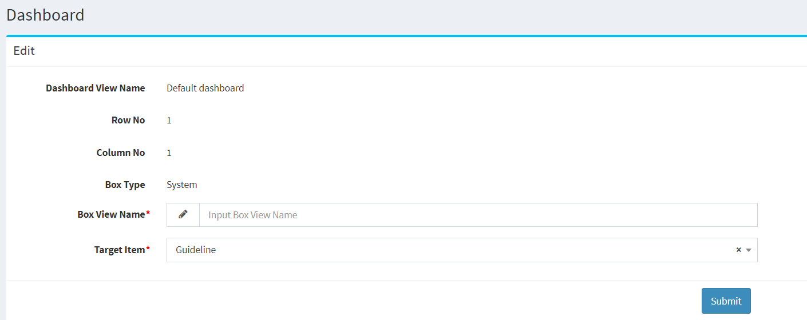

#### Item display name
Enter the name of the item to be displayed on the screen. 

#### Display Items
Select the items you want to view.

- ##### Guidelines
It can display information about the system.  
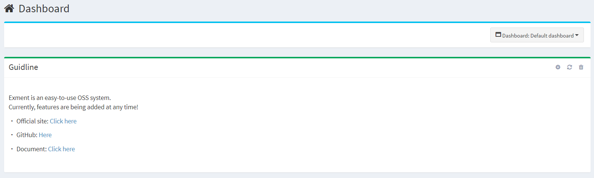

- ##### Exment Latest News List
The latest information is obtained and displayed from the Exment official website.
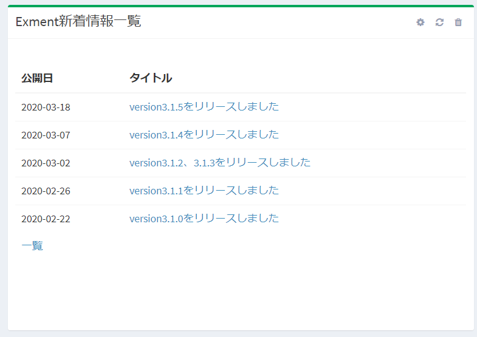

- ##### Editor
Enter the text freely and display it on the screen.
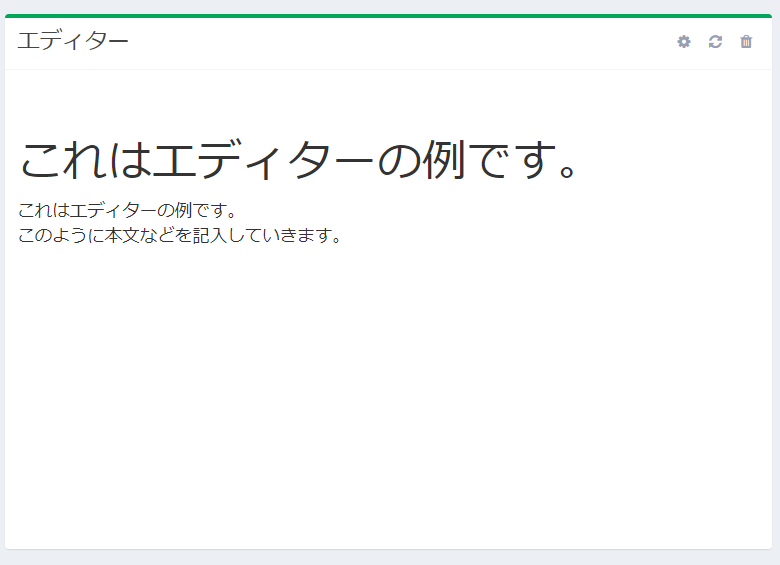

- ##### HTML
Enter the content in HTML format and display it on the screen. *Scripts will also be executed.
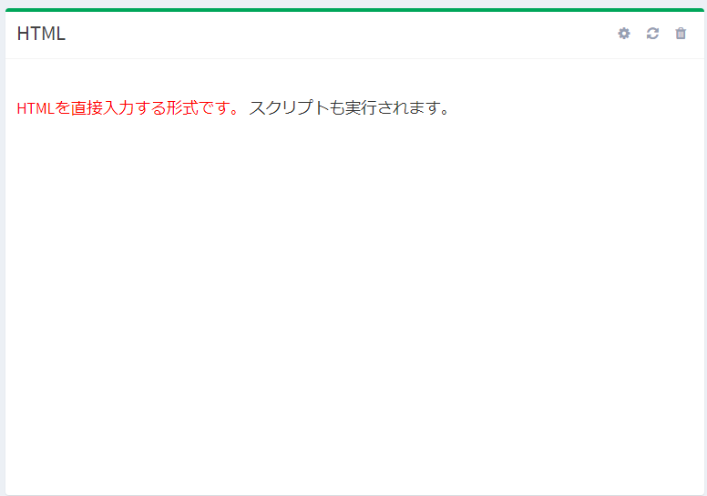

##### 2D/JAN Barcode  
Displays the button for 2D/JAN barcode scanning.  
The display name of the "2D/JAN Barcode Scan" button can be customized in the `.env` file by modifying the `EXMENT_TEXT_SCAN_BUTTON_JA/EN` variable.  

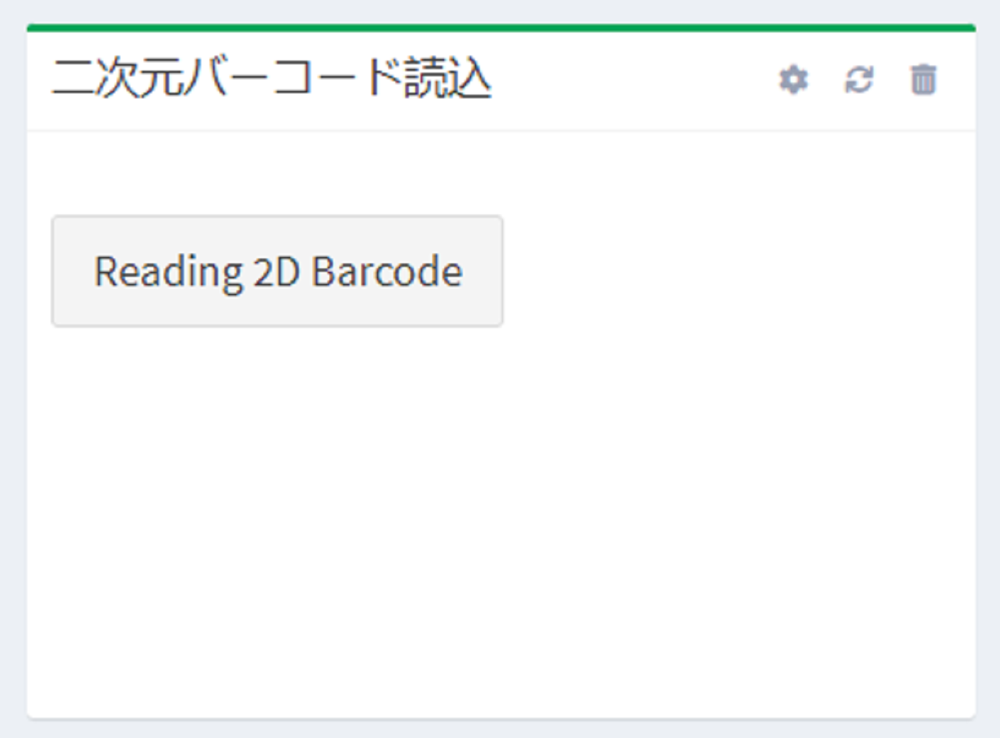

## chart
Data managed by Exment's summary view can be converted into any format among 3 types of
bar data, line graph, pie
graph and displayed on the dashboard.

### Bar graph display example

### Display example of line graph

### Display example of pie chart

### Chart setting items
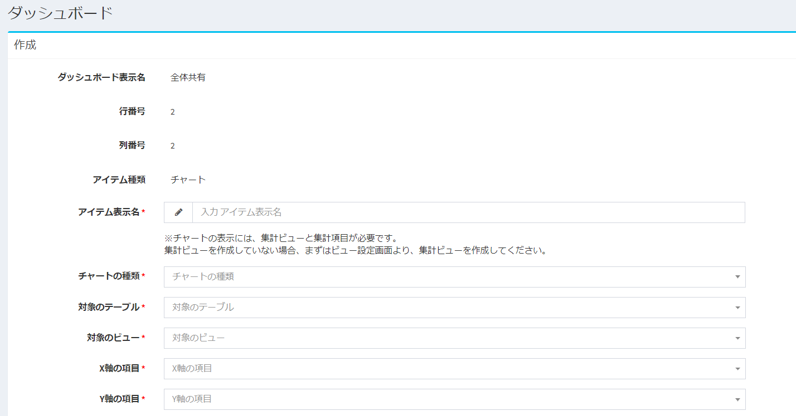

#### Item display name
Enter the name of the item to be displayed on the screen.

#### Chart type
"Bar graph" "Line graph" "Pie graph"  
Select the graph you want to display from these three types.

#### Target table
Select the target to be displayed from the created tables in [Custom table settings](/table.md).  
※ Only the tables for which the aggregation view is set are displayed as options.

#### Target view
Select the target to be displayed from the summary view in the selected target table.  

#### X-axis item
Select the X axis (horizontal axis) to be displayed as a graph.  
※The column specified as the group column in the summary view setting can be selected.  

#### Y-axis items
Select the Y axis (vertical axis) to be displayed as a graph.  
※You can select the column specified as the total column in the total view setting.  

#### Check boxes according to other graph types
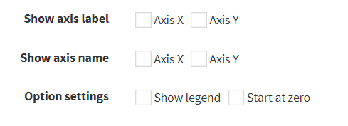  
The checked display format is reflected on the graph.

## Calendar
Data managed by Exment's calendar view can be displayed on the dashboard in any of two types of display formats,
"monthly" and "list".

### Monthly display example
  

### List display example
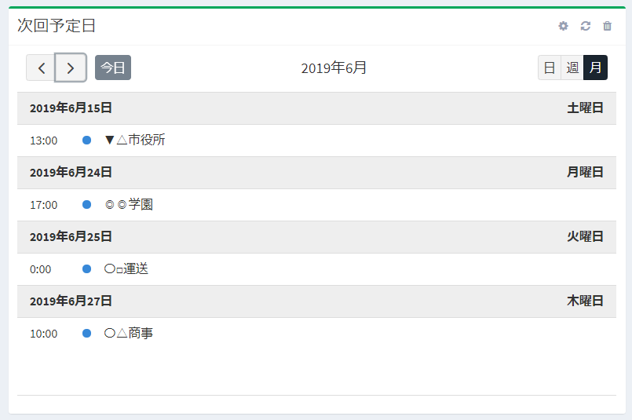  

### Calendar settings
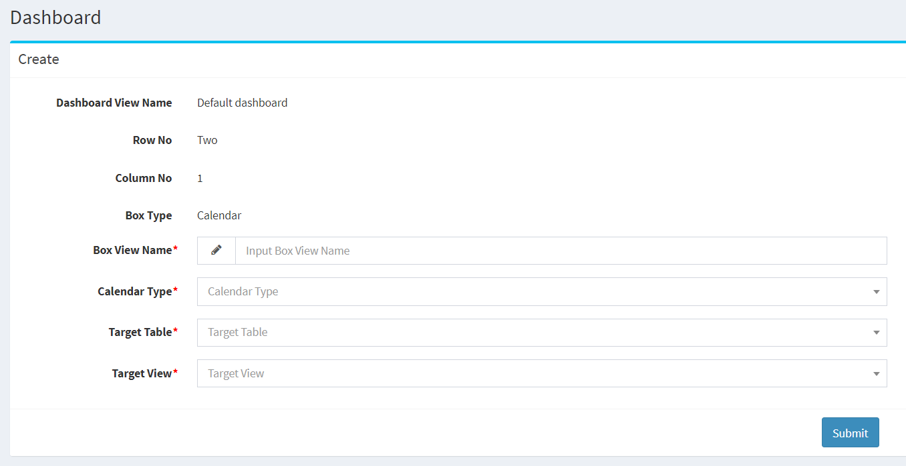  

#### Item display name
Enter the name of the item to be displayed on the screen.

#### Calendar type
"Monthly" "List"  
Select the calendar you want to display from these two types.  

#### Target table
Select the target to be displayed from the created tables in [Custom table settings](/table.md).
※Only the tables for which the calendar view is set are displayed as options.

#### Target view
Select the target to be displayed from the calendar views in the selected target table.  

