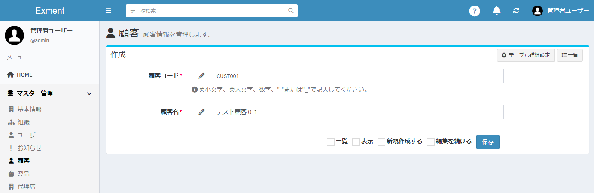

# Data
It is a function to list, add new, edit, display and delete data of each table stored in Exment.  
The user inputs and saves the value by linking it to the table created by the system administrator.  
The data mainly has the following functions.  

## List of data
The list of data stored in the table is displayed.  
What you see in the list is the data you created or the ones to which you have been assigned permissions.  
※By registering the authority to edit and view all data to users and organizations, all data is displayed regardless of the above conditions.  
  
  
For details of the list screen, please refer to the following page.  
[List of data](/data_grid.md)

## Add new data
If you want to add data, click the "New" button at the top right of the page.  
※This button is not displayed if the logged-in user does not have “Edit” permission for the table.  
Please refer to “Authority Assignment” from the left menu for the authority assignment method.  

The new data creation screen is displayed.  

  
Please refer to the following page for details of the new addition screen.  
[Data form](/data_form.md)

## Editing data
If you want to edit the data, click the "Edit" link in the corresponding row.  
※If the logged-in user does not have "Edit" permission for the table, this link will not be displayed.  
Please refer to “Authority Assignment” from the left menu for the authority assignment method.  

The data edit screen is displayed.  

  
For details on the edit screen, see the following page.  
[Data form](/data_form.md)

## View data
If you want to display the data, click the "Display" link in the corresponding row.  

The data display screen is displayed.  

  
For details on the display screen, refer to the following page.  
[Data details](/data_details.md)

## Deleting data
If you want to delete the data, click the "Delete" link in the corresponding row.  

## Copy data
- If you want to copy data, click the "Copy" link in the relevant row.  
 * In order to display copy links, you need to change the settings. refer to the following page. [here](/config?id=display-custom-data-copy-link)  

- The editing screen will be displayed with the selected data contents initialized.  
 * Only items that exist on the form are copied.  
 * Auto number, files, images, etc. are not eligible.  

- Please modify the contents as necessary and then save.  