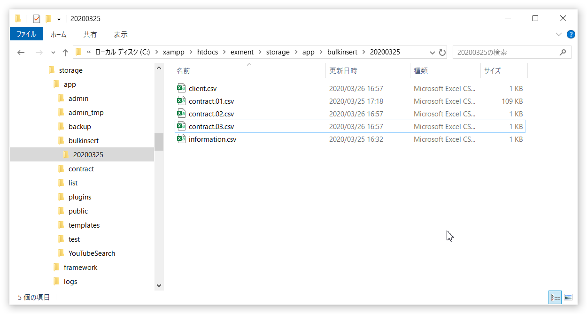
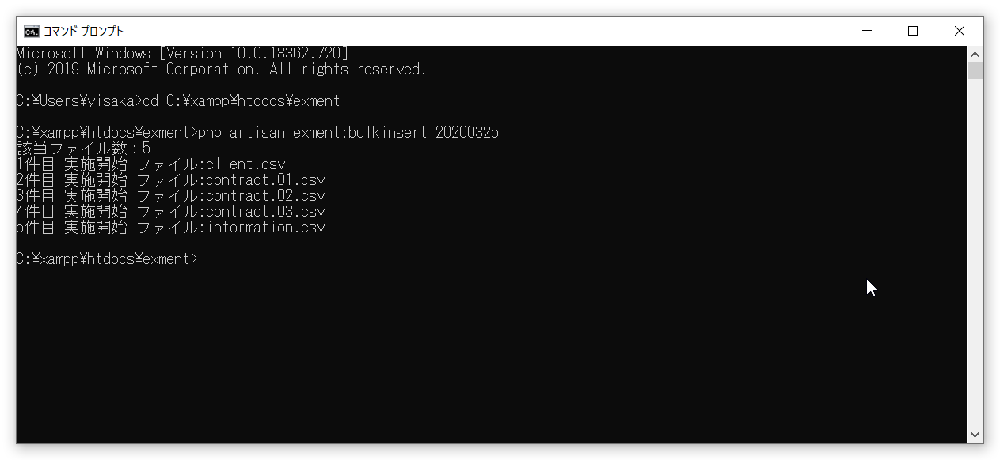

# Batch input of large amount of data
Put a large amount of data (bulk insert. 1000 or more) prepared as a csv file into the custom table of Exment at once.

## important point
- Bulk insert emphasizes performance in order to input a large amount of data. Therefore, please note the following points.

    - ** Even if the created csv or data content is incomplete, detailed error checking will not be executed. ** Please check carefully when creating the file, and if a problem occurs, check that part of the data is imported by importing from the screen.

    - "[Change the data specification method of another table](/data_import_export#Change-the-data-specification-method-of-another-table)" that can be realized by [Normal import](/data_import_export) cannot be executed by this function. .. Please enter the id in the column and import.

## Data preparation
First, create a csv file for import. The format is as follows.
- First row: Custom table column name
- From the second line onward: Data to be input

※The file name is ** "(custom table name) .csv" ** (example: client.csv). If the data to be input to one table is divided into multiple files, please assign a serial number such as ** "(custom table name). Serial number.csv" ** (example: client.01.csv). ..

※The character code of the csv file that can be imported is <strong> UTF-8 </strong>. Also, do not use BOM.
** If you create a file with EXCEL, the default character code will be Shift JIS. Be sure to apply character code conversion with a text editor etc. in advance. ** **

### Values ​​that can be used as column names in custom tables
| Item | Description |
| ---- | ---- |
| id | Primary key (numeric value) * Enter only if you want to specify |
| parent_type | Name of parent table * Enter only for child table data |
| parent_id | ID of the associated parent data * Enter only for data in the child table |
| deleted_at | Data deletion date and time * Enter only if you want to specify |
| deleted_user_id | User ID with deleted data * Enter only if you want to specify |
| value. (Custom column column name) | Column name registered in the custom column settings. Be sure to add value. At the beginning |

※Unless you have a specific reason, set only custom columns in the csv file. (Other items are set automatically)
** Unlike normal import, even if you specify the same id as existing data, it will not be updated. ** **

#### Sample file (client.csv)
- This is a sample to input data to the customer table (client). The customer code (client_code) and customer name (client_name), the deletion date and time (deleted_at) and the deleted user ID (deleted_user_id) are set for the third data.

~~~
value.client_code, value.client_name, deleted_at, deleted_user_id
CUST001, test customer name 001 ,,
CUST002, test customer name 002 ,,
CUST003, test customer name 003, 2019/3/20,2
CUST004, test customer name 004 ,,
CUST005, test customer name 005 ,,
CUST006, test customer name 006 ,,
CUST007, test customer name 007 ,,
CUST008, test customer name 008 ,,
CUST009, test customer name 009 ,,
~~~

## Method of operation

1. Create a working folder in the following path on the server. It is recommended that the folder name be something that shows the contents of this work, the date, etc.

~~~
(Project root directory)/storage/app/bulkinsert/(folder name)
~~~

2. Place the created csv file (s) in the above folder.

#### Folder layout example

3. At the command line, run the following command.
~~~
php artisan exment: bulkinsert {folder name}
~~~

#### Command execution example
