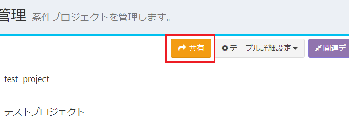
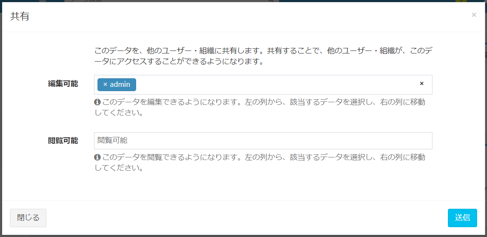
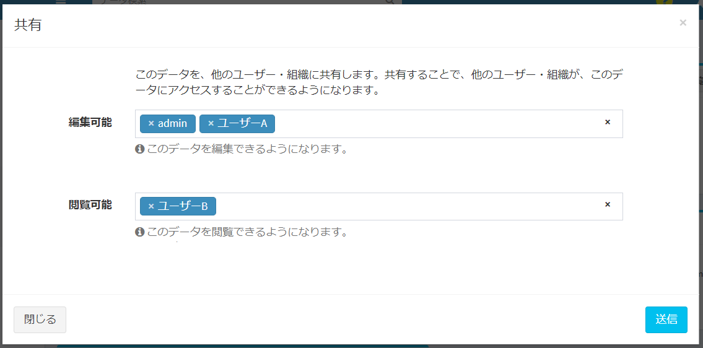

# Data details
Click the target data in [Data List](/data_grid.md) to display the data details.  
In the data list, only the contents specified in [Display column selection](/view?Id=Display-Column-Selection) in the view settings are displayed.  
In the data details, matching form items are displayed according to the priority set in the [form priority](/form?Id=form-priority-settings) settings.

The following four types of information are displayed on the data details screen.  

- Details of contents  
- Attachment  
- Comment  
- Change log  

## Details of contents
  
- Displays details registered as data.  

## Attachment
  

- ①.Click the "Browse" button and select the file you want to attach.  
②.Click "Upload".  
The file can be attached to the data detail screen by the above procedure.  

- The attached file can be deleted from the "Delete" button.  

## comment
  

- By clicking the "Send" button after entering a comment, you can make a comment on the data.  
- The date and time when the comment was made and the user name are automatically entered.  
- The comment made can be deleted from the "Delete" button.  

※You can only delete comments made by the logged-in user.  
In the example of the image, since you are logged in as user, the "Delete" button of the comment made by admin is not displayed.  

## Change log

  

- The update history is displayed when [Use data change history](/table?Id=Use-Data-Change-History) in the table settings is set to YES.
- When you edit the data, the date and time of the edit and the user name are automatically described.  
- When you edit the data, the date and time of the edit and the user name are automatically described.  

#### Revision
  
- In "Revision selection", select the data you want to compare from the history.  
- "Selected history data" is displayed on the left, and "Latest data" is displayed on the right, and items that differ in data registration are colored with a background color.  
- Click the "Restore This Revision" button at the bottom of the page to restore with the selected data content.  

  

## Data sharing
Share the saved data to other users / organizations.  
※In [Role group setting](/role_ group), it can be executed only if you have "Data sharing" authority.

#### Sharing method
- On the data details screen, the "Share" button is displayed. Click it.
  

- A data sharing dialog appears.
  

- Add the users you want to share and click "Submit" to complete the sharing.  
  

※システム管理者が、[通知設定](/ja/notify)で「データ新規作成・更新・共有・コメント」による通知設定を行うことで、共有を行ったユーザーに通知を行うことができます。
