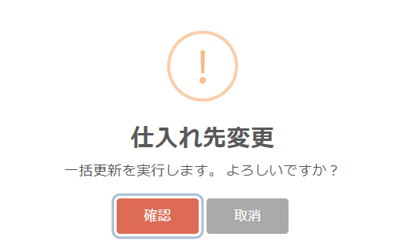

# List of data
- List the data of each table stored in Exment.  
- What you see in the list is the data you created or the ones to which you have been assigned permissions.  
- By registering the authority to edit and view all data to users and organizations, all data will be displayed regardless of the above conditions. Please refer to [roles / permissions](/permission.md) for details on permissions.

## Functions list
  

- Reload:  
Reload the list.

- Filter:  
Filters the contents of the currently displayed data list. See below for details.

- View:  
The view button for the currently displayed custom table. See below for details.  

- Import / Export:  
This button is used to export or import the data of the currently displayed custom table. Please refer to [Data Import / Export](/data_import_export.md) for details.  

- List:  
Data list.  
Line items to be displayed are narrowed down by the user's authority, view refinement settings, and list screen filter settings.  
The columns to be displayed are changed according to the column settings of the view.  

- Batch update: Updates：  
Updates the data contents in a batch at the selected multiple lines.  
In [Batch update setting](/mass_update.md), it is necessary to set the target column and update value for batch update.

## detail of function

### filter
Filters the contents of the currently displayed data list.  
  
Filtered items are displayed by clicking the "Filter" button.  

- Items that can be narrowed down are "ID" or columns where "Search index" is ON in custom column settings.  
[Click here for custom column setting manual](/column.md)

- For each item, enter a keyword and click "Search" to narrow down and display the corresponding line.    

- If you want to reset the filters, click the "Reset" button.  

- When a user other than the administrator narrows down, the data is narrowed down by the filter function from the data to which the user has authority. Unauthorized data is not filtered.  

- In addition to the refinement condition of the displayed view, refinement is performed by the filter function.  

- At present, input of filter condition only supports prefix matching by input.  

### The view
A button for the view of the currently displayed custom table.  
For the button name, the name of the currently displayed view is displayed.  
Click the button to display the view menu.  
  

- System view:  
A list of views registered in the system is displayed.  
Click an item to switch to that view.  

- Settings-Change current view settings:  
Change the settings of the currently displayed view.  
Clicking an item switches the display to the setting change screen for that view.  
※ Items are displayed only for users who have table administrator authority.  

- Settings-New View:  
Create a new view.  
The display switches to the new view creation screen by clicking the item.  
※ Items are displayed only for users who have table administrator authority.  

### Bulk update
Updates the contents of the selected multiple data at once.  
When you make a selection with the check box to the left of each line, the number of selected lines and the icon of ▼ are displayed at the upper left.  
  

- If you click the ▼ icon, batch deletion and created batch update settings are displayed as options.

- When you click the option of the content you want to update, a message confirming the execution of the batch update is displayed. Click the confirmation button. The data of the column specified in [Batch update setting](/mass_update.md) is registered with the update value.
  