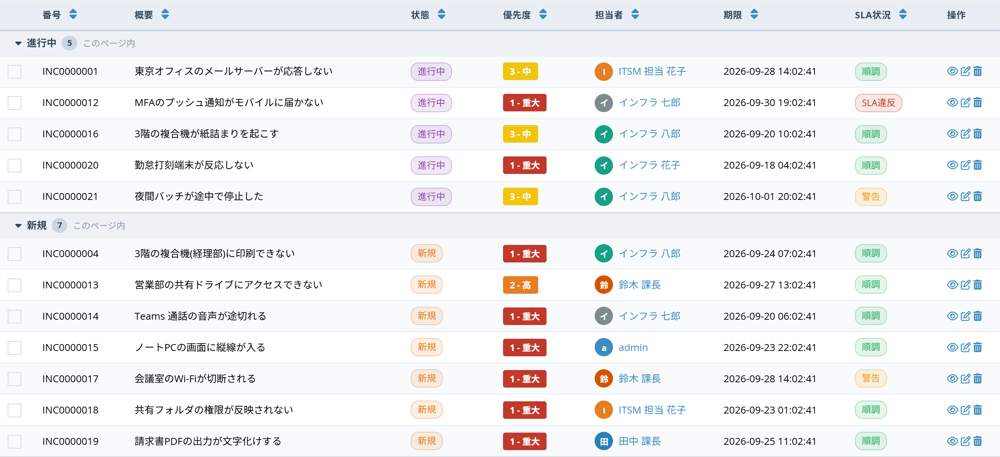
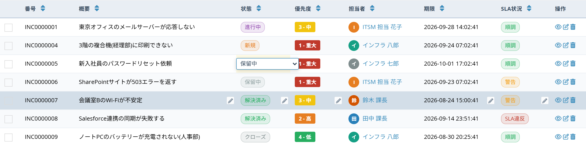
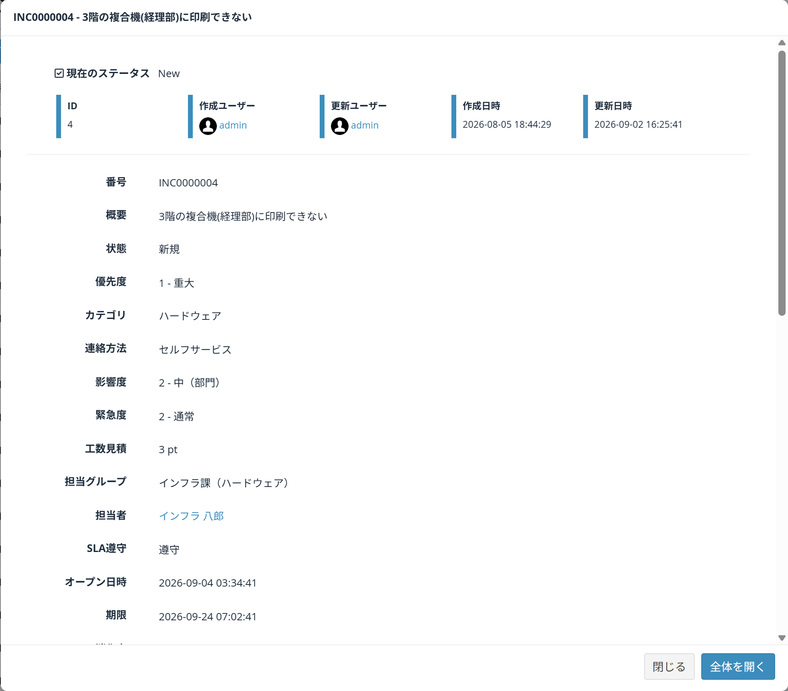

# Data list tools

The display and in-place editing features available on the [list of data](/data_grid.md) screen.  
Nothing has to be configured - they are there as soon as a data list is opened.

## The toolbar buttons

Five buttons sit at the top right of the list, to the left of the view picker.

From the left: [Select columns to show], [Pin columns], [Group rows], [Density], [Auto refresh].

> These settings are stored **in the browser of the person using them**. The view is not changed, so nobody else's screen is affected.  
> [Select columns to show], [Pin columns] and [Density] survive closing the browser.  
> [Group rows] and [Auto refresh] last until the tab is closed.

### Select columns to show

Chooses which of the view's columns are drawn on screen.

- Type in the box at the top to filter the column names.
- [Select all], [Clear all] and [Reset to default] act on every column at once.
- [Apply] to use the choice, [Cancel] to close.

At least one column must stay checked.  
Hiding a column never deletes data - [Reset to default] brings everything back.

### Pin columns

Keeps the chosen columns against the left edge while the table scrolls sideways, so a wide table never loses track of which row is which.

| Item | Content |
| --- | --- |
| Pin first 2 columns / Pin first 3 columns | Common combinations in one click |
| Unpin all | Releases every pin |
| Pin action column to the right | Keeps the action column always visible |
| Pin header row | Keeps the header visible while scrolling down |
| (list of columns) | Pin columns one by one |

If the screen is too narrow, some columns are left unpinned and a message says so.

### Group rows

Groups the rows of the current page by the value of one column.

- Each group header carries the number of rows in it.
- The triangle on the left folds and unfolds a group.
- [No grouping] returns to the original order.

> **Why it says "this page only"**  
> Grouping rearranges the rows already loaded on the page.  
> To summarise across all of the data, build an [aggregate view](/view.md) instead.

### Density

Changes the row height and whether text wraps inside a cell.

| Item | Content |
| --- | --- |
| Compact | Tighter rows - more of them fit on screen |
| Comfortable | The default height |
| Spacious | Taller rows, easier to read |
| Single line rows | Text is not wrapped; long values are cut off |

### Auto refresh

Reloads the list every so often, so a screen left open during shared work (a support queue, for instance) keeps showing the current state.

Off, 30 seconds, 1 minute or 5 minutes.  
The setting is dropped when the tab is closed.

## Working inside the table

### Inline editing (double click)

Double click a cell to change its value in place. Cells that can be edited show a pencil icon on hover.

Choosing (or typing) a value saves it and repaints the cell.

| Column type | Editor |
| --- | --- |
| Choices, choices (value and label), YES/NO | A picker |
| Single line text, e-mail, URL | A text input |
| Integer, decimal, currency | A number input |
| Date, datetime | The browser's calendar |

Multi-select columns and columns computed by a formula are not editable.  
The pencil never appears without edit permission.  
The save goes through the same path as the normal edit form, so validation, workflow and revision history all behave as usual. A refused value is not saved and the old display comes back.

### Right click menu

Right clicking a row opens the actions available for that record.

| Item | Content |
| --- | --- |
| Quick preview | Shows the record without leaving the list |
| View | Opens the detail screen |
| Edit | Opens the edit screen |
| Duplicate as new | Opens a new record prefilled from this row |
| Set me as ... | Puts the logged-in user into the assignee column |
| Filter within this page: "..." | Keeps only the rows with the same value as the clicked cell |
| Copy cell value | Copies the clicked cell to the clipboard |
| Delete | Deletes the record after a confirmation |

Only entries the user is allowed to run are shown - a read-only visitor never sees delete or edit.  
Shift + right click opens the browser's own menu instead.

### Quick preview

Reads one record without leaving the list.

- [Open full page] goes to the normal detail screen.
- [Close] returns to the list with its scroll position and filter untouched.

### Multi select and bulk actions

Ticking the checkboxes on the left changes the row colour and brings up a bar at the foot of the screen.

| Button | Content |
| --- | --- |
| Bulk edit | Changes the ticked rows together |
| CSV / Excel | Exports only the ticked rows |
| Bulk delete | Deletes the ticked rows |
| Clear selection | Unticks everything |

Which buttons appear depends on the permission and on the [operation setting](/operation.md).

#### Bulk edit

- Fill only the fields to change. Blank fields are left as they are.
- [Apply to N rows] asks for confirmation and then updates.
- Progress is shown, and the number of successes and failures at the end.

Only columns with a picker are offered.  
Each row is saved through the normal update path, so validation, workflow and revision history all behave as usual. Rows refused by a permission or a rule are counted as failures.

### While a filter is on

When [Filter] is used, the conditions in force are drawn as chips above the table.

- The "x" on a chip removes that one condition.
- [Clear all] removes every condition.

"Filter within this page" from the right click menu shows a yellow strip instead.

- It says how many rows are hidden.
- [Clear filter] brings them back.

> This filter only looks at the rows on the current page. To filter across pages, use the [Filter] panel or the [view's display condition](/view.md).

## About permissions

These features use the existing permissions.

- The list still shows only the data the logged-in user may read.
- Edit and delete entries appear only where the user holds that right on the record.
- Inline editing and bulk edit go through the same save path as the normal edit form; a record the user may not change is not updated.

## See also

- [List of data](/data_grid.md)
- [Custom views](/view.md)
- [Cell style presets](/cell_style_preset.md)
- [Operation](/operation.md)
