# Data import / export  
Import and export data of each table stored in Exment.  

## Data export
Export (output) the data of each table stored in Exment.  
The output data format supports csv and xlsx (recommended).  

### Method of operation
- Displays the data list screen.  
  

- The "Import / Export" button is displayed at the top right of the page. Click it.  
  

- A menu is displayed. Select the item you want to output from "Output (CSV)" or "Output (Excel)".  
  
    - All: Outputs all data of the table. However,**data for which the logged-in user does not have permission is not output.**  
    - Current page: Outputs the data list of the currently open page.  
    - Selected rows only: Outputs a list of checked data from the data of the currently open page.  

- By clicking each "Output" button, the data will be downloaded as a file.  
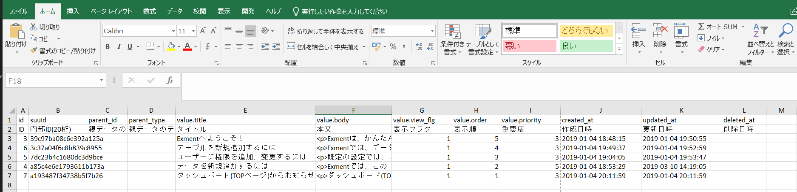

### Output item list
- ID: A positive integer that is automatically numbered when registering data.

- Internal ID (20 digits): This is a 20-digit alphanumeric character that is rarely displayed on the screen and is automatically assigned when registering data. Used for data migration.  

- Parent data ID: If the table is registered as "n" in "1: n" in the relation setting, it is the id of the parent table. If no relation is set, this will be blank.    

- Parent data table name: If the table is registered as "n" in "1: n" in the relation setting, this is the parent table name (alphanumeric). If no relation is set, this will be blank.  

- Custom column list: A list of data registered as custom columns is displayed.  

- Creation date, update date, deletion date: The date when the data was created, the date when the data was updated, and the date when the data was deleted are output.  

### Export 1: n relation  
- If you export data in a table registered as "1" in "1: n" in the relation setting,**the data list of "n" in relation will be exported at the same time.**  
Example: When "Contract information" is 1 and "Contract details information" is n, relationship settings are saved.  
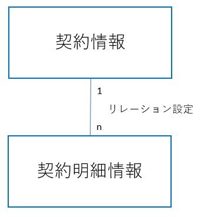  
data is exported on the "Contract information" screen (※ Customer in the image is test data ) Both.  
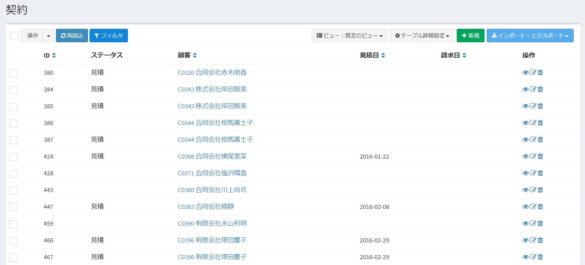  
"contract information" and "contract details information" data are output.  
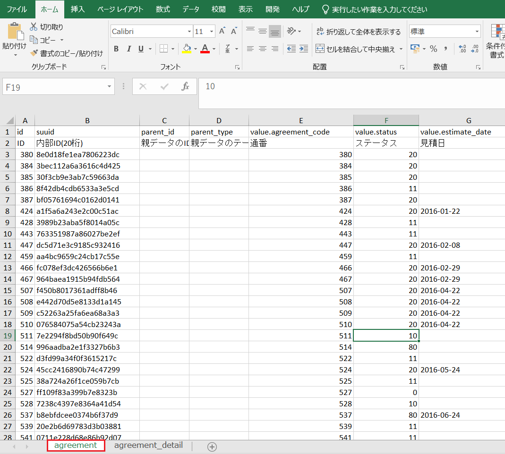  
  
- In the data list registered as n of "1: n" in the relation setting, "ID of parent data" and "table name of parent data" output the ID and table name of the parent table of the relation destination.  

### Export n: n relation
- If data is exported to a table registered as n in the relationship setting "n: n",**information related to the relation destination "n" is also exported.**  
Example: When "Organization information" and "User information" are set to n: n and the relationship settings are saved.  
  
When data is exported on the "Organization information" screen, the data of
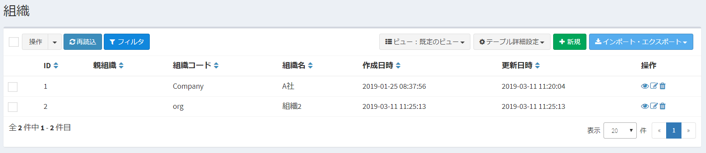  
"Organization information" is output In addition, data that associates "user information" with "organization information" is output.
  
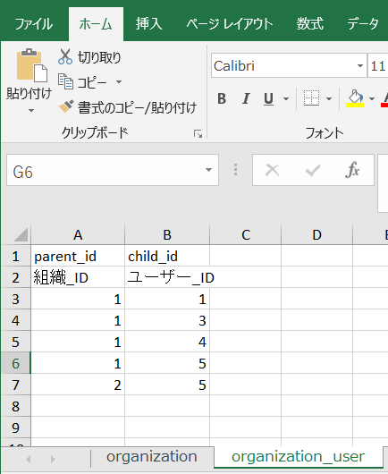  
- "Parent_id" displays the ID of the parent organization information, and "child_id" displays the ID of the child user information.  

### other noteworthy things
- In both CSV format and Excel format, the first line displays the column name (alphanumeric), and the second line displays the column display name (Japanese). Please note that the header will be two lines even in CSV format.  
- When output in CSV format, character code is output as UTF-8, line feed code is LF, and file without BOM is output.  
- If multiple data is output depending on the relation settings, zip multiple csv files for Excel format or multiple csv files for CSV format.  

## Data import
Import (enter) the data of each table into Exment.
The format of the imported data is compatible with csv and xlsx (recommended), and it is necessary to process the data according to the format specified in Exment in advance.  

### Method of operation

#### Template output
Outputs a template for importing data.

- Displays the data list screen.  
  

- The "Import / Export" button is displayed at the top right of the page. Click it.  
  

- Click “Template output” from “Import (CSV)” or “Import (Excel)”.  
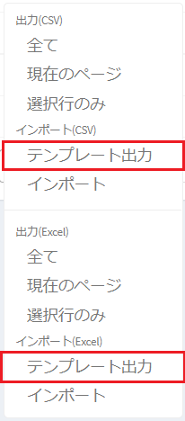  

- A CSV or Excel file for data import will be downloaded.  
  
※ The format of the file is the same as when "Export" was executed.
When outputting a template, no data is output.

- Enter the information of the data you want to import in the output template.  

### List of import items
- ID: A positive integer that is automatically numbered when registering data.  
If you want to clearly specify this ID when importing, please enter it.  
Leave blank unless otherwise specified. The system sets the values ​​automatically during capture.  

- Internal ID (20 digits): This is a 20-digit alphanumeric character that is rarely displayed on the screen and is automatically assigned when registering data.  
If you want to clearly specify this internal ID when importing, please fill in.  
Leave blank unless otherwise specified. The system sets the value automatically.  

- Parent data ID: Basically, set it to blank.  
If the table to be imported is registered as "n" in "1: n" of the relation setting, enter the id of the parent table.  

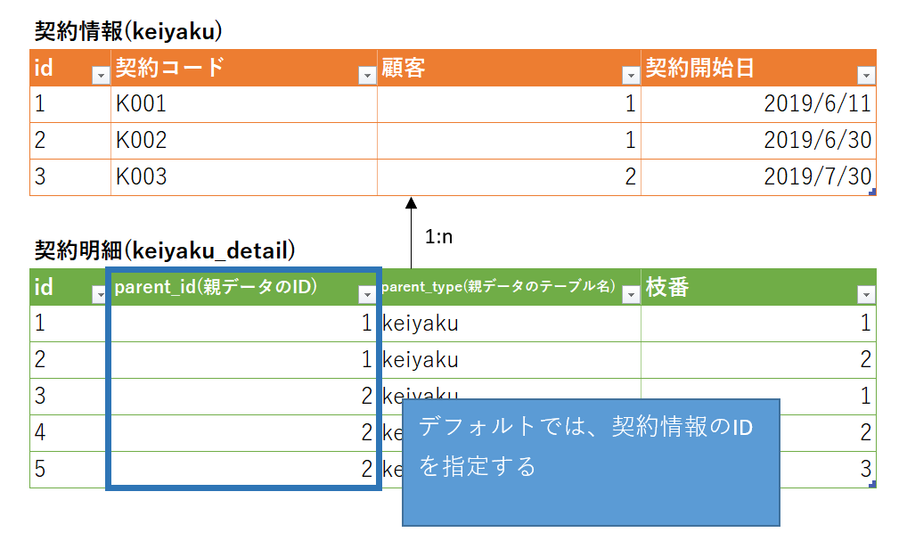  
※By default, you specify the ID of the data in the parent table, but you can specify a custom column to retrieve.  
For details, refer to**[Changing the method of specifying parent table data](#custom-column-input-method-when-importing)**.

- Parent data table name: Basically, set it to blank.  
If the table is registered as n in "1: n" in the relation setting, enter the parent table name (alphanumeric).  
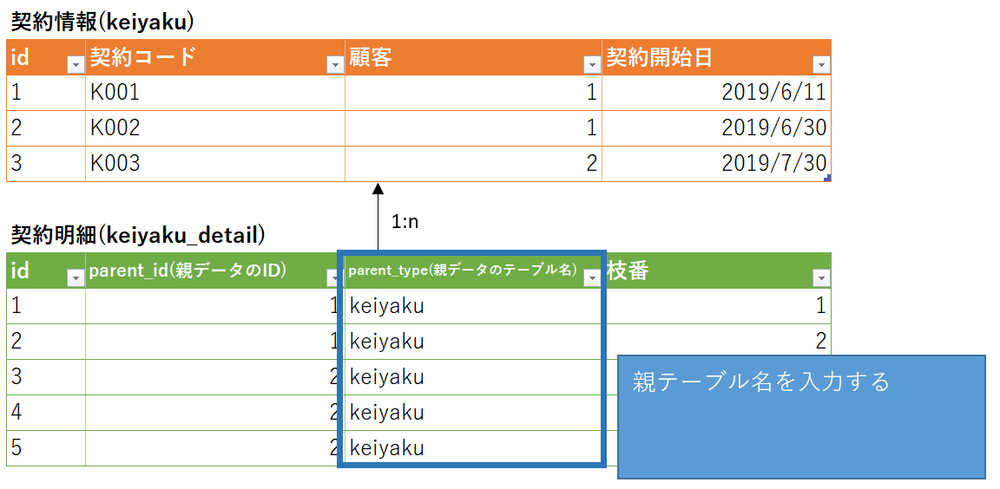  

- Custom column list: Enter the value to be registered as a custom column.  
※ The method of inputting values ​​differs depending on the type of column.   
Please confirm the following menu「[Custom column input method when importing](#Custom-column-input-method-when-importing)」.

- Creation date / time, update date / time, deletion date / time: Basically, it is blank.  
Fill in if you want to specify the date and time when the data was created, updated, and deleted.  
If this is blank, the system will set the value automatically when importing.  

### Execute data import
Execute the import from the screen.  

- Displays the data list screen.
  

- The "Import / Export" button is displayed at the top right of the page. Click it.  
  

- Click “Import” from “Import (CSV)” or “Import (Excel)”.  
  

- Click “Import” from “Import (CSV)” or “Import (Excel)”.  
  

- For "Import file", select the created import template file.  

- For "Primary key", select the primary key for judging new / update when importing.
For details, see "Primary key types" below.  

- After completing the settings, click “Submit” in the dialog.  

- If there is a problem with the imported data, the line number after the header and the content of the error are displayed in "Error Message".  

※The import will not succeed if the data is not entered for the item that is set to "[Required](/column? Id = Common entry details)" in the custom column settings. Check if there is any omission in the import template file.
- After successful completion of the acquisition, the dialog is closed and the data is re-read.  

### Judgment method for newly added data and updated data
When importing data, determine whether to import as new additional data or update data for each row.
This section describes the determination method.  

- In advance, specify the column that will be the "primary key" to be used for judgment on the screen when importing data. (Here, it is assumed to be "ID.")  
※The primary key is selected when importing data. Will be described later  

- During the data import process, the value of the ID column of the acquired data is acquired inside the system.
  

    - When the ID value of the imported data is blank, it is treated as newly added data.  
  

    - If there is a value in the ID of the imported data, search for a data with the same ID from the registered data list.  
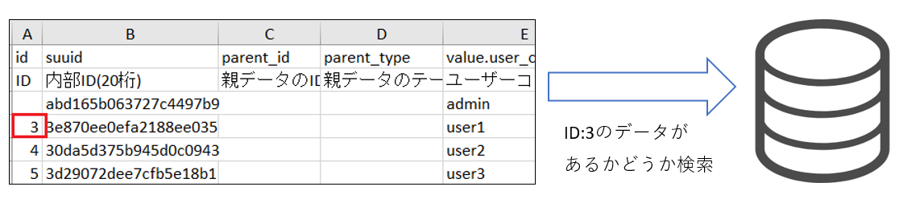  
    If there is data with the same ID, update the imported data for that data.  
If not, add new import data. At that time, the ID will be the ID of the captured data.  

### Primary key type

- ID (recommended): An integer automatically assigned by the system. Also used for relationships with other tables.  
Although it is easy and easy to set the value in advance, when shifting from environment to environment, there is a possibility that unexpected misalignment will occur because items are automatically assigned serial numbers.  

- Internal ID (20 digits): 20 digits of alphanumeric characters automatically assigned by the system when data is saved.  
When migrating from environment to environment, we recommend using this internal ID to clarify the data to be updated.  

- Unique (unique) column: The column that is set to "unique" in the custom column settings can be selected as the primary key. (Example: Email address, user code)   

### Custom column input method when importing
Depending on the type of custom column, the method of inputting values ​​during import differs.  
Please check out contents below.  

- Choices (Register value / heading): Enter the "value" to be registered in the database and the "heading" displayed on the screen.  

- Choices (select from a list of values ​​in another table), User, Organization: Enter**the ID of the referenced table**. 
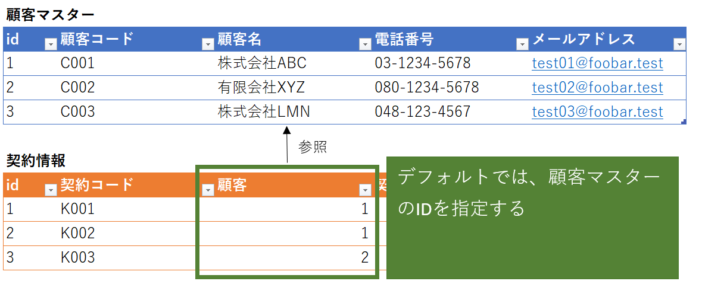  
※In the default setting, specify the data ID of the reference destination table,**but you can specify a custom column and import it.**  
For details, refer to「[Changing the method of specifying parent table data](#Changing-the-method-of-specifying-parent-table-data)」.

- YES / NO: Please input "YES" or "NO", or "1" or "0".  

- Select two values: Enter the value or the value of "Select two values" entered on the custom column screen.  
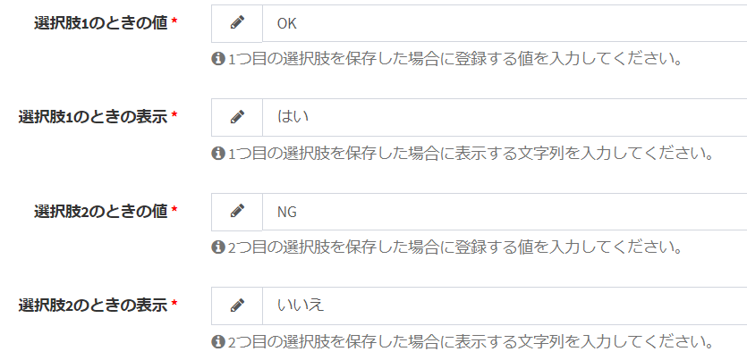  

- Others: Enter the value to be registered as it is.  

### Changing the method of specifying parent table data
The “Parent data ID”, “Choices (select from the list of values ​​in other tables)”, “User” and “Organization” columns usually specify the ID of the data in the referenced table, but**custom columns Can be specified to retrieve.**  
Describes the procedure for performing the acquisition using a custom column.   

#### If parent_id (parent data ID)
- Moves to relation setting screen.  

- Set "Key column at import" to a custom column used to search for values ​​at import and save.  
※The columns that can be specified are only the columns specified as "Search index" in the custom column settings.  
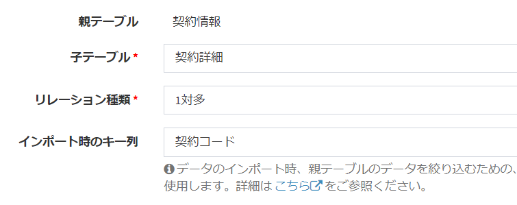  

- After that, when you download the Excel file for import in the child table, the child table name, "parent_id", and the custom column name of the specified parent table are output to the "## setting ##" sheet.。  
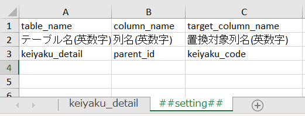  

- Do not edit the information on this sheet, but fill in the data on the child table sheet.  
At that time, in the "parent_id" column, enter the value of the custom column registered as **the key column at the time of import .**  
In the case of the following example, enter the value of "contract code" in the parent table "contract information".  
  
  

- Then perform the import.  

#### For "Choices (select from a list of values ​​in another table)", "User", or "Organization"
- Transition to the custom column setting screen where the above column settings are performed.  

- Set "Key column at import" to a custom column used to search for values ​​at import and save.  
※The columns that can be specified are only the columns specified as "Search index" in the custom column settings.  
  

- After that, when you download the Excel file for importing in the table of the referrer, the table name of the referrer, “value.” + The name of the custom column of the referrer, the custom column of the referrer The name is output.  
  

- Do not edit the information on this sheet, but fill in the imported data on the sheet of the referencing table.  
At that time, in the custom column of the reference source , enter the value of the custom column of the reference destination registered in **the key column at the time of import .**  
In the case of the following example, enter the value of "Customer Code" in the reference table "Customer Master".  
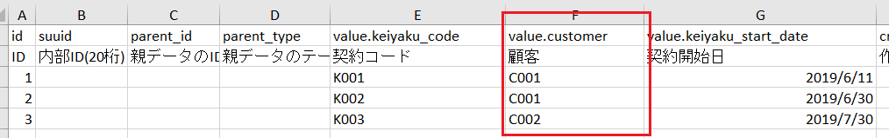  
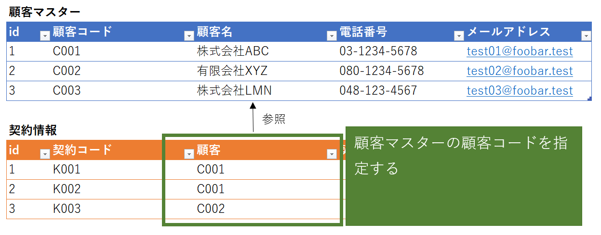  

- Then perform the import.  

#### important point
- Only import in Excel format is supported. CSV format is not currently supported.  