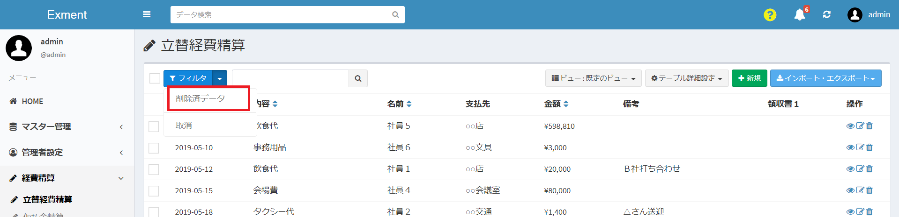
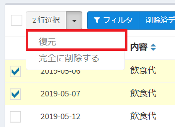
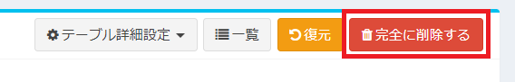
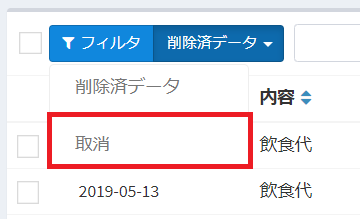

# Deleted data
- In each Exment table, you can display the deleted data.
- Deleted data can only be displayed by users who have permission to view deleted data.
- Users with edit privileges can restore or permanently delete data.

※Please refer to [Role Group](/role_group.md) for details on permissions.

## List display

- Select "Deleted data" from the ▼ mark on the upper left side of [Filter] on the data list screen.
- The display changes and the deleted data for that table is listed.

## Detail View

- The data in the deleted data list can be displayed in detail.
- Click the display icon in the data row or operation column for which you want to display details.

- On the data details screen, you can check the display of the deleted user and the deleted date and time.

## Restore

- Deleted data can be restored to the data list screen.
- Restoration can be done in three ways.
    - Use the [Restore] button on the data details screen.
    
    - On the deleted data list screen, use the [Restore] icon in the operation column.
    
    - On the deleted data list screen, check the data you want to restore and select "Restore" from the ▼ mark at the top left of the deleted data screen.
    

※Data can only be restored by users who have permission to edit the data.

## Completely deleted

- Deleted data can be completely deleted as data. Completely deleted data will be deleted from the deleted data list.
- Complete deletion can be done in three ways.
    - Use the [Delete Permanently] button on the data details screen.
    
    - On the deleted data list screen, use the [Permanently delete] icon in the operation column.
    
    - On the deleted data list screen, check the data you want to delete completely and select "Permanently delete" from the ▼ mark at the top left of the deleted data screen.
    

※Data can only be deleted by users who have permission to edit the data.

## Move to the data list screen

- On the deleted data list screen, click [Deleted data ▼] and select "Cancel" to move to the data list screen for that table.

#### Authority settings
- In order to display deleted data, the user needs to have permission to view the data.
- In order to restore deleted data or delete it completely, the user needs edit permission for the data.

※Please refer to [Role Group](/role_group.md) for permission settings.