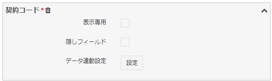

# Custom form
Set items to be displayed in [Data form screen](/data_form.md) of Exment , number of rows in columns, hidden fields, and data linkage settings.  
The content set in this custom form is reflected in [Data form screen](/data_form.md) of each table.  

## Page display
- On the custom table screen, check one of the tables you want to change, and click "form setting" of "page move".  

- This will display a list of forms that the checked custom table has.  
One form is created by default, one for each table.  

## Form editing
If you want to edit the form, click the "Edit" link in the appropriate row.  

## Custom form settings

#### Form display name
Enter the name of the form to be saved.  

#### Form items
Setting of items to be displayed on the input form.  
A list of the set columns is displayed on the data form screen.  

- Form block name:  
The name displayed on each block of the form.  
  
- Form items Column 1:  
 Items to be displayed in the left column of the form.  
  
- Form items Column 2:  
Items to be displayed in the right column of the form.  

- Form item candidate list:  
Items that can be added to the form.  
There are two types, "Table column" and "Other".  

- Table column:  
Value item of data to be added / edited.  
Includes ID, internal ID, creation / update date, creation / update user.  
By adding to "Form item column 1" or "Form item column 2", you can edit or display the value of that item when displaying the data form.  

- Miscellaneous:  
Headlines, descriptions, and HTML that are simply displayed on the form.  
By adding it to "form item column 1" or "form item column 2", you can display the value of that item when displaying the data form.  

#### Form item details
After adding an item to "Form item column 1" or "Form item column 2", click the arrow on the right to display options.  
Items that are required as custom columns are indicated with a red mark in the item name.  

- "Delete" link:  
Click to delete the item from the form item list.  

- Display only:  
If checked, the user will not be able to enter content, and the value can only be changed in the system, calculated fields, and data linked settings (below).  

- Hidden field:  
If checked, the item will not be displayed from the screen and will be added as a hidden field (hidden).  
If there is a calculated field or data linkage setting (below), it will be necessary to add it to the form, so please set it as a hidden field.  

- Data linkage setting:  
See Refer to [Data link setting](#Data-link-setting).  

## Data link setting
When you select another item in the form, you can copy the value of the selected data to the item.  
Example: Procedure for copying the value of the "Customer name" item in the "Customer" data to the "Target customer name" item in the "Contract" form when selecting the item "Customer" option in the "Contract" form  

The "Contract" form has a "Customer" choice and one line of "Customer Name" text,  
  

When "Customer" is selected,  
  

The value is automatically set in the "customer name" text  

Table settings above  

##### procedure
- Open the custom form screen.  
Click the "Data linkage setting" button in the "Customer name" text of the form item.  

- The "Data linkage settings" dialog opens.  

- For the first item, Select Column, select the column that will trigger the change.  
**※The choices for this item are a list of columns in the same form where the column type is "Choices (select from a list of values ​​in another table)", "User", "Organization**  
This time select "Customer".  

- By selecting the "Select column" item, the choice of the second item "Select link column" is displayed.  
The column list of the table selected in the "Select column" item is displayed.  
This time, select "Customer Name".  

- After setting, click the “Settings” button.  
The dialog is closed and "Set" is displayed next to the "Data linkage setting" button.  

- Click the "Send" button at the bottom of the page to complete the settings.  