# Custom form
Set items to be displayed in [Data form page](/data_form.md) of Exment , number of rows in columns, hidden fields, and data linkage settings.  
The content set in this custom form is reflected in [Data form page](/data_form.md) of each table.  

## Page display
- On the custom table screen, check one of the tables you want to change, and click "form setting" of "page move".  


> * It is also possible to transition directly from the data list screen or data registration screen of the target custom table. Even in that case, click "Detailed table settings" on the upper right.  
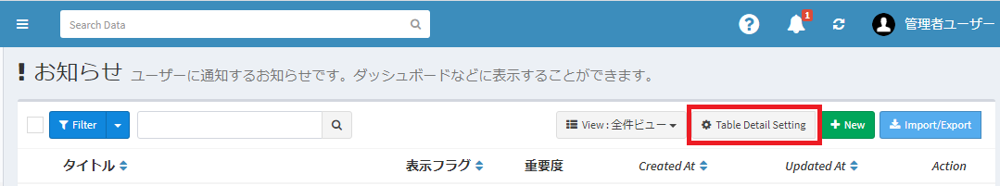  

- On the displayed table advanced settings screen, click the form settings icon to display a list of forms.  
\* One default form is created for each table from the beginning.
- This will display a list of forms that the checked custom table has.  
One form is created by default, one for each table.  
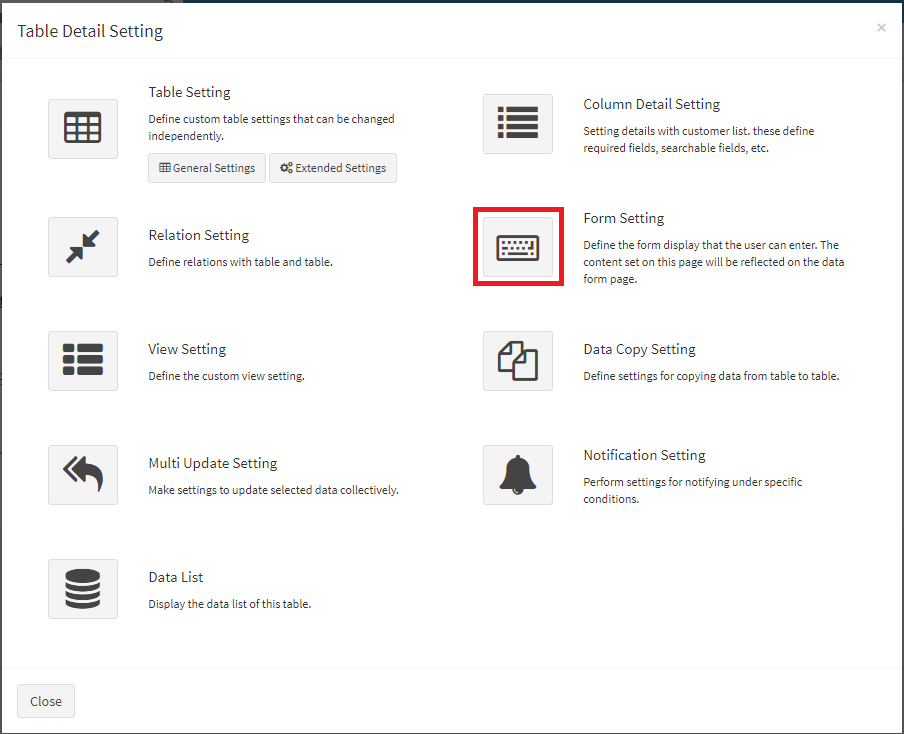


## Form editing
If you want to edit the form, click the "Edit" link in the appropriate row.  
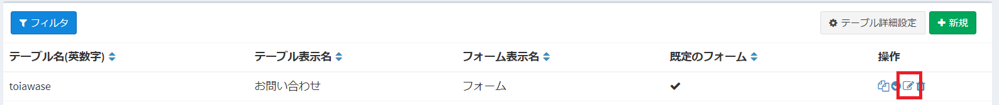

## Custom form settings
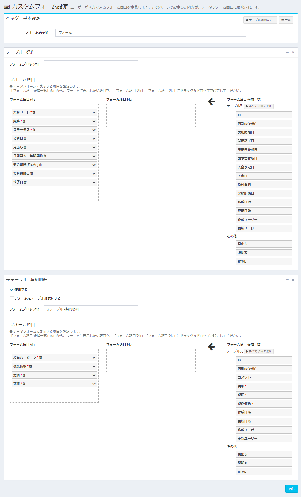

### Form preferences
Enter the basic information for the form.

- ##### Form display name
Enter the name of the form to be saved.  

- ##### Default form
If you want to register this form as the default form, please set it to YES.  
If [form priority](#form-priority-settings) is set, that will be prioritized.

- ##### Detailed screen display method
Select whether to match the item display method on the [data detail page](/data_details) with the row / column layout set on this screen, or to display in a simple vertical single column display.


- ##### Heading display method
Set how to display the heading of each item.  
\* This is the setting for the entire form. If you want to set them individually, change the settings of each item.

### Form block settings
Set the form block.  
A block is a collection of data, basically one per table.  
As an exception, if you have set a 1:n relation, you can also enter data on the child table side at the same time. Check "Use" of the child table block and configure the settings.

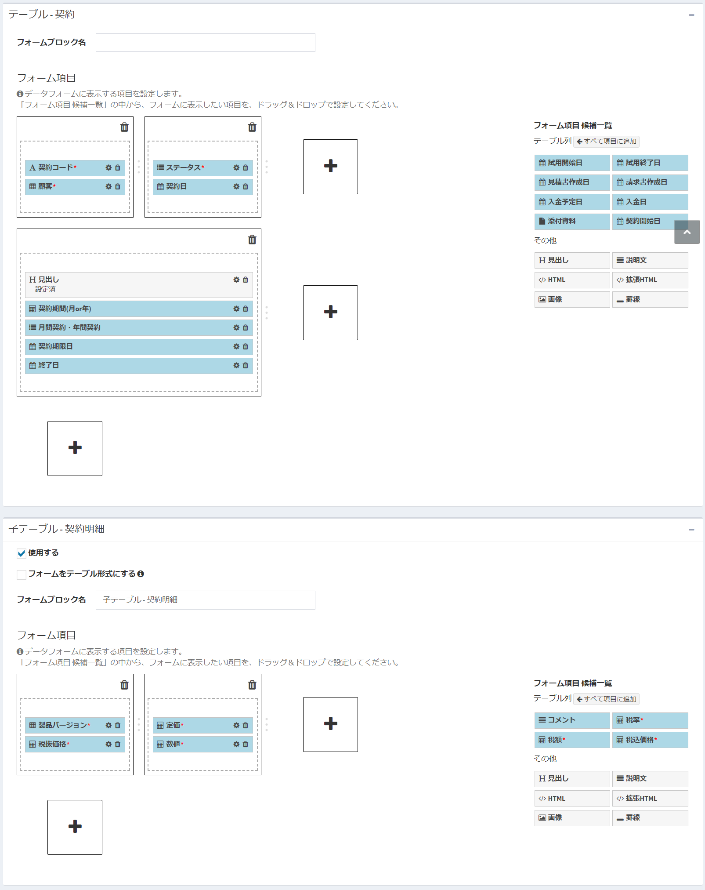

- ##### Form block name  
The name to be displayed in each block of the form.  
\* Currently, it is displayed only for child tables.

#### Form items
Setting of items to be displayed on the input form.  
A list of the set columns is displayed on the data form screen.  

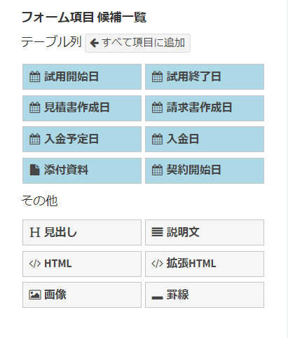

You can set boxes with 1 to 4 columns on the form.  
Place form items in these boxes.


You can do the following in the box.  

- Click the "+" button next to the box to add a new column to the current row.  


- Click the "+" button below the box to add a new row. (Add a new column to the next row if it already exists)  
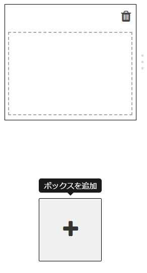

- You can resize the box by dragging and dropping the margin on the right side of the box.  


- Click the trash can icon in the upper right corner of the box to delete the box.  


By increasing or decreasing the rows and columns of the box and changing the width, you can create the following layout, for example.  

- 1 column - 2 columns


- 3 columns - 1 column
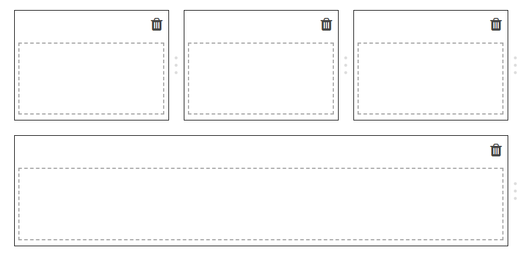

- 1 column - 2 columns - 1 column


### Form item candidate list:  
Items that can be added to the form.  
There are two types, "Table column" and "Other".  

#### Table column  
A custom column item set in a custom table.  
You can place it on the data form by dragging and dropping it into the "Form Item" box. You can usually edit or view the value of an item, although it behaves differently depending on the type of custom column and the settings in [Form Item Details](#form-item-details).  

#### Other  
Items that are not linked to data such as headings, descriptions, and HTML displayed on the form.  
By dragging and dropping it into the "Form Item" box, it will be placed on the data form.

- ##### Heading:  
It will be displayed in the form as a heading.  

- ##### Explanatory text:  
Display a descriptive text on the form. HTML is not available.  

- ##### HTML:  
Display HTML on the form.  
\* Scripts can also be used. <span class="red">(If you enter the script tag, the script will be executed when the page is drawn, so please be careful.)</span>

- ##### Extended HTML：
In addition to HTML, you can use a string in the format specified by the [parameter](/params). When drawing the page, you can create HTML by replacing it with the value of the saved data.
Example：
```
<h4>ID：${id}、Company Code：${value:company_code}</h4>
```
\* Column values ​​are replaced only when drawing on the screen. Please note that even if you edit the value of the target column on the data edit screen, the value will not be changed in conjunction with it.  
\* Scripts can also be used. <span class="red">(If you enter the script tag, the script will be executed when the page is drawn, so please be careful.)</span>

- ##### Image：
Display the image on the form.

- ##### Hairline：
Display hairlins on the form.


#### Form item details
Items added to the box are labeled as shown below.  

- Items that are required in the custom column settings are marked with a red mark next to their names.
- Click the trash can icon to the right of the label to remove the item from the box.
- Click the gear icon to the right of the label to display the advanced settings dialog.


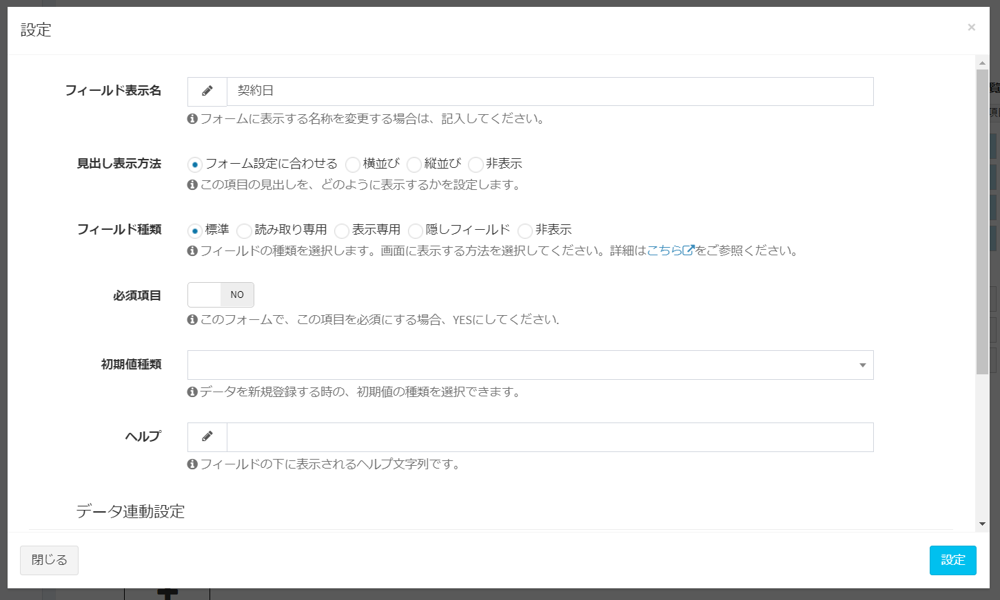

##### Heading display format
You can set the heading display method for each item individually. (Prefers over form-wide settings)

##### Field Type
Set the display format on the data form screen.

- Read Only：  
If checked, the value cannot be changed by the user. Values ​​can be changed / acquired only from the system, calculated fields, and [data linkage settings](#data-linkage-settings).
Once set, the form will be grayed out as shown below.
  
- Display Only:    
If checked, the value cannot be changed by the user. Values ​​cannot be changed or obtained from the system, calculated fields, or [data linkage settings](#data-linkage-settings).  
Once set, it will appear as text on the form, as shown below.
  
- Hidden field：  
If checked, the item will not be displayed on the page and will be added as a hidden field. Use this setting when you want to use it in the calculated field and [data linkage settings](#data-linkage-settings), but you do not want to display it on the page.

- Hide：  
If checked, the item will not be added to the page. It is added inside the system just before saving the data.
Since it does not exist on the page, it cannot be used in calculated fields or data linkage settings.
Use this setting for items that you do not want to be tampered with or modified, such as internal parameter values.


##### Data linkage settings (item)  
Please refer to the [Data linkage settings](#data-linkage-settings).  

##### Related refinement settings (items)  
Please refer to the [Related refinement settings](#Related-refinement-settings).  


## Data linkage settings
If there is an item in the form that selects data from another table, you can copy the contents of the selected data to another related item.  
Ex: When "Customer" is selected in the "Contract" form, the value of "Customer Name" in the "Customer" data is copied to "Customer Name" in the "Contract" form.  


The "Contract" form has a "Customer" select and one line of "Customer Name" text,  
  

When "Customer" is selected,  
  

The value is automatically set in the "customer name" text  


<br />  

#### Procedure
- Open the custom form page.  
Click the setting icon of form item "Customer Name".  


- There is an item of "Data linkage settings" in the opened dialog.  


- Under Select Column, select the custom column that will trigger the change.  
 \* In the same form, you can select columns with column types of "Select (from table)", "User", or "Organization". This time, select "Customer".  


- By selecting the "Select column" item, the choice of the second item "Select link column" is displayed.  
The column list of the table selected in the "Select column" item is displayed.  
This time, select "Customer Name".  


- Finally, click the [Set] button.
The dialog closes and the word "Set" is displayed next to the "Data Linkage Settings" button.  


- Click the "Send" button at the bottom of the page to complete the settings. 


## Related refinement settings
When the column type is "Select (from table)", "User", or "Organization", the choice is narrowed down according to the selection of another item in the same form. It can be set only when the columns of the parent table or referenced table of the target table exist in the same form.  

#### Example
1:n relationship is set in the "Customer Information" table and the "Contact Information" table, and the "Customer" column and the "Contact Information" column exist in the "Contract Information" table.  
When selecting the "Customer" column, I want to narrow down the options in the "Person in charge" column to only the person in charge whose parent is the selected "Customer".  

  

There is the following data,
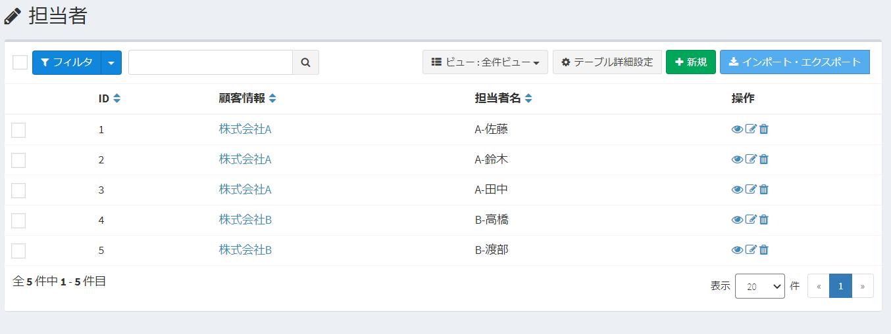  

On the contract information page,
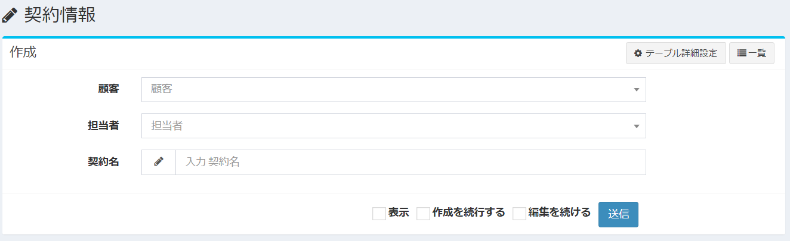 

After selecting "A Co., Ltd." in "Customer", select the person in charge belonging to A Co., Ltd. as an option candidate.
  

If "B Co., Ltd." is selected in "Customer", the person in charge belonging to B Co., Ltd. is selected as an option candidate.
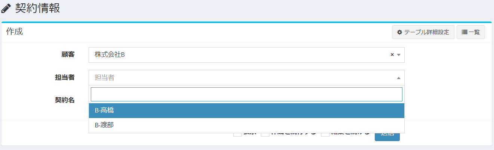  

#### Procedure
- Open the Custom form page.  
In the form item, click the settings icon in the Contact column.  
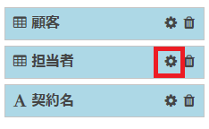

- In the dialog that opens, there is an item for "Related refinement settings".
The choices you see are a list of columns that are the parent of the selected column in the same form.
In this example, the Customer table column, which is the parent table of the Contact table, is displayed in the choices.  
\* The "Related refinement setting" button is displayed when the custom column is "Select (from table)", "User", and "Organization".


- After setting, click the "Set" button.  


#### Specifications less than v3.3.1
<span class="small">In v3.3.1 or less, this setting screen was not displayed, and the choices were narrowed down in all fields with 1: n parent-child relationship / reference relationship.  
As a result, sometimes it caused unnecessary narrowing down and unexpected problems, so in v3.3.1, we added a setting so that you can select whether or not to narrow down.  
When updating from less than v3.3.1 to v3.3.1 or higher, in order to maintain compatibility, the setting "narrow down the options in all fields with 1: n parent-child relationship / reference relationship" is inherited. I will.  
Click [here](/patch/relation_filter) for details on the specifications at the time of update.</span>


## Form priority settings
By setting the conditions and priority, you can switch the form screen used for data creation and data detail page.  

### Create New
Create from the [New] button to the right of the form priority settings.
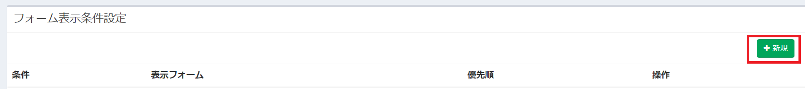

### Setting Page


##### Target Form  
Select the form you want to display when the conditions are match.

##### Priority  
Set the display priority of the form.   
If the data meets multiple form display conditions, the form with the highest priority will be displayed on the screen.

##### Condition Item  
This column is used as a display condition.

##### Search Condition  
Select the content to be a condition.  
The selection items change depending on the type of content selected in "Condition items" ("Date", "User", etc.).

##### Condition Value  
Enter the conditions to match the contents of the search conditions.

##### ［Delete］button  
Delete the display condition of the form.

##### ［New］button  
Add a new form display condition.