# Environment construction using Windows Server
This page describes the steps to build Exment on IIS on Windows Server.   
This is a completely new installation procedure, including the installation of the web server.

## Environment
This page is constructed with the following contents.   
- Windows Server 2019 Standard Japanese version
- IIS 10
- PHP 8.2.X
- MySQL 8.0.35

Appropriate notes are provided if Windows 10 is used for verification purposes.

## Important point

- Depending on your environment and version, you may not be able to set up correctly using this procedure. note that.

- This procedure describes only the steps to run Exment on Windows Server.   
General IT knowledge such as Windows Server management, database creation, commands, etc. is not included. note that.   

- **Administrator privileges are required to perform this procedure. If necessary, run the command prompt, PowerShell, or the executable file as administrator (or elevate using User Account Control)**

## Installation instructions using Windows Server

> Before you begin, we recommend that you configure Windows Server Explorer to display   filename extension  

### Installing the web server (IIS)
If the IIS feature is not enabled on your server, first install the IIS feature.
1. Open the Add Roles and Features wizard from Administration in Server Manager  
   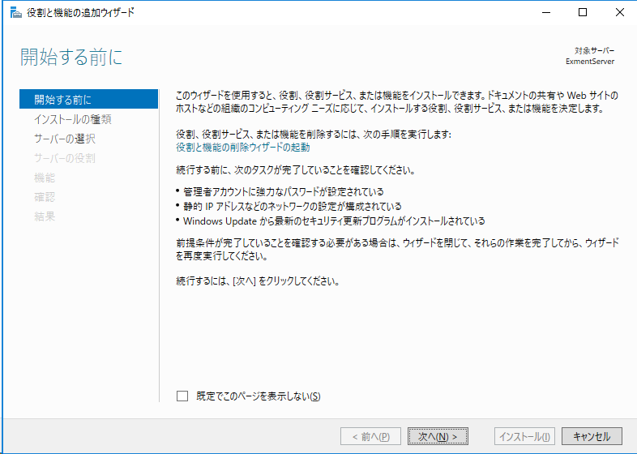
2. For Installation type, select Role-based or Feature-based installation, and Server Selection is the server on which you want to install IIS (usually the server you are working on). Select and proceed.
3. Under \[Server Roles\], select   Web Server (IIS)   and also add the displayed features  
   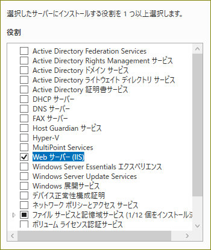
4. Proceed to the next screen of \[Feature Selection\] and \[Web Server Role (IIS)\].
5. Under \[Select Role Services\], expand \[Application Development\], check   CGI  , and proceed to the next  
     
   Please add other roles (authentication, compression, etc.) as necessary (no additional roles are required for the operation of Exment itself)
7. Under \[Check installation options\], click   Install   and wait for the installation to complete.
8. Once the installation is complete, start your browser (such as Internet Explorer) and verify that you can view the IIS default page by accessing http://localhost

> When installing on Windows 10, go to Control Panel - Programs - Programs and Features - Turn Windows features on or off and select Internet Information Services. 1_, and enable   CGI   in \[Application Development Features\].

### Preparing PHP
Download and install PHP
1. Visit https://windows.php.net/download/
2. Download the \[VC15 x64 Non Thread Safe\] ZIP file for \[PHP 8.2\]  
   > If you are using a 32-bit version of Windows in a Windows 10 environment, please download the \[VC15 x86 Non Thread Safe \] ZIP file
3. Right-click the downloaded ZIP file to display properties, check   Unblock   under \[Security\] on the \[General\] tab, and click \[OK\]. Click   
   
4. Extract the contents of the ZIP file to a suitable folder (e.g. C:\PHP)
5. Set environment variables to run PHP  
   Run sysdm.cpl with \[Run\] and display \[System Properties\]
6. Open \Environment Variables\ on the \Advanced Settings\ tab  
   
7. Find and select the variable name "Path" from the list of \[System environment variables\]   
   
8. Click Edit, then click New  
   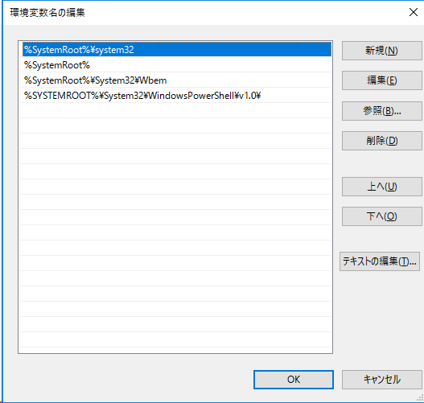
9.  Enter the path of the folder where you extracted PHP (e.g. C:\PHP) and click \[OK\] three times  
    
10. At the command prompt   
    ```
    set path
    ```
    Run and make sure the path to the PHP folder is in
11. Create a PHP configuration file  
    Create a php.ini file by copying the php.ini-development   file in the folder where PHP was extracted.
12. Edit and save the php.ini file
    1.  In the "Paths and Directories" section
        ```
        ;extension_dir = "ext"
        ```
        Change as belows  (remove the ; from the beginning of the line to uncomment it)
        ```
        extension_dir = "Path to the folder where PHP is extracted\ext" (Ex: extension_dir = "C:\PHP\ext")
        ```
    2. In the "Dynamic Extension" section
        ```
        ;extension=gd
        ;extension=openssl
        ;extension=pdo_mysql
        ```
        Change as belows  (remove the ; from the beginning of the line to uncomment it)
        ```
        extension=gd
        extension=openssl
        extension=pdo_mysql
        ```
    3.  In the "File Uploads" section
        ```
        ;upload_tmp_dir=
        ```
        Change as belows  (remove the ; from the beginning of the line to uncomment it)
        ```
        upload_tmp_dir = "Any working folder path" (Ex: upload_tmp_dir = "C:\Temp")
        ```
        ※The specified folder will be the temporary storage location when uploading files.
    4. Add the following to the end of the file.
        ```
        extension=php_fileinfo.dll
        ```

13. Verify that PHP is working by running the following command at the command prompt  
    ```
    php -v
    ```
    

    If you get an error that the Visual C++ runtime is not found, click Download the latest supported Visual C++ (https://support.microsoft.com/help/2977003/the-latest-supported-visual-c-downloads) from the Visual C++ Redistributable Package (vc_redist Please download and install .x64.exe)  
    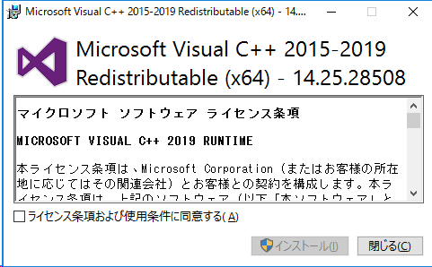

### Installing MySQL
Install and initial configuration of MySQL used by Exment  
Here we are installing MySQL 8.0.35

1. Visit the [MySQL Community Downloads](https://dev.mysql.com/downloads/mysql/) page
2. Click \[General Availability (GA) Releases\]   
   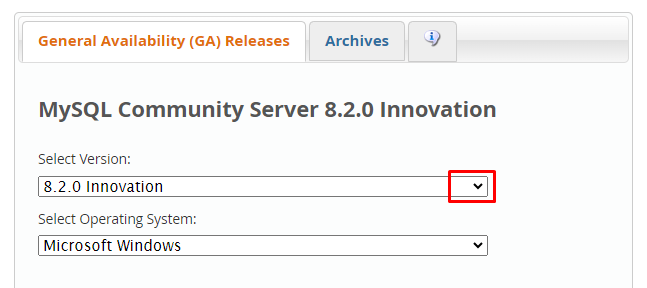
3. Select "8.0.35" for \[Select Version\], select "Microsoft Windows" for \[Select Operating System\], and select "Windows (x86, 64bit)" for \[Select OS Version\].  
     
   > If you are using a 32-bit version of Windows in a Windows 10 environment, please select "Windows (x86, 32bit)" in \[Select OS Version\]
4. Click the \[Download\] button in the "ZIP Archive" column of \[Other Downloads\] and download the mysql-8.0.35-winx64.zip file.  
   
5. When you see \[Login Now or Sign Up for a free account.\], click \[No thanks, just start my download.\] at the bottom. Download will begin
6. Right-click the downloaded ZIP file to display properties, check   Unblock   under \[Security\] on the \[General\] tab, and click \[OK\]. Click   
   
7. Extract the contents of the ZIP file to a suitable folder (e.g. C:\MySQL)
8. Launch an administrator command prompt and navigate to the mysql-8.0.35-winx64\bin folder inside the folder where you extracted the ZIP file  
   
9. Execute the following command to initialize MySQL
    ```
    mysqld --initialize
    ```
    

    If you get an error that the Visual C++ runtime is not found, [click Download the latest supported Visual C++](https://support.microsoft.com/help/2977003/the-latest-supported-visual-c-downloads) Please download and install (vc_redist.x64.exe)  
    
10. Run the following command to confirm MySQL startup. If "mysqld: ready for connections." is displayed, it has started correctly.
    ```
    mysqld --console
    ```
    
11. Press Ctrl + C to stop MySQL
12. Install MySQL as a Windows service. Installing as a service automatically runs MySQL when Windows starts
    ```
    mysqld --install
    ```
    
13. Run the following command to start MySQL immediately
    ```
    net start mysql
    ```
    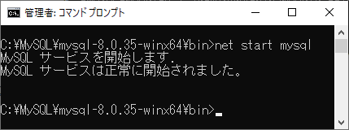
14. Check the initial value of the administrator (root) password for using MySQL  
    If the folder where you expanded MySQL is C:\MySQL, there will be a file with the extension .err in C:\MySQL\mysql-8.0.35-winx64\data, so open it with a text editor such as Notepad.   
    > In the case below, the file name is ExmentServer2.err  
    
15. Near the top of the file there is a line that says "\[Note\] A temporary password is generated for root@localhost:" (underlined in red in the image below). The character string written after this (1fyr*IXeC2%w in the figure below) is the initial password. Please note this password
    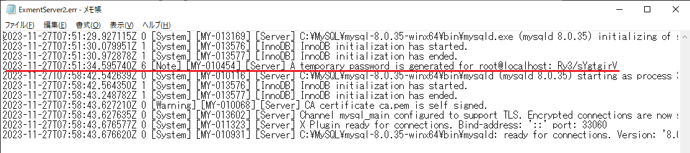
16. Return to the administrator command prompt and run the following command to initialize MySQL
    ```
    mysql_secure_installation
    ```
    1. You will be asked "Enter password for user root:", so enter the initial password you wrote down and press Enter.
    2. "The existing password for the user account root has expired. Please set a new password." is displayed  
       You will be asked for a new password, "New password:", so enter your new password and press Enter. You will be asked "Re-enter new password:", so enter your new password again and press Enter.
       > Please use a strong password that is difficult to guess. We recommend meeting the following requirements: 8 characters or more, using at least 3 types of uppercase/lowercase letters/numbers/symbols, and not using words found in the dictionary.
    3. You will be asked if you want to use VALIDATE PASSWORD PLUGIN  
       If you set a strong, hard-to-guess password, type any key other than "y" and press Enter
    4. When asked "Change the password for root ?", enter any key other than "y" and press Enter.
    5. Type "y" for all remaining confirmations and press Enter
    6. When "All done!" is displayed, the initial settings are complete.
17. Run the following command to log in to MySQL
    ```
    mysql -u root -p
    ```
18. You will be asked for a password, "Enter password:", so enter the password you set earlier and press Enter.
    
19. When the "MySQL>" prompt appears, run the following commands in sequence:
    > Here, the MySQL user used for Exment is "exment_user" and its password is "M!p3~S$W7fLm"  
      Please decide the actual username and password yourself (please use a strong password that is difficult to guess)  
      This username and password will be used for the initial settings of Exment.
    ```
    CREATE DATABASE exment_database;
    CREATE USER 'exment_user' IDENTIFIED BY 'M!p3~S$W7fLm';
    GRANT ALL ON exment_database.* TO exment_user identified by 'M!p3~S$W7fLm';
    FLUSH PRIVILEGES;
    ```
20. Log out of MySQL by typing the following and pressing Enter
    ```
    \q
    ```

### Preparing IIS
Prepare IIS to run Exment
1. Install the URL Rewite module.   
   Visit https://www.iis.net/downloads/microsoft/url-rewrite and click \[Install this extention\]
2. urlrewrite2.exe will be downloaded, run it and follow the on-screen guidance to install it.
   1. Click \[Install\]   
      
   2. Click \[Agree\]  
      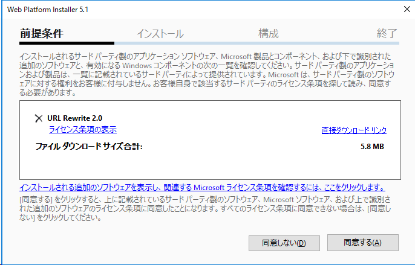
   3. The installation will begin  
      
   4. Click \[Finish\]  
      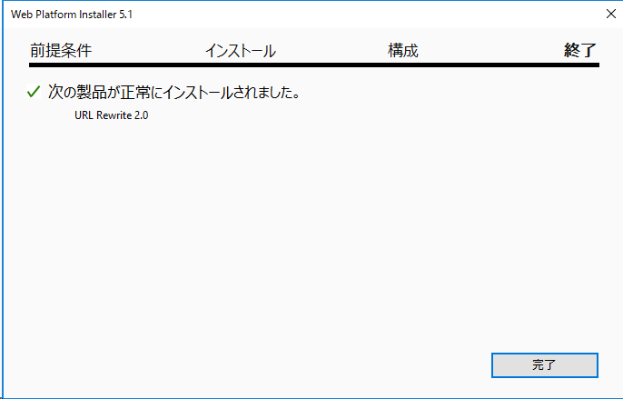
   5. Click \[Exit\]  
      
3. Open Internet Information Services (IIS) Manager from Tools in Server Manager  
   
4. In the connections pane, expand \[(server name)\] - \[Site\] and select \[Default Web Site\]
5. Double-click \[Handler Mapping\] in the feature view
6. Click \[Add module map\] in the action pane
7. Enter the following in \[Add module map\] and click \[OK\]   
   - Request path: *.php  
   - Module: FastCgiModule  
   - Executable file: (Path of folder where PHP is extracted)\php-cgi.exe (Example: C:\PHP\php-cgi.exe)  
   - Name: Any (Example: PHP)  
   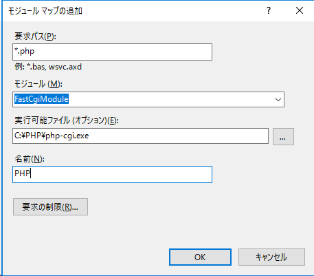
8. Click \[Yes\] when the confirmation message appears.

### Installing Composer
Install the PHP library management tool (Composer) required by Exment
1. Access the [Composer download page (https://getcomposer.org/download/)](https://getcomposer.org/download/) and select "Download and run Composer-Setup.exe - it will install the Download Composer-Setup.exe from where it says "latest composer version whenever it is executed"  
   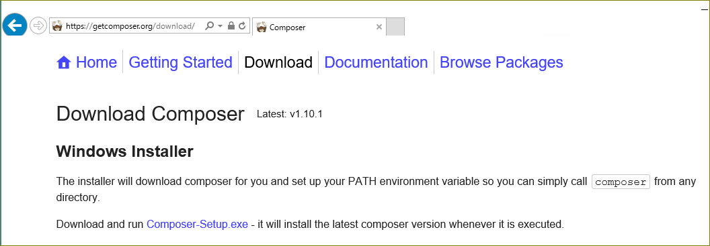
2.  Run the downloaded Composer-Setup.exe
3.  Select "Install for all users"  
   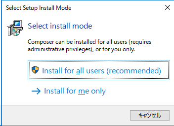
4.  Uncheck "Developer Mode" and proceed to the next  
   
5. Confirm that the PHP path displayed in "Setting Check" is correct and proceed to the next   
   
6. If "PHP Configration Error" appears, check \[Create a php,ini file\] or \[Update this php.ini\] to proceed  
   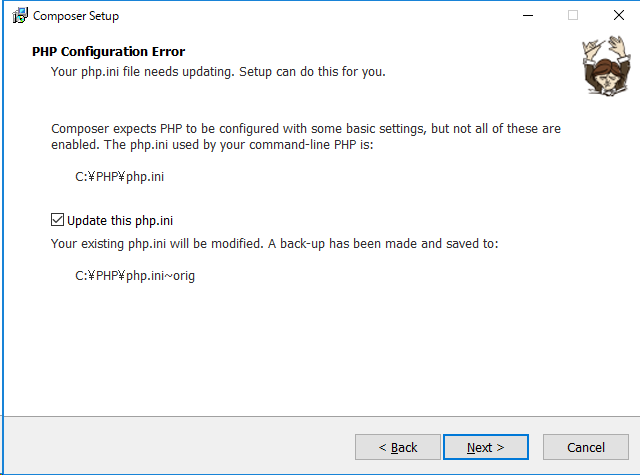
7. Under "Proxy Settings" specify the proxy to use for your Internet connection. If you are not using a proxy, just continue   
   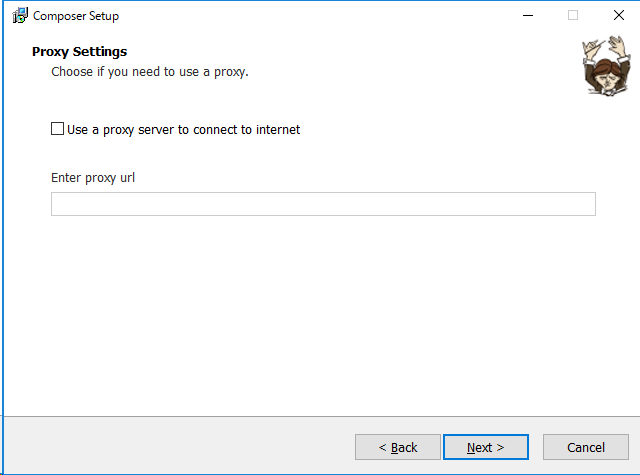
8. A confirmation screen will appear, so click \[Install\]   
   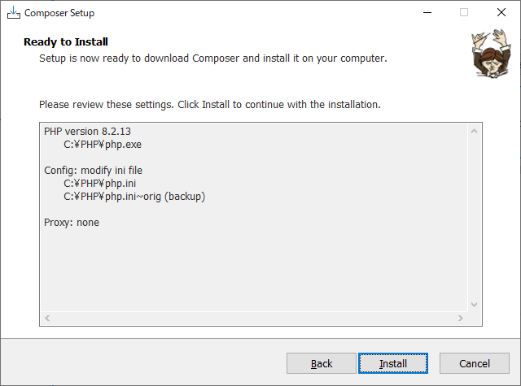
9. When "Information" is displayed, proceed to the next step  
    
10. Click \[Finish\] to complete  
    

### Download Exment and prepare to run it

1. From the Exment installation procedure page ([https://exment.net/docs/#/quickstart](https://exment.net/docs/#/quickstart)) .zip)
2. Right-click the downloaded ZIP file to display properties, check   Unblock   under \[Security\] on the \[General\] tab, and click \[OK\]. Click   
   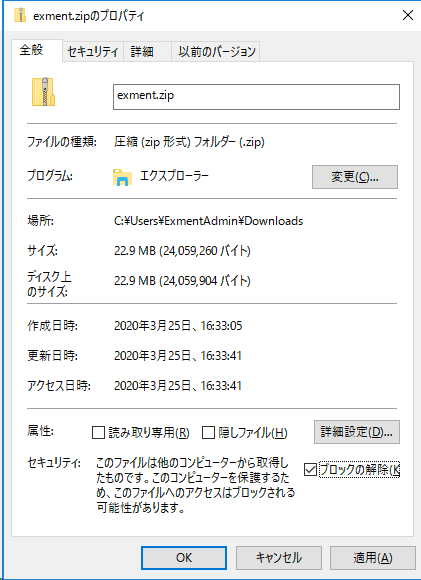
3. Extract the contents of the exment folder in the ZIP file to an appropriate folder (e.g. C:\exment)  
     
   **Never extract directly under the   inetpub\wwwroot   folder. Installation files containing database settings, email passwords, etc. will be made public, leading to a fatal information leak**
4. Create a virtual directory   
   Open Internet Information Services (IIS) Manager, expand \[(server name)\] - \[Sites\] in the \[Connections] pane, right-click \[Default Web Site\], and click \[ Select Add Virtual Directory   
   
5. Configure the virtual directory as follows  
   In the example, the alias (URL path to access Exment) is "exment"  
   Set the physical path to the path of the folder where the Exment ZIP file was extracted (e.g. C:\exment)
   - Alias: exment  
   - Physical path: C:\Exment\public  
   
6. Add "index.php" to the default files   
   Select \[Default Web Site\] and double-click \[Default Document\] to open it  
   
7. Click Add in the Actions pane
8. Add index.php   
   
9.  Add URL replacement (Rewrite) rules to Web.config  
   In the \[Connection\] pane, select the virtual directory (exment in the example) added in   4.   and double-click \[URL Rewriting\] to open it  
   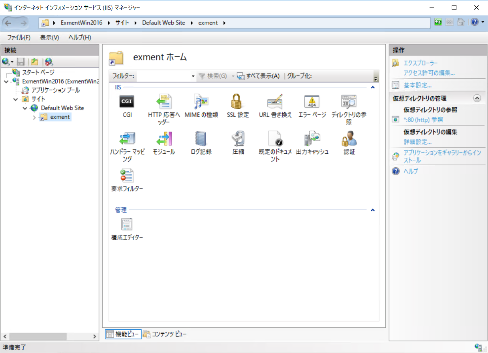
10. Click Add Rule in the Actions pane  
   
11. Under Add Rule, select Empty Rule under Inbound Rule and click OK.
   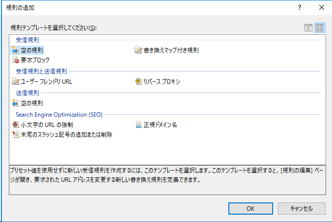
12. Create a rule in \[Edit Inbound Rules\] as follows  
    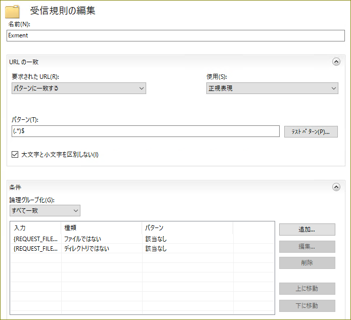
    - Name: Any name
    - \[URL match\]
      - Requested URL: matches pattern
      - Use: regular expression
      - Pattern: (.*)$
    - Condition
      - Logical group: Match all
      - Click \[Add\] and add the following two conditions
        - Input: {REQUEST_FILENAME}  
        Type: Not a file
        - Input: {REQUEST_FILENAME}  
        Type: Not a directory
    - Action
      - Action type: Rewrite
      - Action properties
      - URL replacement: index.php/{R:1}
      - Add query string: ON
      - Record rewritten string: OFF
    - Stop processing subsequent rules: ON
13. Click Apply in the Actions pane
14. Changes saved successfully   is displayed, click \Return to Rules\

<!-- Please check the following steps -->

15. Set folder permissions so that it can be written to from Laravel
    Give the IIS execution user (IIS_IUSRS) write permissions to the folder where you expanded the ZIP in Exment and configured the virtual directory.  
    > C:\exment in the example
    
    

16. Add write access to the exment folder to the IIS execution user (IIS_IUSRS)
    1. Right-click the exment folder and select Properties
    2. Open the \[Security\] tab and click \[Edit\]
    3. Under \[storage permissions\], click the \[Add\] button to display \[Select user or group\]
    4. Enter IIS_IUSRS in the \[Enter the object names to select\] field and click \[Check Names\]
    5. When the display changes to (computer name)\IIS_IUSRS, click \[OK\]  
       
    6. Return to \[exment permissions\], so click IIS_IUSRS in the \[group name or user name\] field, and set \[permissions\] for \[write\] in the \[permissions\] field   
    
    7. Click \[OK\] twice to close properties

<!--
It seems that IIS_IUSRS write permission is actually required not only for the storage folder but also for other files and folders in the exment folder.
Since I don't know what minimum permissions are actually required for which resources, in the test environment I have given IIS_IUSRS write permissions to the entire C:\exment folder to confirm that the Exment web app works. .
Once we know the minimum access rights, we will revise this section accordingly.

14. Set folder permissions so that it can be written to from Laravel
    > Give the IIS execution user (IIS_IUSRS) write permissions to the folder where you expanded the Exment ZIP and configured the virtual directory (for example C:\exment)
15. Configure access privileges
    1. Right-click the exment folder and select Properties
    2. Open the \[Security\] tab and click \[Edit\]
    3. Under \[exment permissions\], click the \[Add\] button to display \[Select user or group\]
    4. Enter IIS_IUSRS in the \[Enter the object names to select\] field and click \[Check Names\]
    5. When the display changes to (computer name)\IIS_IUSRS, click \[OK\]  
    6. Return to \[exment permissions\], so click IIS_IUSRS in the \[group name or user name\] field, and set \[permissions\] for \[write\] in the \[permissions\] field. Check   
    7. Click \[OK\] twice to close the properties
-->

17. Start your browser (Chrome or Microsoft Edge) and access http://localhost/(virtual directory alias)/admin (for example, http://localhost/exment/admin)  
The Exment installation page appears.
> Exment does not support display in Internet Explorer. Use Chrome or Microsoft Edge to access Exment

   1. Check that Language is \[Japanese\] and Timezone is \[(GMT+09:00)Japan\], and click \[Submit\]  
   

   2. Enter the settings for the created database and click \[Submit\]
   > In the example, <br />Database\[exment_database\] <br />Username\[exment_user\] <br />Password\[M!p3~S$W7fLm\]

   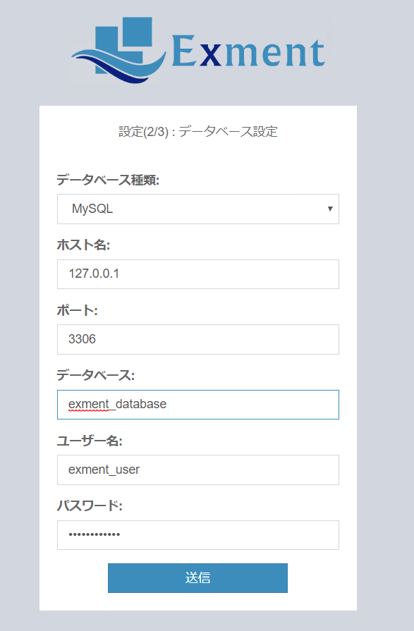

   3. Click \[Run installation\]   
     
   If the installation has been completed successfully, the Exment initial settings screen will be displayed.   
   For initial settings, please see [here](/first_setting.md?id=Initial settings screen).

18.  Once the installation is complete, remove the access permissions set for the exment folder.

   1. Right-click the exment folder and select \[Properties\]
      > C:\exment (in the example)
   2. Open the \[Security\] tab and click \[Edit\]
   3. Select \[IIS_IUSRS\] in the \[Group name or user name\] field
   4. Click \[Check Names\] in \[Permissions\], and uncheck \[Allow\] for \[Write\] in the \[Permissions\] field. 
   
   5. Click \[OK\] twice to close properties   

19.  Add write access permissions to some folders. The folders and files to be added are as follows.

| Type | File/folder name | Required functions |
| ---- | ---- | ---- |
| Folder | storage | All functions |
| Folder | bootstrap/cache | Full functionality |
| File | .env | Easy installation and restore |
| Folder | config | Easy installation and restore |
| Folder | app | Easy installation |
| Folder | public | Easy installation |
| Folder | resources | Easy installation |

The following example shows the steps to add permissions to the storage folder.

   1. Right-click the storage folder and select \[Properties\]  
   > C:\exment\storage in the example  
   2. Open the \[Security\] tab and click \[Edit\]  
   3. Under \[Storage Permissions\], click the \[Add\] button to display \[Select User or Group\]  
   4. Enter IIS_IUSRS in the \[Enter the object names to select\] field and click \[Check Names\]  
   5. When the display changes to (computer name)\IIS_IUSRS, click \[OK\]    
         
   6. Return to \[storage permissions\], so click IIS_IUSRS in the \[group name or user name\] field, and set \[permission\] for \[write\] in the \[permissions\] field   
      
   7. Click \[OK\] twice to close the properties  

20.   Add write access permissions to the folder specified by upload_tmp_dir in php.ini so that uploaded files can be temporarily stored  
   1. Right-click the relevant folder and select \[Properties\]  
   > C:\Temp in the example
   2. Open the \[Security\] tab and click \[Edit\]  
   3. Under \[Temp Permissions\], click the \[Add\] button to display \[Select User or Group\]  
   4. Enter IIS_IUSRS in the \[Enter the object names to select\] field and click \[Check Names\]  
   5. When the display changes to (computer name)\IIS_IUSRS, click \[OK\]  
         
   6. Return to \[Temp Permissions\], click IIS_IUSRS in the \[Group Name or User Name\] field, and set \[Permission\] for \[Write\] in the \[Permissions\] field   
      
   7. Click \[OK\] twice to close the properties  
   For initial settings after installation, please see [here](/first_setting.md)

  
## Correspondence when upgrading PHP version
If you want to change the PHP version, please update it by following the steps below.   
※Exment will not be accessible while the version is being upgraded.   
※The example below is the procedure for updating from PHP7.4 to PHP8.2.   
※The version upgrade method may differ depending on the environment, installation time, version, and installation method.   

- Stop IIS in preparation for work.   

- Back up the PHP execution folder you are currently using. You can rename the folder, copy it to another location, or do whatever you like.   

- Download new PHP.   

   1. Access https://windows.php.net/download/
   2. Download the \[VC15 x64 Non Thread Safe\] ZIP file for \[PHP 8.2\]  
      > If you are using a 32-bit version of Windows in a Windows 10 environment, please download the \[VC15 x86 Non Thread Safe \] ZIP file.
   3. Extract the contents of the ZIP file to the same path as the previous PHP.   
   ※ It is assumed that PATH is set in the environment variable.   

- Copy the php.ini file from the previous version's PHP folder that you have backed up to the new version's PHP folder.   

- Edit the php.ini file as required.   
   1. If the GD library in the "Dynamic Extension" section is commented out, enable it.
        ```
        ;extension=gd
        ```
        Change as belows (Remove the ; from the beginning of the line to uncomment it)
        ```
        extension=gd
        ```

   ※ Depending on the original PHP version, extension=gd2 may be set. Please change extension=gd.   

- Start IIS.   

- Check that the PHP version is 8.2.X using a command prompt, etc.   

~~~
php -v
~~~
