# MySQL installation procedure
These are the steps for using MySQL with Exment.  
※Various steps may differ depending on the OS, version, installation time, etc.


## MySQL settings (Windows)

### Upgrade to MySQL 8.4 (Windows)

This section is for users who already have MySQL (for example 5.7 / 8.0) and want to upgrade to MySQL 8.4.

- Recommendation: Back up your databases before upgrading.
	- Example: [Database backup](https://dev.mysql.com/doc/refman/8.0/en/mysqldump-sql-format.html)

- (If MySQL is running) open Command Prompt as Administrator and stop the service.
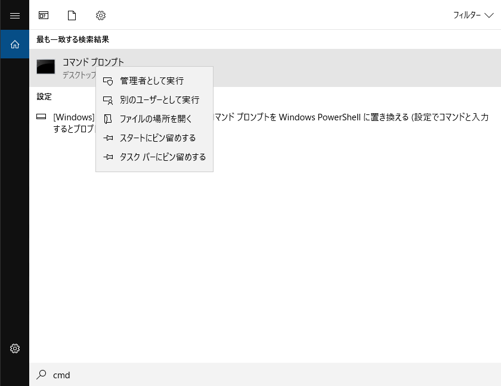

~~~
net stop mysql57
net stop mysql80
~~~

- Download MySQL Community Server (Windows) from the following page.
	- Note: MySQL Installer is available only for the MySQL 8.0 series. For MySQL 8.1 and later (including 8.4), download MySQL Server as an MSI or ZIP package.
	- [MySQL Community Server Downloads](https://downloads.mysql.com/archives/community/)
	- In Select Version, choose 8.4.X, then choose Windows (x86, 64-bit).
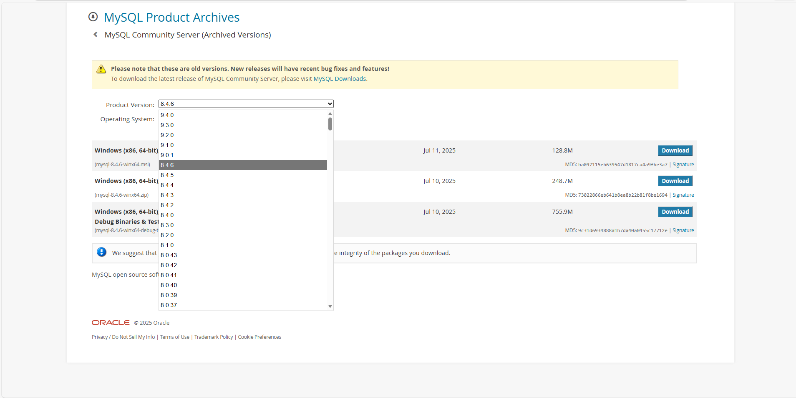

- Download one of the following packages:
	- MSI Installer
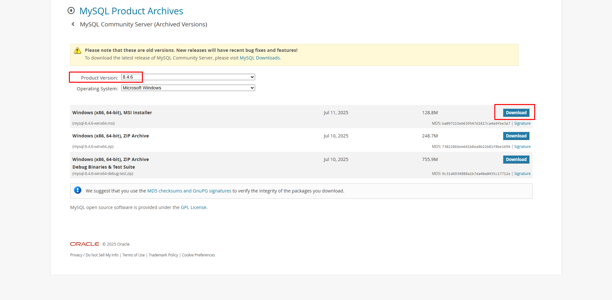

- Run the MSI file and follow the wizard.
	- On the Welcome screen, click Next to start.

		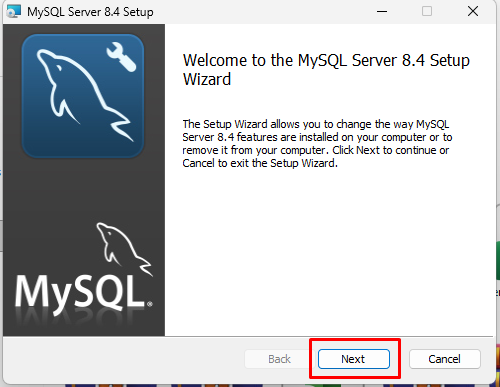
	- Accept the License Agreement and click Next.

		
	- For setup type, select **Complete** to install all features.

		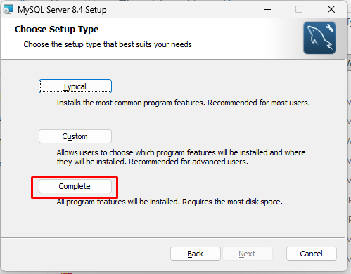
	- Click Install to start installing.

		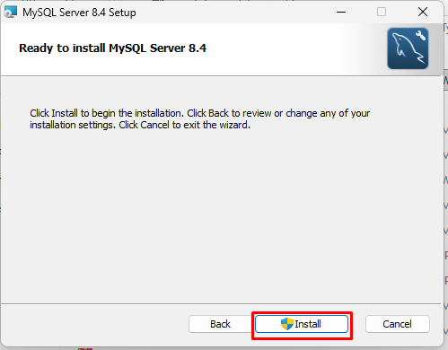
	- Wait for installation to complete, then click Finish.

		

- After the MSI installation finishes, the configuration tool (MySQL Configurator) starts automatically.
	- On **Welcome to the MySQL Server Configurator**, click **Next**.

		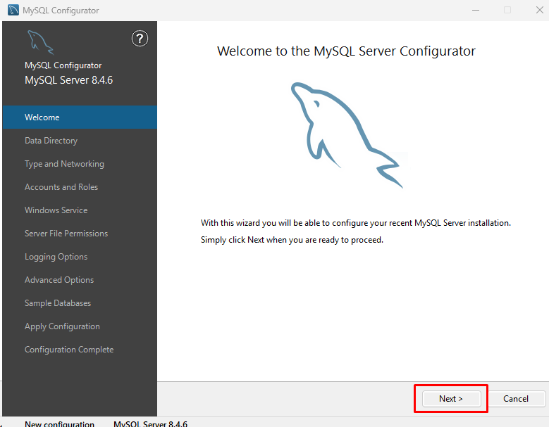

- **Data Directory**: keep the default and click **Next**.

	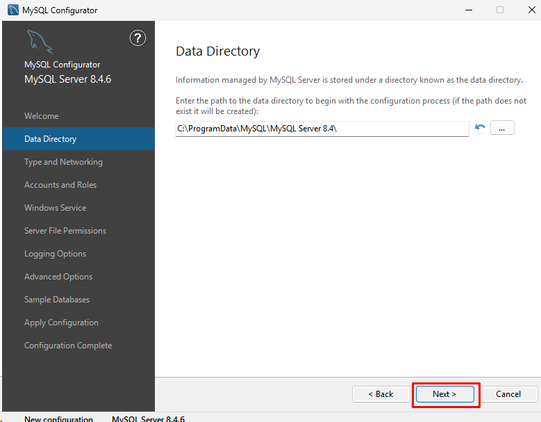

- **Type and Networking**:
	- **Config Type**: select `Development Computer`.
	- **Connectivity**: check `TCP/IP` (default port is `3306`).
	- Click **Next**.

		

- **Accounts and Roles**: set the `root` password and click **Next**.

	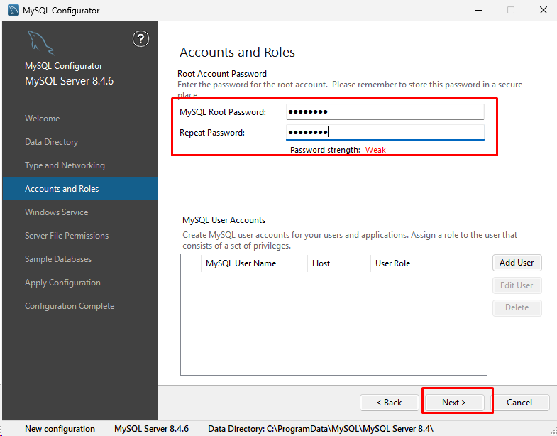

- **Windows Service**: set a service name (example `MySQL84`) and click **Next**.

	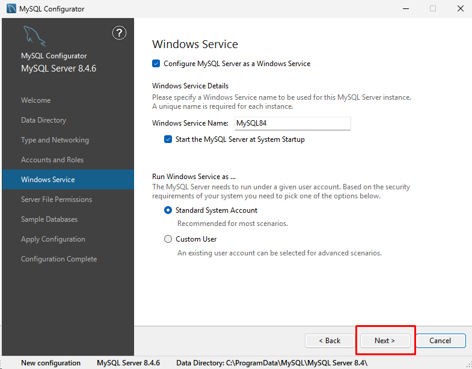

- **Server File Permissions**: keep the default and click **Next**.

	

- **Sample Databases**: skip, click **Next**.

	

- **Apply Configuration**: click **Execute**, then **Next** and **Finish**.

	

- Edit `my.ini` (MySQL 8.4) and enable local infile.
	- Path: `C:\ProgramData\MySQL\MySQL Server 8.4\my.ini`
	- Add the following under `[mysqld]` (or to the end of the file):

~~~
local-infile=1
~~~

- Restart MySQL (service name depends on your setup).

~~~
net stop MySQL84
net start MySQL84
~~~

- Verify the version.

~~~
mysql --version
~~~

~~~
mysql -u root -p -e "SELECT VERSION();"
~~~


### Add environment variables

- From Explorer, right-click This PC and click Properties.

	

- Click Advanced system settings.

	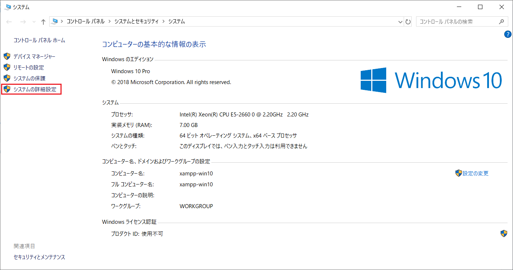
- Click on Environment Variables.

	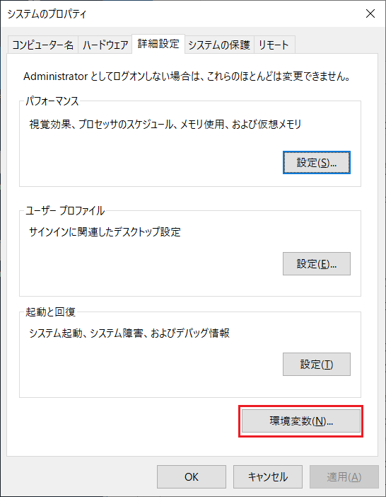

- Click Path under User Environment Variables and click Edit.

	

- Remove old MySQL `bin` paths if they exist (example: `C:\Program Files\MySQL\MySQL Server 5.7\bin`).

	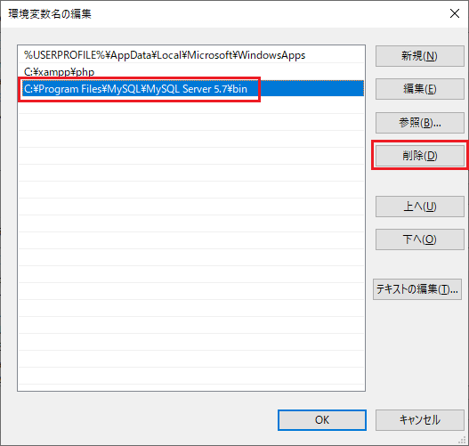

- Click New and add the following line.

~~~
C:\Program Files\MySQL\MySQL Server 8.4\bin
~~~


- Click OK to close all dialogs.


## MySQL settings (Linux)
This is the installation procedure for MySQL on Linux.   
※ Add sudo to the beginning of the command if necessary.   
※If the installation destination is CentOS8, RHEL8, etc., please use the dnf command instead of yum.

### If MySQL5.7 exists (update from MySQL5.7 to MySQL8.4)
- Delete the MySQL5.7 package.
~~~
sudo killall mysqld; sudo killall mysqld_safe;
sudo rpm -e --nodeps mysql57-community-release
sudo yum remove mysql mysql-server mysql-client mysql-common mysql-devel mysql-community-client-plugins -y
~~~

- Install and start MySQL 8.4.
<div style="margin-left: 2em;">Note: The rpm package depends on your OS version.</div>
<div style="margin-left: 2em;">For example, in the case of AlmaLinux 9.5:</div><br>

~~~
[root@localhost ~]# uname -a
Linux localhost.localdomain 5.14.0-503.11.1.el9_5.x86_64 #1 SMP PREEMPT_DYNAMIC Tue Nov 12 09:26:13 EST 2024 x86_64 x86_64 x86_64 GNU/Linux
~~~

<div style="margin-left: 2em;">In this case,</div><br>

~~~
sudo rpm -ivh https://repo.mysql.com/mysql84-community-release-el9-2.noarch.rpm
~~~

<div style="margin-left: 2em;">would be the appropriate command.</div><br>


```bash
# For CENTOS STREAM

rpm -ivh https://repo.mysql.com/mysql84-community-release-el9-2.noarch.rpm
rpm --import https://repo.mysql.com/RPM-GPG-KEY-mysql-2023
dnf clean packages
dnf update -y

# Install and start mysql-community-server
dnf install mysql-community-server -y
systemctl start mysqld
systemctl enable mysqld
```


```bash
# For CENTOS 8

sudo rpm -ivh https://repo.mysql.com/mysql84-community-release-el8-2.noarch.rpm
sudo rpm --import https://repo.mysql.com/RPM-GPG-KEY-mysql-2023

# Check if mysql-community-server exists
sudo yum search mysql-community-server

# If you get a message like "Error: Unable to find a match: mysql-community-server", run the following command first:
sudo yum -y module disable mysql

# Install and start mysql-community-server
sudo yum -y install mysql-community-server
sudo systemctl enable mysqld.service
sudo systemctl start mysqld
```

- Fix my.cnf.

~~~
vi /etc/my.cnf

# Add the following to the end

local-infile=1
~~~

- Start MySQL.

~~~
sudo systemctl start mysqld
~~~

### If MySQL5.7 does not exist (new installation of MySQL8.4)
- Install and start MySQL8.4.

<div style="margin-left: 2em;">Note: The rpm package depends on your OS version.</div>
<div style="margin-left: 2em;">For example, in the case of AlmaLinux 9.5:</div><br>

~~~
[root@localhost ~]# uname -a
Linux localhost.localdomain 5.14.0-503.11.1.el9_5.x86_64 #1 SMP PREEMPT_DYNAMIC Tue Nov 12 09:26:13 EST 2024 x86_64 x86_64 x86_64 GNU/Linux
~~~

<div style="margin-left: 2em;">In this case,</div><br>

~~~
sudo rpm -ivh https://repo.mysql.com/mysql84-community-release-el9-2.noarch.rpm
~~~

<div style="margin-left: 2em;">would be the appropriate command.</div><br>

```bash
# For CENTOSSTREAM

rpm -ivh https://repo.mysql.com/mysql84-community-release-el9-2.noarch.rpm
rpm --import https://repo.mysql.com/RPM-GPG-KEY-mysql-2023
dnf clean packages
dnf update -y

# Install and start mysql-community-server
dnf install mysql-community-server -y
systemctl start mysqld
systemctl enable mysqld
```

```bash
# For CENTOS 8

sudo rpm -ivh https://repo.mysql.com/mysql84-community-release-el8-2.noarch.rpm
sudo rpm --import https://repo.mysql.com/RPM-GPG-KEY-mysql-2023

# Check if mysql-community-server exists
sudo yum search mysql-community-server

# If you get a message like "Error: Unable to find a match: mysql-community-server", run the following command first:
sudo yum -y module disable mysql

# Install and start mysql-community-server
sudo yum -y install mysql-community-server
sudo systemctl enable mysqld.service
sudo systemctl start mysqld
```


- Check the initial password for MySQL.

~~~
cat /var/log/mysqld.log | grep password

#The following log will be output, so check the password
2016-09-01T13:09:03.337119Z 1 [Note] A temporary password is generated for root@localhost: uhsd!XXXXXX
~~~

- (Optional) Disable password policy.

~~~
vi /etc/my.cnf

#Add the following validate_password
[mysqld]
validate_password=OFF
~~~


- Restart MySQL.

~~~
sudo systemctl restart mysqld
~~~

- Perform initial settings for MySQL. Run the following command:

~~~
mysql_secure_installation

Enter password for user root: (enter the password you copied earlier)

New password: (enter new password)
Re-enter new password: (enter new password)

Change the password for root? : n

Remove anonymous users? : y #Remove anonymous user account
Disallow root login remotely? : y # Remove root account that is accessible only from localhost
Remove test database and access to it? : y # Remove test database
Reload privilege tables now? : y #reload privilege tables
~~~

- Log in to MySQL.

~~~
mysql -u root -p(password)
~~~
- Fix my.cnf.

~~~
vi /etc/my.cnf

# Add the following to the end

local-infile=1
~~~

- Restart MySQL.

~~~
sudo systemctl restart mysqld
~~~

- Create a database and user for Exment.   
※Here, let the database name be exment_database and the user exment_user.   
Also, assume the connection source IP address is 192.168.137.%.

~~~
CREATE DATABASE exment_database;
CREATE USER 'exment_user'@'192.168.137.%' IDENTIFIED BY '(password for exment_user)';
GRANT ALL ON exment_database.* TO 'exment_user'@'192.168.137.%';
FLUSH PRIVILEGES;
~~~

- Firewall settings allow MySQL access only from the IP address of the connection source.   
※Here, the connection source IP address is 192.168.137.%.

~~~
firewall-cmd --permanent --new-zone=from_webserver
firewall-cmd --reload
firewall-cmd --permanent --zone=from_webserver --add-source="192.168.137.0/24"
firewall-cmd --permanent --zone=from_webserver --add-port=3306/tcp
firewall-cmd --zone=from_webserver --add-service=mysql
firewall-cmd --reload
~~~
