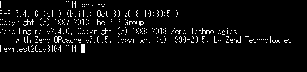

# Environment construction by rental server
If you want to easily build and operate an environment, you have the option of a rental server.  
This page describes the procedure for building an Exment on the rental server.  

## Points to note when building on a rental server
- Exment requires the following environment.
    1. PHP 7.2.0 or higher  
    1. MySQL 5.7.8 or higher, less than 8.0.0  
or MariaDB 10.2.7 or higher  
  Especially the MySQL version may not meet the requirements depending on the rental server.  
Please check in advance if your rental server meets the requirements.

- In building on a rental server, the basic flow is to first install composer after SSH communication and install Exment.  

- For each rental server, the public path to the Web is specified as public (/ home / username / www, / public_html, etc.).  
 **Do not put the folder where Exment is installed directly under this folder. The setting file of the database setting value and the password of the e-mail etc. are disclosed to the outside, leading to fatal information leakage.**    
In this procedure, the procedure for publicly publishing only the folder to be published is described. Follow this procedure to publish on the Web.  

- Depending on the rental server environment and the version of the server on the rental server side, it may not be possible to set correctly with this procedure.  

- In this procedure, only the procedure for operating Exment on the rental server is described.  
It does not describe general IT-related knowledge such as SSH, database creation, and Linux commands. Please note.  

- For other inquiries, please feel free to [contact us](https://exment.net/inquiry) for free.

## Installation procedure by rental server

### For Xserver

<iframe width="560" height="420" src="https://www.youtube.com/embed/RB6i0F2fev0" frameborder="0" allow="accelerometer; autoplay; encrypted-media; gyroscope; picture-in-picture" allowfullscreen></iframe>

- Create MySQL for Exment in advance.

- Change the PHP version.  
In the case of Xserver, the version of PHP that is set from the management screen may be different from the version of PHP that is executed when a command is executed through SSH connection.  
  
So, set the version of Xserver at the time of command.  

- Click "Switch PHP Ver." From the management screen of Xserver.  
Then select the target domain.  
  
  

- The current version is described from "PHP version switching", so write down the version.  
  

- SSH to Xserver.  

- Use the following command to check the PHP version set on the Xserver.  
From the command result, copy the path to the version of PHP that you wrote down from the management screen.  

~~~ bash
find /opt/php-*/bin -type f -name 'php'

## /opt/php-7.1.2/bin/php
## /opt/php-7.1.3/bin/php
## /opt/php-7.1.4/bin/php
## /opt/php-7.2.1/bin/php
## /opt/php-7.2.14/bin/php
## /opt/php-7.2.6/bin/php ←Here in this example
## /opt/php-7.2/bin/php
~~~

- Create a folder and create a symbolic link to PHP.  

~~~
mkdir $HOME/bin
ln -s /opt/php-7.2.6/bin/php $HOME/bin/php
~~~

- Modify the bashrc file to pass the path to the PHP version above.  

~~~ bash
vi ~/.bashrc

## Write the following in the last line and save it with ": wq!"
export PATH=$HOME/bin:$PATH

## Apply modifications
source ~/.bashrc
~~~

- Check if the latest PHP is correctly reflected.  
If the version is listed on the management screen, you are done.  

~~~ bash
php --version
~~~

  

- Install composer.  

~~~ bash
cd ~
curl -sS https://getcomposer.org/installer | php -- --install-dir=$HOME/bin/
## rename
mv $HOME/bin/composer.phar $HOME/bin/composer
## Verification
composer --version
# Composer version 1.8.5 2019-04-09 17:46:47
~~~

- Install Exment. Here,**please do not install directly under "$ HOME / (domain name) / public_html" folder.**  
This time, create “$ HOME / (domain name) / laravel” folder and install Exment in it.  

~~~ bash
cd ~/(Domain name)
mkdir laravel
cd laravel
wget https://exment.net/downloads/ja/exment.zip
unzip exment.zip
rm exment.zip
~~~

- Create a symbolic link to the “$ HOME / (domain name) / laravel / exment / public” folder in the “$ HOME / (domain name) / public_html” folder.  
By creating a symbolic link, the Laravel public folder will be in the public_html folder even if the Laravel main unit and setting values ​​are not in the Web-published folder.  

~~~ bash
## Delete default public_html
rm -r $HOME/(domain name)/public_html
ln -s $HOME/(domain name)/laravel/exment/public $HOME/(domain name)/public_html
~~~

- You are now ready to access Exment. Follow the [installation procedure](/quickstart) to complete the settings.  
※If you want to access Exment, add "/ admin" to the end of the URL.  

### For Sakura Internet
※In case of Sakura Internet, it may be terminated on the way when composer is implemented.  
Therefore, execute it with "nice -n 20 composer" and "nice -n 20".  

- Create MySQL for Exment in advance.  

- Change the path from Sakura Internet's "Domain / SSL Settings".  
Select the domain you want to change from "Domain / SSL Settings" in the administration menu.  
  

Change the specified folder from "Multi-domain target folder". Here, it is "/ exment".  
  

- Use your ID password to perform SSH communication.  

- Change shell  

~~~
which bash
#  /usr/local/bin/bash

chsh -s /usr/local/bin/bash
# Password:  ## Enter password
# chsh: user information updated
~~~

- Modify the batch.  

~~~ bash
vi .bash_profile

## Write the following and save with ": wq!"
PATH=$PATH:$HOME/bin:$HOME/usr/local/bin
export PATH
~~~

- Terminate the SSH communication once and execute the SSH communication again.  

- Install composer.  

~~~ bash
cd ~
mkdir -p usr/local/bin/
curl -sS https://getcomposer.org/installer | php -- --install-dir=usr/local/bin/
## rename
mv usr/local/bin/composer.phar usr/local/bin/composer
## Verification
nice -n 20 composer --version
# composer version 1.8.5 2019-04-09 17:46:47
~~~

- Install Exment.**never install directly under the "$ HOME / www /" folder.**  
This time, create “$ HOME / laravel” folder and install Exment in it.  

~~~ bash
cd ~
mkdir laravel
cd laravel
wget https://exment.net/downloads/ja/exment.zip
unzip exment.zip
rm exment.zip
~~~

- Create a symbolic link to the "$ HOME / laravel / exment / public" folder created in the "$ HOME / www / exment" folder.  
By creating a symbolic link, the laravel public folder will be in the www folder, even if the Laravel body and settings are not in the web-published folder.  

~~~
ln -s $HOME/laravel/exment/public $HOME/www/exment
~~~

- You are now ready to access Exment. Follow the [installation procedure](/quickstart) to complete the settings.  
※If you want to access Exment, add "/ admin" to the end of the URL.  