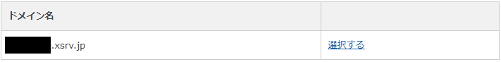
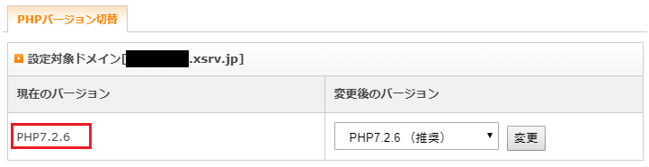
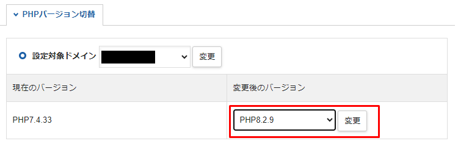
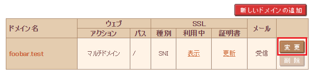
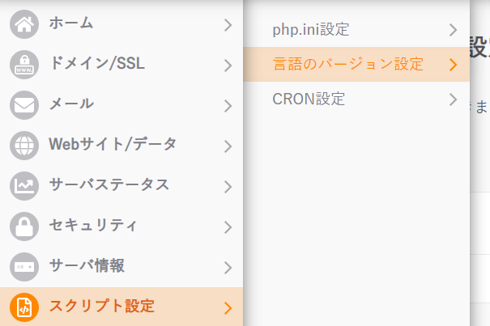

# Environment construction using rental server
If you want to easily build and operate an environment, you have the option of renting a server.   
This page describes the steps to build Exment on a rental server.   

## Points to note when building on a rental server
- Exment requires the following environment.
    1. PHP 8.2 or higher
    1. MySQL 8.0 or higher or MariaDB 10.4 or higher  
  In particular, the version of MySQL may not meet the requirements depending on the rental server.   
  Please check in advance whether the rental server you are using meets the conditions. 

- When building a rental server, the basic flow is to first install composer and Exment after SSH communication.   

- For each rental server, a path to publish the web to public is specified (/home/username/www, /public_html, etc.).   
Do not put the folder where Exment is installed directly under this folder. Installation files containing database settings, email passwords, etc., may be made public, leading to a fatal information leak.   
This procedure describes the steps to make public only the folder that should be made public, so please follow these steps to publish on the web.

- Depending on the environment of the rental server, the version of the server on the rental server side, etc., you may not be able to configure the settings correctly using this procedure.

- This procedure only describes the steps to run Exment on a rental server.   
General IT knowledge such as SSH, database creation, Linux commands, etc. is not included. note that.   

## Installation procedure using rental server

### For Xserver
Operation has been confirmed with the ※X10 plan.

<iframe width="560" height="420" src="https://www.youtube.com/embed/RB6i0F2fev0" frameborder="0" allow="accelerometer; autoplay; encrypted-media; gyroscope; picture-in-picture" allowfullscreen></iframe>

- Create MySQL for Exment in advance.

- Change PHP version.   
In the case of Xserver, the PHP version set from the management screen and the PHP version when you connect to SSH and execute commands may be different.   
Therefore, set the Xserver version at the time of the command.

- From the Xserver management screen, click PHP Ver. Switch.   
Then select the domain of interest.   
  
  

- The current version is listed in the PHP version switcher, so make a note of it.   
  

- SSH into Xserver.   

- Check the PHP version set on Xserver with the command below.   
From the command result, copy the path to the PHP version that you took note of from the management screen.   

~~~ bash
find /opt/php-*/bin -type f -name 'php'

## /opt/php-8.2.9/bin/php ←Click here for this example
~~~

- Create a folder and create a symbolic link to PHP.   

~~~
mkdir $HOME/bin
ln -s /opt/php-8.2.9/bin/php $HOME/bin/php
~~~

- Modify the bashrc file to pass the path to the above PHP version.   

~~~ bash
vi ~/.bashrc

## Write the following on the last line and save with :wq!
export PATH=$HOME/bin:$PATH

## Apply the modifications
source ~/.bashrc
~~~

- Check whether the latest PHP is properly reflected.   
If it is the version listed on the management screen, you are done.

~~~ bash
php --version
~~~

-Install composer.

~~~ bash
cd ~
curl -sS https://getcomposer.org/installer | php -- --install-dir=$HOME/bin/
## rename
mv $HOME/bin/composer.phar $HOME/bin/composer
## confirmation
composer --version
# Composer version 2.6.5 2023-10-06 10:11:52
~~~

- Install Exment. Never install directly under the $HOME/(domain name)/public_html folder. Installation files containing database settings, email passwords, etc., may be made public, leading to a fatal information leak.   
This time, create the $HOME/(domain name)/laravel folder and install Exment in it.

~~~ bash
cd ~/(domain name)
mkdir laravel
cd laravel
wget https://exment.net/downloads/en/exment.zip
unzip exment.zip
rm exment.zip
~~~

- Create a symbolic link for the $HOME/(domain name)/laravel/exment/public folder you created earlier in the $HOME/(domain name)/public_html folder.   
By creating a symbolic link, the Laravel public folder will exist in the public_html folder even if the Laravel main body and setting values ​​are not in the web publication folder.

~~~ bash
## Delete default public_html
rm -r $HOME/(domain name)/public_html
ln -s $HOME/(domain name)/laravel/exment/public $HOME/(domain name)/public_html
~~~

- Now you are ready to access Exment.   
Please follow the [Installation Instructions](/quickstart) to complete the settings.   
If you want to access ※Exment, please add /admin to the end of the URL.   

#### Correspondence when upgrading PHP version
If you want to change the PHP version, please update it by following the steps below.   
※Exment will not be accessible while the version is being upgraded.   
※The example procedure below is for updating from PHP7.4 to PHP8.2.   
※The version upgrade method may differ depending on the environment, installation time, version, and installation method.   

- From the Xserver management screen, click PHP Ver. Switch.   
Then select the domain of interest.   

- In PHP version switcher, switch to the new version and click Change.   
  

- SSH into Xserver.   

- Check the current PHP version with the command below.   
(At this stage the old version will be displayed.)  

~~~
php --version
~~~

- Break symbolic links to PHP.   

~~~
unlink $HOME/bin/php
~~~

- Check the path of the version selected in PHP version switch.   

~~~bash
find /opt/php-*/bin -type f -name 'php'

## /opt/php-8.2.9/bin/php  ←Click here for this example
~~~

- Set a symbolic link to the path confirmed above.   

~~~
ln -s /opt/php-8.2.9/bin/php $HOME/bin/php
~~~

- Check PHP version. If it's a new version, it's a success.   

~~~
php --version
~~~

### For Sakura Internet
※Operation has been confirmed with the standard plan.   
※In the case of Sakura Internet, when running composer, it may end midway.   
So run nice -n 20 composer and nice -n 20.

- Create MySQL for Exment in advance.

- Change the path from Sakura Internet's domain/SSL settings.   
Select the domain you want to change from Domain/SSL Settings in the administration menu.  
  

Change the specified folder from the multi-domain target folder. Here it is /exment.  
  

- Perform SSH communication using your ID and password.   

- Change shell.   

~~~
which bash
#  /usr/local/bin/bash

chsh -s /usr/local/bin/bash
# Password:  ## Enter password
# chsh: user information updated
~~~

- Fix batch.

~~~ bash
vi .bash_profile

## Enter the following and save with :wq!
PATH=$PATH:$HOME/bin:$HOME/usr/local/bin
export PATH
~~~

- Terminate SSH communication once, and then execute SSH communication again.

- Install composer.

~~~ bash
cd ~
mkdir -p usr/local/bin/
curl -sS https://getcomposer.org/installer | php -- --install-dir=usr/local/bin/
## rename
mv usr/local/bin/composer.phar usr/local/bin/composer
## confirmation
nice -n 20 composer --version
# Composer version 2.6.5 2023-10-06 10:11:52
~~~

- Install Exment. Never install directly under the $HOME/www/ folder. Installation files containing database settings, email passwords, etc., may be made public, leading to a fatal information leak.   
This time, create a $HOME/laravel folder and install Exment in it.

~~~ bash
cd ~
mkdir laravel
cd laravel
wget https://exment.net/downloads/en/exment.zip
unzip exment.zip
rm exment.zip
~~~

- Create a symbolic link for the $HOME/laravel/exment/public folder you created earlier in the $HOME/www/exment folder.   
By creating a symbolic link, the Laravel public folder will exist in the www folder even if the Laravel main body and setting values ​​are not in the web public folder.

~~~
ln -s $HOME/laravel/exment/public $HOME/www/exment
~~~

- Now you are ready to access Exment.   
Please follow the [Installation Instructions](/quickstart) to complete the settings.   
If you want to access ※Exment, please add /admin to the end of the URL.   

#### Correspondence when upgrading PHP version
If you want to change the PHP version, please update it by following the steps below.   
※Exment will not be accessible while the version is being upgraded.   
※The version upgrade method may differ depending on the environment, installation time, version, and installation method.   

- From the Sakura Internet management screen, click Script Settings → Language Version Settings.   
  

- Under PHP version, switch to the new version and click Save.   
  

- SSH connect to Sakura Internet.   

- Check PHP version. If it's a new version, it's a success.   

~~~ bash
php --version
~~~
