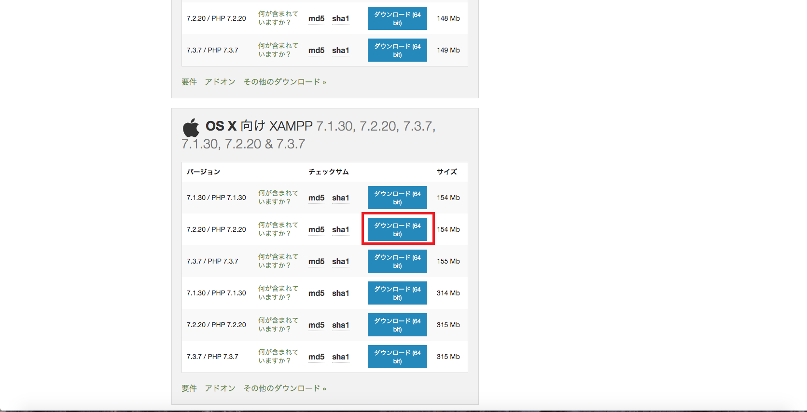
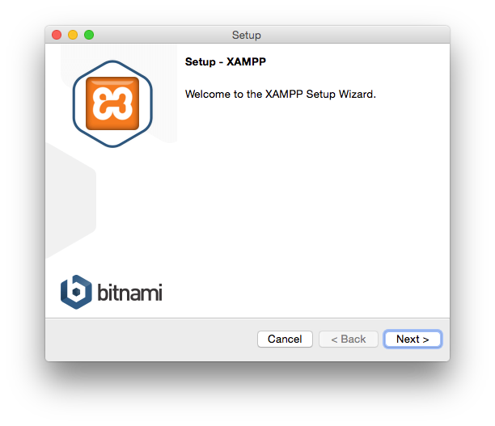
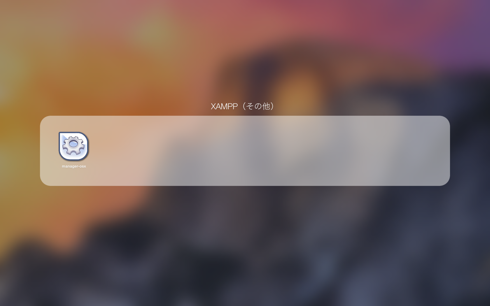
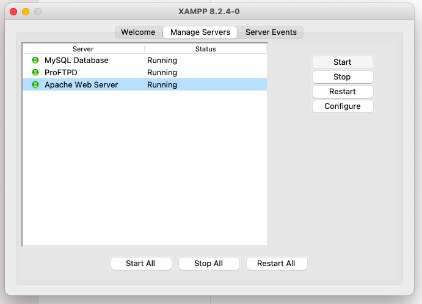
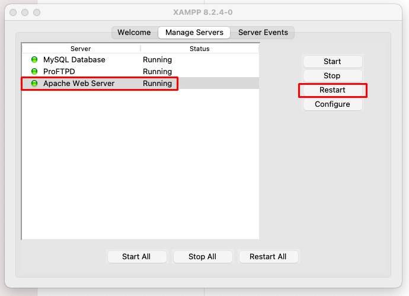
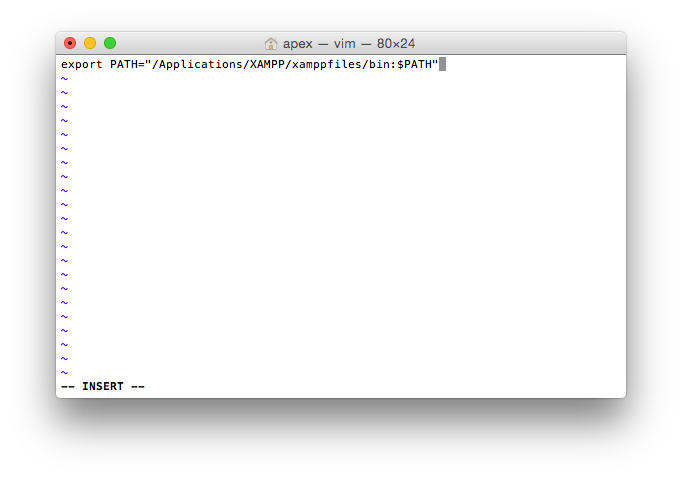
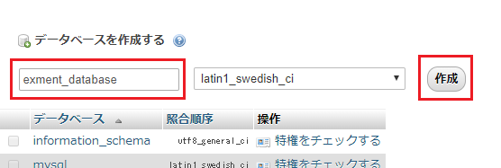
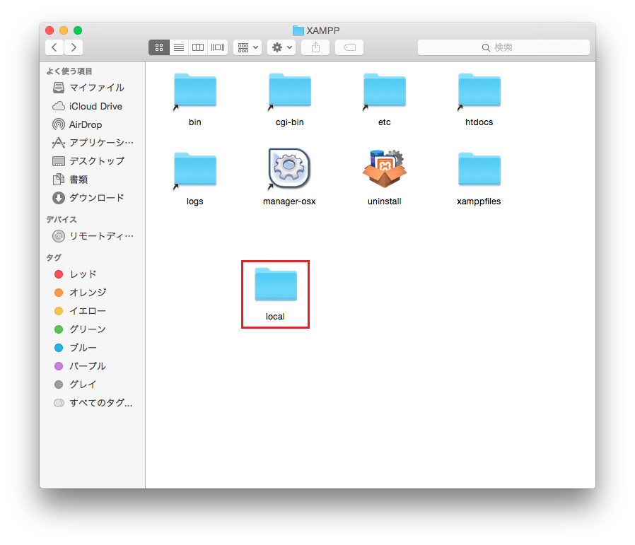

# Environment construction with XAMPP
XAMPP is recommended when building an environment with PHP, Apache, and MySQL as a development environment from the beginning.  
In addition, this manual introduces the case of Mac.  

- For other inquiries, please feel free to [contact us](https://exment.net/inquiry) for free.  

## Important point
- **Please use XAMPP installation only for development and verification. We recommend that you do not use it as a production environment.** 

## Installation procedure

### XAMPP installation procedure
- Access the following site and download XAMPP.  
[XAMPP Download](https://www.apachefriends.org/jp/download.html)  

- From XAMPP for OS X, select PHP 8.2 and download it.  

- After that, proceed with the installation of XAMPP.  

- On the XAMPP component selection screen, check both and press Next.  

- Follow other screens and press Next to complete the installation.  
- After the installation is completed, there is an application called manager-osx in XAMPP (Other) of LaunchPad, so you can start XAMPP from there.  

- After launching XAMPP, click on Manage Servers.  

- Click the Start button of MySQL or Apache, and set Status to Runnig.  

#### 【Important point】
- When the OS is restarted, it is necessary to start the XAMPP control panel again and restart Apache.  

### Add environment variable
- When executing mysql from the terminal, add Path to the terminal configuration file .bash_profile.  

- Edit .bash_profile by passing the following command to pass the path.  
~~~
vi .bash_profile
~~~

- On the opened screen, press i on the keyboard to enter the input mode (INSERT is displayed at the lower left), and then enter the Path as follows.  
~~~
export PATH="/Applications/XAMPP/xamppfiles/bin:$PATH"
~~~

- To save and close the settings, press Esc on your keyboard, then enter: wq.  

- Finally, run .bash_profile with the following command and pass it through the path.  
~~~
source ~/.bash_profile
~~~

#### Create database
- After starting the XAMPP control panel, access the phpMyadmin by entering the following URL in a web browser.

http://localhost/phpmyadmin/index.php  

- Click "New" on the left menu.

- In the "Create database" line, enter any database name in alphanumeric characters and click "Create".

This completes the database creation.

### Subdomain settings
Under normal settings, you can use Exment by placing the Exment project file in the "/ Applications / XAMPP / htdocs" folder. However, there is a big problem, for example, when accessing the URL of [http: //localhost/exment/.env](http://localhost/exment/.env), the configuration file including the database information is displayed on the screen.  
Therefore, we strongly recommend that you avoid these issues.  
Please set according to the following procedure.  

- Create a folder "local" in the folder "/ Applications / XAMPP".  

- Open "/Applications/XAMPP/xamppfiles/etc/extra/httpd-xampp.conf".  

- Add the following description at the end of the line.  
**※"/Public" is required at the end of DocumentRoot**  

~~~
<VirtualHost *:80>
    DocumentRoot "/Applications/XAMPP/xamppfiles/htdocs"
    ServerName localhost
</VirtualHost>

<VirtualHost *:80>
  DocumentRoot "/Applications/XAMPP/local/exment/public"
  ServerName exment.localapp
</VirtualHost>

<Directory "/Applications/XAMPP/local/exment/public">
  Allow from all
  AllowOverride All
  Require all granted
</Directory>  
~~~

- Edit "/Applications/XAMPP/xamppfiles/etc/httpd.conf".  
After that, perform a character string search to find the following description.  

~~~
User daemon
Group daemon
</IfModule>
~~~

Modify this description as follows.  

~~~
User (Mac login user name)
Group daemon
</IfModule>
~~~

- Open "/ etc / hosts" and edit it.  
In a terminal, enter the following command:  
※ You will be asked for a password. Enter the password of the login user.

~~~
sudo vi /etc/hosts
~~~

Edit the hosts file. Add the following items.  

~~~
127.0.0.1       localhost
127.0.0.1       exment.localapp
~~~

- Restart Apache in the XAMPP control panel.  

### Exment installation
Install Exment according to the Exment [installation procedure](/quickstart).  
Exment is usually installed in the "/ Applications / XAMPP / local" folder.  
Here, it is assumed that the installation was performed in the "/ Applications / XAMPP / local / exment" folder.  

- In the future installation of Exment, there is a screen to fill in the database settings, please enter as follows.  
    - Database type: MariaDB
    - Host name: 127.0.0.1
    - Port: 3306
    - Database: (Database name created above)
    - User name: root
    - Password: (blank)

