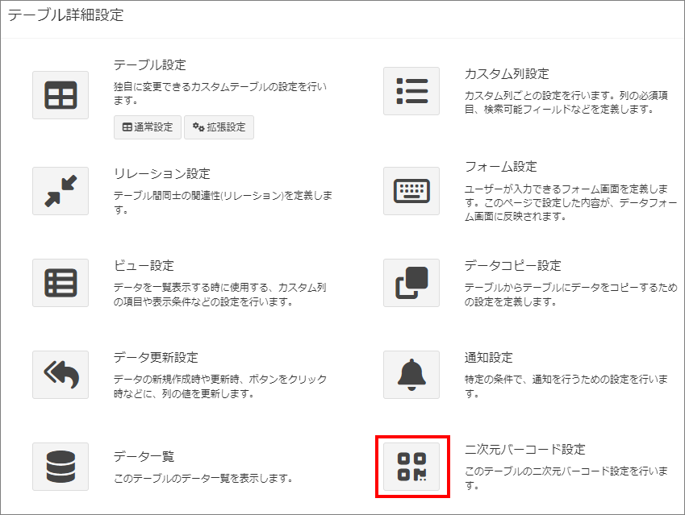
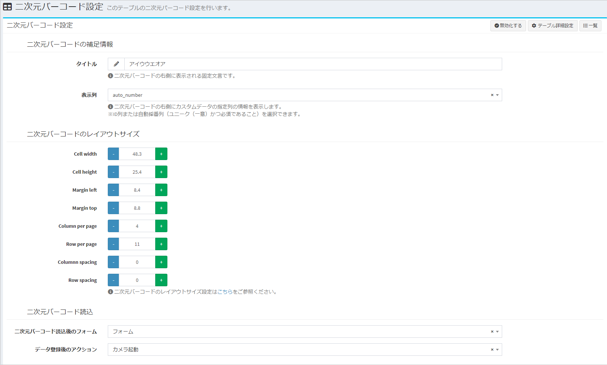
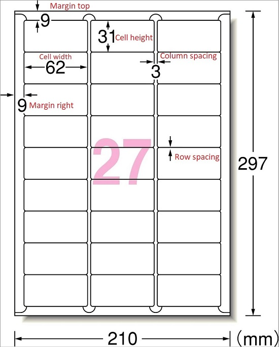
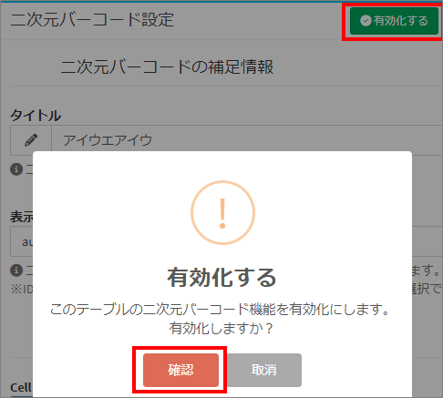
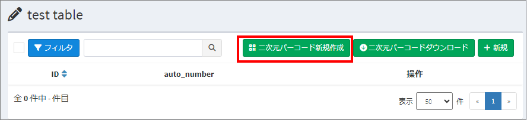
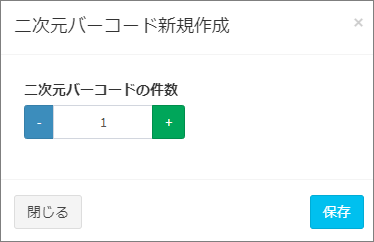
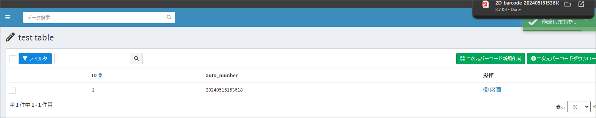
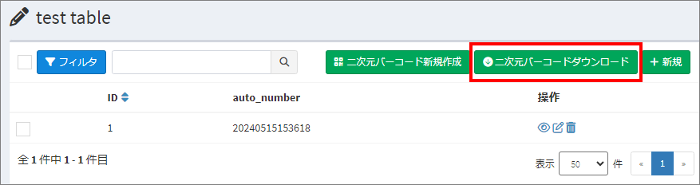
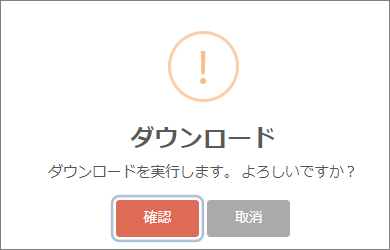
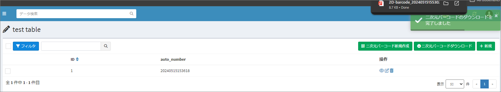

# 二次元バーコード設定
テーブルの二次元バーコード設定を行います。

## 二次元バーコード機能の概要
二次元バーコード機能の概要については、[こちら](https://exment.net/release_v6-1-0/)の公式サイトの投稿をご覧ください。

## ページ表示
- カスタムテーブル一覧で、設定を行うテーブルにチェックを入れて、右上の「テーブル詳細設定」をクリックします。  

> ※ 対象となるカスタムテーブルのデータ一覧画面やデータ登録画面から、直接遷移することも可能です。その場合も、右上の「テーブル詳細設定」をクリックしてください。  

- 表示されたテーブル詳細設定の画面で、二次元バーコード設定のアイコンをクリックすると、二次元バーコード設定画面が表示されます。  

## 二次元バーコードの設定項目

### 二次元バーコードの補足情報
二次元バーコードの右側に表示される情報を設定します。

- #### タイトル
二次元バーコードの右側に表示される固定文言を入力します。

- #### 表示列
二次元バーコードの右側にカスタムデータの指定列を設定します。   
ID列または自動採番列（ユニーク（一意）かつ必須であること）を選択できます。

### 二次元バーコードのレイアウトサイズ
二次元バーコードのレイアウトサイズを設定します。 
下記の表をご参照ください。

| Case | Cell width | Cell height | Margin right | Margin top | Column per page | Row per page | Column spacing | Row spacing |
| ---- | ---- | ---- | ---- | ---- | ---- | ---- | ---- | ---- |
| 2x5 | 84 | 52 | 17 | 10.5 | 2 | 5 | 8 | 4 |
| 2x6 | 83.8 | 42.3 | 19.3 | 21.5 | 2 | 6 | 3.8 | 0 |
| 2x7 | 83 | 32 | 20 | 24 | 2 | 7 | 4 | 4 |
| 3x6 | 63.5 | 46.5 | 7.2 | 9 | 3 | 6 | 2.55 | 0 |
| 3x7 | 63.5 | 38 | 7.2 | 15.5 | 3 | 7 | 2.55 | 0 |
| 3x8 | 56 | 30 | 17 | 14.5 | 3 | 8 | 4 | 4 |
| 3x9 | 62 | 31 | 9 | 9 | 3 | 9 | 3 | 0 |
| 3x10 | 53.3 | 25.4 | 19 | 21.5 | 3 | 10 | 3.8 | 0 |
| 3x12 | 60 | 20 | 12 | 12 | 3 | 12 | 3 | 3 |
| 4x11 | 48.3 | 25.4 | 8.4 | 8.8 | 4 | 11 | 0 | 0 |

### 二次元バーコード読込
二次元バーコード読込時の情報を設定します。 

- #### 二次元バーコード読込後のフォーム
二次元バーコード読込後の登録フォームを設定します。  
対象テーブルに登録済のカスタムフォームから選択できます。 

- #### データ登録後のアクション  
データ登録後の表示画面を設定します。  
TOP画面、一覧画面、詳細画面、編集画面、カメラ起動画面を選択できます。

設定後、「保存」ボタンをクリックします。  

### 二次元バーコード設定を有効化する  
- 対象テーブルの二次元バーコード機能を公開するためには「有効化する」必要があります。一度保存を行ってから、ページ右上の「有効化する」ボタンをクリックしてください。

## 二次元バーコード新規作成
- 二次元バーコード機能を有効化した後、対象テーブルのデータ一覧に「二次元バーコード新規作成」ボタンが表示されます。  
「二次元バーコード新規作成」ボタンの「二次元バーコード」の表示名を.envファイルの「EXMENT_TEXT_QR_BUTTON_JA/EN」で変更できます。  

- 二次元バーコード新規作成」をクリックすると、二次元バーコード新規作成画面が表示されます。

- 二次元バーコードの件数を入力して、保存すると、入力されている数でデータが作成されて、二次元バーコードもPDF出力されます。

## 二次元バーコードダウンロード
- 二次元バーコード機能を有効化した後、対象テーブルのデータ一覧に「二次元バーコードダウンロード」ボタンが表示されます。  
「二次元バーコードダウンロード」ボタンの「二次元バーコード」の表示名を.envファイルの「EXMENT_TEXT_QR_BUTTON_JA/EN」で変更できます。

- 対象データを選択して、「二次元バーコードダウンロード」をクリックすると、選択されているデータの二次元バーコードがPDF出力されます。

## Exmentからカメラ画面の起動
- Exmentのダッシュボードから、二次元バーコード読込のためのカメラ画面を起動できます。

- Exmentのダッシュボードに、アイテム「二次元バーコード読込」を追加する手順は、[こちら](/ja/dashboard#二次元バーコード)をご参照ください。
