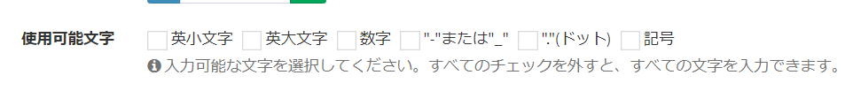

# カスタム列の種類「1行テキスト」の設定「使用可能文字」で、独自のオプションを追加
カスタム列の種類「1行テキスト」では、設定「使用可能文字」で、以下のような項目が表示されます。



この項目に加え、独自の項目を追加するための手順を記載します。

### 設定手順 

- プロジェクトのルートフォルダより、「app/Exment」フォルダを開きます。

- その後、作成されている「bootstrap.php」ファイルを開きます。

> 「app/Exment/bootstrap.php」ファイルが存在しない場合、手動でフォルダ・phpファイルを作成してください。

- 以下のような記載を追加してください。

``` php
\Exceedone\Exment\Model\CustomColumn::customAvailableCharacters([
    [
        'key' => 'hiragana', // キー。英数字
        'label' => 'ひらがな', // 画面に表示する文言
        'regex' => 'ぁ-ん', // 許可する文字列を、正規表現で記載
    ],
    [
        'key' => 'katakana',
        'label' => 'カタカナ',
        'regex' => 'ァ-ン',
    ],
]);
```

- これにより、使用可能文字の選択肢が追加されます。


- 保存し、設定完了です。


[←追加設定一覧へ戻る](/ja/quickstart_more)