# (上級者向け)ファイルの保存先変更
Exmentでは標準設定の場合、添付ファイルはWebサーバー上に保存されます。  
ですが、Webサーバー以外の場所に保存したい場合も考えられます。例えば、以下のような場合です。

- バックアップファイルを、FTPに保存する
- 冗長化を行うため、ファイルをAWS S3に保存する

このように、ファイルの保存先を変更したい場合の設定方法を記載します。  

## ファイルの種類
現在Exmentでは、以下のようなファイルの種類があります。  
※キー名は、後に記載する設定で使用します

- **添付ファイル** : 画面から保存する、データの添付ファイル。キー名 : exment
- **バックアップ** : バックアップ画面から実行する、Exmentデータのバックアップファイル。キー名 : backup
- **プラグイン** : Exmentの拡張機能としてアップロードした、プラグインファイル。キー名 : plugin
- **テンプレート** : Exmentのカスタムテーブルやカスタム列などの設定ファイル。キー名 : template


## アップロード先(ドライバ)の種類
現在Exmentでは、以下のアップロード先(ドライバ)に対応しています。
※キー名は、後に記載する設定で使用します

- **ローカル(既定)** : Webサーバー。キー名 : local
- **FTP** : FTP。キー名 : ftp
- **SFTP** : SFTP。キー名 : sftp
- **Amazon S3** : Amazon S3。キー名 : s3
- **Azure Blob** : Azure Blob。キー名 : azure

> v3.6.2より、独自のドライバに対応しました。詳細は、このページ下部の「独自のドライバ追加」をご確認ください。

## 設定方法

### 共通設定
- ".env"を開き、変更したいファイルの種類ごとに、ドライバを指定します。

~~~
EXMENT_DRIVER_EXMENT=(添付ファイルで使用したいドライバのキー名)
EXMENT_DRIVER_BACKUP=(バックアップで使用したいドライバのキー名)
EXMENT_DRIVER_TEMPLATE=(テンプレートで使用したいドライバのキー名)
EXMENT_DRIVER_PLUGIN=(プラグインで使用したいドライバのキー名)

// 例1：バックアップ先のみFTPにしたい場合
EXMENT_DRIVER_BACKUP=ftp

// 例2：すべてのアップロード先を、Amazon S3に変更したい場合
EXMENT_DRIVER_EXMENT=s3
EXMENT_DRIVER_BACKUP=s3
EXMENT_DRIVER_TEMPLATE=s3
EXMENT_DRIVER_PLUGIN=s3
~~~

### はじめてインストールしたバージョンがv3.0.8未満の場合
Exmentをはじめてインストールしたバージョンが、v3.0.8未満の場合、以下の修正が必要です。  
(インストールしたバージョンがご不明な方は、念の為ご確認ください)

- プロジェクトのルートフォルダの、「config/exment.php」を開きます。

- 以下のような記述を探します。

~~~ php
    /*
    |--------------------------------------------------------------------------
    | driver
    |--------------------------------------------------------------------------
    |
    | file upload driver
    |
    */
    'driver' => [
        'default' => env('EXMENT_DRIVER_DEFAULT', 'local'),
    ],
~~~

- この記述を、以下に変更します。

~~~ php
    /*
    |--------------------------------------------------------------------------
    | driver
    |--------------------------------------------------------------------------
    |
    | file upload driver
    |
    */
    'driver' => [
        'exment' => env('EXMENT_DRIVER_EXMENT', 'local'), //修正
        'backup' => env('EXMENT_DRIVER_BACKUP', 'local'), //追加
        'plugin' => env('EXMENT_DRIVER_PLUGIN', 'local'), //追加
        'template' => env('EXMENT_DRIVER_TEMPLATE', 'local'), //追加
    ],
~~~

### (1 推奨)ドライバごとの設定 - configと.env設定
configの記載は最低限にし、.envに設定値を記載する方法です。  
ファイルの種類ごとに設定値は使い回せるので、比較的かんたんに設定を行うことができます。

#### FTP
- "config/filesystems.php"を開き、"disks.ftp"の設定値を確認します。  
存在していなかった場合、以下の設定を追加します。

~~~php
    'disks' => [
        // ここから追加
        'ftp' => [
            'driver'   => 'ftp',
            'host'     => env('FTP_HOST'),
            'username' => env('FTP_USERNAME'),
            'password' => env('FTP_PASSWORD'),
    
            // FTP設定のオプション
            'port'     => env('FTP_PORT', 21),
            'ssl'      => env('FTP_SSL', false),
            'timeout'  => env('FTP_TIMEOUT', 30),
        ],
    ],
~~~

- ".env"を開き、以下の内容を追加します。  

~~~
FTP_HOST=(FTPのホスト名)
FTP_USERNAME=(FTPのユーザー名)
FTP_PASSWORD=(FTPのパスワード)
~~~

- FTPを使用したいファイルの種類ごとに、以下の設定を追記します。

~~~
FTP_ROOT_EXMENT=(添付ファイルで使用するFTPのルートパス)
FTP_ROOT_BACKUP=(バックアップで使用するFTPのルートパス)
FTP_ROOT_TEMPLATE=(テンプレートで使用するFTPのルートパス)
FTP_ROOT_PLUGIN=(プラグインで使用するFTPのルートパス)

// 例1：バックアップのFTPのルートパスを指定
FTP_ROOT_EXMENT=/var/foo/exment/ftp/backup

// 例2：すべてのFTPのルートパスを指定
FTP_ROOT_EXMENT=/var/foo/exment/ftp/admin
FTP_ROOT_BACKUP=/var/foo/exment/ftp/backup
FTP_ROOT_TEMPLATE=/var/foo/exment/ftp/template
FTP_ROOT_PLUGIN=/var/foo/exment/ftp/plugin
~~~


#### SFTP

- 以下のコマンドを実行します。

~~~
composer require league/flysystem-sftp ~1.0
~~~

- "config/filesystems.php"を開き、"disks.sftp"の設定値を確認します。  
存在していなかった場合、以下の設定を追加します。

~~~php
    'disks' => [

        // ここから追加
        'sftp' => [
            'driver'   => 'sftp',
            'host'     => env('SFTP_HOST'),
            'username' => env('SFTP_USERNAME'),
            'password' => env('SFTP_PASSWORD'),

            // SSH keyベースの認証の設定
            'privateKey' => env('SFTP_PRIVATE_KEY'),
            'password' => env('SFTP_PASSWORD'),

            // FTP設定のオプション
            'port' => env('SFTP_PORT', 22),
            'timeout' => env('SFTP_TIMEOUT', 30),
        ],
    ],
~~~

- ".env"を開き、以下の内容を追加します。  

~~~
SFTP_HOST=(FTPのホスト名)
SFTP_USERNAME=(FTPのユーザー名)
SFTP_PASSWORD=(FTPのパスワード)
~~~

- SFTPを使用したいファイルの種類ごとに、以下の設定を追記します。

~~~
SFTP_ROOT_EXMENT=(添付ファイルで使用するSFTPのルートパス)
SFTP_ROOT_BACKUP=(バックアップで使用するSFTPのルートパス)
SFTP_ROOT_TEMPLATE=(テンプレートで使用するSFTPのルートパス)
SFTP_ROOT_PLUGIN=(プラグインで使用するSFTPのルートパス)

// 例1：バックアップのSFTPのルートパスを指定
SFTP_ROOT_EXMENT=/var/foo/exment/sftp/backup

// 例2：すべてのSFTPのルートパスを指定
SFTP_ROOT_EXMENT=/var/foo/exment/sftp/admin
SFTP_ROOT_BACKUP=/var/foo/exment/sftp/backup
SFTP_ROOT_TEMPLATE=/var/foo/exment/sftp/template
SFTP_ROOT_PLUGIN=/var/foo/exment/sftp/plugin
~~~


#### Amazon S3
- 事前に[AWS S3のバケット作成、IAM作成](#S3用のIAMを作成)を行います。  
※複数のファイルの種類を対応させる場合、ファイルの種類ごとにバケットを分けて作成してください

- 以下のコマンドを実行します。

~~~
composer require league/flysystem-aws-s3-v3 ~1.0
~~~

- "config/filesystems.php"を開き、"disks.s3"の設定値を確認します。  
存在していなかった場合、以下の設定を追加します。

~~~php
    'disks' => [

        // ここから追加
        's3' => [
            'driver' => 's3',
            'key' => env('AWS_ACCESS_KEY_ID'),
            'secret' => env('AWS_SECRET_ACCESS_KEY'),
            'region' => env('AWS_DEFAULT_REGION'),
        ],
    ],
~~~

- 以下の内容を、".env"に追加します。  

~~~
AWS_ACCESS_KEY_ID=(AWS S3のアクセスキー)
AWS_SECRET_ACCESS_KEY=(AWS S3のシークレットアクセスキー)
AWS_DEFAULT_REGION=(AWS S3のリージョン)
~~~

- Amazon S3を使用したいファイルの種類ごとに、以下の設定を追記します。

~~~
AWS_BUCKET_EXMENT=(添付ファイルで使用するAWS S3のバケット)
AWS_BUCKET_BACKUP=(バックアップで使用するAWS S3のバケット)
AWS_BUCKET_TEMPLATE=(テンプレートで使用するAWS S3のバケット)
AWS_BUCKET_PLUGIN=(プラグインで使用するAWS S3のバケット)

// 例1：バックアップのAWS S3のバケットを指定
AWS_BUCKET_BACKUP=exment_backup

// 例2：すべてのAWS S3のバケットを指定
AWS_BUCKET_EXMENT=exment_default
AWS_BUCKET_BACKUP=exment_backup
AWS_BUCKET_TEMPLATE=exment_template
AWS_BUCKET_PLUGIN=exment_plugin
~~~


#### Azure Blob
- AzureのBlobを作成します。  
※複数のファイルの種類を対応させる場合、ファイルの種類ごとにコンテナを分けて作成してください

- 以下のコマンドを実行します。

~~~
composer require league/flysystem-azure-blob-storage ~0.1.6
~~~

- "config/filesystems.php"を開き、"disks.azure"の設定値を確認します。  
存在していなかった場合、以下の設定を追加します。

~~~php
    'disks' => [
        // ここから追加
        'azure' => [
            'driver' => 'azure',
            'account' => env('AZURE_STORAGE_ACCOUNT'),
            'key' => env('AZURE_STORAGE_KEY'),
        ],
    ],
~~~

- 以下の内容を、".env"に追加します。  

~~~
AZURE_STORAGE_ACCOUNT=(Azure Blobのアカウント)
AZURE_STORAGE_KEY=(Azure Blobのアクセスキー)
~~~

- Azure Blobを使用したいファイルの種類ごとに、以下の設定を追記します。

~~~
AZURE_STORAGE_CONTAINER_EXMENT=(添付ファイルで使用するAzure Blobのコンテナ)
AZURE_STORAGE_CONTAINER_BACKUP=(バックアップで使用するAzure Blobのコンテナ)
AZURE_STORAGE_CONTAINER_TEMPLATE=(テンプレートで使用するAzure Blobのコンテナ)
AZURE_STORAGE_CONTAINER_PLUGIN=(プラグインで使用するAzure Blobのコンテナ)

// 例1：バックアップのAzure Blobのコンテナを指定
AZURE_STORAGE_CONTAINER_BACKUP=exment_backup

// 例2：すべてのAzure Blobのコンテナを指定
AZURE_STORAGE_CONTAINER_EXMENT=exment_default
AZURE_STORAGE_CONTAINER_BACKUP=exment_backup
AZURE_STORAGE_CONTAINER_TEMPLATE=exment_template
AZURE_STORAGE_CONTAINER_PLUGIN=exment_plugin
~~~


### (2 非推奨)ドライバごとの設定 - configに個別に指定
ファイルの種類ごとに、各ドライバ情報をconfigに細かく設定する方法です。

#### 例：FTP
- "config/filesystems.php"を開き、以下の値を追加します。  

~~~php
    'disks' => [
        // ファイルの種類がバックアップの場合、ここから追加
        'backup' => [ // ファイルの種類のキー名を入力
            'driver'   => 'ftp',
            'host'     => env('FTP_HOST'),
            'username' => env('FTP_USERNAME'),
            'password' => env('FTP_PASSWORD'),
            'root' => env('FTP_ROOT'),
    
            // FTP設定のオプション
            'port'     => env('FTP_PORT', 21),
            'ssl'      => env('FTP_SSL', false),
            'timeout'  => env('FTP_TIMEOUT', 30),
        ],

        // 他のファイル種類のドライバを変更する場合は、こちらに同様の設定を記載
    ],
~~~

- ".env"を開き、上記の「env」関数内に記載の設定値を追加します。

- 他のファイル種類のドライバを変更する場合は、".env"ファイルに設定を追加してください。


### 注意事項
- サーバーによって、ファイル保存が実施できない場合がございます。  
特にレンタルサーバーの場合、**提供会社の設定により、FTPなどを制限している場合がございます。**あらかじめご了承ください。


## (上級者・開発者向け)独自のドライバ追加
Exmentでは、FTPやAmazon S3といったドライバに対応しております。  
ここでは、Exment標準では対応していない、独自のドライバを使用する方法を記載します。  

### 前提
- ※Exmentでは、前述の「ファイルの種類(添付ファイル、バックアップ、プラグイン、テンプレート)」ごとに、ルートフォルダを分ける必要があります。  

- 使用するファイルシステムで、ルートフォルダを分ける機能がない場合、アップロード先を変更する、ファイルの種類ごとのアプリケーションを作成する、といった対応が必要になります。

### 利用条件
Exmentでは、[Laravelのファイルシステム](https://readouble.com/laravel/6.x/ja/filesystem.html)の機能を使用して、独自のドライバを管理します。  
そのため、Laravelのファイルシステムが用意されているサービスのみ、Exmentのファイル管理に対応します。(もしくは、ご自身でドライバを準備する必要があります。)

### 開発方法
ここでは例として、ファイルのアップロード先をDropboxにする方法について、記載します。

#### 必要なパッケージの取得
LaravelでDropboxを管理するために必要なパッケージを追加します。

```
composer require spatie/flysystem-dropbox
```

#### ファイルの作成・追記
以下のファイルを追加・追記します。

- ##### アダプタ
"app/Exment/Driver"フォルダを新規作成し、ファイル"ExmentAdapterDropbox.php"を作成します。

``` php
<?php

namespace App\Exment\Driver;

use Spatie\FlysystemDropbox\DropboxAdapter;

use Exceedone\Exment\Model\File;
use Exceedone\Exment\Enums\Driver;
use Exceedone\Exment\Storage\Adapter\ExmentAdapterInterface2;
use Exceedone\Exment\Storage\Adapter\AdapterTrait;

// (1) DropboxAdapterを継承。※DropboxAdapterは、\League\Flysystem\Adapter\AbstractAdapterを継承
// (2) ExmentAdapterInterface もしくは ExmentAdapterInterface2を継承
class ExmentAdapterDropbox extends DropboxAdapter implements ExmentAdapterInterface2
{
    //(3)AdapterTraitをuseする
    use AdapterTrait;
    
    /**
     * (4)ファイルのURLを取得。基本的には、下記の処理をそのまま使用してください
     */
    public function getUrl(string $path): string
    {
        return File::getUrl($path);
    }
    
    /**
     * (5) アダプタのインスタンス時に呼び出されるメソッド
     */
    public static function getAdapter($app, $config, $driverKey)
    {
        $mergeFrom = array_get($config, 'mergeFrom');
        $mergeConfig = static::mergeFileConfig('filesystems.disks.dropbox', "filesystems.disks.$mergeFrom", $mergeFrom);

        $client = new \Spatie\Dropbox\Client(array_get($mergeConfig, 'token'));

        // Let's teach Flysystem to interact with Dropdox,
        // thanks to an adapter made by Spatie as usual.
        $driver = new self($client);
        return $driver;
    }


    /**
     * (6) 設定ファイルのマージ
     * @param string $mergeFrom 'exment', 'backup', 'plugin', 'template' 文字列
     */
    public static function getMergeConfigKeys(string $mergeFrom, array $options = []) : array{
        return [
            'token' => config('filesystems.disks.dropbox.access_token_' . $mergeFrom),
        ];
    }
}

```

```
(1) アダプタファイルでは、\League\Flysystem\Adapter\AbstractAdapterを継承するようにしてください。  
Dropboxでは、\Spatie\FlysystemDropbox\DropboxAdapterが上記クラスを継承しているので、そちらを継承してください。　　

(2) \Exceedone\Exment\Storage\Adapter\ExmentAdapterInterface2 もしくは \Exceedone\Exment\Storage\Adapter\ExmentAdapterInterface を実装してください。  
※ExmentAdapterInterfaceとExmentAdapterInterface2は、関数getUrlの引数と戻り値に、型の明示化が行われているかどうかのみ、異なります。  

(3)AdapterTraitをuseしてください。  

(4)基本的には、記載の処理をそのまま使用してください。  

(5)アダプタのインスタンス化の際に呼び出されるメソッドです。基本的に、各自のファイルサービスのインスタンス化方法に従い、実装を行ってください。    

(6)設定値のマージを行うための、キー値と設定値の一覧を設定します。  
※Exmentでは、前述の「ファイルの種類(添付ファイル、バックアップ、プラグイン、テンプレート)」ごとに、ルートフォルダを分ける必要があります。  
Dropboxの場合、同一のアプリで、ルートフォルダを分ける機能はありません。  
そのため、ファイルの種類ごとに、個別のDropBoxアプリを作成する必要があります。  
このマージ処理では、ファイルの種類ごとにそれぞれ作成されるアクセストークンを、設定値として振り分けるための処理になります。
```

    
- ##### フック
"app/Exment"フォルダの"bootstrap.php"に、以下を追記します。

``` php
<?php
// \Exceedone\Exment\Enums\Driver::extendメソッド実行
// 第一引数：アダプタのキー名
// 第二引数：実装したAdapterのパス
\Exceedone\Exment\Enums\Driver::extend('dropbox', \App\Exment\Driver\ExmentAdapterDropbox::class);

```

    
- ##### 設定値
"config"フォルダの"filesystems.php"に、以下を追記します。  
ファイルの種類ごとに、Dropboxのアプリを分ける必要があるため、ファイルの種類ごとのトークンを設定します。

``` php
    'dropbox' => [
        'driver' => 'dropbox',
        'access_token_exment' => env('DROPBOX_ACCESS_TOKEN_EXMENT'),
        'access_token_backup' => env('DROPBOX_ACCESS_TOKEN_BACKUP'),
        'access_token_plugin' => env('DROPBOX_ACCESS_TOKEN_PLUGIN'),
        'access_token_template' => env('DROPBOX_ACCESS_TOKEN_TEMPLATE'),
    ],
```

    
- ##### .envファイル
ルートフォルダの".env"に、以下を追記します。

```
# 以下、必要なもののみ追記
EXMENT_DRIVER_EXMENT=dropbox
EXMENT_DRIVER_BACKUP=dropbox
EXMENT_DRIVER_TEMPLATE=dropbox
EXMENT_DRIVER_PLUGIN=dropbox

# 以下、必要なもののみ追記
DROPBOX_ACCESS_TOKEN_EXMENT=XXXXXX
DROPBOX_ACCESS_TOKEN_BACKUP=YYYYYY
DROPBOX_ACCESS_TOKEN_TEMPLATE=ZZZZZZ
DROPBOX_ACCESS_TOKEN_PLUGIN=VVVVVV

```

これで、実装完了です。


## 参考：AWS S3の作成方法
Amazon Simple Storage Service (Amazon S3) の作成方法について、簡単に解説します。  
※事前にAWSアカウントを作成してログインを行う必要があります。

#### S3用のIAMを作成
- コンソール画面の右上から、自分のアカウントをクリックしてサブメニューを開きます。「セキュリティ認証情報」を選択してください。
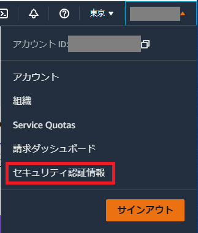  

- 左側のサイドメニューから「ユーザー」を選択します。
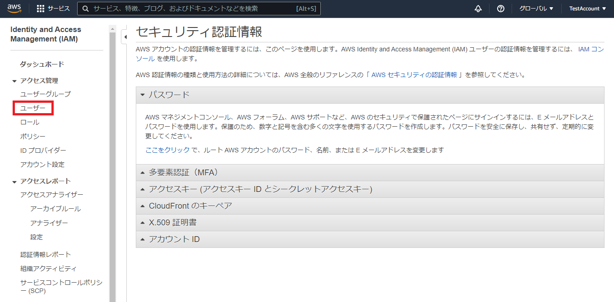  

- 「ユーザーを追加」ボタンをクリックします。
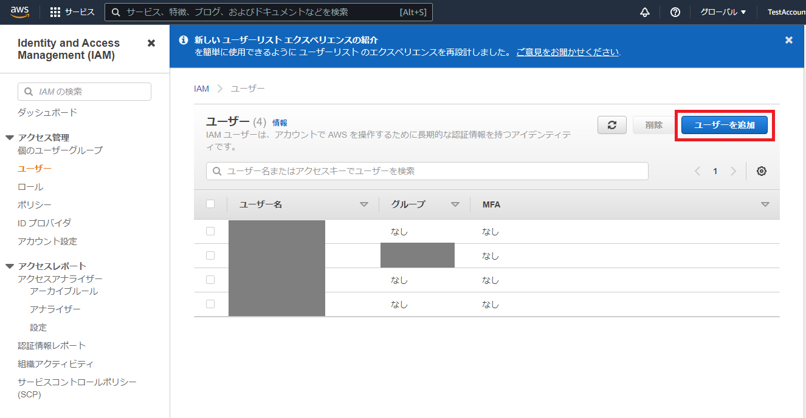  

- 「ユーザー名」に任意の名前を入力します。
「AWS認証情報タイプを選択」で「アクセスキー-プログラムによるアクセス」をチェックして「次のステップ：アクセス権限」ボタンをクリックしてください。
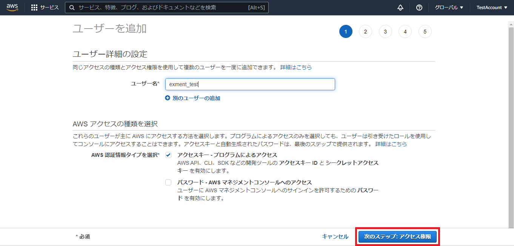  

- 「アクセス許可の設定」で「既存のポリシーを直接アタッチ」をクリックします。
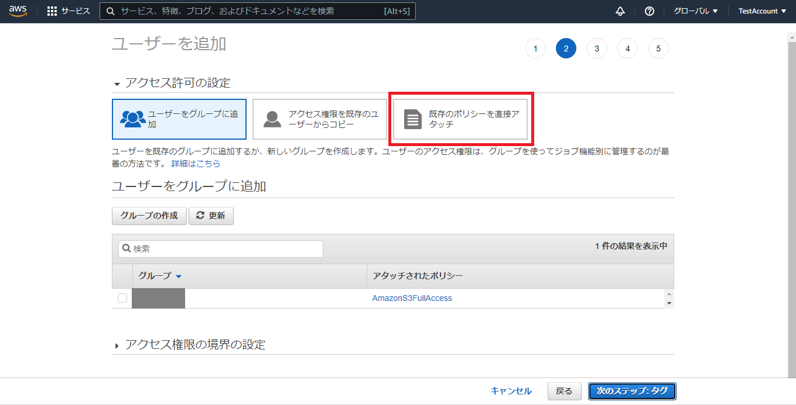  

- 「ポリシーのフィルタ」に"S3"と入力して、検索を行います。表示された一覧の中から「AmazonS3FullAccess」にチェックを入れて、「次のステップ：タグ」ボタンをクリックしてください。
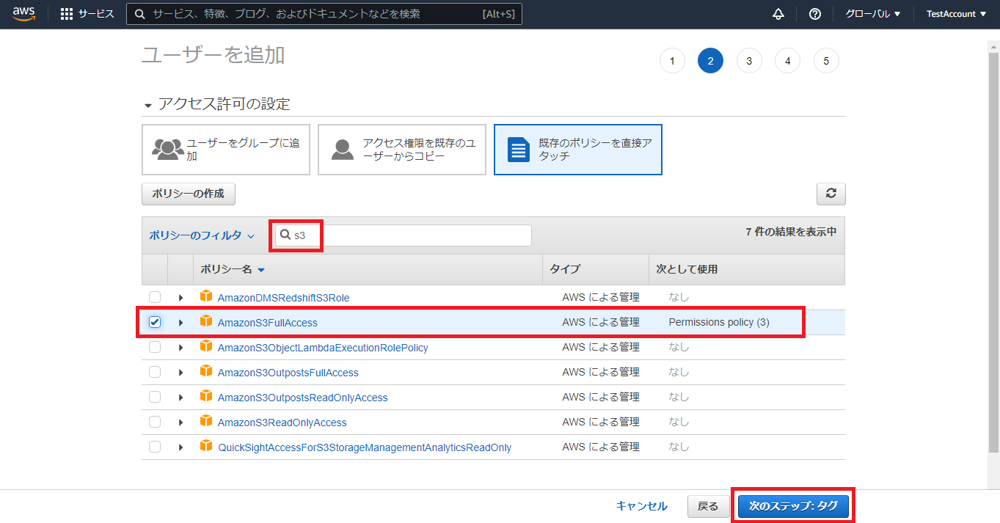  

- 「次のステップ：確認」ボタンをクリックします。
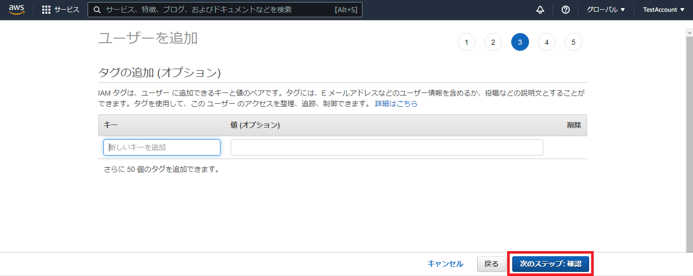  

- 確認画面が表示されるので、選択内容を確認してから「ユーザーの作成」ボタンをクリックします。
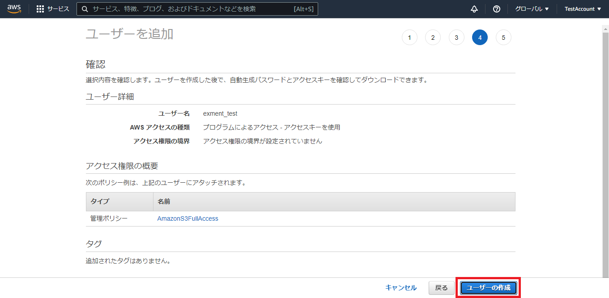  

- ユーザーの作成に成功すると、「アクセスキーID」と「シークレットアクセスキー」が表示されます。
あとで使用するので、必ずメモしておいてください。
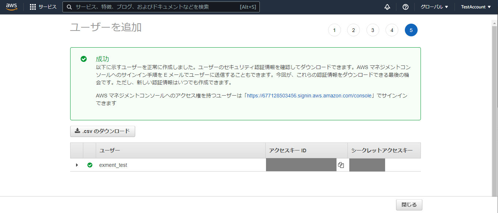  

#### バケットの作成

- ユーザーを作成した後はバケットの作成を行います。  
コンソール画面左上のサービスをクリックして、「ストレージ」→「S3」を選択してください。
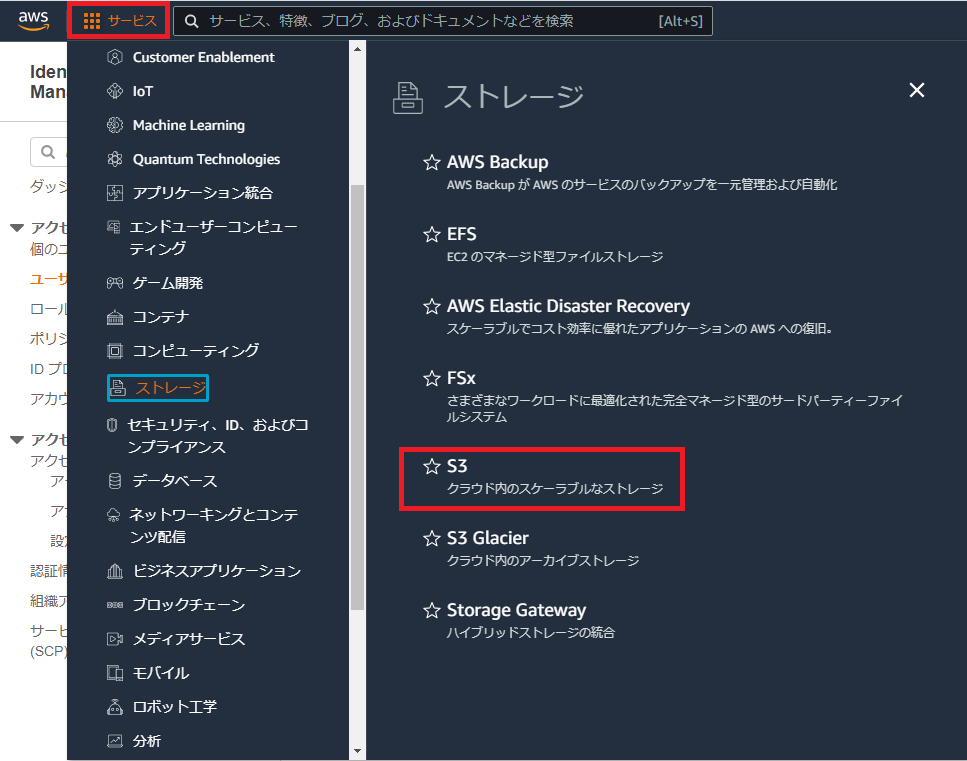  

- 「バケットを作成」ボタンをクリックします。
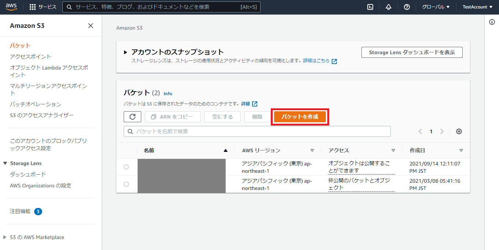  

- 「バケット名」に任意の名前を入力します。「AWSリージョン」は「アジアパシフィック（東京）」を選択します。  
※その他のオプションは必要に応じて設定してください。
  

- 「バケットを作成」ボタンをクリックします。
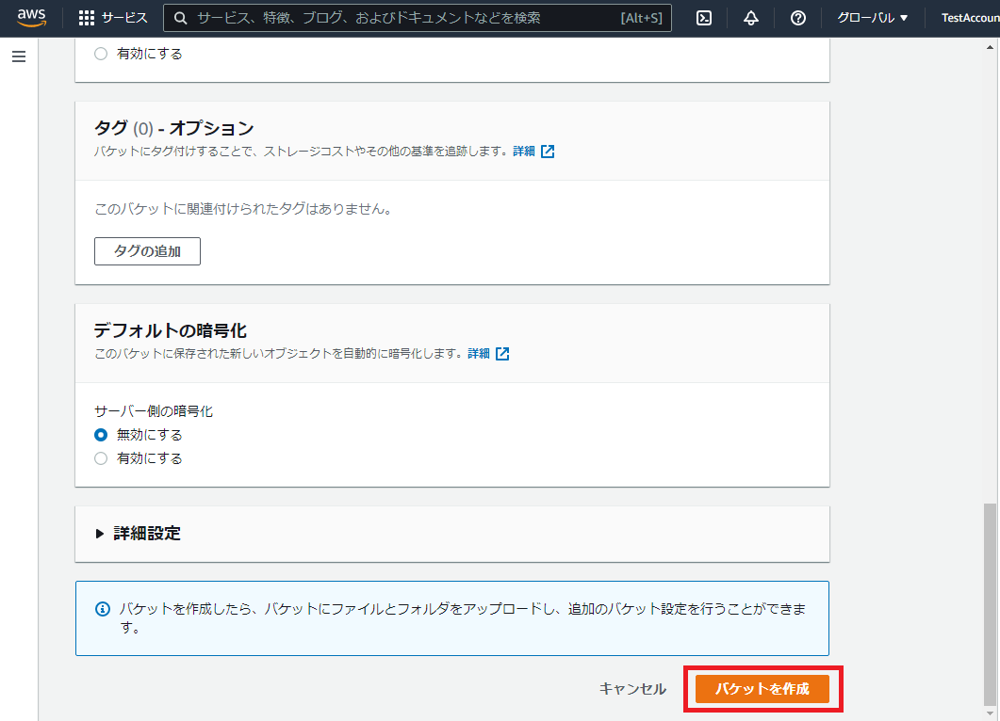  

- 作成したバケットが一覧に追加されていることを確認します。
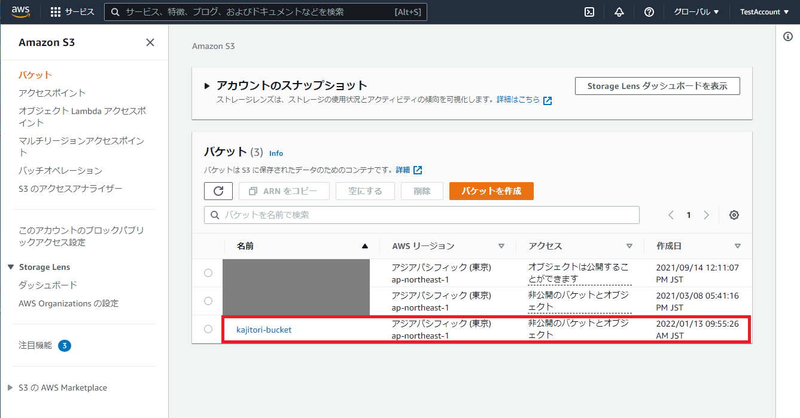  


[←追加設定一覧へ戻る](/ja/quickstart_more)