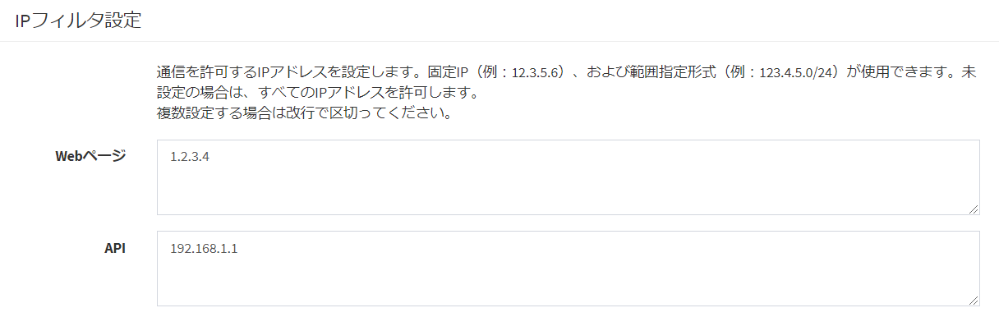

# IPフィルター
ExmentのWebページ、ならびにAPIに対し、アクセス許可するIPアドレスを制限することができます。  
登録するIPアドレスはホワイトリスト方式で、アクセス許可するIPアドレスのみを登録します。  
また、許可IPアドレスは、Webページ用とAPI用で分けて登録します。そのため、例えば「APIのみ、実行許可IPアドレスを制限」ということも可能です。

### 設定手順
- Exmentをエキスパートモードにします。まだエキスパートモードになっていない場合、".env"ファイルを開き、以下の値を追加します。

~~~
EXMENT_EXPART_MODE=true
~~~

- システム設定画面を開くことで、IPフィルターの項目が追加されています。  

#### 設定内容詳細

- IPアドレスを固定で指定したい場合、IPアドレスを直接入力してください。  
    - 例： 123.4.5.6

- IPアドレスを範囲指定したい場合、IPアドレスをサブネットマスク形式で入力してください。  
    - 例1： 123.4.0.0/16 → 123.4.0.0から123.4.255.255までアクセス許可  
    - 例2： 123.4.10.0/24 → 123.4.10.0から123.4.10.255までアクセス許可

- localhostに構築のサーバーで、localhostからのアクセスを許可する場合、「::1」と入力してください。

- 複数のIPアドレスを許可する場合、改行区切りで入力してください。いずれかのIPアドレスが合致した場合、アクセスが許可されます。

#### IP制限を強制的に無効にする
WebページのIPアドレス制限に失敗し、アクセスが不可能になってしまった場合などに、IP制限を無効にする手順です。

- ".env"ファイルを開き、以下の値を追加します。

~~~
EXMENT_DISABLE_IP_FILTER=true
~~~

[←追加設定一覧へ戻る](/ja/quickstart_more)