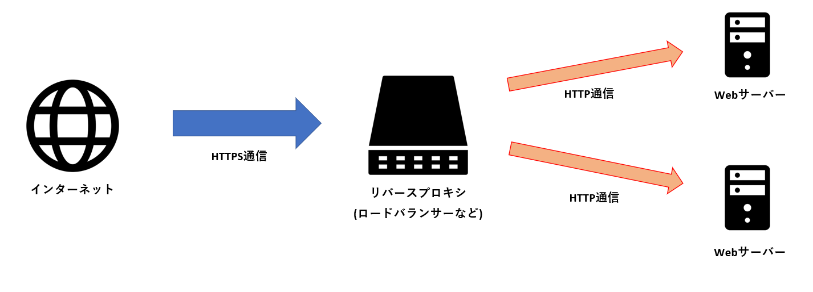
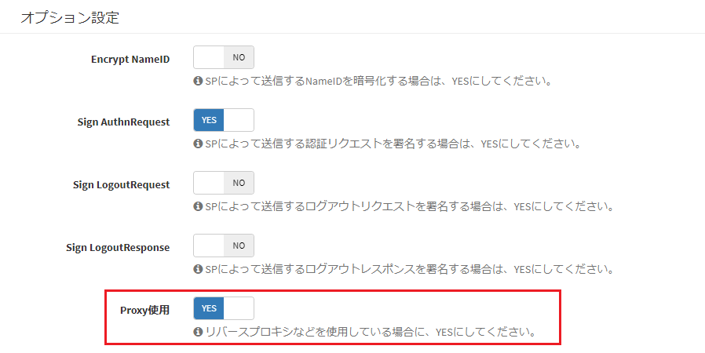

# リバースプロキシを採用している場合の設定
Exmentのサーバー構築に、リバースプロキシを使用していた場合の手順を記載します。

## はじめに
クラウドサービスのロードバランサーなど、Webリクエストを受け付けるサーバー(サービス。以下、リバースプロキシサーバー)と、Webサーバーが異なる場合があります。  
特に、以下のような設定を行うことがあります。  

- インターネットから、リバースプロキシサーバーの通信 : HTTPS通信
- リバースプロキシサーバーから、Webサーバーの通信 : HTTP通信

このようなリバースプロキシ構築を行う場合に必要となる、Exmentの追加設定手順です。

### 設定手順

- .envファイルを編集します。

~~~
#リバースプロキシサーバーまでのURL。"admin"は不要
APP_URL=http://XXXX.com 

# インターネット⇔リバースプロキシサーバーをHTTPS、リバースプロキシサーバー⇔Webサーバーの通信をHTTPにする場合、新規追加する
ADMIN_HTTPS=true
~~~

- [SAML認証](/ja/login_saml)を行っている場合、「オプション設定」で、「Proxy使用」をYESにしてください。

[←追加設定一覧へ戻る](/ja/quickstart_more)