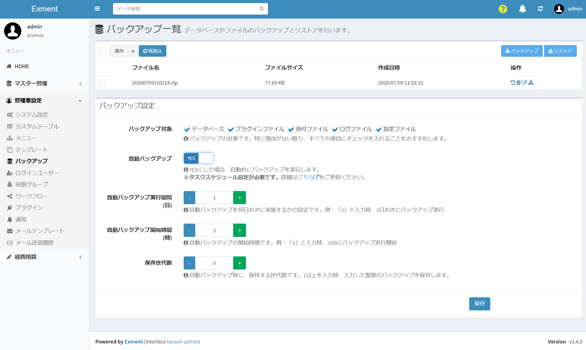
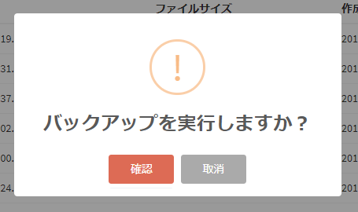
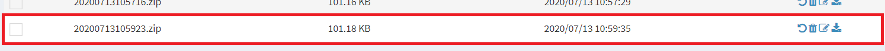
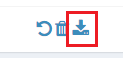
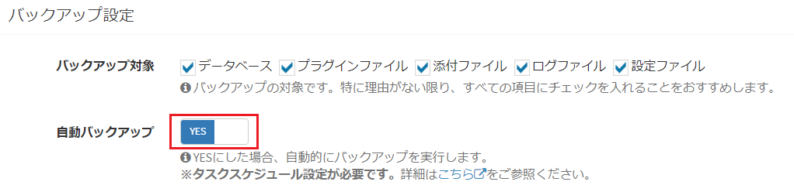
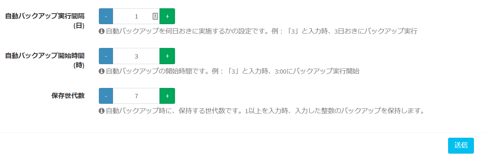
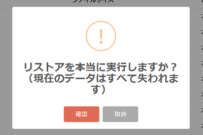

# バックアップ・リストア
Exmentのデータのバックアップとリストアを行うことができます。  

## 概要
Exmentでは、データのバックアップとリストアを行うことができます。  
例えば、以下のようなことを実行できます。  

- 大きなデータ更新を行う前に、事前にバックアップを行っておき、万が一不備が発生した場合に元に戻す。
- 毎日バックアップを保持しておき、予期せぬ障害に備える。
- 今ある環境から別の環境に全データを移行する。（実施前に、必ず動作確認をお願いいたします。）

バックアップ対象は、以下の通りです。
- データベース
- プラグインファイル
- 添付ファイル
- ログファイル
- 設定ファイル

## 画面
- 左メニューより、「管理者設定 > バックアップ」を選択します。  
もしくは、以下のURLにアクセスしてください。  
http(s)://(ExmentのURL)/admin/backup  
これにより、バックアップ画面が表示されます。

## バックアップ
バックアップを行う方法として、「手動」と「自動」の2種類あります。  

### 手動バックアップ実行
手動でバックアップを実施する手順です。  
任意のタイミングでバックアップを実行することができます。  

- ページ右上の「バックアップ」ボタンをクリックします。  
  

- 確認ダイアログが表示されますので、「確認」をクリックし、そのままお待ち下さい。  
**※バックアップは非常に時間がかかります。そのまま操作せずお待ち下さい。**
  

- 完了すると、メッセージが表示されます。  
その後、バックアップ一覧にて、作成日時が実行日時のファイルが作成されます。
  
  

- 作成したバックアップファイルは、ダウンロードを行うことができます。  
バックアップの行の「ダウンロード」リンクをクリックしてください。  
  

### 自動バックアップ実行
Exmentでは、決まった時刻に自動的にバックアップを行うことができます。  
定期的にバックアップを取っておくことによって、万が一の大幅なデータ更新ミスなどがあった場合でも、復元することが可能です。  
**※事前に、[タスクスケジュール](/ja/quickstart_more?id=タスクスケジュール)設定を行う必要があります。**
    
例として、「夜間3時」に「1日おき」に、「7世代分のバックアップ」の設定を行う方法です。  

- 「バックアップ設定」より、「自動バックアップ」の選択を「YES」にします。
  

- オプションの設定を変更します。
  

- その後、ページ下部の「保存」ボタンをクリックします。  

## リストア
データをリストア(復元)する方法として、「バックアップ一覧から選択」と「アップロード」の2種類あります。  

### リストア時の注意
- バックアップを行った時点のExmentのバージョンと、現在インストールされているExmentのバージョンが異なっていた場合、リストア後、データベースの最新化が必要です。  
例： バックアップ時点のバージョン：v1.1.6 現在のバージョン：v1.2.0  →データベースの最新化が必要
その場合、リストア後、以下のコマンドを実行してください。  

~~~
php artisan exment:update
~~~

- リストア後は、自動的にサインアウトされます。バックアップされていたユーザーのIDとパスワードでログインを行ってください。

### バックアップ一覧から選択
過去に実施したバックアップ一覧から、バックアップするファイルを選択して、データを復元させる方法です。  

- バックアップ一覧から、「リストア」リンクをクリックします。  
  

- 確認ダイアログが表示されますので、「確認」をクリックし、そのままお待ち下さい。  
**※リストアは非常に時間がかかります。そのまま操作せずお待ち下さい。**
  

- 完了メッセージが表示されれば、バックアップした時点での環境に復元されます。  
自動的にログインページへリダイレクトされます。  
  

### アップロード
ローカルに保存しているバックアップをExmentにアップロードし、データを復元させる方法です。  
**※アップロードファイルの容量が大きすぎると、正常に完了しない場合があります。** その場合、下記のメニュー「容量が大きくてアップロードできない場合」を参照ください。  

- ページ右上の「リストア」ボタンをクリックします。  
  

- ファイルアップロードのダイアログが表示されますので、ローカルにダウンロードしたバックアップファイルを選択し、「送信」をクリックします。  
  

- 「送信」ボタンをクリックしたら、そのままお待ち下さい。  
**※リストアは非常に時間がかかります。そのまま操作せずお待ち下さい。**

- 完了メッセージが表示されれば、バックアップした時点での環境に復元されます。  
  

### 容量が大きくてアップロードできない場合
「アップロード」方式でリストア時に、バックアップファイルの容量が大きすぎる場合、リストアに失敗する場合があります。  
その場合、以下の手順でリストアを行ってください。  

- ダウンロードしたバックアップファイルを、サーバーの以下のパスに配置します。  

~~~
(プロジェクトのルートディレクトリ)/storage/app/backup/list
~~~

- バックアップ画面をリロードします。  

- バックアップ一覧に、配置したバックアップファイルが追加されているので、上記メニューの「バックアップ一覧から選択」より、リストアを行ってください。