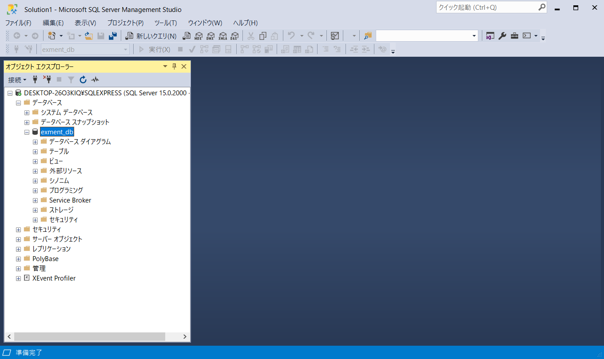
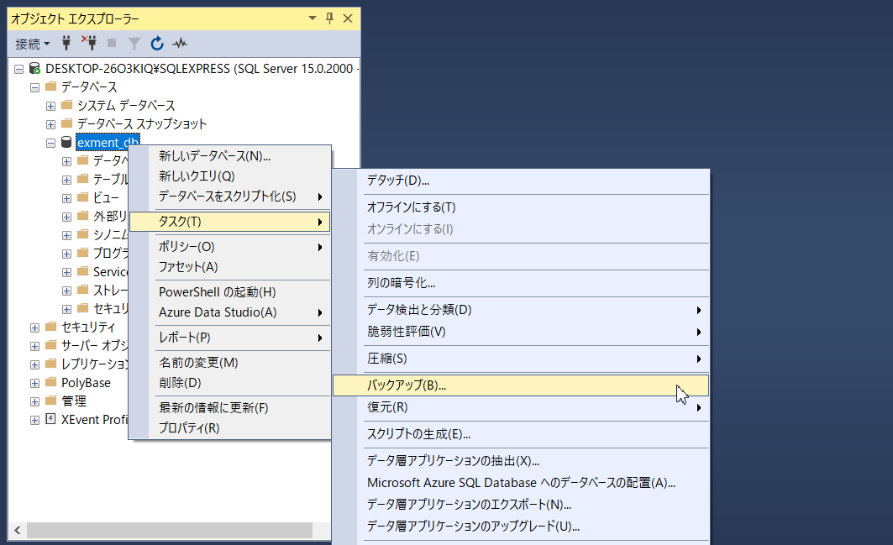
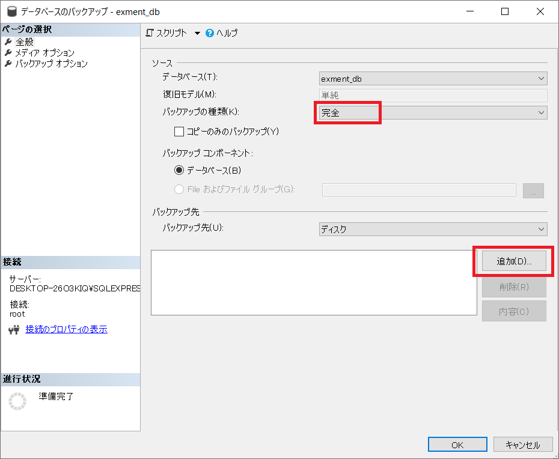
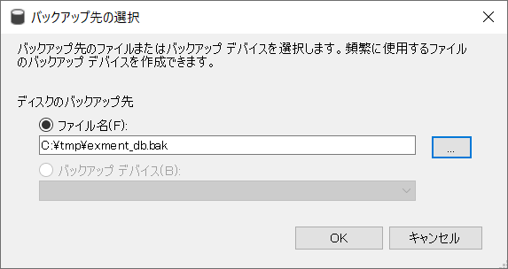
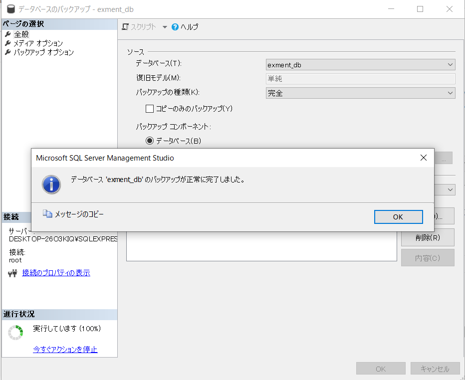
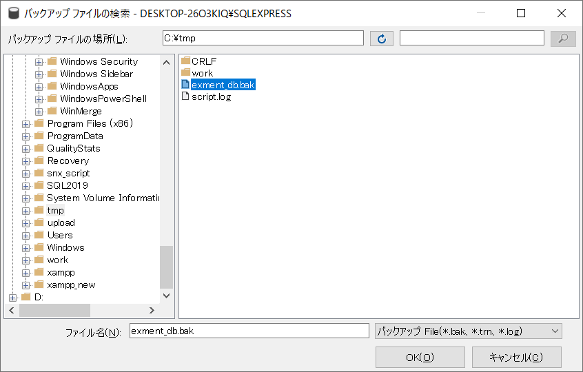
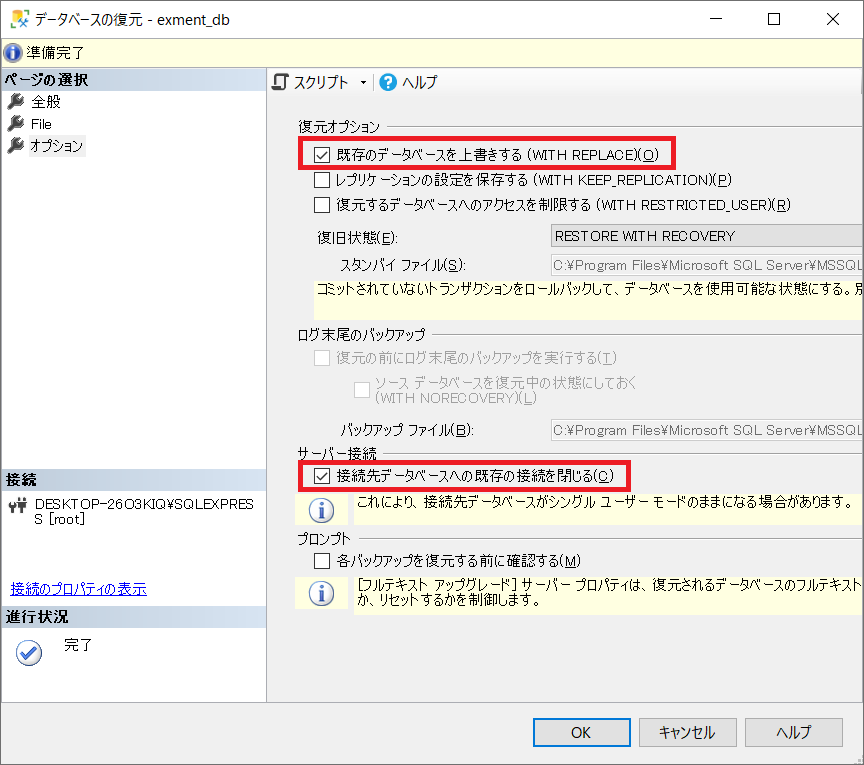

# バックアップ・リストア（SQL Server）
SQLServerを使用しているユーザーが手動でExmentのデータのバックアップ／リストアを行う流れを説明します。  

## 概要
SQLServerを使用している場合、Exmentでは画面からのバックアップ／リストアは実行できません。Microsoft SQL Server Management Studio (SSMS)を用いて、手動でデータベースのバックアップとリストアを行ってください。  

なお、以下のファイルについてはエクスプローラー等でフォルダごと別の場所に保存し、必要に応じて復元してください。
- プラグインファイル
- 添付ファイル
- ログファイル
- 設定ファイル

## データベースのバックアップ
SQLServerのバックアップを実施する手順です。  
任意のタイミングで実行してください。  

- Microsoft SQL Server Management Studio (SSMS)を起動します。  
**※必ずsysadminのサーバーロールかdb_owner、又はdb_backupoperatorのデータベースロールを持つメンバーでログインしてください。**
  

- バックアップ対象のデータベースを右クリックして、タスク→バックアップを選択します。  
  

- データベースのバックアップ画面で「バックアップの種類：完全」を選択し、バックアップ先の追加をクリックします。  
  

- バックアップ先の選択ダイアログが表示されるので、任意のフォルダとファイル名を指定してOKボタンをクリックします。  
  

- データベースのバックアップ画面に戻って、OKボタンをクリックしてください。バックアップが実行されます。完了するとメッセージが表示されます。   
  

- 指定したバックアップ先にバックアップファイル（.bak）が作成されていることを確認してください。

## 各種ファイルのバックアップ
以下のファイルはサーバー上の所定のフォルダに配置されています。エクスプローラー等を用いて、別のフォルダや外部メディアにフォルダごと保存してください。
  
~~~
プラグインファイル：(プロジェクトのルートディレクトリ)/storage/app/plugins
添付ファイル　　　：(プロジェクトのルートディレクトリ)/storage/app/admin
ログファイル　　　：(プロジェクトのルートディレクトリ)/storage/logs
設定ファイル　　　：(プロジェクトのルートディレクトリ)/config
.envファイル　　　：(プロジェクトのルートディレクトリ)/.env
~~~
    
**※.envファイルはLaravelの重要な設定を保存しているファイルです。バックアップしておくことをお勧めしますが、リストア時に直接置き換えることはしないでください。**

## データベースのリストア
SQLServerのバックアップを復元する手順です。  
必ず、Exment使用中のユーザーがいないことを確認してから、処理を実施してください。  

- Microsoft SQL Server Management Studio (SSMS)を起動します。  
**※必ずsysadmin、又はdbcreatorのサーバーロールを持つメンバーかデータベースの所有者 (dbo)でログインしてください。**
  

- リストア対象のデータベースを右クリックして、タスク→復元→データベースを選択します。  
  

- データベースの復元画面で「ソース：デバイス」を選択し、「...」をクリックしてバックアップデバイスの選択ダイアログを表示します。  
  

- 追加ボタンをクリックすると、バックアップファイルの検索ダイアログが表示されるので、復元したいバックアップファイルを選択して、OKをクリックします。  
  

- バックアップデバイスの選択ダイアログに選択したファイルが追加されていることを確認して、さらにOKをクリックします。  
  

- データベースの復元画面に戻るので、「ページの選択：オプション」を選択してオプションタブを表示します。「復元オプション：既存のデータベースを上書きする」と「サーバー接続：接続先のデータベースへの既存の接続を閉じる」にチェックを入れて、OKをクリックします。  
  

- 復元が完了するとメッセージが表示されます。  
  

### リストア時の注意
- バックアップを行った時点のExmentのバージョンと、現在インストールされているExmentのバージョンが異なっていた場合、リストア後、データベースの最新化が必要です。  
例： バックアップ時点のバージョン：v1.1.6 現在のバージョン：v1.2.0  →データベースの最新化が必要
その場合、リストア後、以下のコマンドを実行してください。  

~~~
php artisan exment:update
~~~
    
**※新しいバージョンのExmentでバックアップしたデータベースを古いバージョンのExmentにリストアすることはできません。**

## 各種ファイルのリストア
保存してあったファイルをエクスプローラー等を用いて、フォルダごと元に戻します。  
プラグインファイル、添付ファイルは、データベース側のデータと連動しているため、同じタイミングでバックアップしたデータを同時にリストアする必要があります。  
また、ログファイルは直接上書きをせず、別名をつけて同じフォルダ内に保存しておくことをお勧めします。
  
~~~
プラグインファイル：(プロジェクトのルートディレクトリ)/storage/app/plugins
添付ファイル　　　：(プロジェクトのルートディレクトリ)/storage/app/admin
ログファイル　　　：(プロジェクトのルートディレクトリ)/storage/logs
設定ファイル　　　：(プロジェクトのルートディレクトリ)/config
~~~
