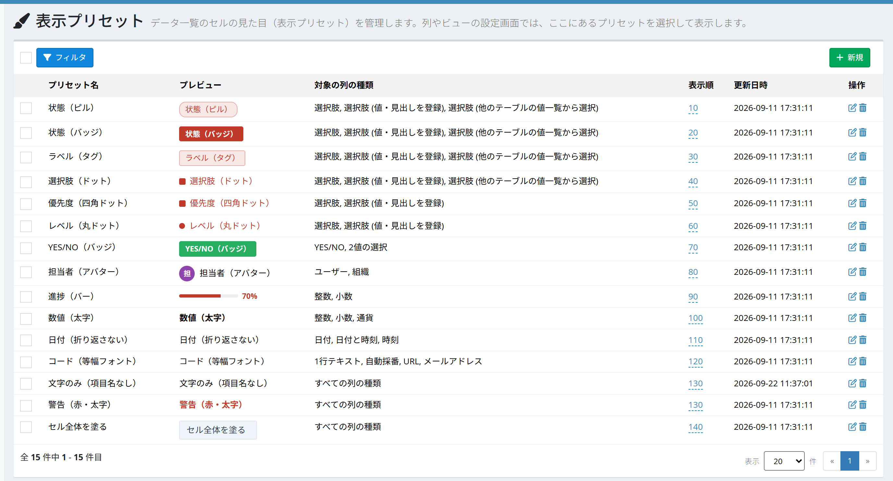
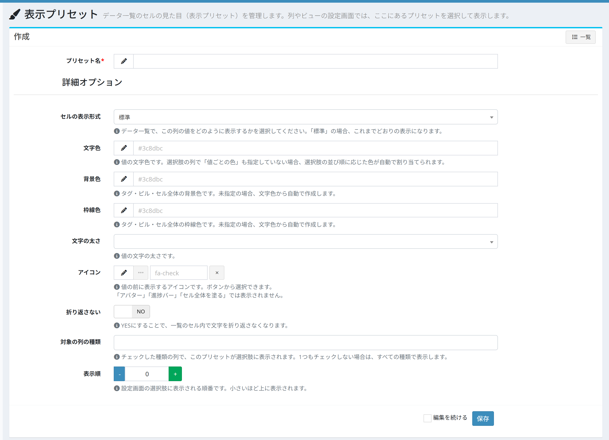
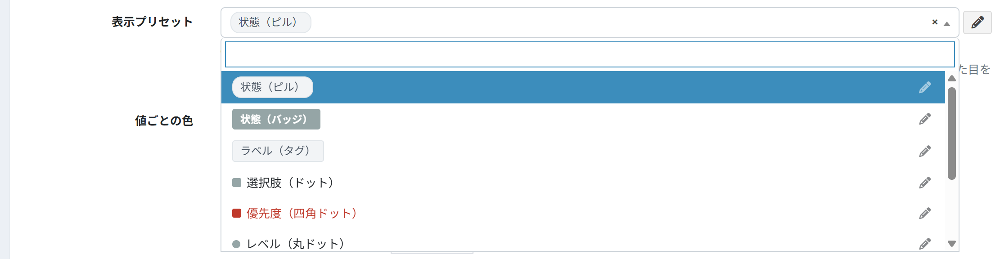
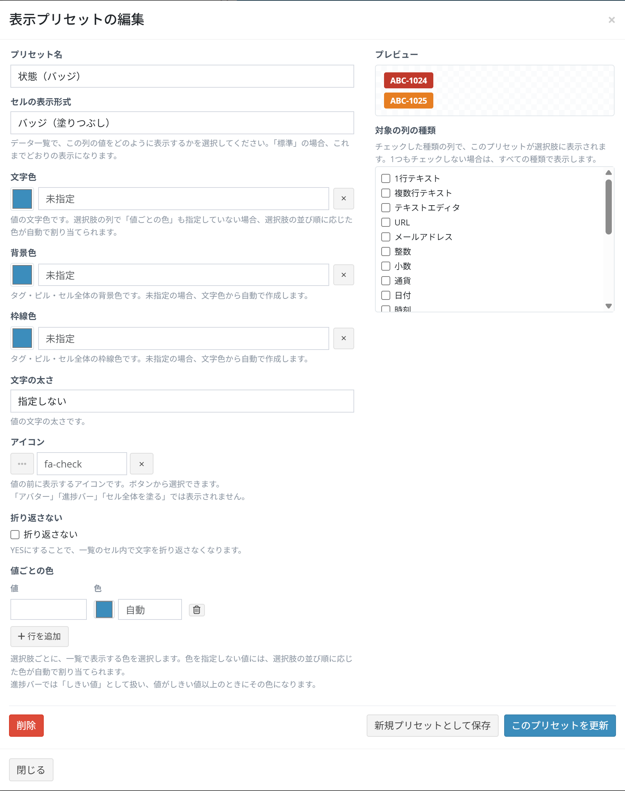
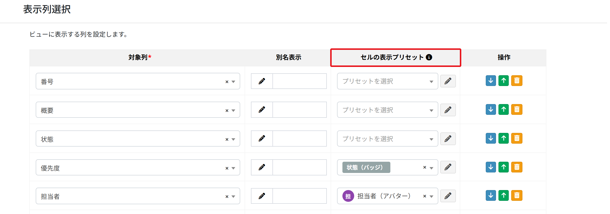

# 表示プリセット

セルの見た目（色・形・アイコンなど）に名前を付けて保存し、複数の列やビューで使い回すための機能です。データ一覧だけでなく、カンバンビューのカードにも同じ見た目が適用されます。

## 表示プリセットとは

これまでは、セルの見た目を **列ごとに1つずつ** 設定していました。  
そのため「状態をピル（角丸）で表示する」のような同じ設定を、テーブルが変わるたび、列が変わるたびに作り直す必要がありました。

表示プリセットは、その設定に名前を付けて1つだけ保存しておく仕組みです。  
列やビューには「どのプリセットを使うか」だけを記録するので、次のようになります。

- 同じ見た目を、ほかの列・ほかのテーブルでも一覧から選ぶだけで使える
- プリセットを1つ修正すると、そのプリセットを選んでいるすべての列の表示が一度に変わる

## プリセットを使う場所

表示プリセットは、次の4つの画面で使用します。

| 画面 | 役割 | 必要な権限 |
| --- | --- | --- |
| 表示プリセット（ライブラリ画面） | プリセットの一覧・新規作成・編集・削除 | システム権限 |
| カスタム列設定 ＞ セルの表示 | その列の既定の見た目としてプリセットを選ぶ | 対象テーブルのテーブル設定権限 |
| カスタムビュー設定 ＞ 表示列選択 | そのビューだけの見た目としてプリセットを選ぶ | 対象テーブルのテーブル設定権限 |
| カンバンビュー設定 ＞ カードに表示する列 ＞ 表示スタイル | カード上の見た目としてプリセットを選ぶ | 対象テーブルのテーブル設定権限 |

※プリセットはテーブルに属しません。1つ作れば、どのテーブルの列からでも選べます。  
※ビューで指定したプリセットは、列の設定より優先されます。

## ライブラリ画面（表示プリセット一覧）

### ページ表示

ブラウザで `(Exmentのアドレス)/admin/cell_style_preset` を開きます。

いつでも開けるようにするには、[メニュー](/ja/menu.md)設定でメニューに追加します。

1. 「管理者設定」＞「メニュー」を開きます。
2. 右上の［新規］をクリックします。
3. 「メニューの種類」で「システム」、「メニュー名」で「表示プリセット」を選択します。
4. 表示する親メニュー（「管理者設定」など）を選び、保存します。

一覧には次の項目が表示されます。

| 項目 | 内容 |
| --- | --- |
| プリセット名 | 設定画面の選択肢に表示される名前 |
| プレビュー | 実際のデータ一覧での表示イメージ |
| 対象の列の種類 | このプリセットを選択肢に出す列の種類 |
| 表示順 | 選択肢に並ぶ順番（小さいほど上） |
| 更新日時 | 最終更新日時 |

Exment をインストールした時点で、よく使う14件のプリセットが最初から登録されています。

| プリセット名 | 主な対象の列の種類 |
| --- | --- |
| 状態（ピル） | 選択肢 |
| 状態（バッジ） | 選択肢 |
| ラベル（タグ） | 選択肢 |
| 選択肢（ドット） | 選択肢 |
| 優先度（四角ドット） | 選択肢、選択肢（値・見出しを登録） |
| レベル（丸ドット） | 選択肢、選択肢（値・見出しを登録） |
| YES/NO（バッジ） | YES/NO、2値の選択 |
| 担当者（アバター） | ユーザー、組織 |
| 進捗（バー） | 整数、小数 |
| 数値（太字） | 整数、小数、通貨 |
| 日付（折り返さない） | 日付、日付と時刻、時刻 |
| コード（等幅フォント） | 1行テキスト、自動採番、URL、メールアドレス |
| 警告（赤・太字） | すべての列の種類 |
| セル全体を塗る | すべての列の種類 |

※最初から登録されているプリセットも、この画面で編集・削除できます。

### プリセットの新規作成・編集

一覧右上の［新規］ボタン、または各行の編集アイコンをクリックします。

#### プリセット名
設定画面の選択肢に表示される名前です。必須項目です。

#### セルの表示形式
値をどのような形で表示するかを選択します。

| 選択肢 | 表示内容 |
| --- | --- |
| 標準 | これまでどおりの表示（装飾なし） |
| 文字色のみ | 文字に色だけを付ける |
| タグ（角丸小） | 角を少し丸めた枠付きのタグ |
| ピル（角丸大） | 角を大きく丸めたタグ |
| バッジ（塗りつぶし） | 背景を塗りつぶした濃い色のバッジ |
| 四角ドット＋文字 | 値の前に四角い色マークを付ける |
| 丸ドット＋文字 | 値の前に丸い色マークを付ける |
| 等幅フォント | 文字幅をそろえて表示（コード・IDなど） |
| アバター（頭文字の丸） | 頭文字を丸いアイコンにして表示（担当者など） |
| 進捗バー（0～100） | 値を横棒グラフとして表示 |
| セル全体を塗る | セルの背景全体に色を付ける |

#### 文字色
値の文字色です。  
※選択肢の列で「値ごとの色」も指定していない場合は、選択肢の並び順に応じた色が自動で割り当てられます。

#### 背景色
タグ・ピル・セル全体の背景色です。未指定の場合、文字色から自動で作成します。

#### 枠線色
タグ・ピル・セル全体の枠線色です。未指定の場合、文字色から自動で作成します。

#### 文字の太さ
「標準」「やや太い」「太字」から選択します。

#### アイコン
値の前に表示するアイコンです。ボタンから選択できます。  
※「アバター」「進捗バー」「セル全体を塗る」では表示されません。

#### 折り返さない
YESにすると、一覧のセル内で文字を折り返さなくなります。日付や番号など、途中で改行されると読みにくい列に使用します。

#### 対象の列の種類
チェックした種類の列で、このプリセットが選択肢に表示されます。  
※1つもチェックしない場合は、すべての種類で表示します。

#### 表示順
設定画面の選択肢に表示される順番です。小さいほど上に表示されます。

## カスタム列にプリセットを割り当てる

1. メニューから対象のテーブルを選び、［テーブル詳細設定］＞［カスタム列設定］を開きます。
2. 設定したい列の編集画面を開き、「セルの表示」の欄までスクロールします。

3. 「表示プリセット」の選択肢から、使用したいプリセットを選びます。  
選択肢は、実際の見た目のまま表示されます。

4. 選択すると、下の「プレビュー」がすぐに切り替わります。保存しなくても確認できます。

5. 画面下部の［送信］ボタンで保存します。

### 値ごとの色

選択肢の列では、「値ごとの色」で選択肢1つずつに色を指定できます。  
色を指定しない値には、選択肢の並び順に応じた色が自動で割り当てられます。

※進捗バーでは「しきい値」として扱い、値がしきい値以上のときにその色になります。

## その場でプリセットを作る・編集する（鉛筆ボタン）

「表示プリセット」の右にある鉛筆ボタンをクリックすると、設定画面を離れずにプリセットを編集できます。

左側で設定を変更すると、右側の「プレビュー」がすぐに更新されます。

ダイアログの下部には、次のボタンがあります。

| ボタン | 動作 |
| --- | --- |
| 新規プリセットとして保存 | 今の内容を **別のプリセット** として追加します。元のプリセットは変わりません。 |
| このプリセットを更新 | 今開いているプリセットを上書きします。**このプリセットを選んでいる他の列の表示も変わります。** |
| 削除 | プリセットを削除します。誤操作防止のため、もう一度押すと削除されます。 |
| 閉じる | 保存せずに閉じます。 |

> 既存のプリセットを少しだけ変えて使いたい場合は、「このプリセットを更新」ではなく **「新規プリセットとして保存」** を使用してください。  
> 更新すると、同じプリセットを使っている他の列の見た目も変わります。

## ビューの列にプリセットを割り当てる

同じテーブルでも、ビューによって見せ方を変えたい場合があります。  
その場合は、カスタムビュー設定の「表示列選択」でプリセットを指定します。

「セルの表示プリセット」の列で、列ごとにプリセットを選択します。  
右の鉛筆ボタンからは、列設定と同じダイアログを開けます。

※ここで指定したプリセットは、**カスタム列設定の内容より優先されます。**  
※何も選ばない場合は、カスタム列設定の内容が使われます。

## よくある質問・注意点

#### プリセットを削除したら、使っている列はどうなりますか
そのプリセットを選んでいた列は、装飾のない「標準」の表示に戻ります。データは変わりません。

#### プリセットが選択肢に出てきません
プリセットの「対象の列の種類」に、その列の種類が含まれていない可能性があります。  
ライブラリ画面でプリセットを開き、「対象の列の種類」を確認してください。すべての種類で表示したい場合は、チェックを1つも付けないでください。

#### 見た目を変えたら、ほかのテーブルの表示も変わってしまいました
プリセットはテーブルに属さず、Exment 全体で共有されます。  
1つのテーブルだけ見た目を変えたい場合は、「新規プリセットとして保存」で別のプリセットを作成してください。

## 関連項目

- [カスタム列](/ja/column.md)
- [カスタムビュー](/ja/view.md)
- [データ一覧](/ja/data_grid.md)
- [カンバンビュー](/ja/view_kanban.md)
