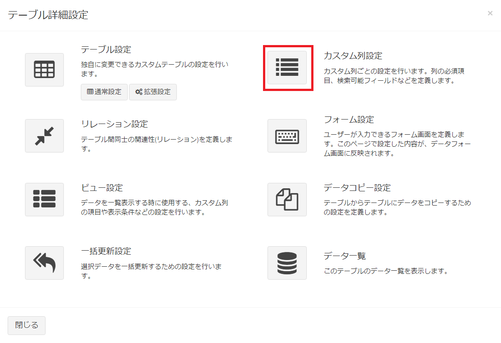
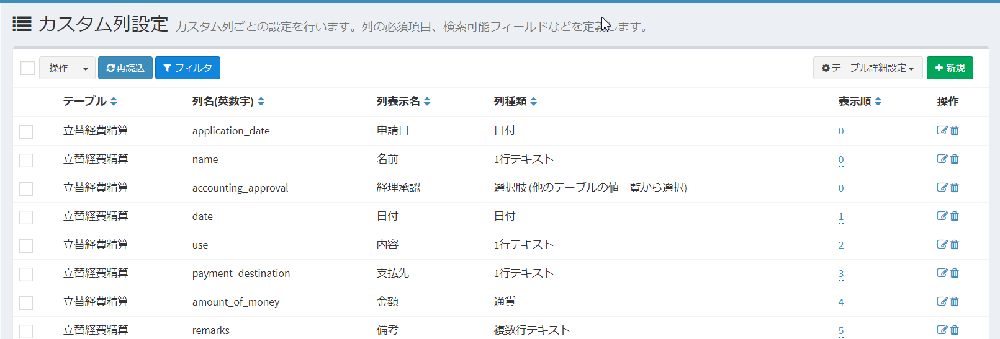
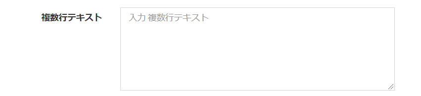
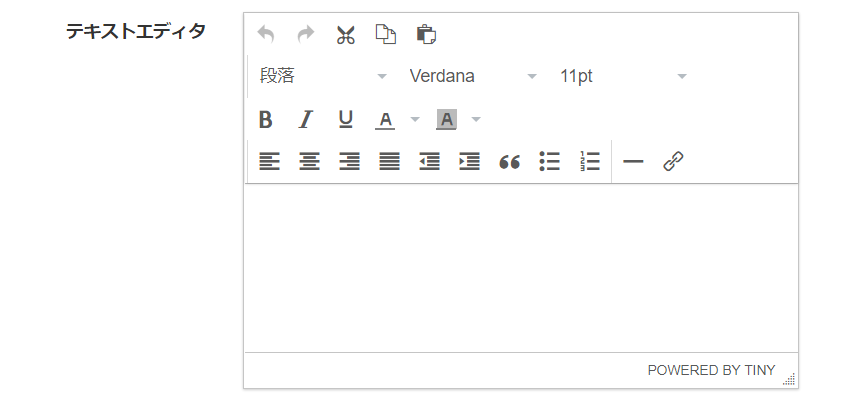
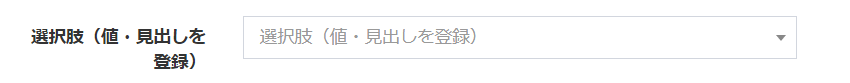
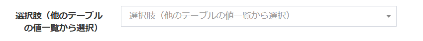
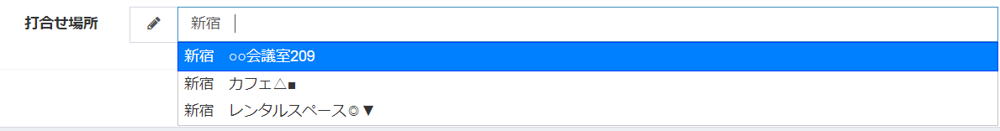

# カスタム列管理
カスタムテーブルが持つ列、「カスタム列」の設定を行います。  

## 設定画面
- カスタムテーブル一覧で、設定を行いたいテーブルにチェックを1つ入れ、右上の「テーブル詳細設定」をクリックします。  

- もしくは、メニューから設定を行いたいテーブルを選択した後、同様に右上の「テーブル詳細設定」をクリックします。  
※該当のテーブルをメニューに表示する設定があらかじめ必要です。  

- 表示されたテーブル詳細設定の画面で、カスタム列のアイコンをクリックします。

- これで、チェックしたカスタムテーブルがもつ、列の一覧を表示します。  

## 列の新規追加
- 「カスタム列設定」画面で、ページ右上の［新規］ボタンをクリックします。

- カスタム列の新規追加画面が表示されますので、必要事項を入力します。

## 保存
設定を入力したら、［送信］をクリックしてください。

## 編集
列の編集を行いたい場合、該当する行の［編集］リンクをクリックしてください。  

## 削除
列の削除を行いたい場合、該当する行の［削除］リンクをクリックしてください。  

**※ただし、システムでインストールしている列は削除できません。**

## 記入項目の詳細(共通)
- 列名(英数字)：システムで使用する列の名称です。英数字、または「-」「\_」で記入します。設定できるのは1度のみで、変更できません。  
**※以下の名前は使用できません。**  
id,suuid,parent_id,parent_type,created_at,updated_at,deleted_at,created_user,updated_user,deleted_user

### 列表示名
画面に表示する、列の名前です。

### 列種類
設定する列の種類です。この項目で登録した内容が、データ登録時のフォームに適用されます。

> カスタム列ごとの、システムの仕様詳細は、[カスタム列リファレンス](/ja/column_reference)をご確認ください。

#### 1行テキスト
1行テキスト(テキストボックス)です。  

#### 複数行テキスト
複数行テキスト(テキストエリア)です。  

#### テキストエディタ
テキストエディタを使用したデータ入力ができます。

#### URL
URLが入力できるフォームになります。  

#### メールアドレス
メールアドレスが入力できるフォームになります。  

#### 整数
整数のみ入力できるフォームになります。また、データ登録時に、項目の左右に「＋」「－」ボタンを表示して、クリックで値を上下することができます。  

#### 小数
小数のみ入力できるフォームになります。パーセント表示をYESにすることで、データ表示の際に%表示されます。  

#### 通貨
通貨の入力ができるフォームになります。表示形式は４種類（￥・円・＄・€）から選ぶことができます。

#### 日付
日付のフォームになります。データ登録時に、カレンダーから日付を変更することができます。  

#### 時刻
時間のフォームになります。データ登録時に、時計から時刻を変更することができます。  

#### 日付と時刻
日時のフォームになります。データ登録時に、カレンダーと時計から日時を変更することができます。  

#### 選択肢
選択肢のフォームになります。値と見出しが同じ選択肢一覧になります。  

#### 選択肢 (値・見出しを登録)
選択肢のフォームになります。値と見出しが異なる選択肢一覧になります。  

#### 選択肢 (他のテーブルの値一覧から選択)
選択肢のフォームになります。選択肢が他のテーブルの項目となる、選択肢を作成します。  

#### YES/NO
「YES」と「NO」を切り替えるスイッチを作成します。データ登録時、YESだと1、NOだと0と登録されます。  

#### 2値の選択
2つの値を切り替えるスイッチを作成します。データ登録時の値も変更できます。  

#### 自動採番
UUIDやランダム文字列などの値を、データ作成時に作成します。  

#### 画像
画像をアップロードするフォームになります。  

#### ファイル
ファイルをアップロードするフォームになります。  

#### ユーザー
システムのユーザーを選択する選択肢になります。  

#### 組織
システムの組織を選択する選択肢になります。  

## 記入項目の詳細(共通)
##### 列名(英数字)
システムで使用する列の名称です。英数字、または「-」「_」で記入します。設定できるのは1度のみで、変更できません。  
**※以下の名前は使用できません。**  
id,suuid,parent_id,parent_type,created_at,updated_at,deleted_at,created_user,updated_user,deleted_user

##### 列表示名
画面に表示する、列の名前です。

##### 列種類
[列種類の一覧](#列種類)から、データ登録に使用する列を選択します。

##### 必須
そのフィールドが必須項目であるかどうかを選択します。YESにした場合、データ記入画面で必須項目となり、記入していなかった場合にエラーが表示されます。  

##### 検索インデックス
下記の「[検索インデックス](#検索インデックス-1)」をご参照ください。  

##### フリーワード検索対象
検索インデックスがYESの場合に表示されます。  
下記の「[フリーワード検索対象](/ja/column#フリーワード検索対象詳細)」をご参照ください。  

##### ユニーク(一意)
YESにした場合、データ登録の際に、他のデータと重複する値を登録することが出来なくなります。複数列の値による特定の組み合わせでの重複登録を防ぎたい場合には、[複合ユニークキー設定](/ja/table.md?id=複合ユニークキー設定)をご参照ください。  

##### 1度のみ入力
YESにした場合、新規登録時にのみデータ登録が可能な列にすることが出来ます。データ編集時には表示専用となります。

##### 初期値
フォーム項目に初期値として入力しておく値です。  

##### プレースホルダー
フォーム項目にプレースホルダーとして登録する文字列です。  

##### ヘルプ
フォーム項目の下に、情報として表示する内容です。

##### 表示順
カスタム列の一覧画面における表示順位を指定します。

##### 既定のフォーム・ビューに追加する
YESの場合、新規作成に伴って既定のフォーム・ビューに列を追加します。列の新規作成時にのみ設定可能です。更新時はそれぞれ[フォーム画面](/ja/form.md)・[ビュー画面](/ja/view.md)から変更してください。

##### 見出し列に追加する
作成するカスタム列を見出し列に追加することができます。  
※カスタム列の新規作成時にのみ表示される設定です。設定の更新時には[見出し表示列設定](/ja/table.md#見出し表示列設定)から変更してください。

## 記入項目の詳細説明(列種類別)
##### 最大文字数(1行テキスト,複数行テキスト)
フォーム項目で記入できる最大文字数です。オーバーした場合にエラーが発生します。  

##### 使用可能文字(1行テキスト)
チェックを入れた文字の種類は、フォーム項目で入力が可能になります。
全てにチェックを入れていない場合には、すべての文字の種類が入力可能になります。

##### サジェスト入力(1行テキスト)
同じカスタム列に既に登録しているデータの値から、入力内容と合致している値を入力候補として表示します。

##### 正規表現(1行テキスト)
入力内容を、正規表現によるバリデーションを行うことができます。詳細は[正規表現](#正規表現)をご確認ください。

##### 最小値(整数、小数)
フォーム項目で記入できる値の最小値です。その値を下回って送信した場合に、エラーが発生します。未記入の場合、最小値のチェックは行いません。  

##### 最大値(整数、小数)
フォーム項目で記入できる値の最大値です。その値を上回って送信した場合に、エラーが発生します。未記入の場合、最大値のチェックは行いません。  

##### 選択肢(選択肢, 選択肢 (値・見出しを登録))
フォーム項目で候補として表示する、選択肢を登録します。改行区切りで、複数の候補を登録します。  
列種類で「選択肢 (値・見出しを登録)」を選択していた場合、カンマを列の区切りとして、1列目が値、2列目が見出しになります。  

↓  
  
フォームでデータ保存時には、1列目の値がデータベースに保存されます。  

##### 対象テーブル(選択肢 (他のテーブルの値一覧から選択)
フォーム項目で、選択肢の候補として表示するテーブルを指定します。  

>選択肢として一覧に表示される文言は、[見出し表示列設定](/ja/table#見出し表示列設定)で変更できます。

##### 採番種類（自動採番）
データ登録時に、採番を行う種類を選択します。
- フォーマット  
ユーザーが指定したフォーマットで採番を登録します。
- ランダム(ライセンスコード)    
5文字×5で25文字のランダム文字列を登録します。
- ランダム(UUID)  
合計32桁のランダム文字列を登録します。

##### 桁数(自動採番)
自動採番時に、データとして登録する桁数になります。不足分は0埋めで登録します。  

##### 権限をもたないユーザー・組織も表示する(ユーザー・組織)
テーブルへのアクセス権限をもつユーザー・組織のみを表示するか、全てのユーザー・組織を表示するかを設定します。

##### 複数選択を許可する
画像やファイル、選択肢系の項目で、複数の選択肢を行う場合にYESにしてください。  

## 自動採番フォーマットのルール
列種類を「自動採番」、採番種類（自動採番）を「フォーマット」にした場合、ユーザー独自のルールで、自動採番を登録することが出来ます。  

設定できるパラメータ変数は、以下のページをご確認ください。  
[パラメータ変数](/ja/params)

## 検索インデックス
「検索インデックス」とは、データの検索のパフォーマンスを向上させるために、あらかじめデータベースに設定しておく機能です。「インデックス」は「索引」ともいいます。  
Exmentでは、この検索インデックスをYESにした場合のみ、一部の機能が有効になります。
    

YESにした場合、以下の機能が有効になります。  
- [カスタムビュー](/ja/view)の「表示条件」設定で、「対象列」に表示される  
    

- [カスタムビュー](/ja/view)の「並べ替え」設定で、「対象列」に表示される  
    

- [データ一覧](/ja/data_grid)の「フィルタ」設定の項目に表示される  
    

- [データ一覧](/ja/data_grid)の「ソート」を行うアイコンが表示される
    

- ページ上部の検索バーで、ユーザーがワードを記入した時、データ検索の検索対象となる。各種コードや各種名称など、検索画面で検索させたい列の場合、YESとしてください。  

- **フリーワード検索対象**を設定することができます。  
YESにすることで、検索バーに文字列を入れて検索を行う際に、検索対象となります。

※同一のテーブルで、「検索インデックス」を非常に多く設定すると、データの新規作成時や更新時に、パフォーマンスが低下する可能性があります。  
同一のテーブルで設定できる「検索インデックス」は、推奨10件まで、最大20件までです。  
※なお、検索インデックスの上限値は、[設定値](/ja/config#検索インデックス件数)で変更できます。

## ラベルで使用する
> 本設定方法は、v1.3.0にて[カスタムテーブルの拡張設定](/ja/table#見出し表示列設定)に変更されました。

## 正規表現
> この設定は、[エキスパートモード](/ja/additional_expert)を有効にしていた場合のみ表示されます。

カスタム列設定が「1行テキスト」の場合、正規表現によるバリデーションを行うことができます。  

  

#### 正規表現の例
~~~
# 電話番号  
^0\d{2,3}-\d{1,4}-\d{4}$

# 郵便番号  
^\d{3}-\d{4}$

# ひらがなのみ
^[ぁ-ん]+$

# カタカナのみ
^[ァ-ヴ]+$
~~~

#### その他
- 正規表現を設定していた場合、「使用可能文字」は無効になります。  
- 正規表現の判定は、PHPの関数を使用しております。正規表現のサンプルを検索される場合、PHPの正規表現をベースに検索を行ってください。  
- 文頭と文末に付ける「/」や、文末の「u」は不要です。  
- 正規表現の内容については、お問い合わせの対象外になります。ご了承ください。

