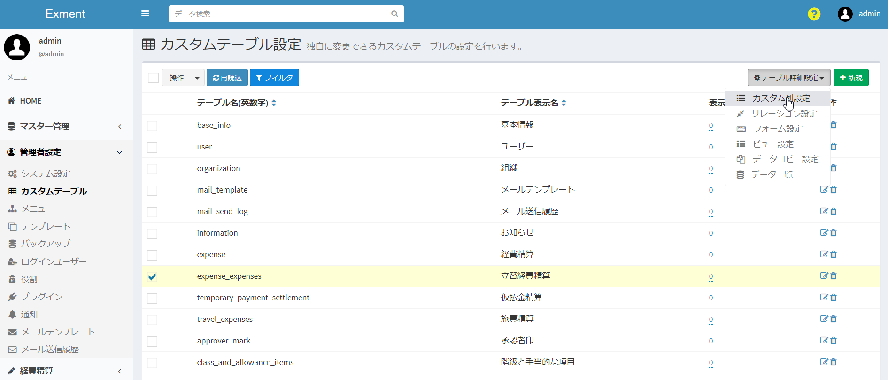
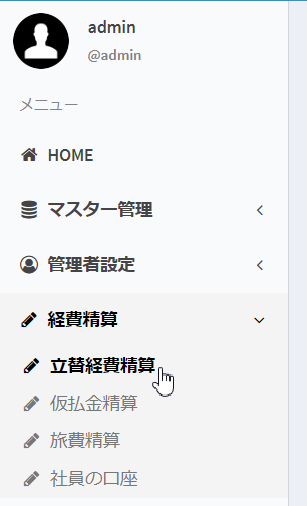
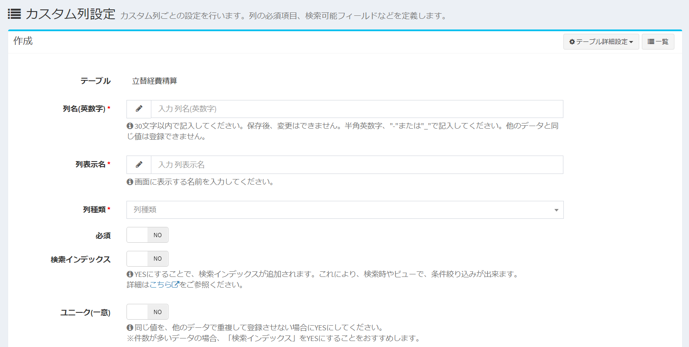
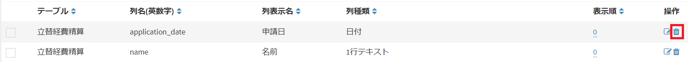
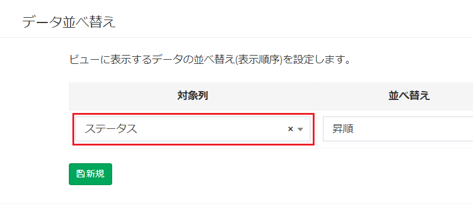
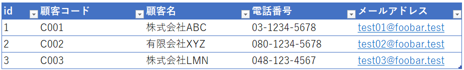
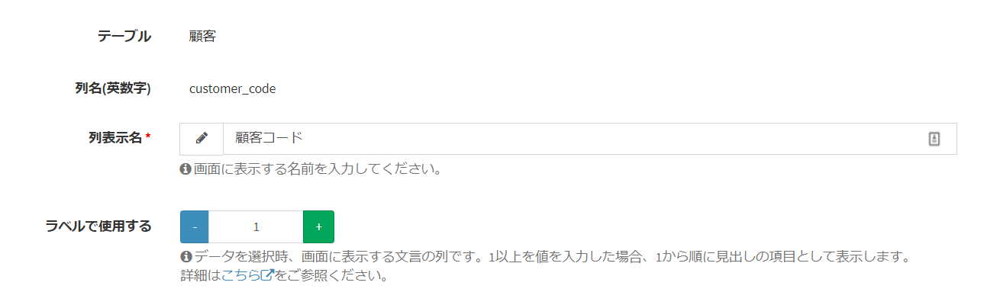
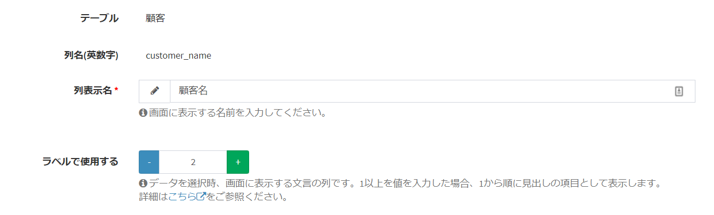
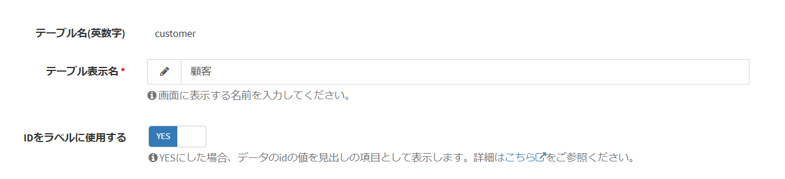

# カスタム列管理
カスタムテーブルが持つ列、「カスタム列」の管理を行います。  

## ページ表示
- カスタムテーブル画面で、変更を行いたいテーブルにチェックを1つ入れ、「ページ移動」の「列の詳細設定」をクリックします。  

- これで、チェックしたカスタムテーブルがもつ、列の一覧を表示します。  

## 列の新規追加
- 「カスタム列詳細設定」画面で、ページ右上の「新規」ボタンをクリックします。

- カスタム列新規追加画面が表示されますので、必要事項を入力します。

## 保存
設定を記入したら、「送信」をクリックしてください。

## 編集
列の編集を行いたい場合、該当する行の「編集」リンクをクリックしてください。  

## 削除
列の削除を行いたい場合、該当する行の「削除」リンクをクリックしてください。  

**※ただし、システムでインストールしている列は削除できません。**

## 記入項目の詳細(共通)
- 列種類：設定する列の種類です。この項目で登録した内容が、データ登録時のフォームに適用されます。
    - 1行テキスト：1行テキスト(テキストボックス)です。  
    - 複数行テキスト：複数行テキスト(テキストエリア)です。  
    - URL：URLです。  
    - メールアドレス：メールアドレスです。  
    - 整数：整数のみ入力できるフォームです。また、データ登録時のフォームでは、項目の左右に「＋」「－」ボタンが表示され、クリックで値を上下することが出来ます。  
    - 小数：小数のみ入力できるフォームです。  
    - 日付：日付の項目になります。データ登録時のフォームでは、カレンダーから日付を変更することができます。  
    - 時刻：時間の項目になります。データ登録時のフォームでは、時計から時刻を変更することができます。  
    - 日付と時刻：日時の項目になります。データ登録時のフォームでは、カレンダーと時計から日時を変更することができます。  
    - 選択肢：値と見出しが同じ選択肢一覧になります。  
    - 選択肢 (値・見出しを登録)：値と見出しが異なる選択肢一覧になります。  
    - 選択肢 (他のテーブルの値一覧から選択)：選択肢が他のテーブルの項目となる、選択肢を作成します。  
    - YES/NO：「YES」と「NO」を切り替えるスイッチを作成します。データ登録時、YESだと1、NOだと0と登録されます。  
    - 2値の選択：2つの値を切り替えるスイッチを作成します。データ登録時の値も変更できます。  
    - 自動採番：UUIDやランダム文字列などの値を、データ作成時に作成します。  
    - 画像：画像をアップロードする項目です。  
    - ファイル：ファイルをアップロードする項目です。  
    - ユーザー：システムのユーザーを選択する選択肢です。  
    - 組織：システムの組織を選択する選択肢です。  

- 必須：そのフィールドが必須項目であるかどうかを選択します。YESにした場合、データ記入画面で必須項目となり、記入していなかった場合にエラーが表示されます。  

- 検索インデックス：下記の「[検索インデックス](#検索インデックス)」をご参照ください。  

- プレースホルダー：フォーム項目にプレースホルダーとして登録する文字列です。  

- ヘルプ：フォーム項目の下に、情報として表示する内容です。

- ラベルで使用する：1以上の数値を入力した場合、ページ上部の検索ボックスで、このテーブルを選択肢として表示する場合などに、このテーブル項目の見出し（ラベル）として表示させます。  
詳細は下記の項目「ラベルで使用する」をご確認ください。

## 記入項目の詳細説明(列種類別)
- 最大文字数(1行テキスト,複数行テキスト)：フォーム項目で記入できる最大文字数です。オーバーした場合にエラーが発生します。  

- 最小値(整数、小数)：フォーム項目で記入できる値の最小値です。その値を下回って送信した場合に、エラーが発生します。未記入の場合、最小値のチェックは行いません。  

- 最大値(整数、小数)：フォーム項目で記入できる値の最大値です。その値を上回って送信した場合に、エラーが発生します。未記入の場合、最大値のチェックは行いません。  

- 選択肢(選択肢, 選択肢 (値・見出しを登録))：フォーム項目で候補として表示する、選択肢を登録します。改行区切りで、複数の候補を登録します。  
列種類で「選択肢 (値・見出しを登録)」を選択していた場合、カンマを列の区切りとして、1列目が値、2列目が見出しになります。  

↓  
  
フォームでデータ保存時には、1列目の値がデータベースに保存されます。  

- 対象テーブル(選択肢 (他のテーブルの値一覧から選択))：フォーム項目で、選択肢の候補として表示するテーブルを指定します。  

- 採番種類（自動採番）：データ登録時に、採番を行う種類を選択します。
    - フォーマット：ユーザーが指定したフォーマットで採番を登録します。
    - ランダム(ライセンスコード)：5文字×5で25文字のランダム文字列を登録します。
    - ランダム(UUID)：合計32桁のランダム文字列を登録します。

- 桁数(自動採番)：自動採番時に、データとして登録する桁数になります。不足分は0埋めで登録します。  

- 複数選択を許可する：画像やファイル、選択肢系の項目で、複数の選択肢を行う場合にYESにしてください。  

## 自動採番フォーマットのルール
列種類を「自動採番」、採番種類（自動採番）を「フォーマット」にした場合、ユーザー独自のルールで、自動採番を登録することが出来ます。  

- 設定できるパラメータ変数は、以下のページをご確認ください。  
[パラメータ変数](/ja/params)

## 検索インデックス
「検索インデックス」とは、データの検索のパフォーマンスを向上させるために、あらかじめデータベースに設定しておく機能です。「インデックス」は「索引」ともいいます。  
Exmentでは、この検索インデックスをYESにした場合のみ、一部の機能が有効になります。
    

YESにした場合、以下の機能が有効になります。  
- [カスタムビュー](/ja/view)の「表示条件」設定で、「対象列」に表示される  
    

- [カスタムビュー](/ja/view)の「並べ替え」設定で、「対象列」に表示される  
    

- [データ一覧](/ja/data_grid)の「フィルタ」設定の項目に表示される  
    

- ページ上部の検索バーで、ユーザーがワードを記入した時、データ検索の検索対象となる。各種コードや各種名称など、検索画面で検索させたい列の場合、YESとしてください。

※同一のテーブルで、「検索インデックス」を非常に多く設定すると、データの新規作成時や更新時に、パフォーマンスが低下する可能性があります。

## ラベルで使用する
カスタム列設定では、「ラベルで使用する」項目があります。  
この設定は、検索バーなどで値を表示するときに、表示する項目を制御することができます。  
  
例えば下記のように、「顧客情報」というテーブルがあるとします。  
顧客情報テーブルには、「顧客コード」「顧客名」「電話番号」「メールアドレス」といった情報があったとします。  
    

検索バーで検索ワードを入力すると、検索候補が表示されますが、  
そのとき、以下のように表示したいとします。  
「(顧客コード) (顧客名)」  
    
  
その場合、以下のように設定を行います。  
  
  
  
「顧客コード」の「ラベルを表示する」を1、「顧客名」の「ラベルを表示する」を2にすることで、このように表示されます。  
  
  
また、「メールアドレス」も表示したい場合は、「メールアドレス」の「ラベルを表示する」を3に設定してください。  
※「ラベルを表示する」の最大値は5です。  
  
  
ここで、カスタムテーブル設定の「IDをラベルに表示する」の項目があります。(ver1.1.0より)  
  
この設定をYESにすると、ラベルの頭に、「#(id)」という文言が追加されます。  
  

※IDを追加できるのは、ラベルの先頭固定です。それ以外の箇所には追加できません。  