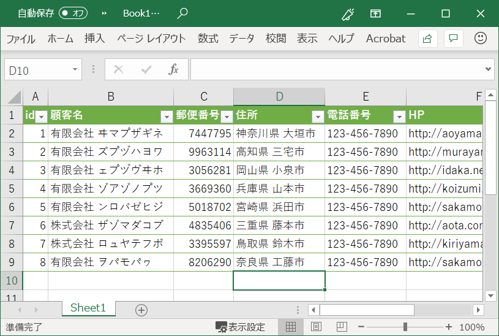
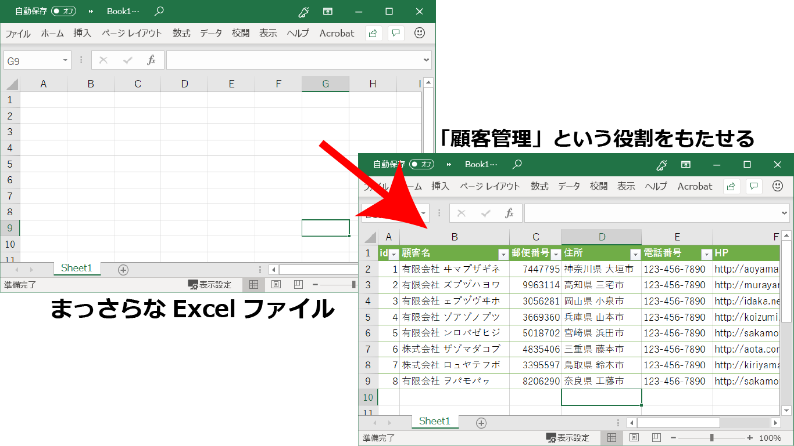
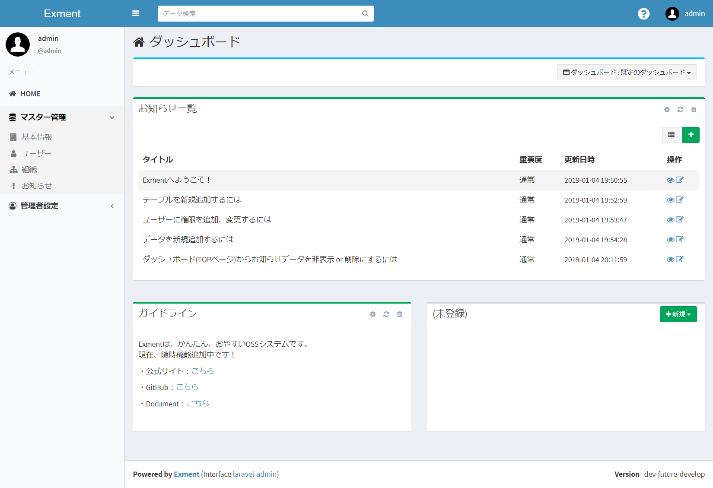
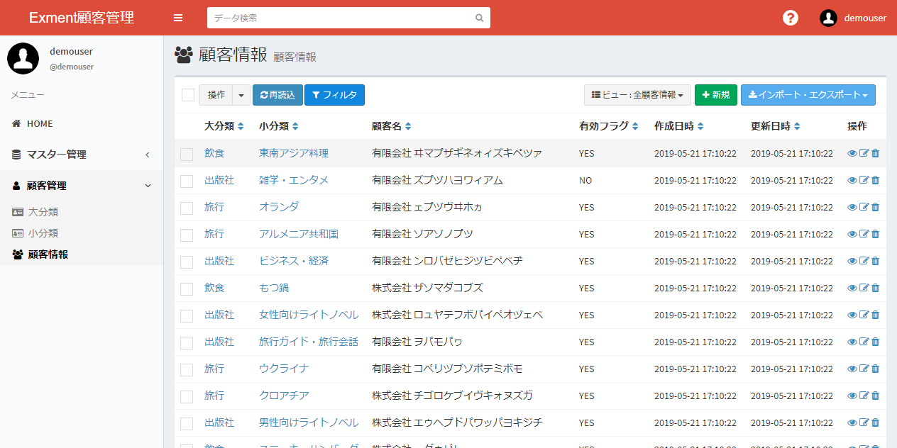

# Exmentのコンセプト
Exmentは、「なんでも管理できるWebデータベース」です。  
Exmentのシステムに、管理したい内容を追加していくことで、さまざまな役割を持たせることができます。  
  
これは、Excelで例えると分かりやすいです。  
Excelでファイルを新規作成した場合、空のシートが表示されます。この時点で、このExcelファイルは、なんの役割をもちません。 
  

このシートにユーザーが、列やシートを追加していくことで、意味を持たせていきます。  
  
      
この例の場合、「id」「顧客名」「郵便番号」「住所」といった情報を追加することで、『顧客管理』という役割を持つようになります。  

Exmentも同じ概念です。  
Exmentは初期設定だと、ユーザー管理やお知らせ管理など、最小限の機能しかありません。  
ここから、利用者自身で、さまざまな機能を追加していきます。  
    

例えば、システム管理者が「顧客管理」に関する設定を行うことで、このExmentでは『顧客管理』という役割をもちます。
    

また、システム管理者が「タスク管理」に関する設定を行うことで、このExmentでは『タスク管理』という役割をもちます。
    
  
このように、システム管理者が自由に設定を行うことによって、さまざまな役割をもたせることができます。  
可能性は無限大。使い方も無限大です。  
その他、Exmentで管理することによって、さまざまなメリットがあります。メリットについては、[こちら](https://exment.net/merit)をご確認ください。