# ダッシュボード
Exmentへのログイン時や「HOME」「左上に表示のサイト名」をクリックした際に表示される画面です。  
表示方法を自由にカスタマイズすることで、Exmentで管理している情報を様々な形式にて表示できます。  
### ダッシュボードの表示例

## ダッシュボードの新規作成
- ダッシュボード画面右上にある「ダッシュボード新規作成」をクリックします。  

  
- ダッシュボードに必要事項を設定していきます。  

## ダッシュボードの設定項目
#### ダッシュボード名(英数字)
ダッシュボードの名称を表します。  
保存後に変更することは出来ません。

#### ダッシュボード表示名
ダッシュボードを選択する際、画面に表示する名前です。  
日本語の設定が可能で、保存後も変更することが出来ます。

#### ダッシュボード種類
「システムダッシュボード」「ユーザーダッシュボード」どちらかを選択します。  

- 「システムダッシュボード」  
システム管理者のみが設定を行えます。全ユーザーが利用可能なダッシュボードになります。  

- 「ユーザーダッシュボード」  
システム管理者以外でも設定を行えるダッシュボードの設定です。作成したユーザーのみが利用可能なダッシュボードになります。    

※「システムダッシュボード」を後から「ユーザーダッシュボード」に変更することはできません。  
**システム管理者が作成した「ユーザーダッシュボード」**に関しては、後から「システムダッシュボード」に変更することが可能です。  
※[ユーザーダッシュボード無効](/ja/config.md?id=ユーザーダッシュボード無効)の設定を行うことで、一般ユーザーにはダッシュボードの作成が行えなくなります。

#### 既定
「YES」「NO」どちらかを選択します。  
ダッシュボードを複数作成している場合、ダッシュボードを開いた際に表示されるのは「YES」に設定しているダッシュボードになります。  
※一覧から選択することで「NO」に設定しているダッシュボードも表示することが出来ます。  
※「既定」を「YES」に設定できるのは、１つのダッシュボードのみです。  
2つ以上のダッシュボードで「YES」とした場合、最後に「YES」に設定したダッシュボード以外は「NO」に変更されます。

#### 列数の選択
ダッシュボードの各行に表示する列数を選択します。  
1行あたり最大4列まで表示することが可能です。  
※列数と１つあたりの表示面積は反比例します。  

### １行に４列表示している例
  

# 表示するアイテムを選択
作成したダッシュボードの各列右上［新規］にある  
「データ一覧」「システム」「チャート」「カレンダー」  
この4種類から表示したいアイテムを選ぶことが出来ます。  

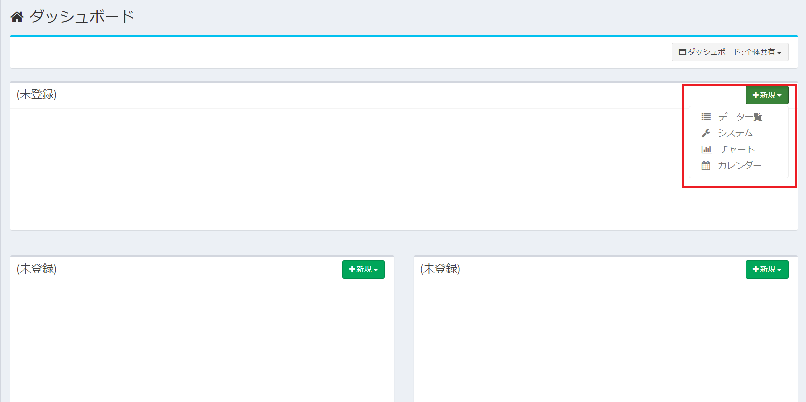  

次に、アイテムごとの具体的な表示内容を設定していきます。

## データ一覧
Exmentで管理している情報の中から、任意のテーブル、ビューを指定することでダッシュボードにデータ一覧を表示することが出来ます。

### データ一覧の表示例

### データ一覧の設定項目
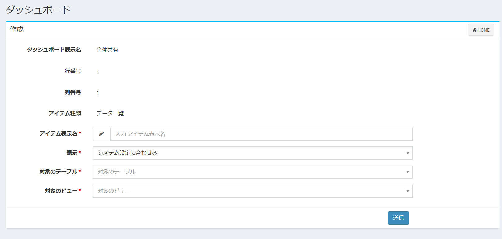
#### アイテム表示名
画面に表示するアイテムの名前を入力します。

#### 表示
一度に何件のデータを表示するか選択します。

#### 対象のテーブル
[カスタムテーブル設定](/ja/table.md)で作成済のテーブルの中から表示する対象を選びます。

#### 対象のビュー
選択した対象のテーブル内にある[ビュー](/ja/view.md)の中から表示する対象を選びます。  

## システム
ダッシュボードにシステムに関する表示を行うことが出来ます。  
※現在は「ガイドライン」「Exment新着情報一覧」「エディター」「HTML」「通知一覧」「二次元バーコード」が表示可能です。

### システムの設定項目
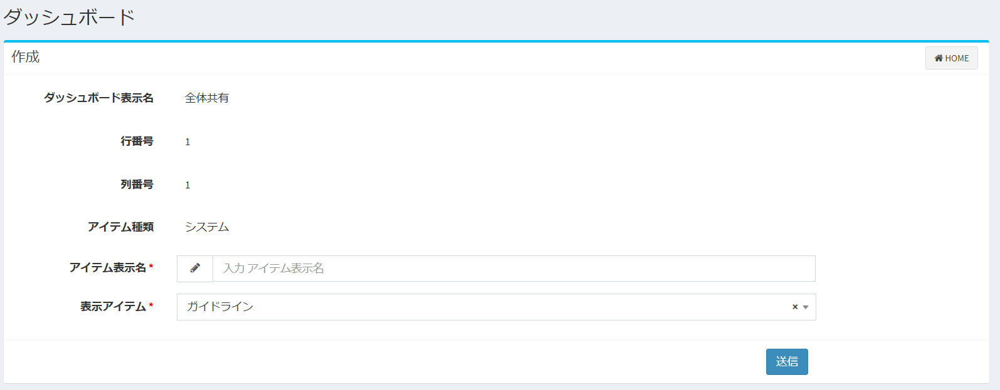

#### アイテム表示名
画面に表示するアイテムの名前を入力します。

#### 表示アイテム
表示するアイテムを選択します。

- ##### ガイドライン
システムに関する案内表示が出来ます。  

- ##### Exment新着情報一覧
Exment公式サイトより、新着情報を取得し表示します。

- ##### エディター
自由に本文を入力し、画面表示します。

- ##### HTML
HTML形式で内容を入力し、画面表示します。※スクリプトも実行されます。

- ##### 二次元バーコード
二次元バーコード読込ボタンを表示します。  
「二次元バーコード読込」ボタンの「二次元バーコード」の表示名を.envファイルの「EXMENT_TEXT_QR_BUTTON_JA/EN」で変更できます。
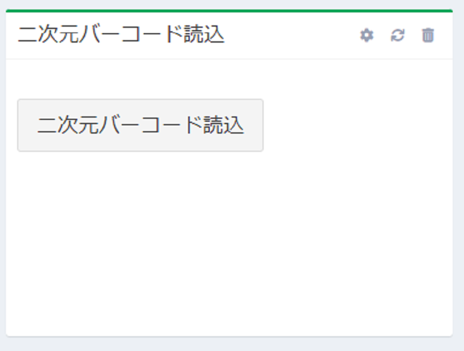

## チャート
Exmentの集計ビューによって管理しているデータを  
「棒グラフ」「折れ線グラフ」「円グラフ」  
3種類のグラフデータの内、任意の形式に変換してダッシュボードに表示することが出来ます。  
※詳細は[チャートの設定内容](#チャートの設定内容)をご確認ください。

### 棒グラフの表示例

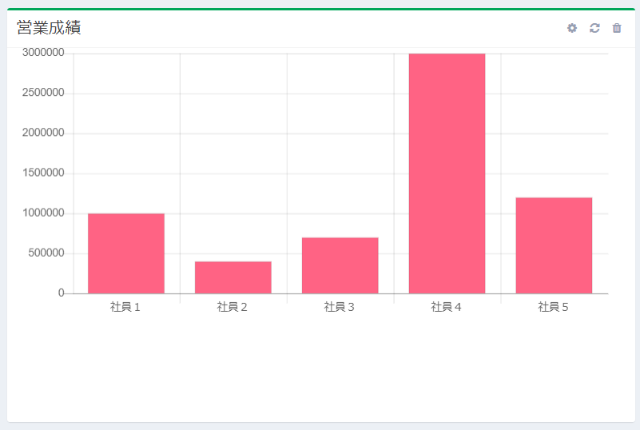

### 折れ線グラフの表示例  
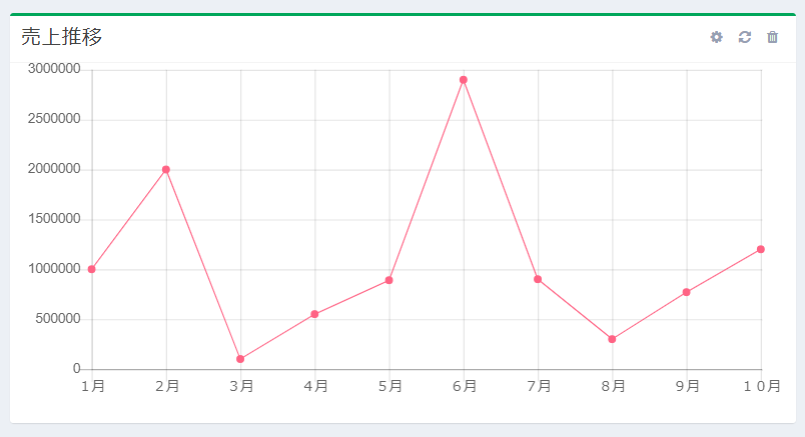

### 円グラフの表示例
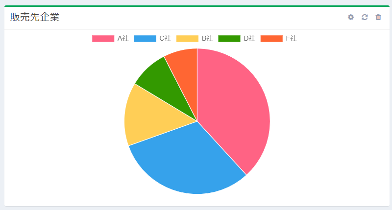

### チャートの設定項目

#### アイテム表示名
画面に表示するアイテムの名前を入力します。

#### チャートの種類
「棒グラフ」「折れ線グラフ」「円グラフ」  
この3種類から表示したいグラフを選びます。

#### 対象のテーブル
[カスタムテーブル設定](/ja/table.md)で作成済のテーブルの中から表示する対象を選びます。  
※集計ビューを設定しているテーブルのみが選択肢として表示されます。

#### 対象のビュー
選択した対象のテーブル内にある集計ビューの中から表示する対象を選びます。  

#### X軸の項目
グラフとして表示するX軸（横軸）を選択します。  

#### Y軸の項目
グラフとして表示するY軸（縦軸）を選択します。  

#### その他グラフ種類に応じたチェックボックス
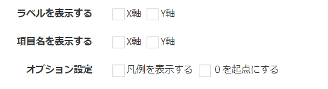  
チェックした表示形式がグラフに反映されます。

## カレンダー
Exmentのカレンダービューによって管理しているデータを、  
「月別」「リスト」  
2種類の表示形式の内、任意の形式にてダッシュボードに表示することが出来ます。
>表示される文言は、[見出し表示列設定](/ja/table#見出し表示列設定)で変更できます。

### 月別の表示例
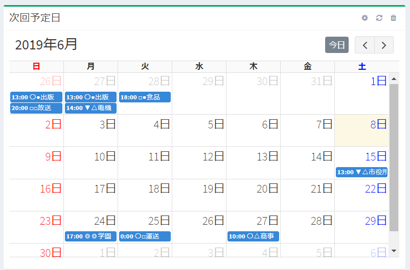  

### リストの表示例
  

### カレンダーの設定項目

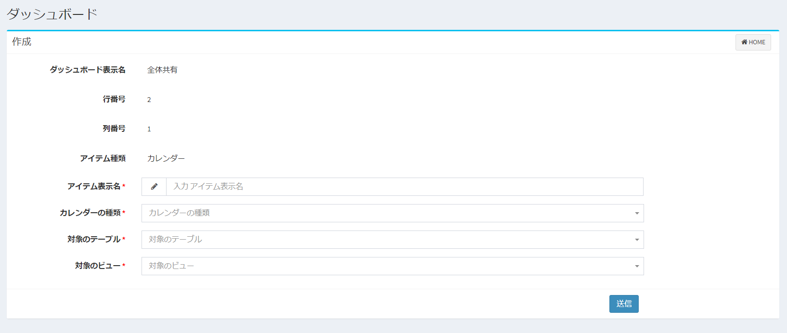  

#### アイテム表示名
画面に表示するアイテムの名前を入力します。

#### カレンダーの種類
「月別」「リスト」  
この2種類から表示したいカレンダーを選びます。

#### 対象のテーブル
[カスタムテーブル設定](/ja/table.md)で作成済のテーブルの中から表示する対象を選びます。  
※カレンダービューを設定しているテーブルのみが選択肢として表示されます。

#### 対象のビュー
選択した対象のテーブル内にあるカレンダービューの中から表示する対象を選びます。  

## チャートの設定内容
チャート(グラフ)で設定するX軸、Y軸の項目は、対象ビューの内容によって異なります。  

### 対象ビューが全件ビュー、標準ビューの場合

#### X軸の項目
X軸の選択肢には、以下の2種類が表示されます。いずれかを選択してください。

- 「データ見出し」項目。  
  

選択することで、[カスタムテーブル設定の見出し表示列設定](/ja/table#見出し表示列設定)が、X軸に表示されます。  

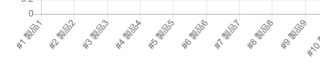  

- [カスタムビュー設定の「表示列選択」](/ja/view#表示列選択)に表示されている項目。選択することで、選択した列の値が、X軸に表示されます。  
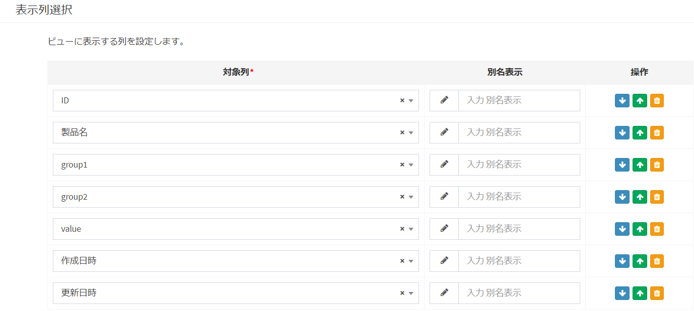  

#### Y軸の項目
Y軸の選択肢には、以下の1種類が表示されます。いずれかを選択してください。

- [カスタムビュー設定の「表示列選択」](/ja/view#表示列選択)に表示されている項目のうち、以下の列種類。選択することで、選択した列の値が、Y軸に表示されます。
    - 整数
    - 小数
    - 通貨

### 対象ビューが集計ビューの場合

#### X軸の項目
X軸の選択肢には、以下の1種類が表示されます。

- 「データ見出し」項目。  
  

選択することで、[カスタムビュー設定の「グループ列選択」](/ja/table#グループ列選択)で設定した値が、X軸に表示されます。  
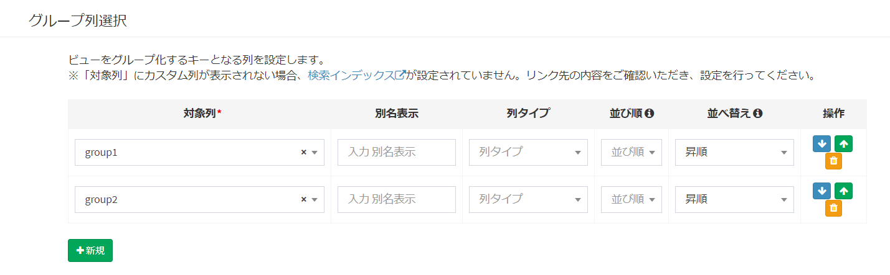  
  

#### Y軸の項目
Y軸の選択肢には、以下の2種類が表示されます。いずれかを選択してください。

- [カスタムビュー設定の「グループ列選択」](/ja/view#グループ列選択)に表示されている項目のうち、以下の列種類。選択することで、選択した列の値が、Y軸に表示されます。
    - 整数
    - 小数
    - 通貨

  

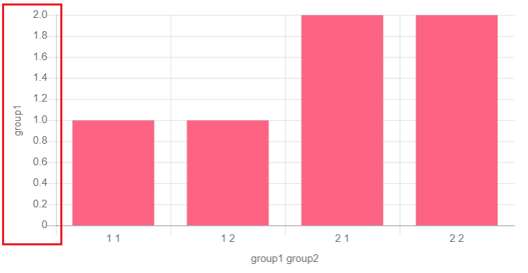  

- [カスタムビュー設定の「集計列選択」](/ja/view#集計列選択)に表示されている項目。選択することで、選択した列の値が、Y軸に表示されます。

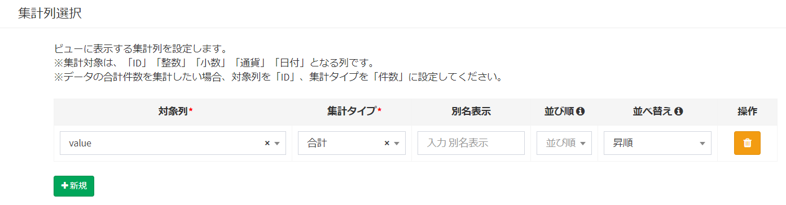  

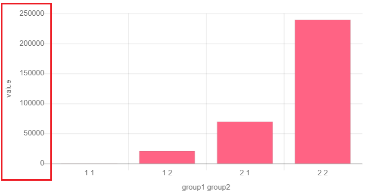  

## ダッシュボードの共有
作成したダッシュボードを、他のユーザー・組織に共有します。  
※共有対象となるのは「ユーザーダッシュボード」のみです。（「システムダッシュボード」は最初から全てのユーザーに公開されています。）  

#### 共有方法
- ダッシュボードの設定変更画面に「共有」ボタンが表示されているので、クリックします。  
※新規作成時にはこのボタンは表示されません。
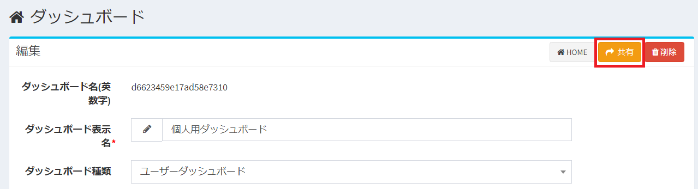  

- ダッシュボードの共有ダイアログが表示されます。
  

- 共有したいユーザーまたは組織を追加して、「送信」をクリックし、共有を完了させます。  
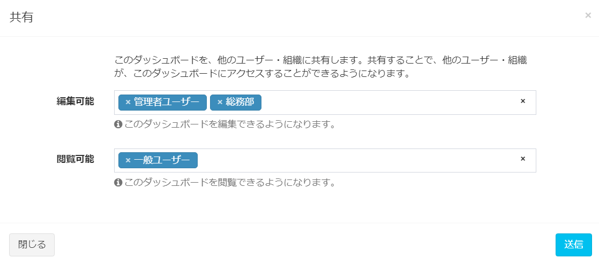  
