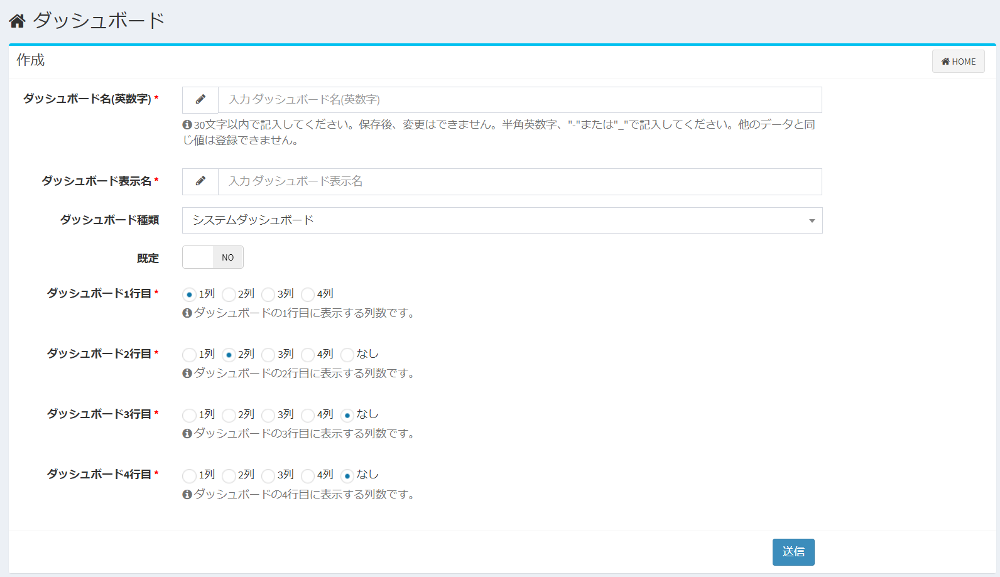

# ダッシュボード
Exmentへのログイン時や「HOME」「左上にあるサイト名」をクリックした際に表示される画面です。

## ダッシュボードの新規作成
- ダッシュボード画面右上にある「ダッシュボード新規作成」をクリックします。  

  
- ダッシュボードに必要事項を設定していきます。  

## ダッシュボードの設定項目
#### ダッシュボード名(英数字)
ダッシュボードの名称を表します。  
保存後に変更することは出来ません。

#### ダッシュボード表示名
画面に表示する名前です。  
日本語の設定が可能で、保存後に変更することが出来ます。

#### ダッシュボード種類
「システムダッシュボード」or「ユーザーダッシュボード」どちらかを選択します。  

「システムダッシュボード」：システム管理者にだけ表示可能となるダッシュボードの設定です。  
「ユーザーダッシュボード」：システム管理者以外にもユーザー全員が表示可能となるダッシュボードの設定です。

#### 既定
「YES」or「NO」どちらかを選択します。  
ダッシュボードを複数作成している場合、ダッシュボードを開いた際に表示されるのは「YES」に設定しているダッシュボードになります。  
※「既定」の項目を「YES」とできるのは、１つのダッシュボードのみです。  
2つ以上のダッシュボードで「YES」とした場合、それ以外の「既定」は「NO」に変更されます。

#### 列数の選択
ダッシュボードの各行に表示する列数を選択します。  
設定した列数の一覧が、データ一覧画面などで表示されます。
  
## 列毎の表示設定

- 対象列：  
ビューに表示する列です。  
  
- 別名表示：  
設定した名前でビューに表示されます。  

- 表示順：  
ビューに表示する項目の順序です。  
値が小さい順に、左から表示されます。

- 「削除」ボタン：  
ビューの表示を削除します。

- 「新規」ボタン：  
ビューの表示列を新規追加します。

#### 表示条件選択
ビューに表示する条件の設定です。  
期間内の項目のみを表示する、特定のステータスの内容のみを表示するなど、表示内容の絞り込みを行う場合に、条件を追加します。  
※この設定の他に、ログインユーザーが所有する権限のデータのみ表示するよう、データのフィルターを行います。権限のないデータは、この設定に関わらず表示されません。

- 対象列：  
絞り込み条件に使用する列です。  
  
- 検索条件：  
条件の内容を選択します。  
詳細は、ページ下部の「検索条件について」をご確認ください。  
  
- 検索値：  
検索条件の内容に合致するための条件を入力します。  
  
- 「削除」ボタン：  
ビューの表示条件を削除します。
  
- 「新規」ボタン：  
ビューの表示条件を新規追加します。

#### 検索条件について
「対象列」で選択した内容の種類（「日付」「ユーザー」など）によって、選択肢の項目は変更されます。  
このマニュアル項目では、特記すべき検索条件について記載します。
##### 対象列の種類が「日付」の場合
- X日前の日付以降  
- X日後の日付以降  
- X日前の日付以前  
- X日後の日付以前  
登録しているデータが、該当する範囲の日付で登録されている場合に、ビューに表示されます。  
例：現在日付が1/15で、検索値を「8」で登録している場合  

##### 対象列の種類が「ユーザー」の場合
- ログインユーザーに合致する  
登録しているデータが、ログインしているユーザーと合致する場合に、ビューに表示されます。  
- ログインユーザーに合致しない    
登録しているデータが、ログインしているユーザーと合致しない場合に、ビューに表示されます。  

## 保存
設定を記入したら、「送信」をクリックしてください。

## 編集
ビューの編集を行いたい場合、該当する行の「編集」リンクをクリックしてください。  

## 削除
ビューの削除を行いたい場合、該当する行の「削除」リンクをクリックしてください。  

## ビューの複製
「このビューの複製」リンクをクリックすると、同じ設定内容でビュー表示名だけ空欄のビューが複製されます。

## データ一覧表示
「このビューでデータ一覧表示」リンクをクリックすると、そのビュー設定でのデータ一覧が表示されます。
