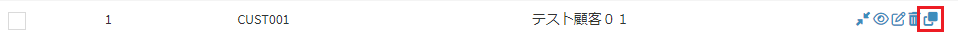

# データ
Exmentに保存している、各テーブルのデータを、一覧・新規追加・編集・表示・削除する機能です。  
システム管理者が作成したテーブルに紐付けて、ユーザーは値を入力して保存します。  
データは主に、以下の機能があります。  

## データ一覧
そのテーブルで保存しているデータの一覧になります。  
一覧に表示されるのは、自分が作成したデータ、または自分が権限を割り当てられているデータになります。  

※すべてのデータを編集・閲覧する権限を、ユーザーや組織に登録することで、上記の条件に関わらず、すべてのデータが表示されます  
  
  
一覧画面の詳細は、[データ一覧](/ja/data_grid.md)をご参照ください。  

## データの新規追加
- データの追加を行いたい場合、ページ右上の［新規］リンクをクリックします。  

※ログインユーザーが、そのテーブルの「編集」権限を所有していない場合、このボタンは表示されません。  
権限の割り当て方法は、左メニューより[役割グループ・権限設定](/ja/role_group.md)をご参照ください。  

- データの新規作成画面が表示されます。  

  
- 新規追加画面の詳細は、[データフォーム](/ja/data_form.md)をご参照ください。  

## データの編集
- データの編集を行いたい場合、該当する行の［編集］リンクをクリックしてください。  

※ログインユーザーが、そのテーブルの「編集」権限を所有していない場合、このリンクは表示されません。  
 権限の割り当て方法は、左メニューより[役割グループ・権限設定](/ja/role_group.md)をご参照ください。  

- データの編集画面が表示されます。  

  
- 編集画面の詳細は、[データフォーム](/ja/data_form.md)をご参照ください。  

> データの更新時、既に他のユーザーがデータの更新を行っていた場合には、下記のエラーメッセージが表示されます。

## データの表示
- データの表示を行いたい場合、該当する行の［表示］リンクをクリックしてください。  

- データの表示画面が表示されます。  

  
- 表示画面の詳細は、[データ詳細](/ja/data_details.md)をご参照ください。  

## データの削除
- データの削除を行いたい場合、該当する行の［削除］リンクをクリックしてください。  

## データのコピー
- データのコピーを行いたい場合、該当する行の［コピー］リンクをクリックしてください。  
※コピーリンクを表示するためには設定値を変える必要があります。[こちら](/ja/config?id=カスタムデータのコピーリンクを表示する)をご参照ください。  

- 選択したデータの内容が初期設定された状態で編集画面が表示されます。  
※コピーされるのはフォーム上に存在する項目だけです。  
※自動採番、ファイル、画像などは対象外になります。  

- 必要に応じて内容を修正した上で保存を行ってください。  