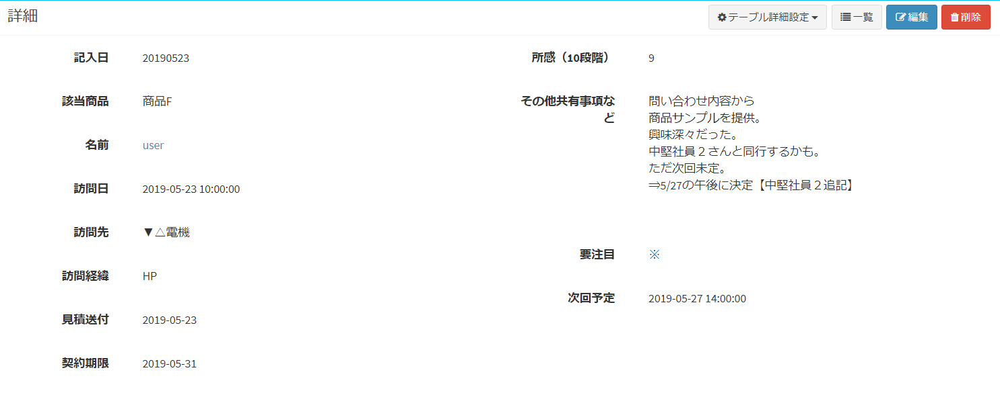
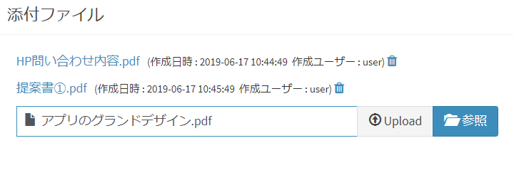
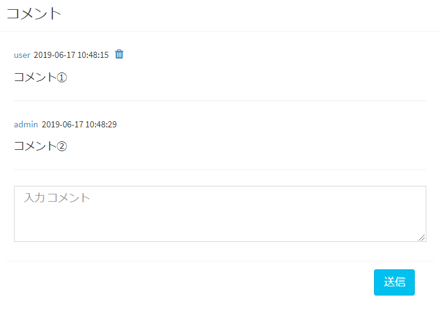
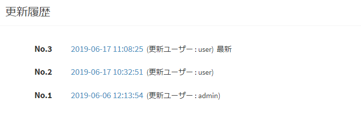
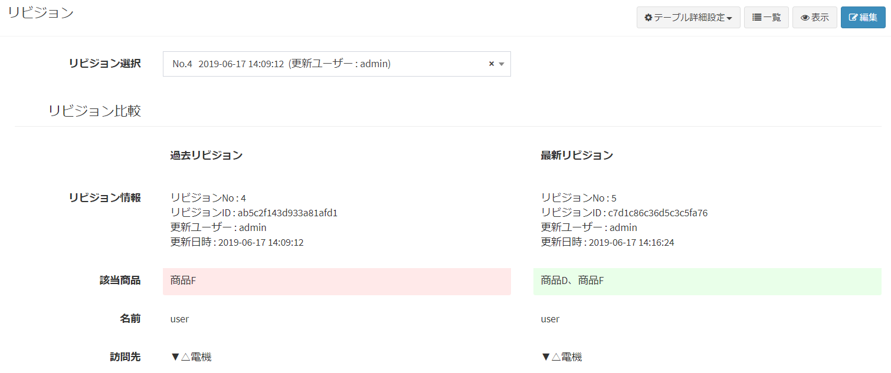
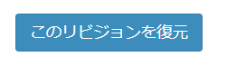

# データ詳細
[データ一覧](/ja/data_grid.md)で対象データをクリックすることにより、データ詳細が表示されます。  
データ一覧では、ビュー設定の[表示列選択](/ja/view?id=表示列選択)で指定している内容が表示されます。  
データ詳細では[フォーム優先順位設定](/ja/form#フォーム優先順位設定)で設定している優先順に従い、合致するフォームの項目が表示されます。  

また、データ詳細の画面では下記4種類の情報が表示されます。  

- 内容の詳細  
- 添付ファイル  
- コメント  
- 更新履歴  

## 内容の詳細
  
- データとして登録している内容を詳細表示します。  

## 添付ファイル
  

- ［参照］ボタンをクリックし、添付したいファイル選択。  
- ［Upload］ボタンをクリック。  

上記の手順によってデータ詳細画面にファイルを添付することが出来ます。  

- 添付したファイルは［削除］ボタンから削除することが出来ます。

## コメント
  

- コメント入力後［送信］ボタンをクリックすることで、データに対しコメントを行うことが出来ます。
- コメントを行った日時とユーザー名が自動で記載されます。
- 行ったコメントは［削除］ボタンから削除することが出来ます。  

※削除を行えるのはログインしているユーザー自身が行ったコメントのみとなります。  
画像の例では、user としてログインしている為、admin が行ったコメントの［削除］ボタンは表示されません。

## 更新履歴

  

- 更新履歴が表示されるのはテーブル設定の[データ変更履歴使用](/ja/table?id=データ変更履歴使用)をYESにしている場合となります。
- データ内容を編集した場合、編集を行った日時とユーザー名が自動で記載されます。
- 更新履歴に表示されている日時をクリックすると、リビジョン画面に移行します。

#### リビジョン
  
- 「リビジョン選択」で、履歴にある中から比較したいデータを選択します。
- 左側に「選択した履歴データ」右側に「最新のデータ」が表示され、データ登録に差異がある項目に背景色が付きます。
- ページ下部にある［このリビジョンを復元］ボタンをクリックすると、選択しているデータ内容にて復元が行われます。

  

## データ共有

> データ共有設定については、[Exmentにおける役割・権限の概要](/ja/permission)ページを、はじめにご確認ください。

保存しているデータを、他のユーザー・組織に共有します。  
※[役割グループ設定](/ja/role_\_group)にて、「データ共有」権限がある場合のみ実行可能です。

#### 共有方法
- データ詳細画面で、［共有］ボタンが表示されているので、クリックします。
  

- データ共有のダイアログが表示されます。
  

- 共有したいユーザーを追加して、［送信］をクリックし、共有を完了させます。  
  

※システム管理者が、[通知設定](/ja/notify)で「データ新規作成・更新・共有・コメント」による通知設定を行うことで、共有を行ったユーザーに通知を行うことができます。
