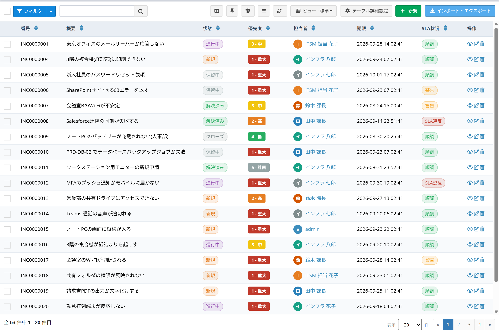
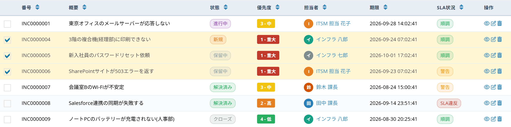

# データ一覧の操作ツール

[データ一覧](/ja/data_grid.md)画面で使える、表示の切り替えとその場編集の機能をまとめています。  
設定は不要で、データ一覧を開くとすぐに使えます。

## ツールバーのボタン

データ一覧の右上、ビュー選択の左側に5つのボタンが並びます。

左から、［表示する列を選択］［列固定］［グループ化］［表示密度］［自動更新］です。

> これらの設定は **使用している人のブラウザに保存されます**。ビューの設定は変更しないので、他のユーザーの画面には影響しません。  
> ［表示する列を選択］［列固定］［表示密度］はブラウザを閉じても残ります。  
> ［グループ化］［自動更新］はタブを閉じるまで有効です。

### 表示する列を選択

そのビューの列のうち、画面に表示する列を選びます。

- 上部の入力欄に文字を入れると、列名で絞り込めます。
- ［すべて選択］［すべて解除］［既定に戻す］で一括操作ができます。
- ［適用］で反映、［取消］で閉じます。

※列を1つも選ばずに［適用］することはできません。  
※非表示にした列もデータは消えません。［既定に戻す］でいつでも元に戻せます。

### 列固定

横スクロールしても、指定した列を画面の左端に固定します。件数の多い横長の表で、どの行を見ているか分からなくなるのを防ぎます。

| 項目 | 内容 |
| --- | --- |
| 先頭2列を固定 / 先頭3列を固定 | よく使う組み合わせをすぐ設定します |
| 固定を解除 | すべての固定を解除します |
| 操作列を右に固定 | 右端の［操作］列を常に表示します |
| ヘッダー行を固定 | 縦スクロール時に見出し行を残します |
| （列名の一覧） | 固定する列を1つずつ選びます |

※画面の幅が足りない場合、一部の列は固定されません。その場合は画面にメッセージが表示されます。

### グループ化

表示中のページのデータを、選んだ列の値ごとにまとめて表示します。

- グループの見出しには、そのグループの件数が表示されます。
- 見出しの左の三角をクリックすると、グループを折りたたむ・開くができます。
- ［グループ化しない］で元の並びに戻ります。

> **「このページ内」と表示される理由**  
> グループ化は、いま画面に読み込まれているページのデータだけを並べ替えます。  
> すべてのデータをまたいで集計したい場合は、[集計ビュー](/ja/view.md)を作成してください。

### 表示密度

行の高さと、セル内の折り返しを切り替えます。

| 項目 | 内容 |
| --- | --- |
| コンパクト | 行の高さを詰めます。1画面により多くの行が入ります。 |
| 標準 | 既定の高さです。 |
| 広め | 行の高さを広げます。読みやすさ優先です。 |
| 1行で表示 | セル内で文字を折り返さず、1行に収めます。長い文章は途中で省略されます。 |

### 自動更新

一覧を一定時間ごとに自動で読み込み直します。  
複数人で同時に対応する業務（問い合わせ受付など）で、画面を開いたまま最新の状態を確認できます。

オフ／30秒／1分／5分から選択します。  
※この設定はタブを閉じると解除されます。

## 表の上での操作

### インライン編集（ダブルクリックで編集）

セルをダブルクリックすると、その場で値を変更できます。編集できるセルは、マウスを乗せると鉛筆アイコンが表示されます。

値を選ぶ（入力する）と自動的に保存され、セルの表示が更新されます。

編集できる列の種類は次のとおりです。

| 列の種類 | 表示される入力 |
| --- | --- |
| 選択肢、選択肢（値・見出しを登録）、YES/NO | 選択リスト |
| 1行テキスト、メールアドレス、URL | テキスト入力 |
| 整数、小数、通貨 | 数値入力 |
| 日付、日付と時刻 | カレンダー入力 |

※複数選択できる列、計算式で自動計算される列は編集できません。  
※編集権限がない場合、鉛筆アイコンは表示されません。  
※保存は通常の編集画面と同じ処理を通るため、入力チェック・ワークフロー・変更履歴はそのまま動作します。入力値がエラーになった場合は、保存されずに元の表示に戻ります。

### 右クリックメニュー

行を右クリックすると、そのデータに対する操作がメニューで表示されます。

| 項目 | 内容 |
| --- | --- |
| クイックプレビュー | 画面を移動せずに、詳細をその場で表示します |
| 表示 | データの詳細画面を開きます |
| 編集 | データの編集画面を開きます |
| 複製して新規 | この行の値をコピーした新規作成画面を開きます |
| 自分を○○にする | 担当者などの列に、ログイン中のユーザーを設定します |
| このページ内で絞り込み：「○○」 | クリックしたセルと同じ値の行だけを表示します |
| セルの値をコピー | クリックしたセルの値をクリップボードにコピーします |
| 削除 | 確認のうえ、このデータを削除します |

※権限のない操作はメニューに表示されません。閲覧のみのユーザーには、削除や編集は表示されません。  
※Shift キーを押しながら右クリックすると、ブラウザ本来のメニューが開きます。

### クイックプレビュー

一覧から離れずに、1件の内容を確認できます。

- ［全体を開く］で通常の詳細画面へ移動します。
- ［閉じる］で一覧に戻ります。一覧のスクロール位置や絞り込みはそのまま残ります。

### 複数選択と一括操作

行の左端のチェックボックスを選択すると、選択した行の色が変わり、画面下部に操作バーが表示されます。

| ボタン | 内容 |
| --- | --- |
| 一括編集 | 選択した行の値をまとめて変更します |
| CSV / Excel | 選択した行だけをファイルに出力します |
| 一括削除 | 選択した行をまとめて削除します |
| 選択解除 | 選択をすべて解除します |

※［一括削除］などの項目は、権限と[データ更新設定](/ja/operation.md)によって変わります。

#### 一括編集

- 変更したい項目だけを入力します。空欄の項目は変更されません。
- ［○件に適用］をクリックすると、確認のうえ更新されます。
- 進捗が表示され、終了後に成功件数・失敗件数が表示されます。

※一括編集に表示されるのは、選択リストで値を選べる列だけです。  
※保存は1件ずつ通常の更新処理を通るため、入力チェック・ワークフロー・変更履歴はそのまま動作します。権限やチェックで更新できなかった行は「失敗」として件数に表示されます。

### 絞り込み中の表示

［フィルタ］で条件を指定して検索すると、表の上に現在の条件がチップ（小さなラベル）で表示されます。

- 条件名の右の「×」で、その条件だけを解除できます。
- ［すべて解除］で、すべての条件を解除します。

右クリックメニューの「このページ内で絞り込み」を使った場合は、黄色の帯で表示されます。

- 何件が非表示になっているかが表示されます。
- ［絞り込み解除］で元に戻ります。

> フィルタは、いま表示されているページの行だけを対象にします。ページをまたいで絞り込みたい場合は、［フィルタ］パネルか[ビューのデータ表示条件](/ja/view.md)を使用してください。

## 権限について

これらの機能は、既存の権限をそのまま使用します。

- 一覧に表示されるデータは、従来どおりログインユーザーが閲覧できるデータだけです。
- 編集・削除の操作は、対象データの編集権限・削除権限がある場合のみ表示されます。
- インライン編集と一括編集は、通常の編集画面と同じ保存処理を通ります。権限のないデータは更新されません。

## 関連項目

- [データ一覧](/ja/data_grid.md)
- [カスタムビュー](/ja/view.md)
- [表示プリセット](/ja/cell_style_preset.md)
- [データ更新設定](/ja/operation.md)
