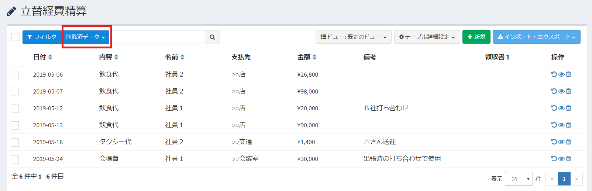
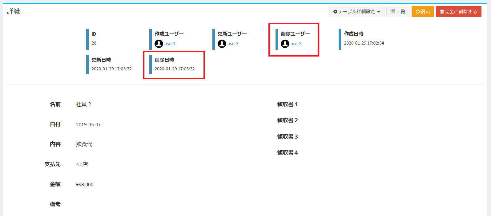
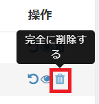

# 削除済データ
- Exmentの各テーブルでは、削除済であるデータの表示を行うことができます。
- 削除済データは、削除データの表示権限を持つユーザーのみが表示可能です。
- 編集権限のあるユーザーは、データの復元や完全削除を行うことができます。  

※権限に関して詳細は[役割グループ](/ja/role_group.md)をご参照ください。

## 一覧表示
  

- データ一覧画面の左上［フィルタ］の右横にある▼マークから、［削除済データ］を選択します。
- 表示が変わり、そのテーブルの削除済データが一覧表示されます。

  

## 詳細表示

- 削除済データ一覧にあるデータは、データの詳細表示を行うことができます。  
- 詳細表示を行いたいデータ行、もしくは操作列にある表示アイコンをクリックしてください。

  

- データ詳細画面では、削除ユーザーと削除日時の表示を確認することができます。

  

## 復元

- 削除済データは、データ一覧画面へ復元することが可能です。
- 復元は３つの方法で行うことができます。
    - データ詳細画面にある［復元］ボタンを使用する。
      
    - 削除済データ一覧画面で、操作列にある［復元アイコン］を使用する。
      
    - 削除済データ一覧画面で、復元したいデータにチェックを入れ、削除済データ画面の左上にある▼マークから、［復元］を選択する。
      

※データの復元は、そのデータの編集権限が付与されているユーザーのみが行えます。

## 完全に削除

- 削除済データは、データとして完全に削除することが可能です。完全に削除したデータは、削除済データ一覧から削除されます。
- 完全に削除は、３つの方法で行うことができます。
    - データ詳細画面にある［完全に削除する］ボタンを使用する。
      
    - 削除済データ一覧画面で、操作列にある［完全に削除する］アイコンを使用する。
      
    - 削除済データ一覧画面で、完全に削除したいデータにチェックを入れ、削除済データ画面の左上にある▼マークから、［完全に削除する］を選択する。
      

※データの削除は、そのデータの編集権限が付与されているユーザーのみが行えます。

## データ一覧画面に移動

- 削除済データ一覧の画面で、［削除済データ▼］をクリックし、［取消］を選択すると、そのテーブルのデータ一覧画面に移動します。

  

#### 権限設定
- 削除済データを表示する為には、そのデータに対する表示権限がユーザーに必要です。
- 削除済データの復元や完全に削除を行う為には、そのデータに対する編集権限がユーザーに必要です。

※権限の設定に関しては、[役割グループ](/ja/role_group.md)をご参照ください。