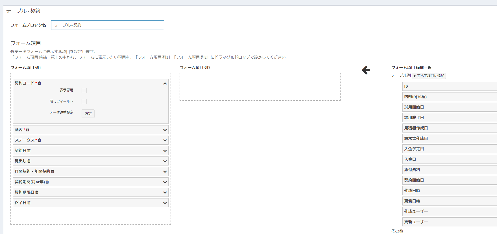
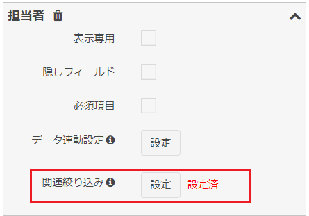

# カスタムフォーム
Exmentの[データフォーム画面](/ja/data_form.md)に表示する項目、列の行数、隠しフィールド、データ連動設定を行います。  
このカスタムフォームで設定した内容が、各テーブルの[データフォーム画面](/ja/data_form.md)に反映されます。

## ページ表示
- カスタムテーブル画面で、変更を行いたいテーブルにチェックを1つ入れ、「ページ移動」の「フォーム設定」をクリックします。  

- これで、チェックしたカスタムテーブルがもつ、フォームの一覧を表示します。  
テーブルごとに1つ、既定でフォームが作成されています。

## フォーム編集
フォームの編集を行いたい場合、該当する行の「編集」リンクをクリックしてください。  

## カスタムフォームの設定項目

#### フォーム表示名
保存するフォームの名称を記入します。  

#### フォーム項目
入力フォームに表示する項目の設定です。  
設定した列の一覧が、データフォーム画面で表示されます。

- フォームブロック名：  
フォームの各ブロックに表示する名称です。  
  
- フォーム項目 列1：  
フォームの左列に表示する項目です。  
  
- フォーム項目 列2：  
フォームの右列に表示する項目です。  

- フォーム項目 候補一覧：  
フォームに追加できる項目の候補です。  
種類は「テーブル列」と「その他」の2種類あります。  

- テーブル列：  
追加・編集するデータの、値の項目になります。  
ID、内部ID、作成・更新日時、作成・更新ユーザーを含みます。  
「フォーム項目 列1」もしくは「フォーム項目 列2」に追加することで、データフォームを表示時に、その項目の値を編集、または表示することができます。

- その他：  
フォームに単に表示する、見出しや説明文、HTMLになります。
「フォーム項目 列1」もしくは「フォーム項目 列2」に追加することで、データフォームを表示時に、その項目の値を表示することができます。

#### フォーム項目詳細
「フォーム項目 列1」もしくは「フォーム項目 列2」に項目を追加した後、  
右にある矢印をクリックすることにより、オプションが表示されます。  
また、カスタム列として必須としている項目には、項目名に赤いマークが表示されます。

- 「削除」リンク：  
クリックすることで、フォーム項目一覧から、その項目を削除します。  

- 表示専用：  
チェックを行うと、ユーザーが内容を入力することができず、システムや計算フィールド、データ連動設定（下記）でのみ、値を変更することができます。  

- 隠しフィールド：  
チェックを行うと、項目が画面から表示されず、隠しフィールド(hidden)として追加されます。  
計算フィールドがある場合や、データ連動設定（下記）の場合、フォームに追加することが必要になりますので、隠しフィールドとして設定してください。  

- データ連動設定：  
[データ連動設定](#データ連動設定)を参照してください。  

## データ連動設定
フォーム内の他の項目を選択したときに、選択したデータの値を、項目にコピーすることができます。  
例：「契約」フォーム内の項目「顧客」選択肢を選択時に、「顧客」データ内の「顧客名」項目の値を、「契約」フォーム内の「対象顧客名」項目にコピーするための手順

「契約」フォームに「顧客」選択肢と「顧客名」1行テキストがあり、  
  
 
「顧客」選択時に、 

>選択肢として一覧に表示される文言は、[見出し表示列設定](/ja/table#見出し表示列設定)で変更できます。  

「顧客名」テキストに、値が自動的にセットする  

上記のテーブル設定  

#### 手順
- カスタムフォーム画面を開きます。  
フォーム項目の、「顧客名」テキストの「データ連動設定」ボタンをクリックします。  

- 「データ連動設定」ダイアログが開きます。  

- 1つ目の項目「列を選択」で、変更を行うトリガーとなる列を選択します。  
**※この項目の選択肢は、同じフォーム内で、列種類が「選択肢 (他のテーブルの値一覧から選択)」、「ユーザー」、「組織」である列の一覧です。**
今回は「顧客」を選択します。  

- 「列を選択」項目を選択することで、2つ目の項目「リンク列を選択」の選択肢が表示されます。  
「列を選択」項目で選択したテーブルの、列一覧が表示されます。  
今回は「顧客名」を選択します。  

- 設定後、「設定」ボタンをクリックします。  
ダイアログが閉じられ、「データ連動設定」ボタンの隣に「設定済」が表示されます。  

- ページ下部の「送信」ボタンをクリックし、設定を完了してください。

## 関連絞り込み設定
フォーム内に、親テーブルもしくは参照先テーブルの列が存在する場合、その列を選択することで、この列の選択肢を絞り込むことができます。  

#### 例
「顧客情報」テーブルと「担当者情報」テーブルが1:nリレーション設定されており、「契約情報」テーブルで、「顧客」列と「担当者」列が両方とも含まれている。  
かつ、「顧客」列を選択時に、「担当者」列の選択肢候補を、選択した「顧客」を親とする担当者のみに絞り込みたい場合。

  

以下のようなデータがあり、
  

契約情報画面で、
 

「顧客」で「株式会社A」を選択したら、株式会社Aに所属する担当者を選択肢候補とし、
  

「顧客」で「株式会社B」を選択したら、株式会社Bに所属する担当者を選択肢候補とする。
  

#### 手順
- カスタムフォーム画面を開きます。  
フォーム項目の、「担当者」列の「関連絞り込み設定」ボタンをクリックします。  
※「関連絞り込み設定」ボタンは、カスタム列が「選択肢 (他のテーブルの値一覧から選択)」「ユーザー」「組織」の場合に表示されます。

- 「関連絞り込み設定」ダイアログが開きます。  
選択肢として表示されるのは、同一フォーム内で、選択した列の親となる列一覧です。  
例の場合、「担当者」テーブルの親テーブルとなる、「顧客」テーブル列が選択肢に表示されます。

- 設定後、「設定」ボタンをクリックします。  
ダイアログが閉じられ、「関連絞り込み設定」ボタンの隣に「設定済」が表示されます。  

- ページ下部の「送信」ボタンをクリックし、設定を完了してください。

#### v3.3.1未満の仕様について
v3.3.1未満では、この設定画面が表示されず、すべての1:n親子関係・参照関係のもつフィールドで、選択肢の絞り込みを行っていました。  
この絞り込みは時に、望まぬ絞り込みや、予期せぬ不具合を引き起こしていたこともあり、v3.3.1にて、絞り込み実施を選択する設定を追加しました。  
v3.3.1未満からv3.3.1以上にアップデートする際には、互換性を保つため、「すべての1:n親子関係・参照関係のもつフィールドで、選択肢の絞り込みを行う」という設定は継続します。  
アップデート時の仕様の詳細は、[こちら](/ja/patch/relation_filter)をご参照ください。

## フォーム表示条件設定
条件と優先度を設定することにより、データ作成やデータ詳細画面の際に用いるフォーム画面を切り替えることができます。  

### 新規作成
フォーム表示条件設定の右にある新規ボタンから作成を行います。

### 設定画面

- 対象フォーム：  
条件に合致する際に表示したいフォームを選びます。

- 優先順：  
フォームの表示優先順位を設定します。
複数のフォーム表示条件に合致するデータの場合には、優先順位の高いフォームにより画面表示が行われます。

- 条件項目：  
表示条件として使用する列です。

- 検索条件：  
条件とする内容を選択します。
「条件項目」で選択した内容の種類（「日付」「ユーザー」など）によって、選択肢の項目は変更されます。

- 条件値：  
検索条件の内容に合致するための条件を入力します。

- 「削除」ボタン：  
フォームの表示条件を削除します。

- 「新規」ボタン：  
フォームの表示条件を新規追加します。