# カスタムフォーム
Exmentの[データフォーム画面](/ja/data_form.md)に表示する項目、ボックスのレイアウト、隠しフィールド、データ連動設定などを変更します。  
ここで設定した内容が、各テーブルの[データフォーム画面](/ja/data_form.md)に反映されます。

## ページ表示
- カスタムテーブル一覧で、設定を行うテーブルにチェックを入れて、右上の「テーブル詳細設定」をクリックします。  

> ※ 対象となるカスタムテーブルのデータ一覧画面やデータ登録画面から、直接遷移することも可能です。その場合も、右上の「テーブル詳細設定」をクリックしてください。  

- 表示されたテーブル詳細設定の画面で、フォーム設定のアイコンをクリックすると、フォームの一覧が表示されます。  
※テーブルごとに1つ、最初から既定のフォームが作成されています。
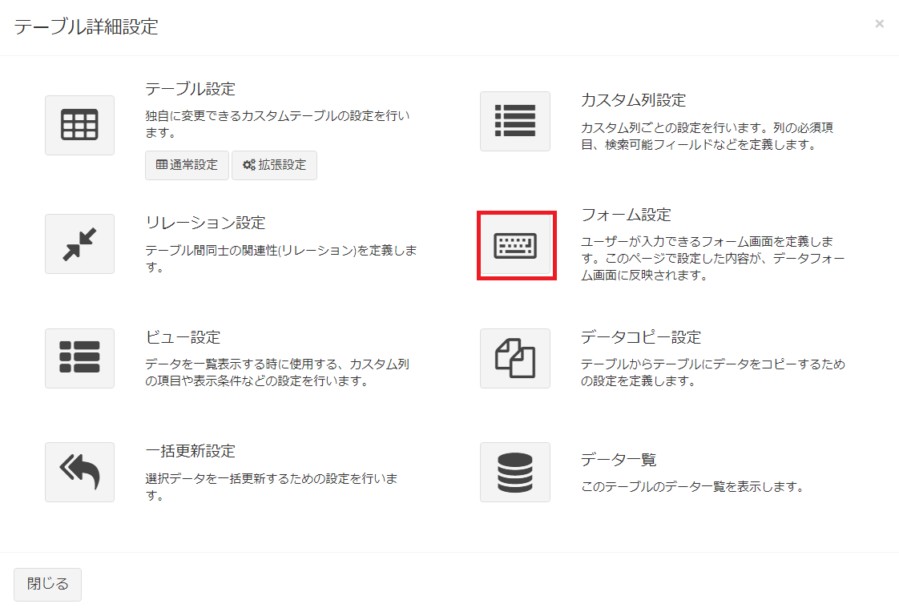
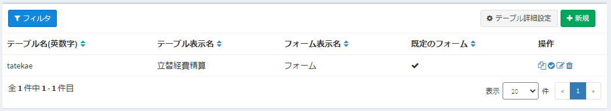

## フォーム編集
フォームの編集を行う場合は、対象フォームの［編集］リンクをクリックします。  


## カスタムフォームの設定項目


### フォーム基本設定
フォームの基本情報を入力します。

- ##### フォーム表示名
フォームの名称を入力します。  

- ##### 既定のフォーム
このフォームを、既定のフォームとして登録する場合は、YESにしてください。  
[フォーム優先順位設定](#フォーム優先順位設定)が設定されている場合はそちらが優先されます。

- ##### 詳細画面表示方法
[データ詳細画面](/ja/data_details)の項目表示方法を、この画面で設定した行・列レイアウトに合わせるか、シンプルな縦1列表示にするかを選択します。  


- ##### 見出し表示方法
各項目の見出しを、どのように表示するかを設定します。  
※フォーム全体の設定です。個別に設定する場合は、各項目の設定を変更してください。

### フォームブロック設定
フォームのブロックを設定します。  
ブロックはデータのまとまりで、基本は1テーブルにつき1つです。  
例外として、1:nのリレーション設定を行っている場合は、子テーブル側のデータも同時に入力することができます。子テーブルブロックの「使用する」をチェックして、設定を行ってください。

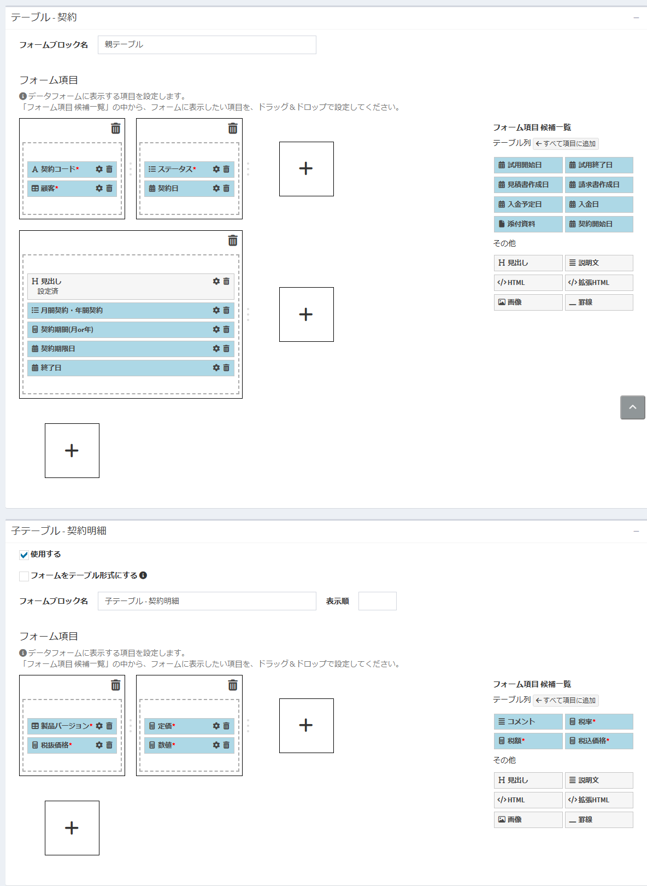

- ##### フォームブロック名  
フォームの各ブロックに表示する名称です。  
※現在、子テーブルの場合のみ表示されます。


#### フォーム項目
入力フォームに表示する項目を選択してレイアウトを行います。  
設定する項目は後述の「フォーム項目 候補一覧」から選択できます。


フォームには1～4列までのボックスを設定することができます。  
これらのボックスに、フォーム項目を配置していきます。

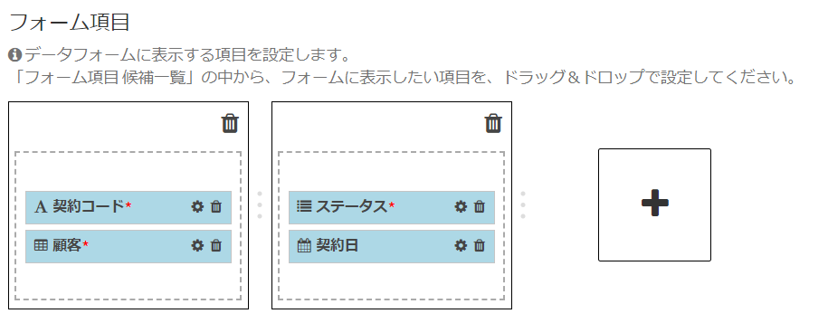

ボックスでは、以下の操作を行うことができます。  

- ボックスの隣にある「+」ボタンをクリックすると、現在の行に新しい列を追加します。  
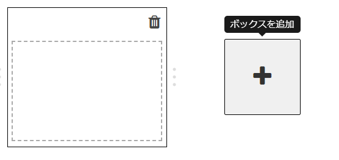

- ボックスの下にある「+」ボタンをクリックすると、新しい行を追加します。（次行がすでに存在する場合はその行に新しい列を追加します）  


- ボックスの右側の余白部分をドラッグ＆ドロップすると、ボックスのサイズを変更できます。  


- ボックスの右上にあるゴミ箱アイコンをクリックすると、ボックスを削除します。  
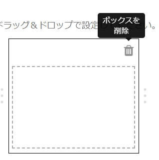

ボックスの行や列を増減したり、幅を変更したりすることで、例えば以下のようなレイアウトが作成できます。  

- 1列 - 2列
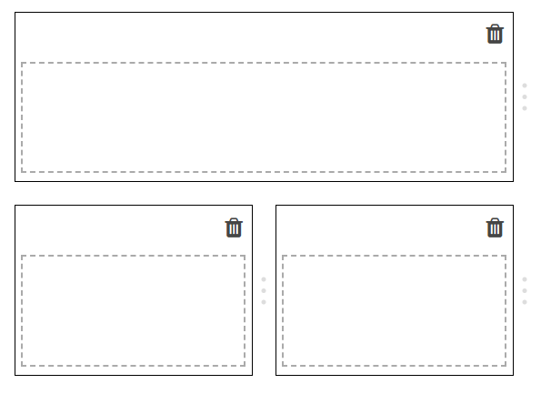

- 3列 - 1列


- 1列 - 2列 - 1列
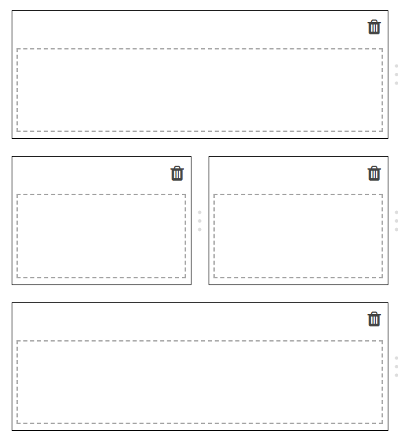


### フォーム項目 候補一覧  
フォームに追加できる項目の候補です。  
種類は「テーブル列」と「その他」の2種類があります。  


#### テーブル列  
カスタムテーブルに設定されたカスタム列の項目です。  
「フォーム項目」のボックスにドラッグ＆ドロップすることで、データフォームに配置されます。カスタム列の種類や[フォーム項目詳細](#フォーム項目詳細)の設定に応じて挙動は異なりますが、通常は項目の値を編集、または表示することができます。

#### その他  
フォームに表示する、見出しや説明文、HTML等のデータに紐づかない項目です。  
「フォーム項目」のボックスにドラッグ＆ドロップすることで、データフォームに配置されます。

- ##### 見出し：
フォームに見出し形式で表示されます。

- ##### 説明文：
フォームに説明文を表示します。HTMLは使用できません。

- ##### HTML：
フォームにHTMLを表示します。  
※スクリプトも使用できます。<span class="red">（scriptタグを入力すると、画面描写時にスクリプトが実行されますので、十分ご注意ください）</span>

- ##### 拡張HTML：
HTMLに加えて、[パラメータ](/ja/params)で指定した形式の文字列を使用できます。画面描写時に、保存済データの値で置き換えて、HTMLを作成できます。  
例：
```
<h4>ID：${id}、会社コード：${value:company_code}</h4>
```
※列の値を置き換えるのは、画面描写時のみです。データ編集画面で、対象の列の値を編集しても、連動して値は変更されませんので、ご注意ください。  
※スクリプトも使用できます。<span class="red">（scriptタグを入力すると、画面描写時にスクリプトが実行されますので、十分ご注意ください）</span>

- ##### 画像：
フォームに画像を表示します。

- ##### 罫線：
フォームに罫線を表示します。


#### フォーム項目詳細
ボックスに追加した項目は、以下のようなラベルで表示されます。  
- カスタム列の設定で必須にした項目は、名前の横に赤いマークが表示されます。  
- ラベル右側のゴミ箱アイコンをクリックすると、ボックスからその項目が削除されます。  
- ラベル右側の歯車アイコンをクリックすると、詳細設定ダイアログが表示されます。  

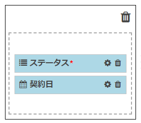


##### 見出し表示形式
各項目の見出し表示方法を、個別に設定することができます。
（フォーム全体の設定よりも優先されます）

##### フィールド種類
データフォーム画面での表示形式を設定します。

- 読み取り専用：  
チェックを行うと、ユーザーが値を変更することができません。システムや計算フィールド、[データ連動設定](#データ連動設定)からのみ、値を変更・取得することができます。  
設定すると、フォームでは以下のように、グレーアウトで表示されます。  
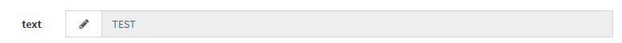  
- 表示専用：  
チェックを行うと、ユーザーが値を変更することができません。システムや計算フィールド、[データ連動設定](#データ連動設定)からも、値を変更・取得することができません。  
設定すると、フォームでは以下のように、テキストとして表示されます。  
  
- 隠しフィールド：  
チェックを行うと、項目が画面に表示されず、隠しフィールド(hidden)として追加されます。  
計算フィールド、[データ連動設定](#データ連動設定)で使用したいが、画面には表示したくない場合に、この設定を使用します。  

- 非表示：  
チェックを行うと、項目は画面に追加されません。データ保存直前に、システム内部で追加されます。  
画面に存在しないので、計算フィールドやデータ連動設定で使用することはできません。  
内部のパラメータ値など、改ざんや修正を行わせたくない項目に、この設定を使用してください。


##### データ連動設定(項目)  
[データ連動設定](#データ連動設定)を参照してください。  

##### 関連絞り込み設定(項目)  
[関連絞り込み設定](#関連絞り込み設定)を参照してください。  


## データ連動設定
フォーム内に他テーブルのデータを選択する項目がある場合に、選択したデータの内容を、関連がある別の項目にコピーできます。  
例：「契約」フォーム内の「顧客」を選択した際に、「顧客」データ内の「顧客名」の値を、「契約」フォーム内の「顧客名」にコピーする。


「契約」フォームに「顧客」選択肢と「顧客名」1行テキストがあり、  
  
 
「顧客」選択時に、 


「顧客名」テキストに、値が自動的にセットされる  

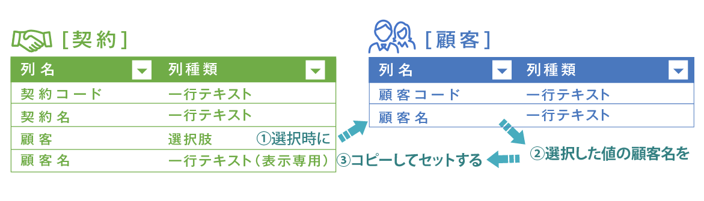
<br />  

#### 手順
- カスタムフォーム画面を開きます。  
フォーム項目の、「顧客名」の設定アイコンをクリックします。  
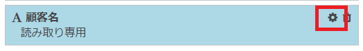

- 開いたダイアログに「データ連動設定」の項目があります。  
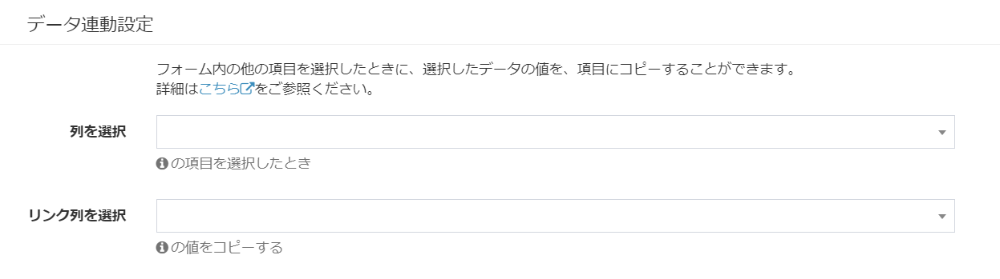

- 「列を選択」で、変更を行うトリガーとなるカスタム列を選択します。  
**※ 同じフォーム内にある、列種類が「選択肢 (他のテーブルの値一覧から選択)」、「ユーザー」、「組織」の列が選択できます。**
今回は「顧客」を選択します。  


- 「列を選択」項目を選択することで、2つ目の項目「リンク列を選択」の選択肢が表示されます。  
「列を選択」項目で選択したテーブルの、カスタム列が一覧表示されます。  
今回は「顧客名」を選択します。  


- 最後に［設定］ボタンをクリックします。  
ダイアログが閉じられ、［データ連動設定］ボタンの隣に「設定済」の文言が表示されます。  
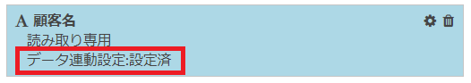

- ページ下部の［送信］ボタンをクリックして、設定を保存してください。


## 関連絞り込み設定
列種類が「選択肢 (他のテーブルの値一覧から選択)」、「ユーザー」、「組織」の場合に、同一フォーム内にある別の項目の選択に応じて、選択肢を絞り込みます。対象テーブルの親テーブルまたは参照先テーブルの列が同一フォーム内に存在する場合のみ、設定できます。  

#### 例
「顧客情報」テーブルと「担当者情報」テーブルに1:nのリレーションが設定されている、かつ「契約情報」テーブルに、「顧客」列と「担当者」列が存在する。  
「顧客」列を選択した際に、「担当者」列の選択肢候補を、選択した「顧客」を親とする担当者だけに絞り込みたい。

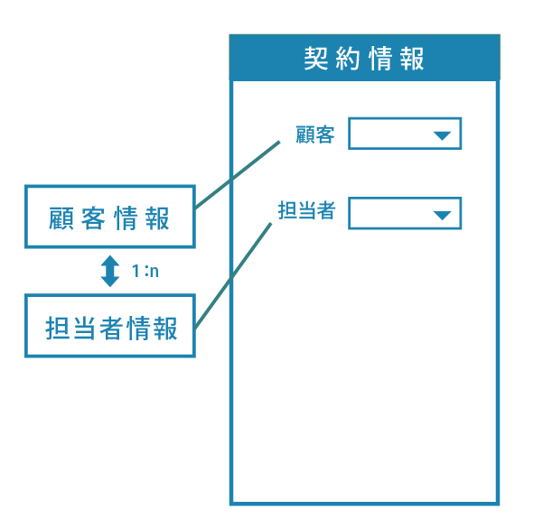  

以下のようなデータがあり、
  

契約情報画面で、
 

「顧客」で「株式会社A」を選択したら、株式会社Aに所属する担当者を選択肢候補とし、
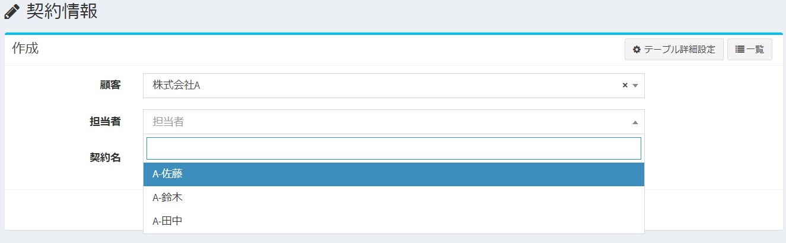  

「顧客」で「株式会社B」を選択したら、株式会社Bに所属する担当者を選択肢候補とする。
  

#### 手順
- カスタムフォーム画面を開きます。  
フォーム項目の、「担当者」列の設定アイコンをクリックします。  
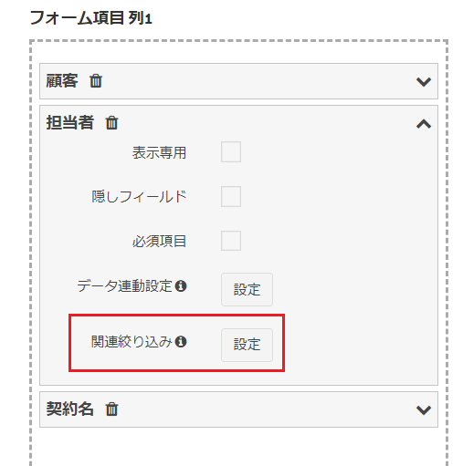

- 開いたダイアログに「関連絞り込み設定」の項目があります。  
選択肢として表示されるのは、同一フォーム内で、選択した列の親となる列一覧です。  
この例の場合、「担当者」テーブルの親テーブルとなる、「顧客」テーブル列が選択肢に表示されます。  
※「関連絞り込み設定」ボタンは、カスタム列が「選択肢 (他のテーブルの値一覧から選択)」「ユーザー」「組織」の場合に表示されます。
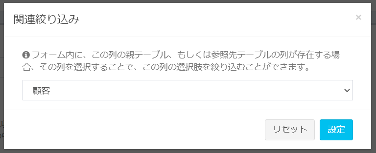

- 設定後、「設定」ボタンをクリックします。  


#### v3.3.1未満の仕様について
<span class="small">v3.3.1未満では、この設定画面が表示されず、すべての1:n親子関係・参照関係のもつフィールドで、選択肢の絞り込みを行っていました。  
その結果、時に不必要な絞り込みや予期せぬ不具合を引き起こしていたこともあり、v3.3.1にて、絞り込みの実施有無を選択できるように設定を追加しました。  
v3.3.1未満からv3.3.1以上にアップデートする際には、互換性を保つため、「すべての1:n親子関係・参照関係のもつフィールドで、選択肢の絞り込みを行う」という設定を引き継いでいます。  
アップデート時の仕様の詳細は、[こちら](/ja/patch/relation_filter)をご参照ください。</span>


## フォーム優先順位設定
条件と優先度を設定することにより、データ作成やデータ詳細画面の際に用いるフォーム画面を切り替えることができます。  

### 新規作成
フォーム優先順位設定の右にある［新規］ボタンから作成を行います。
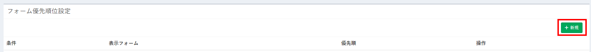

### 設定画面
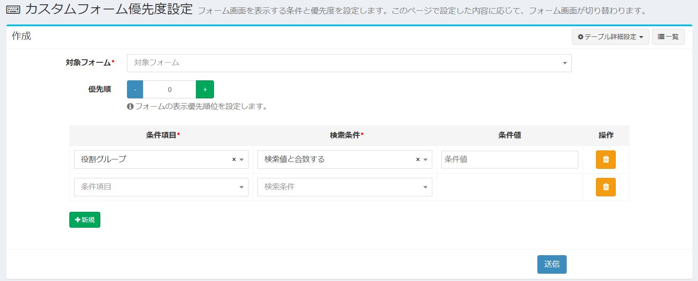

##### 対象フォーム  
条件に合致する際に表示したいフォームを選びます。

##### 優先順  
フォームの表示優先順位を設定します。
複数のフォーム表示条件に合致するデータの場合には、優先順位の高いフォームにより画面表示が行われます。

##### 条件項目  
表示条件として使用する列です。

##### 検索条件  
条件とする内容を選択します。
「条件項目」で選択した内容の種類（「日付」「ユーザー」など）によって、選択肢の項目は変更されます。

##### 条件値  
検索条件の内容に合致するための条件を入力します。

##### ［削除］ボタン  
フォームの表示条件を削除します。

##### ［新規］ボタン  
フォームの表示条件を新規追加します。