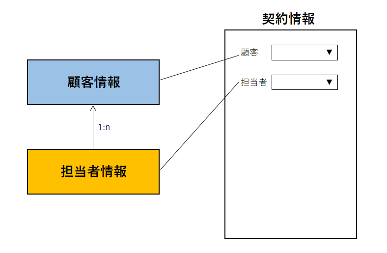

# カスタムフォーム
Exmentの[データフォーム画面](/ja/data_form.md)に表示する項目、列の行数、隠しフィールド、データ連動設定を行います。  
このカスタムフォームで設定した内容が、各テーブルの[データフォーム画面](/ja/data_form.md)に反映されます。

## ページ表示
- カスタムテーブル一覧で、設定を行いたいテーブルにチェックを1つ入れ、右上の「テーブル詳細設定」をクリックします。  

- もしくは、メニューから設定を行いたいテーブルを選択した後、同様に右上の「テーブル詳細設定」をクリックします。  
※該当のテーブルをメニューに表示する設定があらかじめ必要です。  

- 表示されたテーブル詳細設定の画面で、フォーム設定のアイコンをクリックします。


- これで、チェックしたカスタムテーブルがもつ、フォームの一覧を表示します。  
テーブルごとに1つ、既定でフォームが作成されています。

## フォーム編集
フォームの編集を行いたい場合、該当する行の［編集］リンクをクリックしてください。  


## カスタムフォームの設定項目


### フォーム基本設定
フォームの基本情報を入力します。

- ##### フォーム表示名
保存するフォームの名称を記入します。  

- ##### 既定のフォーム
このフォームを、[フォーム表示条件設定](#フォーム表示条件設定)で設定している条件に合致しない場合に使用される、既定のフォームとして登録したい場合には、YESにしてください。

- ##### 詳細画面表示方法
[データ詳細画面](/ja/data_details)で項目を表示する場合に、フォーム項目で設定した行・列を設定した通りに分けて表示するか、すべての項目を縦1列で表示するかどうかを設定してください。  


- ##### 見出し表示方法
各項目の見出しを、どのように表示するかを設定します。※フォーム全体の設定です。個別に設定する場合は、各項目の設定を変更してください。

### フォームブロック設定
フォームの各ブロックを設定します。  
ブロックは、基本的にテーブルにつき1つです。1:nのリレーション設定を行っており、子テーブル側のデータも同時に入力したい場合には、子テーブル側のブロックも、設定を行います。


- ##### フォームブロック名  
フォームの各ブロックに表示する名称です。  
※現在、子テーブルの場合のみ表示されます。


#### フォーム項目
入力フォームに表示する項目の設定です。  
後述の「フォーム項目 候補一覧」より設定した列が、データフォーム画面で表示されます。


フォーム項目は、1～4列までのボックスで表示することができます。  
これらのボックスに、各フォーム項目を設定していきます。


ボックスでは、以下の操作を行うことができます。  

- 各列の右側の「+」ボタンをクリックすることで、列を追加する。  


- 行の下の「+」ボタンをクリックすることで、行を追加する。  


- ボックスの右側の余白部分をドラッグ＆ドロップすることで、ボックスのサイズを変更する。  


- ボックスを削除する。  


また、「+」ボタンをクリックすることで、行数を追加することもできます。追加した行ごとに、個別に列数を設定することができるので、例えば以下のようなレイアウトを作成することができます。  

- 1列 - 2列


- 3列 - 1列


- 1列 - 2列 - 1列


### フォーム項目 候補一覧  
フォームに追加できる項目の候補です。  
種類は「テーブル列」と「その他」の2種類あります。  

#### テーブル列  
追加・編集するデータの、値の項目になります。  
「フォーム項目」のボックスにドラッグ＆ドロップすることで、データフォームを表示時に、その項目の値を編集、または表示することができます。

#### その他  
フォームに単に表示する、見出しや説明文、HTMLになります。
「フォーム項目」のボックスにドラッグ＆ドロップすることで、データフォームを表示時に、その項目の値を表示することができます。

- ##### 見出し：
フォームに見出し形式で表示します。

- ##### 説明文：
フォームに説明文を表示します。HTMLは使用できません。

- ##### HTML：
フォームにHTMLを表示します。また、スクリプトも使用できます。<span class="red">※scriptタグを入力すると、画面描写時にスクリプトが実行されますので、十分ご注意ください。</span>

- ##### 拡張HTML：
フォームに、HTMLに加え、[パラメータ](/ja/params)で指定した形式の文字列を使用できます。画面描写時に、データに登録された列の値で置き換えて、HTMLを作成できます。  
例：
```
<h4>ID：${id}、会社コード：${value:company_code}</h4>
```
※列の値を用いるのは、画面描写時のみです。データ編集画面で、対象の列の値を編集しても、連動して値は変更されませんので、ご了承ください。  
※スクリプトも利用できます。<span class="red">※scriptタグを入力すると、画面描写時にスクリプトが実行されますので、十分ご注意ください。</span>

- ##### 画像：
フォームに画像を表示します。

- ##### 罫線：
フォームに罫線を表示します。


#### フォーム項目詳細
各フォーム項目のボックスに項目を追加した後、
右にある歯車をクリックすることにより、ダイアログで設定が表示されます。  
カスタム列として必須としている項目には、項目名に赤いマークが表示されます。  
ゴミ箱のアイコンをクリックすることで、フォーム項目一覧から、その項目を削除します。  


##### 見出し表示形式
各項目の見出し表示方法を、個別に設定することができます。


##### フィールド種類
画面への表示方式を設定します。

- 読み取り専用：  
チェックを行うと、ユーザーが内容を入力することができず、システムや計算フィールド、データ連動設定（下記）でのみ、値を変更・取得することができます。  
設定すると、フォームでは以下のように、グレーアウトで表示されます。  
  
- 表示専用：  
チェックを行うと、ユーザーが内容を入力することができず、またシステムや計算フィールド、データ連動設定（下記）でも、値を変更・取得することができません。  
設定すると、フォームでは以下のように、テキストとして表示されます。  
  
- 隠しフィールド：  
チェックを行うと、項目が画面から表示されず、隠しフィールド(hidden)として追加されます。  
計算フィールドがある場合や、データ連動設定（下記）の場合、フォームに追加することが必要になりますので、隠しフィールドとして設定してください。  


##### データ連動設定(項目)  
[データ連動設定](#データ連動設定)を参照してください。  

##### 関連絞り込み設定(項目)  
[関連絞り込み設定](#関連絞り込み設定)を参照してください。  


## データ連動設定
フォーム内の他の項目を選択したときに、選択したデータの値を、項目にコピーすることができます。  
例：「契約」フォーム内の項目「顧客」選択肢を選択時に、「顧客」データ内の「顧客名」項目の値を、「契約」フォーム内の「対象顧客名」項目にコピーするための手順


「契約」フォームに「顧客」選択肢と「顧客名」1行テキストがあり、  
  
 
「顧客」選択時に、 

>選択肢として一覧に表示される文言は、[見出し表示列設定](/ja/table#見出し表示列設定)で変更できます。  


「顧客名」テキストに、値が自動的にセットする  


<br />  

#### 手順
- カスタムフォーム画面を開きます。  
フォーム項目の、「顧客名」の設定アイコンをクリックします。  


- 開いたダイアログに「データ連動設定」の項目があります。  


- 「列を選択」で、変更を行うトリガーとなる列を選択します。  
**※この項目の選択肢は、同じフォーム内で、列種類が「選択肢 (他のテーブルの値一覧から選択)」、「ユーザー」、「組織」である列の一覧です。**
今回は「顧客」を選択します。  


- 「列を選択」項目を選択することで、2つ目の項目「リンク列を選択」の選択肢が表示されます。  
「列を選択」項目で選択したテーブルの、列一覧が表示されます。  
今回は「顧客名」を選択します。  


- 設定後、［設定］ボタンをクリックします。  
ダイアログが閉じられ、［データ連動設定］ボタンの隣に「設定済」が表示されます。  


- ページ下部の［送信］ボタンをクリックし、設定を完了してください。


## 関連絞り込み設定
フォーム内に、親テーブルもしくは参照先テーブルの列が存在する場合、その列を選択することで、この列の選択肢を絞り込むことができます。  

#### 例
「顧客情報」テーブルと「担当者情報」テーブルが1:nリレーション設定されており、「契約情報」テーブルで、「顧客」列と「担当者」列が両方とも含まれている。  
かつ、「顧客」列を選択時に、「担当者」列の選択肢候補を、選択した「顧客」を親とする担当者のみに絞り込みたい場合。

  

以下のようなデータがあり、
  

契約情報画面で、
 

「顧客」で「株式会社A」を選択したら、株式会社Aに所属する担当者を選択肢候補とし、
  

「顧客」で「株式会社B」を選択したら、株式会社Bに所属する担当者を選択肢候補とする。
  

#### 手順
- カスタムフォーム画面を開きます。  
フォーム項目の、「担当者」列の込み設定アイコンをクリックします。  


- 開いたダイアログに「関連絞り込み設定」の項目があります。  
選択肢として表示されるのは、同一フォーム内で、選択した列の親となる列一覧です。  
例の場合、「担当者」テーブルの親テーブルとなる、「顧客」テーブル列が選択肢に表示されます。  
※「関連絞り込み設定」ボタンは、カスタム列が「選択肢 (他のテーブルの値一覧から選択)」「ユーザー」「組織」の場合に表示されます。


- 設定後、「設定」ボタンをクリックします。  


#### v3.3.1未満の仕様について
<span class="small">v3.3.1未満では、この設定画面が表示されず、すべての1:n親子関係・参照関係のもつフィールドで、選択肢の絞り込みを行っていました。  
この絞り込みは時に、望まぬ絞り込みや、予期せぬ不具合を引き起こしていたこともあり、v3.3.1にて、絞り込み実施を選択する設定を追加しました。  
v3.3.1未満からv3.3.1以上にアップデートする際には、互換性を保つため、「すべての1:n親子関係・参照関係のもつフィールドで、選択肢の絞り込みを行う」という設定は継続します。  
アップデート時の仕様の詳細は、[こちら](/ja/patch/relation_filter)をご参照ください。</span>


## フォーム表示条件設定
条件と優先度を設定することにより、データ作成やデータ詳細画面の際に用いるフォーム画面を切り替えることができます。  

### 新規作成
フォーム表示条件設定の右にある［新規］ボタンから作成を行います。


### 設定画面


##### 対象フォーム  
条件に合致する際に表示したいフォームを選びます。

##### 優先順  
フォームの表示優先順位を設定します。
複数のフォーム表示条件に合致するデータの場合には、優先順位の高いフォームにより画面表示が行われます。

##### 条件項目  
表示条件として使用する列です。

##### 検索条件  
条件とする内容を選択します。
「条件項目」で選択した内容の種類（「日付」「ユーザー」など）によって、選択肢の項目は変更されます。

##### 条件値  
検索条件の内容に合致するための条件を入力します。

##### ［削除］ボタン  
フォームの表示条件を削除します。

##### ［新規］ボタン  
フォームの表示条件を新規追加します。