# Windows Server による環境構築
本ページでは、Windows Server上の IIS でExmentを構築する手順を記載します。  
Webサーバーのインストールをはじめとして、完全に新規にインストールを行う手順となります。

## 環境
本ページでは、以下の内容で構築を行っております。  
- Windows Server 2019 Standard 日本語版
- IIS 10
- PHP 8.2.X
- MySQL 8.0.35

検証用途で Windows 10 を利用される場合については適宜注記しています。

## 注意点

- ご利用の環境やバージョンなどにより、本手順では正常に設定できない場合がございます。ご了承ください。

- 本手順では、Exmentを Windows Serverで動作させるための手順のみの記載となります。  
Windows Server の管理やデータベース作成、コマンドなど、一般的なIT系のナレッジについては記載致しておりません。ご了承ください。  

- **本手順の実行では管理者権限が必要となります。必要に応じてコマンドプロンプトや PowerShell、実行ファイルを「管理者として実行」（またはユーザーアカウント制御で昇格）してください。**

## Windows Server によるインストール手順

> 作業を始める前に、Windows Server のエクスプローラーで「ファイル名拡張子」を表示する設定にされることをお勧めします

### Webサーバー（IIS）のインストール
サーバーで IIS の機能が有効になっていなければ、まず IIS の機能をインストールします。
1. サーバー マネージャーの \[管理\] から \[役割と機能の追加\] ウィザードを開きます  
   
2. \[インストールの種類\] は「役割ベースまたは機能ベースのインストール」を選択して、\[サーバーの選択\] は IIS をインストールするサーバー（通常は作業しているサーバー）を選択して進めます。
3. \[サーバーの役割\] では「Web サーバー(IIS)」を選択し、表示される機能の追加も行います  
   
4. \[機能の選択\]・\[Web サーバーの役割 (IIS)\] の画面はそのまま次に進めます
5. \[役割サービスの選択\] で \[アプリケーション開発\] を展開し、「CGI」にチェックを入れて、次に進みます  
   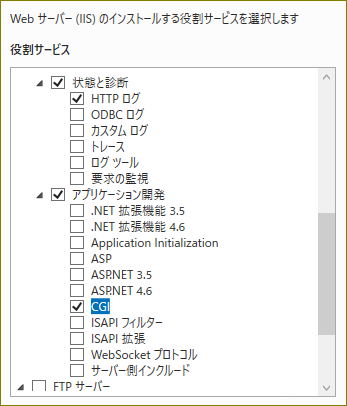  
   その他の役割（認証や圧縮など）は必要に応じて役割を追加してください（Exment 自体の動作には追加の必要はありません）
7. \[インストール オプションの確認\] で「インストール」をクリックし、インストールが完了するのを待ちます
8. インストールが完了したらブラウザー (Internet Explorer など) を起動し、http://localhost にアクセスして IIS の既定のページが表示できることを確認します

> Windows 10 にインストールする場合は、\[コントロール パネル\] - \[プログラム\] -\[プログラムと機能\] - \[Windows の機能の有効化または無効化] で「インターネット インフォメーション サービス」を有効にし、\[アプリケーション開発機能\] で「CGI」を有効にしてください。

### PHP の準備
PHP をダウンロードし、インストールします
1. https://windows.php.net/download/ にアクセスします
2. \[PHP 8.2\] の \[VC15 x64 Non Thread Safe\] の ZIP ファイルをダウンロードします  
   > Windows 10 環境で 32 ビット版 Windows を利用している場合は、\[VC15 x86 Non Thread Safe \] の ZIP ファイルをダウンロードしてください
3. ダウンロードした ZIP ファイルを右クリックしてプロパティを表示し、\[全般\] タブの\[セキュリティ\] にある「ブロックの解除」にチェックを入れて \[OK\] をクリックします  
   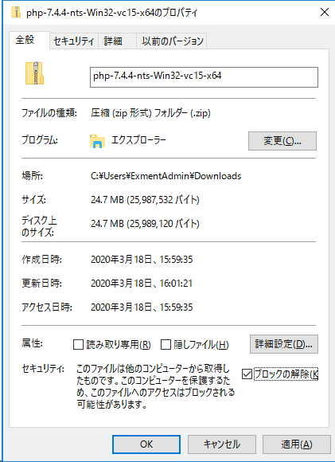
4. ZIP ファイルの内容を適当なフォルダー（例 C:\PHP）に展開します
5. PHP を実行するための環境変数を設定します  
   \[ファイル名を指定して実行\] で sysdm.cpl を実行し、\[システムのプロパティ\] を表示します
6. \[詳細設定\] タブで \[環境変数\] を開きます  
   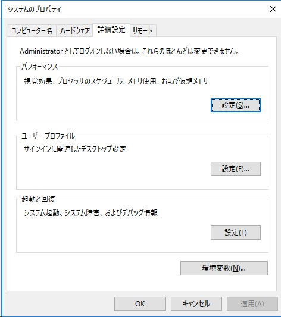
7. \[システム環境変数\] の一覧から変数名 "Path" の項目を見つけて選択します  
   
8. \[編集\] をクリックし、\[新規\] をクリックします  
   
9.  PHP を展開したフォルダーのパス（例 C:\PHP）を入力して \[OK\] を3回クリックします  
    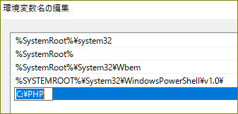
10. コマンドプロンプトで  
    ```
    set path
    ```
    を実行し、PHP のフォルダーにパスが通っていることを確認してください
11. PHP の設定ファイルを作成します  
    PHP を展開したフォルダー内の 「php.ini-development」ファイルをコピーして php.ini ファイルを作成します
12. php.ini ファイルを編集して保存します
    1.  "Paths and Directories" セクションの  
        ```
        ;extension_dir = "ext"
        ```
        を
        ```
        extension_dir = "PHP を展開したフォルダーのパス\ext" (例 extension_dir = "C:\PHP\ext")
        ```
        に変更 (行頭の ; を取ってコメントを外します)
    2. "Dynamic Extension" セクションの
        ```
        ;extension=gd
        ;extension=openssl
        ;extension=pdo_mysql
        ```
        を
        ```
        extension=gd
        extension=openssl
        extension=pdo_mysql
        ```
        に変更 (行頭の ; を取ってコメントを外します)
    3.  "File Uploads" セクションの  
        ```
        ;upload_tmp_dir=
        ```
        を
        ```
        upload_tmp_dir = "任意の作業用フォルダのパス" (例 upload_tmp_dir = "C:\Temp")
        ```
        に変更 (行頭の ; を取ってコメントを外します)  
        ※指定したフォルダはファイルアップロード時の一時的な保管場所になります。
    4. ファイルの末尾に、以下の記述を追加します。
        ```
        extension=php_fileinfo.dll
        ```

13. コマンドプロンプトで以下のコマンドを実行し、PHP が動作することを確認します  
    ```
    php -v
    ```
    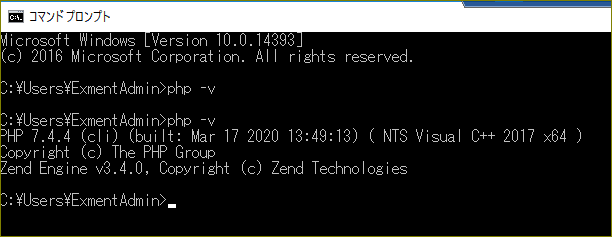

    Visual C++ 14.0 ランタイムが見つからないというエラーになる場合は、[最新のサポートされる Visual C++ のダウンロード
](https://support.microsoft.com/ja-jp/help/2977003/the-latest-supported-visual-c-downloads) からVisual Studio 2015、2017 および 2019 用の Visual C++ 再頒布可能パッケージ (vc_redist.x64.exe) をダウンロード・インストールしてください  
    

### MySQL のインストール
Exment で利用する MySQL をインストールして初期構成します  
ここでは MySQL 8.0.35 をインストールしています

1. [MySQL Community Downloads](https://dev.mysql.com/downloads/mysql/) のページにアクセスします
2. \[General Availability (GA) Releases\] をクリックします  
   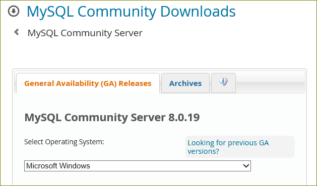
3. \[Select Version\] で "8.0.35" を選択し、\[Select Operating System\] で "Microsoft Windows" を選択し、\[Select OS Version\] で "Windows (x86, 64bit)" を選択します
   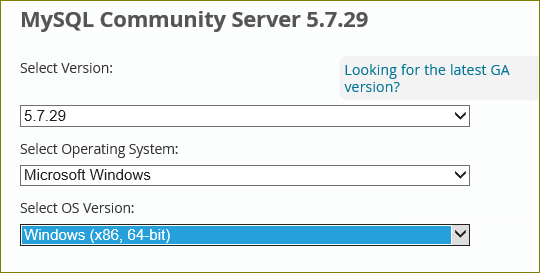  
   > Windows 10 環境で 32 ビット版 Windows を利用している場合は、\[Select OS Version\] で "Windows (x86, 32bit)" を選択してください
4. \[Other Downloads\] の "ZIP Archive" の欄の \[Download\] ボタンをクリックし、mysql-8.0.35-winx64.zip ファイルをダウンロードします
   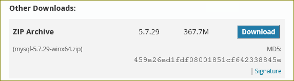
5. \[Login Now or Sign Up for a free account.\] が表示されたら、一番下の \[No thanks, just start my download.\] をクリックします。ダウンロードが開始されます
6. ダウンロードした ZIP ファイルを右クリックしてプロパティを表示し、\[全般\] タブの\[セキュリティ\] にある「ブロックの解除」にチェックを入れて \[OK\] をクリックします  
   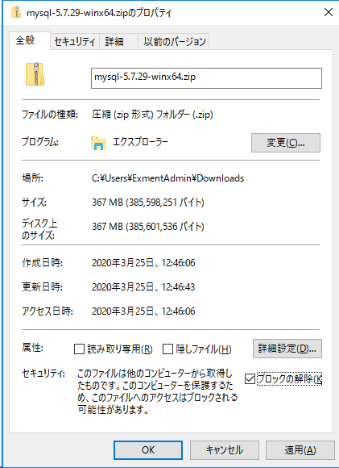
7. ZIP ファイルの内容を適当なフォルダー（例 C:\MySQL）に展開します
8. 管理者コマンドプロンプトを起動し、ZIP ファイルを展開したフォルダー内の mysql-8.0.35-winx64\bin フォルダーに移動します
   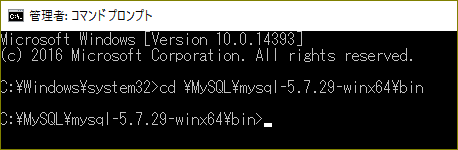
9.  以下のコマンドを実行して MySQL の初期化を行います
    ```
    mysqld --initialize
    ```
    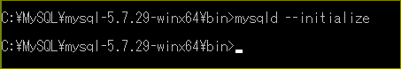

    Visual C++ 12.0 ランタイムが見つからないというエラーになる場合は、[最新のサポートされる Visual C++ のダウンロード
](https://support.microsoft.com/ja-jp/help/2977003/the-latest-supported-visual-c-downloads) を参照して、\[Update for Visual C++ 2013 Redistributable Package\](https://support.microsoft.com/ja-jp/help/4032938/update-for-visual-c-2013-redistributable-package) から日本語版 (Japanese) の Visual Studio 2013 用 Microsoft Visual C++ 再頒布可能パッケージ (vc_redist.x64.exe) をダウンロード・インストールしてください  
    
10. 以下のコマンドを実行して MySQL の起動を確認します。"mysqld: ready for connections." が表示されれば正しく起動できています
    ```
    mysqld --console
    ```
    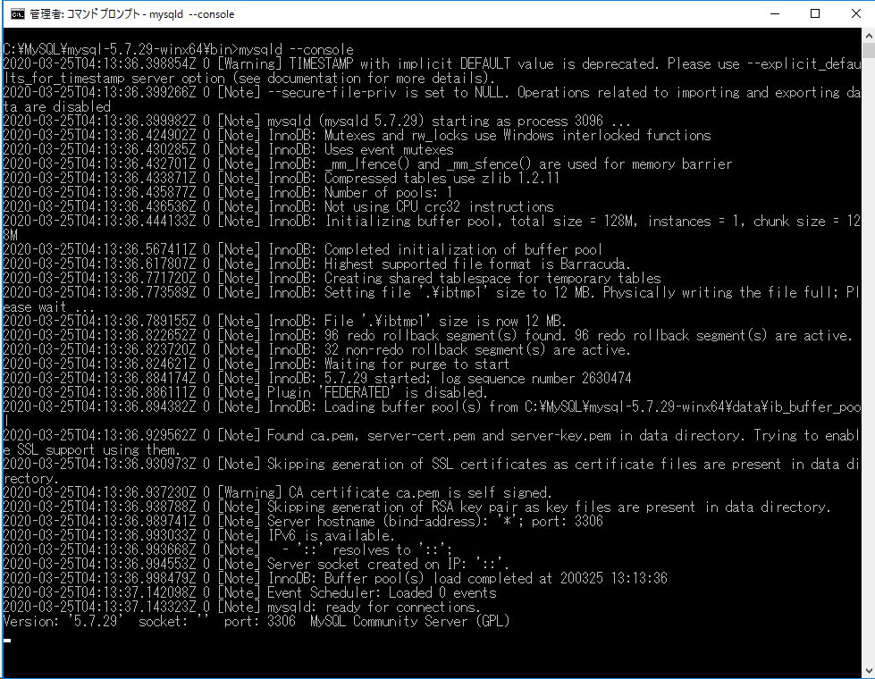
11. Ctrl + C を押して MySQL をいったん停止します
12. MySQL を Windows のサービスとしてインストールします。サービスとしてインストールすることで、Windows の起動時に自動的に MySQL が実行されます
    ```
    mysqld --install
    ```
    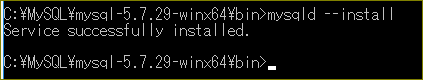
13. すぐに MySQL を起動するため、以下のコマンドを実行します
    ```
    net start mysql
    ```
    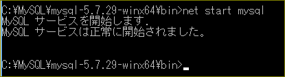
14. MySQL を利用するための管理者 (root) パスワードの初期値を確認します  
    MySQL を展開したフォルダーが C:\MySQL の場合、C:\MySQL\mysql-8.0.35-winx64\data に拡張子が .err のファイルがありますので、これをメモ帳などのテキスト エディタで開きます  
    > 下図の場合は ExmentServer2.err というファイル名です  
    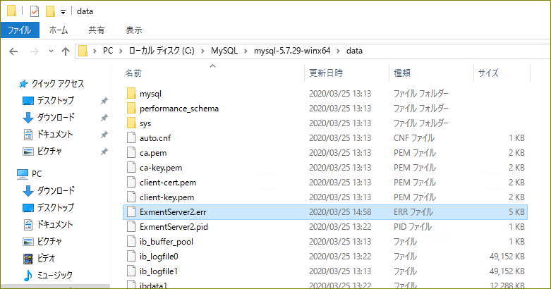
15. ファイルの先頭近くに "\[Note\] A temporary password is generated for root@localhost:" と書かれた行があります (下図の赤下線)。この後に書かれている文字列 (下図では 1fyr*IXeC2%w) が初期パスワードです。このパスワードを控えておいてください
    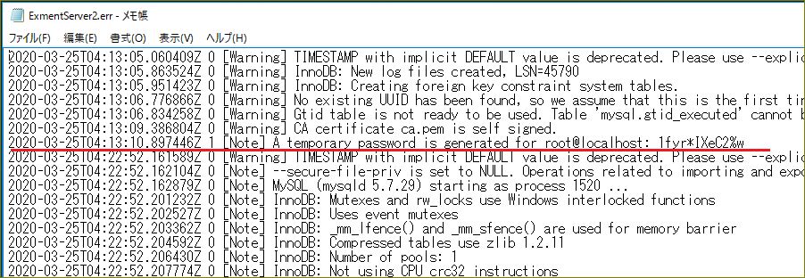
16. 管理者コマンドプロンプトに戻り、以下のコマンドを実行して MySQL の初期設定を行います
    ```
    mysql_secure_installation
    ```
    1. "Enter password for user root:" と尋ねられるので、控えておいた初期パスワードを入力して Enter を押します
    2. "The existing password for the user account root has expired. Please set a new password." と表示されます  
       "New password:" と新しいパスワードを尋ねられますので、新しいパスワードを入力して Enter を押し、"Re-enter new password: と確認されるので、もう一度新しいパスワードを入力して Enter を押します
       > パスワードは強力で推測されにくいものを使用してください。8文字以上・大文字/小文字/数字/記号のうち3種以上を使用・辞書にあるような単語をすのもも使わない、の要件を満たすことをお勧めします
    3. VALIDATE PASSWORD PLUGIN を利用するか確認されます  
       強力で推測されにくいパスワードを設定した場合は、"y" 以外のキーを入力して Enter を押します
    4. "Change the password for root ?" と尋ねられるので、"y" 以外のキーを入力して Enter を押します
    5. 残りの確認にはすべて "y" を入力して Enter を押します
    6. "All done!" と表示されたら初期設定完了です
17. 以下のコマンドを実行し、MySQL にログインします
    ```
    mysql -u root -p
    ```
18. "Enter password:" とパスワードを尋ねられるので、先ほど設定したパスワードを入力して Enter を押します
    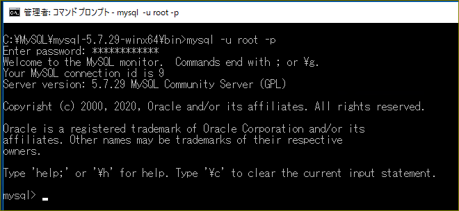
19. "MySQL>" プロンプトが表示されたら、以下のコマンドを順に実行します
    > ここでは Exment で利用する MySQL ユーザーを "exment_user"、そのパスワードを "M!p3~S$W7fLm" としています  
      実際のユーザー名・パスワードはご自身で決めてください (パスワードは強力で推測されにくいものを使用してください)  
      このユーザー名とパスワードは、Exment の初期設定で利用します
    ```
    CREATE DATABASE exment_database;
    CREATE USER 'exment_user' IDENTIFIED BY 'M!p3~S$W7fLm';
    GRANT ALL ON exment_database.* TO exment_user identified by 'M!p3~S$W7fLm';
    FLUSH PRIVILEGES;
    ```
20. 以下のように入力して Enter を押し、MySQL からログアウトします
    ```
    \q
    ```

### IIS の準備
Exment を実行するための IIS の準備を行います
1. URL Rewite モジュールを導入します。  
   https://www.iis.net/downloads/microsoft/url-rewrite にアクセスし、\[Install this extention\] をクリックします
2. urlrewrite2.exe がダウンロードされるので実行し、画面のガイダンスにしたがってインストールします
   1. \[インストール\] をクリックします  
      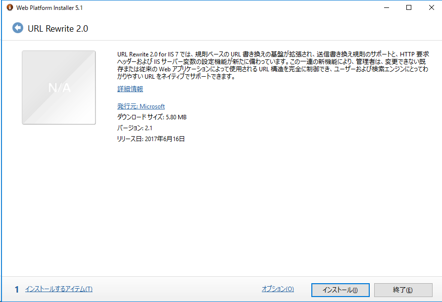
   2.  \[同意する\] をクリックします  
      
   3.  インストールが開始されます  
      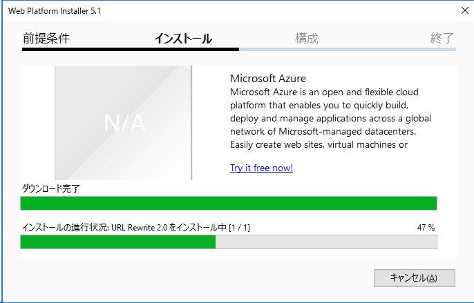
   4.  \[完了\] をクリックします  
      
   5.  \[終了\] をクリックします  
      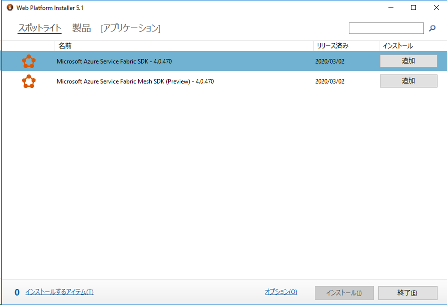
3. サーバー マネージャーの \[ツール\] から \[インターネット インフォメーション サービス (IIS) マネージャー\] を開きます  
   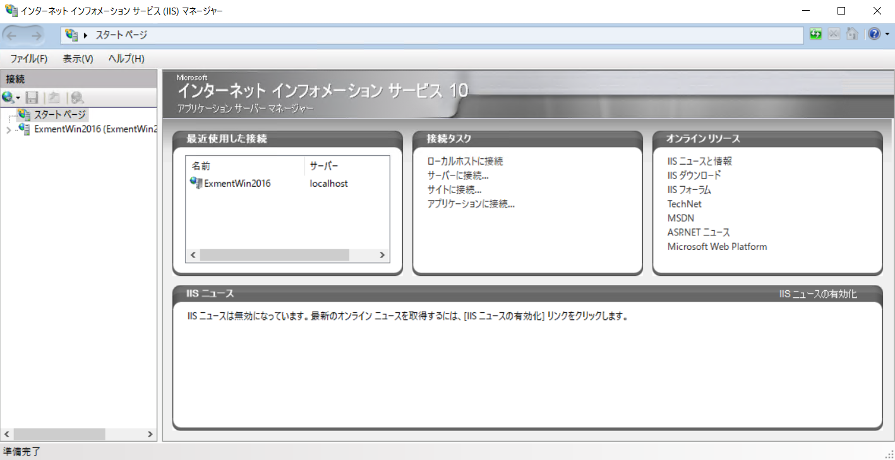
4. 接続ペインで \[(サーバー名)\] - \[サイト\] と展開し、\[Default Web Site\] を選択します
5. 機能ビューで \[ハンドラー マッピング\] をダブルクリックします
6. 操作ペインで \[モジュール マップの追加\] をクリックします
7. \[モジュール マップの追加\] に以下のように入力して \[OK\] をクリックします  
   - 要求パス：*.php  
   - モジュール：FastCgiModule  
   - 実行可能ファイル：(PHPを展開したフォルダーのパス)\php-cgi.exe (例 C:\PHP\php-cgi.exe)  
   - 名前：任意 (例：PHP)  
   
8. 確認メッセージが表示されたら \[はい\] をクリックします

### Composer のインストール
Exment で必要となる PHP ライブラリー管理ツール (Composer) をインストールします
1. [Composer のダウンロードページ (https://getcomposer.org/download/)](https://getcomposer.org/download/) にアクセスし、"Download and run Composer-Setup.exe - it will install the latest composer version whenever it is executed" と書かれている部分から Composer-Setup.exe をダウンロードします  
   
2.  ダウンロードした Composer-Setup.exe を実行します
3.  "Install for all users" を選択します  
   
4.  "Developer Mode" にチェックを入れず、次に進みます  
   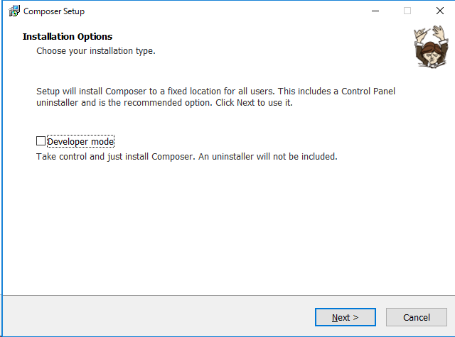
5. "Setting Check" で表示されている PHP のパスが正しいことを確認し、次に進みます  
   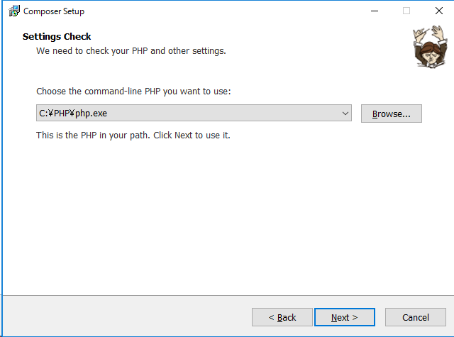
6. "PHP Configration Error" が表示されたら、\[Create a php,ini file\] または \[Update this php.ini\] にチェックを入れて次に進みます  
   
7. "Proxy Settings" では、インターネット接続で使用するプロキシを指定します。プロキシを使用していない場合はそのまま次に進みます  
   
8. 確認画面が表示されるので、\[Install\] をクリックします  
   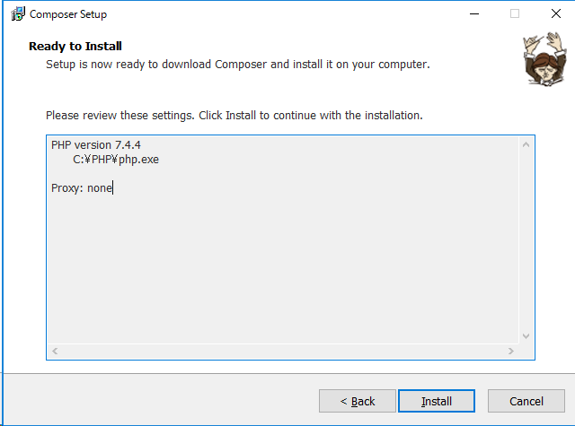
9. "Information" が表示されたらそのまま次に進みます  
    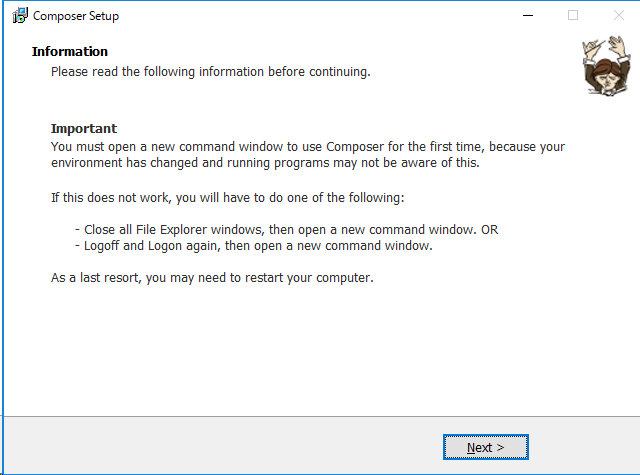
10. \[Finish\] をクリックして完了します  
    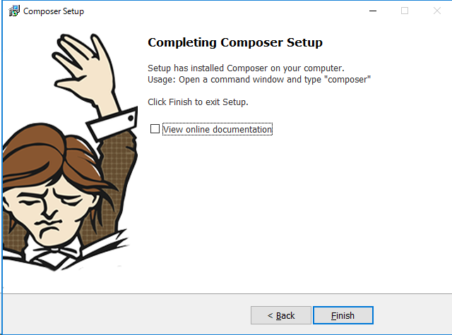

### Exment のダウンロードと実行準備

1. Exment のインストール手順のページ ([https://exment.net/docs/#/ja/quickstart](https://exment.net/docs/#/ja/quickstart)) から Exment zipファイル (exment.zip) をダウンロードします
2. ダウンロードした ZIP ファイルを右クリックしてプロパティを表示し、\[全般\] タブの\[セキュリティ\] にある「ブロックの解除」にチェックを入れて \[OK\] をクリックします  
   
3. ZIP ファイル内の exment フォルダーの内容を適当なフォルダー（例 C:\exment）に展開します  
   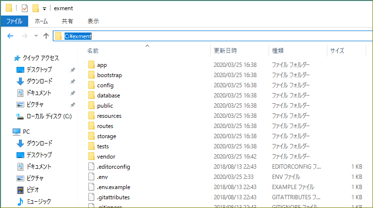  
   **決して「inetpub\wwwroot」フォルダ直下には展開を行わないでください。データベースの設定値や、メールのパスワードなどが記載された設置ファイルなどが外部公開され、致命的な情報流出に繋がります**
4. 仮想ディレクトリを作成します  
   インターネット インフォメーション サービス (IIS) マネージャーを開き、\[接続\] ペインで \[(サーバー名)\] - \[サイト\] と展開し、\[Default Web Site\] を右クリックして \[仮想ディレクトリの追加\] を選択します  
   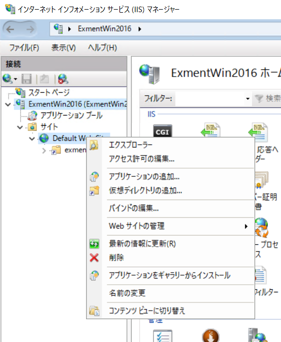
5. 以下のように仮想ディレクトリを構成します  
   例ではエイリアス (Exment にアクセスするための URL のパス) を "exment" としています  
   物理パスには Exment の ZIP ファイルを展開したフォルダーのパス (例 C:\exment) を設定します
   - エイリアス： exment  
   - 物理パス：C:\Exment\public  
   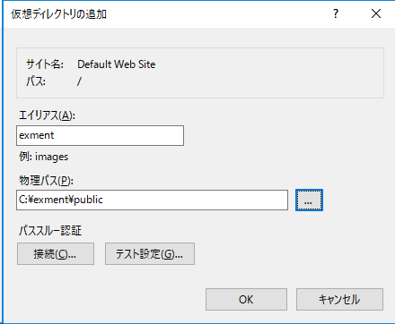
6. "index.php" を既定のファイルに追加します  
   \[Default Web Site\] を選択し、\[既定のドキュメント\]をダブルクリックで開きます  
   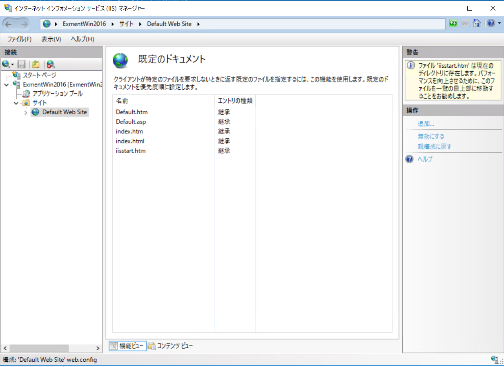
7. \[操作\] ペインで \[追加\] をクリックします
8. index.php を追加します  
   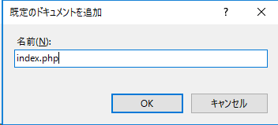
9.  Web.config に URL 置き換え (Rewrite) のルールを追加します  
   \[接続\] ペインで「4.」で追加した仮想ディレクトリ (例では exment) 選択し、\[URL書き換え\] をダブルクリックで開きます  
   
10. \[操作\] ペインで \[規則の追加\] をクリックします  
   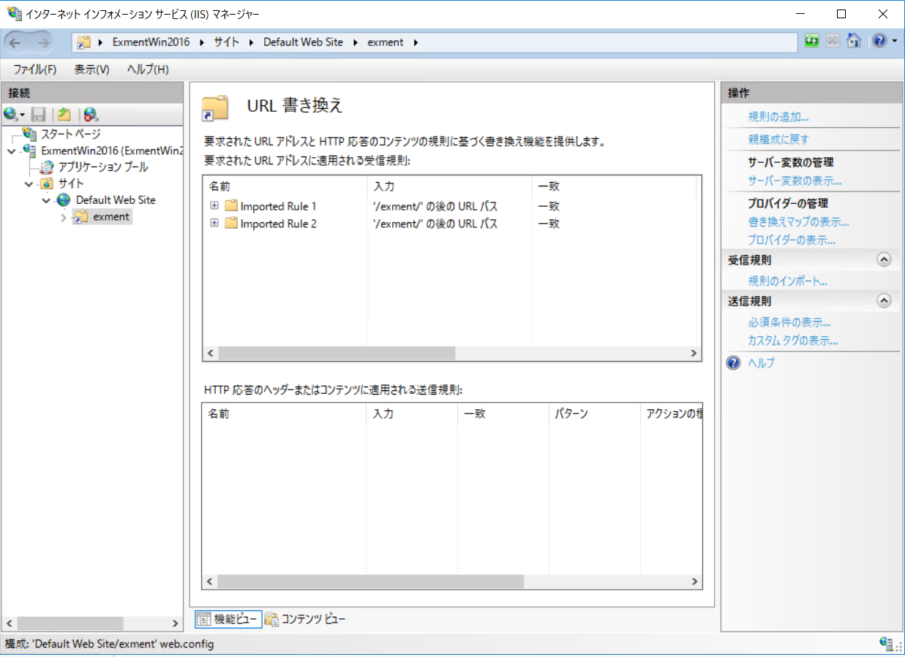
11. \[規則の追加\] で \[受信規則\] の \[空の規則\] を選択して \[OK\] をクリックします  
   
12. \[受信規則の編集\] で以下のように規則を作成します  
    
    - 名前：任意の名前
    - \[URLの一致\]
      - 要求された URL：パターンに一致する
      - 使用：正規表現
      - パターン：(.*)$
    - 条件
      - 論理グループ：すべて一致
      - \[追加\] をクリックして以下の2つの条件を追加
        - 入力：{REQUEST_FILENAME}  
        種類：ファイルではない
        - 入力：{REQUEST_FILENAME}  
        種類：ディレクトリではない
    - アクション
      - アクションの種類：書き換え
      - アクションのプロパティ
      - URL の置き換え：index.php/{R:1}
      - クエリ文字列の追加：ON
      - 書き換えられた文字列を記録する：OFF
    - 後続の規則の処理を停止する：ON
13. \[操作\] ペインで \[適用\] をクリックします
14. 「変更内容は正常に保存されました」と表示されたら \[規則に戻る\] をクリックします

<!-- この後の手順要確認 -->

15. Laravel から書き込みできるよう、フォルダーのアクセス権を設定します
    Exment の ZIP を展開して仮想ディレクトリを構成したフォルダーに、IIS の実行ユーザー (IIS_IUSRS) の書き込み権限を与えます  
    > 例では C:\exment
    
    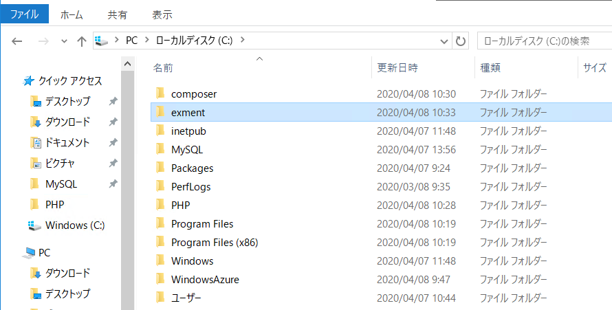

16. IIS 実行ユーザー (IIS_IUSRS) に exment フォルダーに対する書き込みアクセス権限を追加します
    1. exment フォルダーを右クリックし、\[プロパティ\] を選択します
    2. \[セキュリティ\] タブを開き、\[編集\] をクリックします
    3. \[storage のアクセス許可\] で \[追加\] ボタンをクリックし、\[ユーザーまたはグループの選択\] を表示します
    4. \[選択するオブジェクト名を入力してください\] 欄に IIS_IUSRS と入力し、\[名前の確認\] をクリックします
    5. 表示が (コンピュータ名)\IIS_IUSRS に変わったら、\[OK\] をクリックします  
       
    6. \[exment のアクセス許可\] に戻るので、\[グループ名またはユーザー名\] 欄で IIS_IUSRS をクリックし、\[アクセス許可\] 欄の \[書き込み\] の \[許可\] にチェックを入れます  
    
    1. \[OK\] を2回クリックしてプロパティを閉じます

<!--
実際には storage フォルダーだけでなく exment フォルダー内の他のファイルやフォルダーに対しても IIS_IUSRS の書き込み権限が必要のようです。
実際にどのリソースにどれだけの権限が最低限必要なのか分からないので、テスト環境では C:\exment フォルダー全体に IIS_IUSRS の書き込み権限を付けて、Exment の Web アプリが動作することを確認しています。
最低限のアクセス権が分かれば、ここの部分はそれに併せて改定します。

14. Laravel から書き込みできるよう、フォルダーのアクセス権を設定します
    > Exment の ZIP を展開して仮想ディレクトリを構成したフォルダー (例 C:\exment) に、IIS の実行ユーザー (IIS_IUSRS) の書き込み権限を与えます
15. アクセス権限を構成します
    1. exment フォルダーを右クリックし、\[プロパティ\] を選択します
    2. \[セキュリティ\] タブを開き、\[編集\] をクリックします
    3. \[exment のアクセス許可\] で \[追加\] ボタンをクリックし、\[ユーザーまたはグループの選択\] を表示します
    4. \[選択するオブジェクト名を入力してください\] 欄に IIS_IUSRS と入力し、\[名前の確認\] をクリックします
    5. 表示が (コンピュータ名)\IIS_IUSRS に変わったら、\[OK\] をクリックします  
    6. \[exment のアクセス許可\] に戻るので、\[グループ名またはユーザー名\] 欄で IIS_IUSRS をクリックし、\[アクセス許可\] 欄の \[書き込み\] の \[許可\] にチェックを入れます  
    7. \[OK\] を2回クリックしてプロパティを閉じます
-->

17.  ブラウザ (Chrome または Microsoft Edge) を起動し、http://localhost/(仮想ディレクトリのエイリアス)/admin にアクセスします (例 http://localhost/exment/admin)  
    Exment のインストール ページが表示されます。
> Exment は Internet Explorer での表示に対応していません。Exment へのアクセスには Chrome または Microsoft Edge を利用してください

   1. Languageが\[日本語\] 、Timezoneが\[(GMT+09:00)日本\]になっていることを確認し、\[subumit\] をクリックします
   

   2. 作成済のデータベースに関する設定を入力し\[送信\]をクリックします
   > 例では、<br />データベース\[exment_database\] <br />ユーザー名\[exment_user\] <br />パスワード\[M!p3~S$W7fLm\] 

   

   3. \[インストール実行\] をクリックします  
   
   正常にインストールが完了している場合、Exment初期設定画面が表示されます。  
   初期設定に関しては、[こちら](/ja/first_setting.md?id=初期設定画面)をご覧ください。

18.  インストールが完了したら、exment フォルダーに設定していたアクセス権限を解除します

   1. exment フォルダーを右クリックし、\[プロパティ\] を選択します
   > 例では C:\exment  
   2. \[セキュリティ\] タブを開き、\[編集\] をクリックします
   3. \[グループ名またはユーザー名\] 欄で \[IIS_IUSRS\] を選択します
   4. \[アクセス許可\] で\[名前の確認\] をクリックし、\[アクセス許可\] 欄の \[書き込み\] の \[許可\] のチェックを外します
   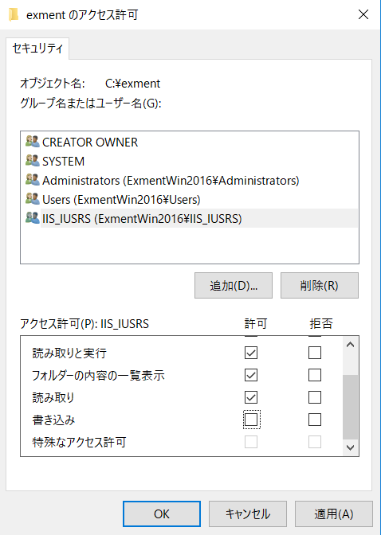
   5. \[OK\] を2回クリックしてプロパティを閉じます   

19.  いくつかのフォルダに、書き込みアクセス権限を追加します。追加するフォルダ・ファイルは以下です。

| 種類 | ファイル・フォルダ名 | 必要となる機能 |
| ---- | ---- | ---- |
| フォルダ | storage | 全機能 |
| フォルダ | bootstrap/cache | 全機能 |
| ファイル | .env | かんたんインストール、リストア |
| フォルダ | config | かんたんインストール、リストア |
| フォルダ | app | かんたんインストール |
| フォルダ | public | かんたんインストール |
| フォルダ | resources | かんたんインストール |

以下の例は、storageフォルダーに権限を追加する手順です。

   1. storage フォルダーを右クリックし、\[プロパティ\] を選択します
   > 例では C:\exment\storage
   2. \[セキュリティ\] タブを開き、\[編集\] をクリックします
   3. \[storage のアクセス許可\] で \[追加\] ボタンをクリックし、\[ユーザーまたはグループの選択\] を表示します
   4. \[選択するオブジェクト名を入力してください\] 欄に IIS_IUSRS と入力し、\[名前の確認\] をクリックします
   5. 表示が (コンピュータ名)\IIS_IUSRS に変わったら、\[OK\] をクリックします  
       
   6. \[storage のアクセス許可\] に戻るので、\[グループ名またはユーザー名\] 欄で IIS_IUSRS をクリックし、\[アクセス許可\] 欄の \[書き込み\] の \[許可\] にチェックを入れます  
    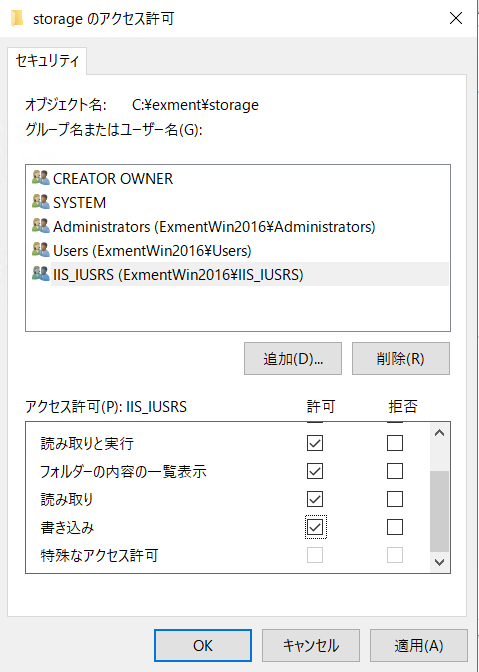
   7. \[OK\] を2回クリックしてプロパティを閉じます

20.  アップロードファイルを一時的に保管できるように、php.iniのupload_tmp_dirで指定したフォルダーに対する書き込みアクセス権限を追加します
   1. 該当フォルダーを右クリックし、\[プロパティ\] を選択します
   > 例では C:\Temp
   2. \[セキュリティ\] タブを開き、\[編集\] をクリックします
   3. \[Temp のアクセス許可\] で \[追加\] ボタンをクリックし、\[ユーザーまたはグループの選択\] を表示します
   4. \[選択するオブジェクト名を入力してください\] 欄に IIS_IUSRS と入力し、\[名前の確認\] をクリックします
   5. 表示が (コンピュータ名)\IIS_IUSRS に変わったら、\[OK\] をクリックします  
       
   6. \[Temp のアクセス許可\] に戻るので、\[グループ名またはユーザー名\] 欄で IIS_IUSRS をクリックし、\[アクセス許可\] 欄の \[書き込み\] の \[許可\] にチェックを入れます  
    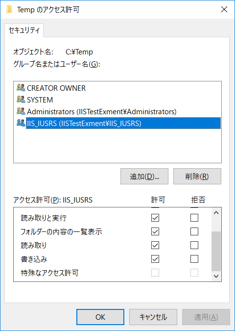
   7. \[OK\] を2回クリックしてプロパティを閉じます

   > インストール後の初期設定に関しては、[こちら](/ja/first_setting.md?id=初期設定画面)をご覧ください

   
## PHPバージョンアップ時の対応
PHPのバージョンを変更する場合、以下の手順でバージョンアップを行ってください。  
※バージョンアップ作業中は、Exmentにアクセスできなくなります。  
※下記の例は、PHP7.4からPHP8.2へアップデートするための手順です。  
※環境や導入時期、バージョンやインストール方法によって、バージョンアップ方法は異なる場合があります。  

- 作業の前準備としてIISを停止します。  

- 現在使用しているPHPの実行フォルダをバックアップします。フォルダの名前を変更する、別の場所にコピーする等お好きな方法でかまいません。  

- 新しいPHPをダウンロードします。  

   1. https://windows.php.net/download/ にアクセスします
   2. \[PHP 8.2\] の \[VC15 x64 Non Thread Safe\] の ZIP ファイルをダウンロードします  
      > Windows 10 環境で 32 ビット版 Windows を利用している場合は、\[VC15 x86 Non Thread Safe \] の ZIP ファイルをダウンロードしてください
   3. ZIP ファイルの内容を前のPHPと同じパスに展開します。  
   ※ 環境変数でPATHが通っていることが前提です。  

- バックアップしておいた前のバージョンのPHPフォルダから、新しいバージョンのPHPフォルダにphp.iniファイルをコピーします。  

- 必要に応じてphp.iniファイルを編集します。  
   1. "Dynamic Extension" セクションのGDライブラリがコメント化されている場合は有効にしてください。
        ```
        ;extension=gd
        ```
        を
        ```
        extension=gd
        ```
        に変更 (行頭の ; を取ってコメントを外します)

   ※ 元のPHPバージョンによってはextension=gd2になっている場合があります。extension=gdに変更してください。  

- IISを起動します。  

- コマンドプロンプト等でPHPのバージョンが8.2.Xになっていることを確認します。  

~~~
php -v
~~~
