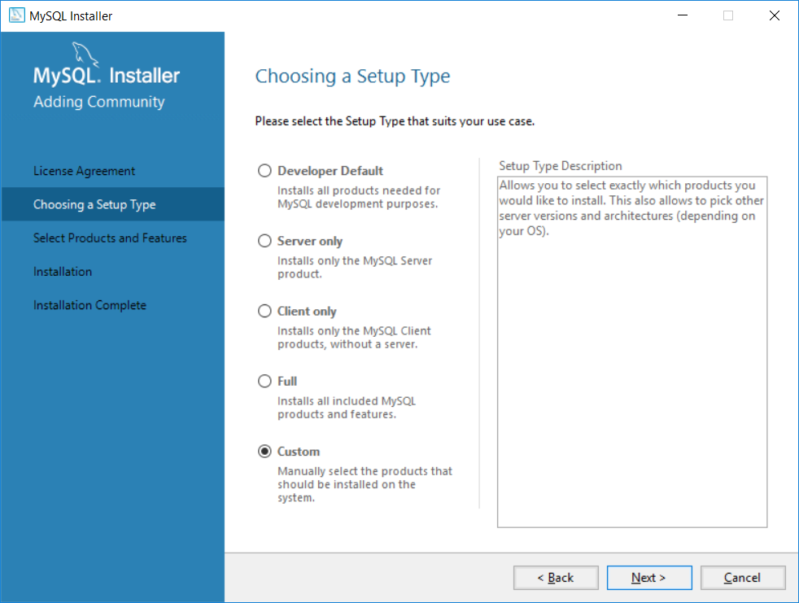
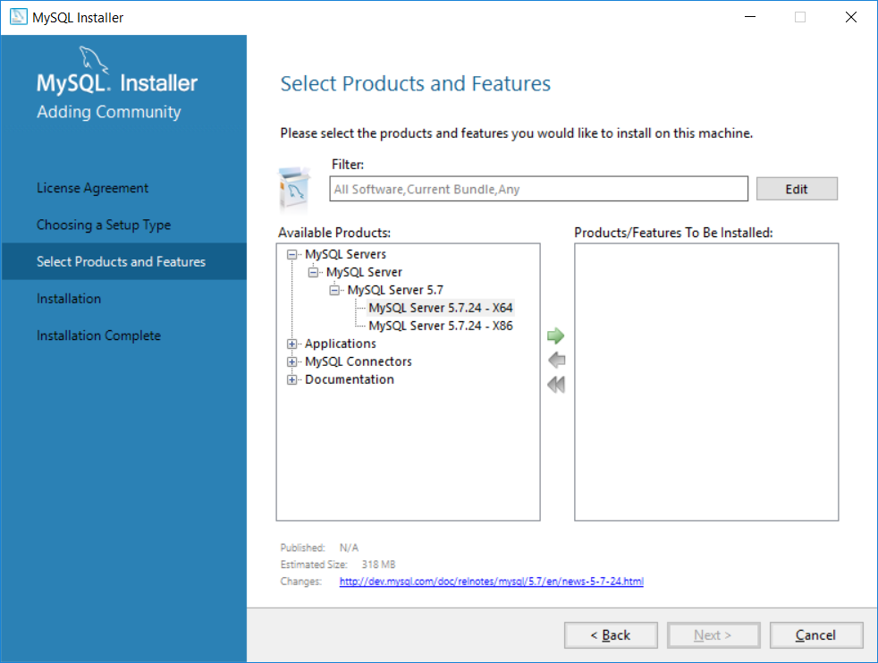
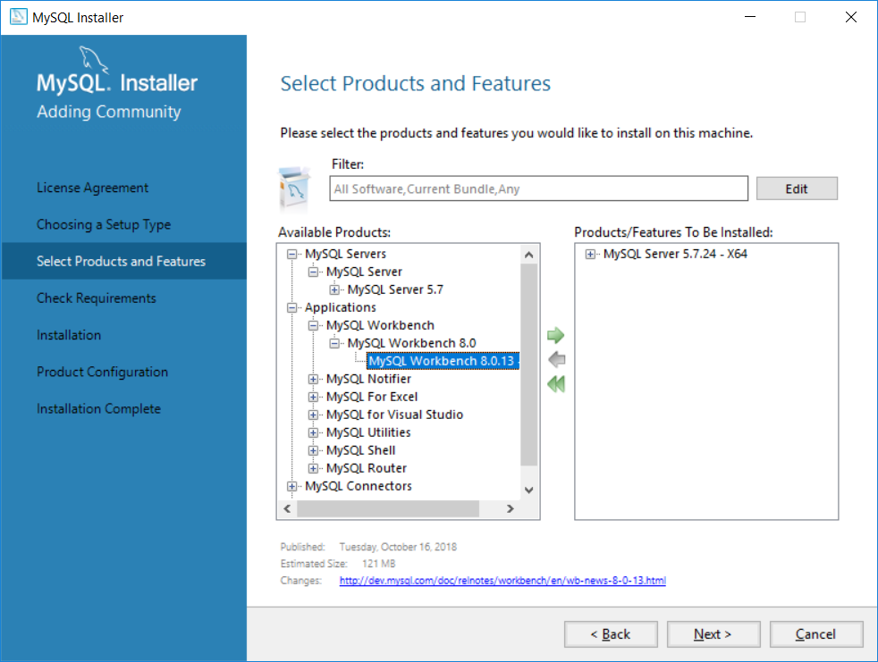
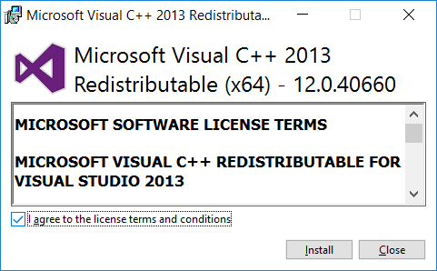
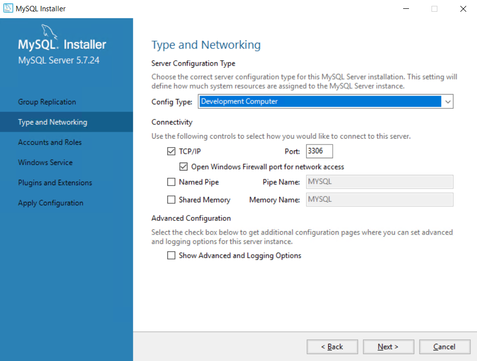
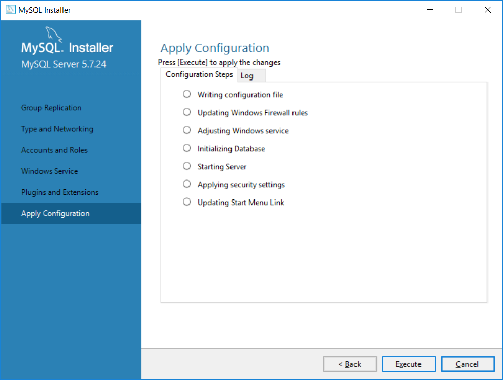
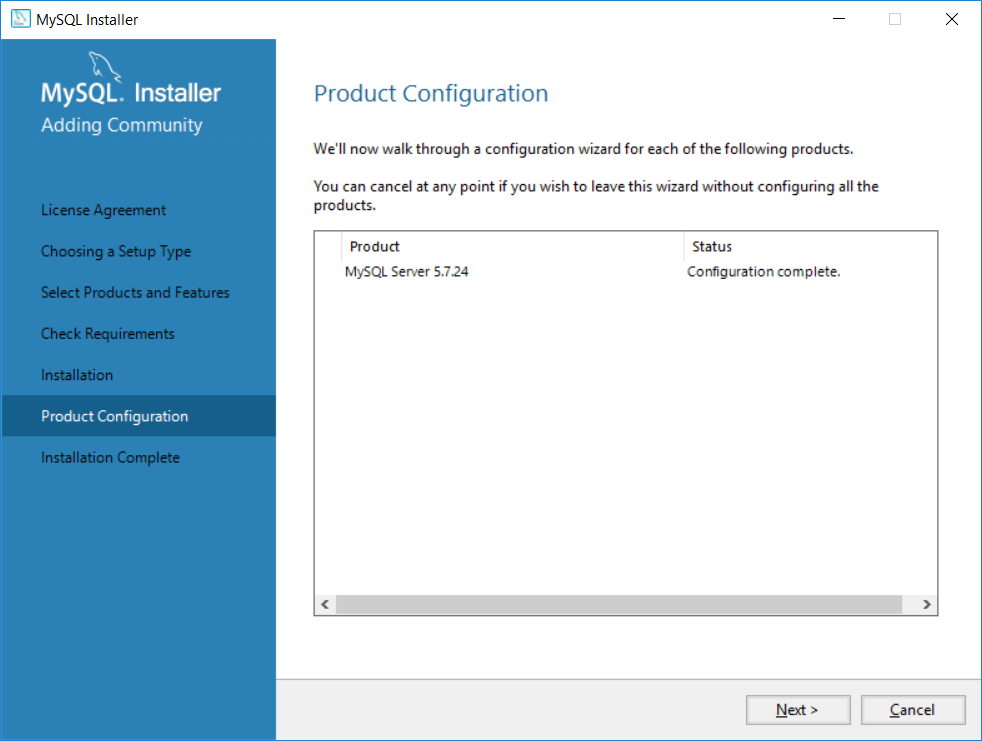
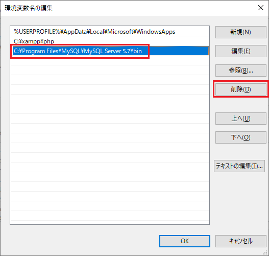

# MySQLインストール手順
Exmentで、MySQLを使用するための手順です。  
※各種手順は、OSやバージョン、インストール時期などにより、異なる場合があります。  

## MySQL設定(Windows)

- **(MySQL5.7が存在する場合のみ)**  
[データベースバックアップ](https://dev.mysql.com/doc/refman/8.0/ja/mysqldump-sql-format.html)します。

- **(MySQL5.7が存在する場合のみ)**  
スタートボタン右側にある「検索バー」へ「コマンドプロンプト」と入力します。  
表示される「最も一致される検索結果」の上段に表示される 「コマンドプロンプト」を右クリックします。  
右クリックで表示されたメニューの中から「管理者として実行」を選択します。
   
MySQLを停止します。  

~~~
net stop mysql57
~~~

- 以下のサイトにアクセスし、MySQLをダウンロードします。  
[MySQLダウンロード](https://downloads.mysql.com/archives/installer/)  

- Product Versionが「8.0.X」となっている、最新版のものを選択します。  

- ファイル名に「web」が"入っていない"方の行で、容量が大きい行の「Download」をクリックし、ダウンロードします。  

- ダウンロードしたファイルを実行し、インストールを進めます。  

- 「Choosing a Setup type」では、「Custom」を選択します。  
  

- 「Select Products and Features」では、「MySQL Servers > MySQL Server > MySQL Server 8.0」をクリックすると、MySQL Server X64とX86が表示されます。  
ご利用のOSのバージョンに合わせ、1行クリックし、真ん中の「→」をクリックしてください。    
  

- (任意)MySQLのワークベンチを導入したい場合、「Applications > MySQL Workbench > MySQL Workbench 8.0」をクリックすると、「MySQL Workbench」が表示されます。  
この行をクリックし、真ん中の「→」をクリックしてください。    
※MySQL Workbenchは、MySQLのデータをGUIからアクセスしやすくするためのアプリケーションです。  
  

- 完了するまで「Yes」や「Install」をクリックします。  
  

- 「Installation」ページで、「Execute」をクリックして、インストールを開始します。  
  

- 「Next」をクリックします。  
  

- 「Type and Networking」では、既定の設定とします。  
  

- rootユーザーのパスワードを入力します。  
今後ExmentなどでMySQLを使用する場合に必要ですので、必ず覚えておいてください。  
  

- その後はウィザードに従い、「Next」を何回か押下して、インストールを進めていきます。
  
  

- インストールが完了しました。  
  

- my.iniを修正します。(C:\ProgramData\MySQL\MySQL Server 8.0\my.ini)

~~~
# 以下の記述を、末尾に追加

local-infile=1
~~~

- 管理者権限のコマンドプロンプトを起動して、MySQLを停止します。  

~~~
net stop mysql80
~~~  

- MySQLを起動します。 

~~~
net start mysql80
~~~

### 環境変数追加 

- エクスプローラから、「PC」を右クリックし、「プロパティ」をクリックします。

- 「システムの詳細設定」をクリックします。

- 「環境変数」をクリックします。  

- 「ユーザー環境変数」の「Path」をクリックし、「編集」をクリックします。  

- 「C:\Program Files\MySQL\MySQL Server 5.7\bin」変数が存在する場合は、削除します。

- 「新規」をクリックし、以下の行を追加します。  
 「C:\Program Files\MySQL\MySQL Server 8.2\bin」   

- 入力を行ったら、起動したダイアログをすべて「OK」をクリックし、完了させます。  

## MySQL設定(Linux)
LinuxでのMySQLのインストール手順です。  
※必要に応じて、コマンドの頭にsudoを付与してください。  
※インストール先がCentOS8、RHEL8等の場合はyumではなくdnfコマンドをご利用ください。

### MySQL5.7が存在する場合（MySQL5.7→MySQL8.0へアップデート）
- MySQL5.7のパッケージを削除します。
~~~
sudo killall mysqld; sudo killall mysqld_safe;
sudo rpm -e --nodeps mysql57-community-release
sudo yum remove mysql mysql-server mysql-client mysql-common mysql-devel mysql-community-client-plugins -y
~~~

- MySQL8.0をインストールし起動します。

~~~
# CENTOS STREAMの場合

rpm -ivh https://dev.mysql.com/get/mysql80-community-release-el9-1.noarch.rpm
rpm --import https://repo.mysql.com/RPM-GPG-KEY-mysql-2023
dnf clean packages
dnf update -y

# mysql-community-serverをインストールし起動する
dnf install mysql-community-server -y
systemctl start mysqld
systemctl enable mysqld
~~~

~~~
# CENTOS8の場合
sudo rpm -ivh http://dev.mysql.com/get/mysql80-community-release-el7-11.noarch.rpm
sudo rpm --import https://repo.mysql.com/RPM-GPG-KEY-mysql-2022

# こちらを実施時して、mysql-community-serverが存在するかを確認します
sudo yum search mysql-community-server

# 上記コマンドで「Error: Unable to find a match: mysql-community-server」のような存在しない旨のメッセージが出た場合は、先に下記のコマンドを実施してください
sudo yum -y module disable mysql

# mysql-community-serverをインストールし起動する
sudo yum -y install mysql-community-server
sudo systemctl enable mysqld.service
~~~
- my.cnfを修正します。

~~~
vi /etc/my.cnf

# 以下の記述を、末尾に追加

local-infile=1
~~~

- MySQLを起動します。

~~~
sudo systemctl start mysqld
~~~

### MySQL5.7が存在しない場合（MySQL8.0の新規インストール）
- MySQL8.0をインストールし起動します。

~~~
# CENTOSSTREAMの場合

rpm -ivh https://dev.mysql.com/get/mysql80-community-release-el9-1.noarch.rpm
rpm --import https://repo.mysql.com/RPM-GPG-KEY-mysql-2023
dnf clean packages
dnf update -y

# mysql-community-serverをインストールし起動する
dnf install mysql-community-server -y
systemctl start mysqld
systemctl enable mysqld
~~~

~~~
# CENTOS 8の場合
sudo rpm -ivh http://dev.mysql.com/get/mysql80-community-release-el7-11.noarch.rpm
sudo rpm --import https://repo.mysql.com/RPM-GPG-KEY-mysql-2022

# こちらを実施時して、mysql-community-serverが存在するかを確認します
sudo yum search mysql-community-server

# 上記コマンドで「Error: Unable to find a match: mysql-community-server」のような存在しない旨のメッセージが出た場合は、先に下記のコマンドを実施してください
sudo yum -y module disable mysql

# mysql-community-serverをインストールし起動する
sudo yum -y install mysql-community-server
sudo systemctl enable mysqld.service
sudo systemctl start mysqld
~~~

- MySQLの初期パスワードを確認します。

~~~
cat /var/log/mysqld.log | grep -i 'temporary password'

#以下のようなログが出力されるので、パスワードを確認する
2025-03-25T04:35:28.567119Z 6 [Note] [MY-010454] [Server] A temporary password is generated for root@localhost: et5k>Y.b0eJ.
~~~

- (任意)パスワードポリシーを無効化します。

~~~
vi /etc/my.cnf

#以下のvalidate_passwordを追加
[mysqld]
validate_password=OFF
~~~

- MySQLを再起動します。

~~~
sudo systemctl restart mysqld
~~~

- MySQLの初期設定を行います。以下のコマンドを実行します。

~~~
mysql_secure_installation

Enter password for user root: (先ほどコピーしたパスワードを入力)

New password: (新しいパスワードを入力)
Re-enter new password: (新しいパスワードを入力)

Change the password for root? : n

Remove anonymous users? : y #匿名ユーザーアカウントを削除
Disallow root login remotely? : y # ローカルホスト以外からアクセス可能な root アカウントを削除
Remove test database and access to it? : y # test データベースの削除
Reload privilege tables now? : y #privilegeテーブルを再読込
~~~

- MySQLにログインします。

~~~
mysql -u root -p(パスワード)
~~~
- my.cnfを修正します。

~~~
vi /etc/my.cnf

# 以下の記述を、末尾に追加

local-infile=1
~~~

- MySQLを再起動します。

~~~
sudo systemctl restart mysqld
~~~

- Exment用のデータベースと、ユーザーを作成します。  
※ここでは、データベース名を「exment_database」、ユーザーを「exment_user」とします。  
また、接続元のIPアドレスを「192.168.137.%」とします。

~~~
CREATE DATABASE exment_database;
CREATE USER 'exment_user'@'192.168.137.%' IDENTIFIED BY '(exment_user用のパスワード)';
GRANT ALL ON exment_database.* TO exment_user identified by '(exment_user用のパスワード)';
FLUSH PRIVILEGES;
~~~

- ファイアウォール設定で、接続元のIPアドレスからのMySQLアクセスのみ許可します。  
※ここでは、接続元のIPアドレスを「192.168.137.%」とします。

~~~
firewall-cmd --permanent --new-zone=from_webserver
firewall-cmd --reload
firewall-cmd --permanent --zone=from_webserver --add-source="192.168.137.0/24"
firewall-cmd --permanent --zone=from_webserver --add-port=3306/tcp
firewall-cmd --zone=from_webserver --add-service=mysql
firewall-cmd --reload
~~~