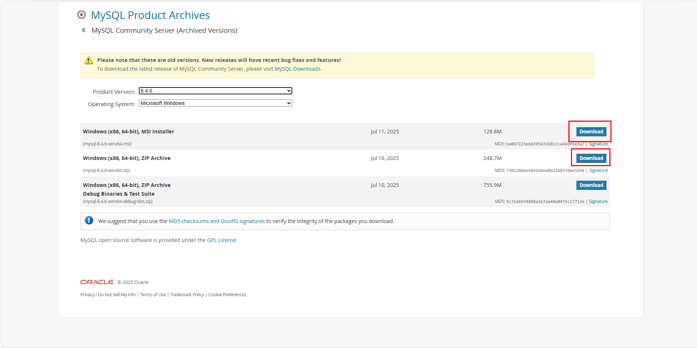
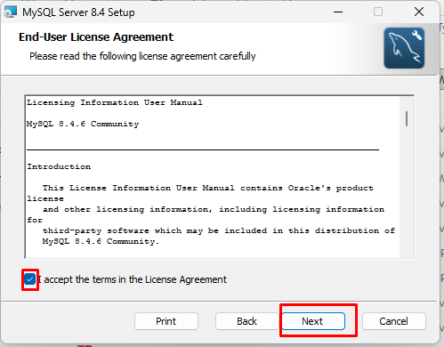
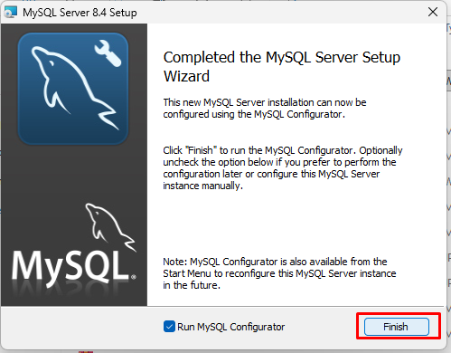
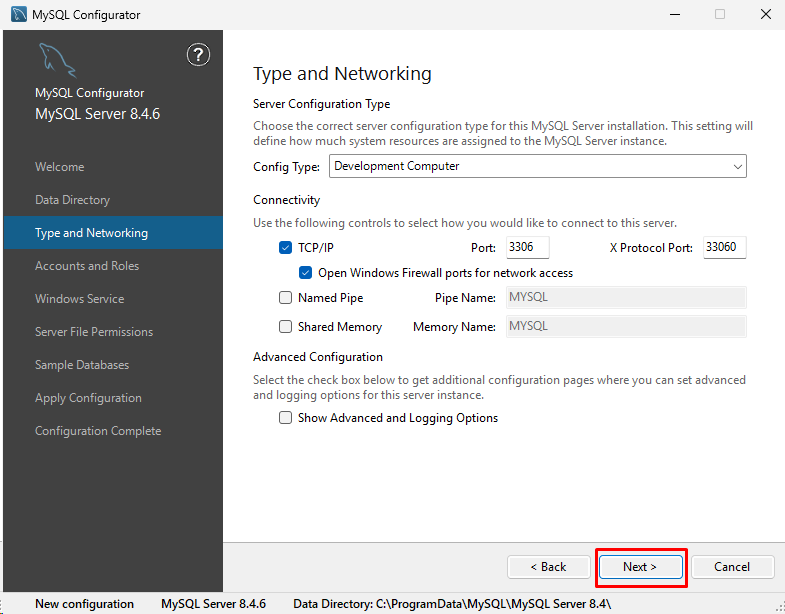
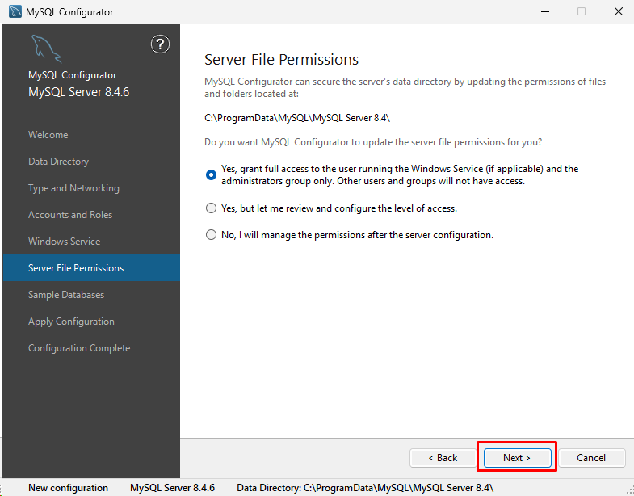
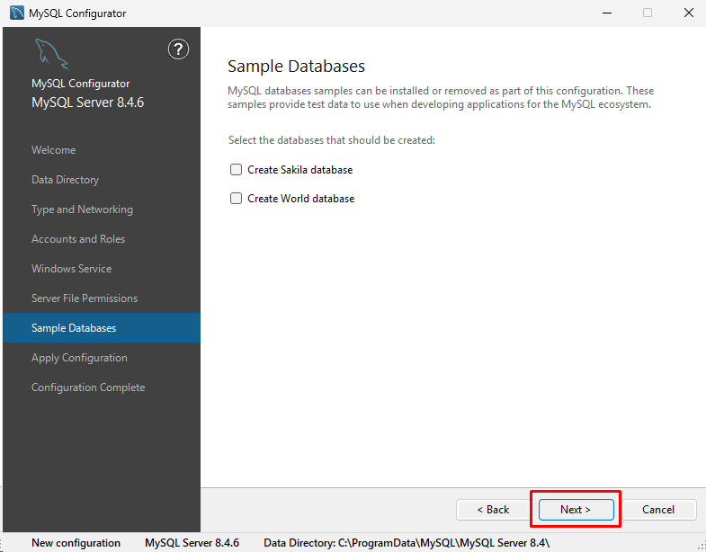
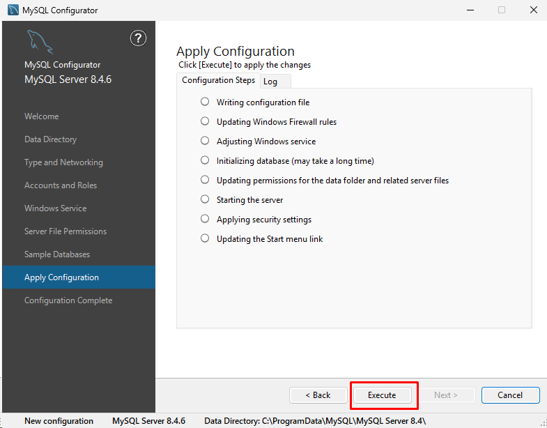
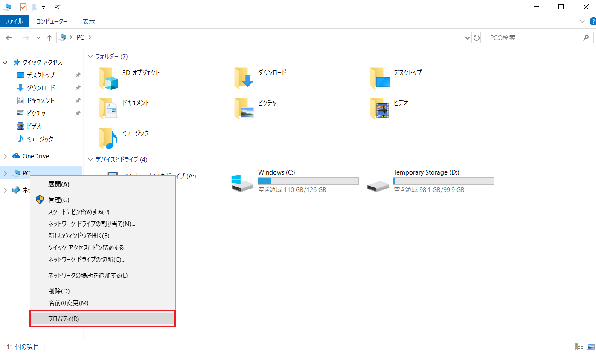
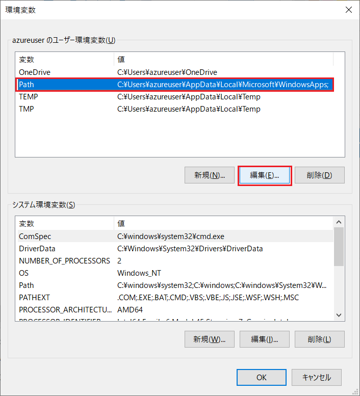
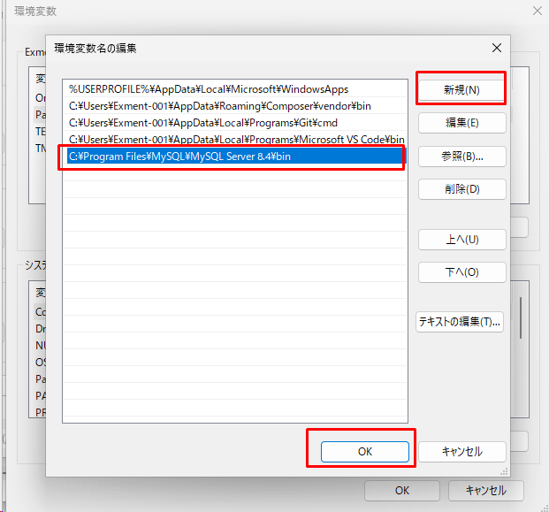

# MySQLインストール手順
Exmentで、MySQLを使用するための手順です。  
※各種手順は、OSやバージョン、インストール時期などにより、異なる場合があります。  

## MySQL設定(Windows)

- 推奨：アップグレード前に[データベースバックアップ](https://dev.mysql.com/doc/refman/8.4/ja/mysqldump-sql-format.html)を取得してください。

- (MySQLが起動している場合) 管理者としてコマンドプロンプトを起動し、MySQLを停止します。  
スタートボタン右側にある「検索バー」へ「コマンドプロンプト」と入力します。  
表示される「最も一致される検索結果」の上段に表示される 「コマンドプロンプト」を右クリックします。  
右クリックで表示されたメニューの中から「管理者として実行」を選択します。
   

~~~
net stop mysql57
net stop mysql80
~~~

- 以下のサイトにアクセスし、MySQLをダウンロードします。  
※MySQL InstallerはMySQL 8.0系のみ提供されています。MySQL 8.1以降(8.4含む)は、MySQL ServerをMSIまたはZIPでダウンロードしてください。  
[MySQL Community Server Downloads](https://downloads.mysql.com/archives/community/)  

- Select Versionで「8.4.X」を選択し、OSはWindows (x86, 64-bit)を選択します。  

- 以下のいずれかをダウンロードします。
	- MSI Installer

- ダウンロードしたMSIファイルを実行し、ウィザードに従ってインストールします。
	- Welcome画面で「Next」をクリックします。

		
	- License Agreementに同意し、「Next」をクリックします。

		
	- Setup Typeは「Complete」を選択します。

		
	- 「Install」をクリックします。

		
	- インストールが完了したら「Finish」をクリックします。

		

- MSIのインストール完了後、MySQL Server Configuratorが自動的に起動します。
	- 「Welcome to the MySQL Server Configurator」で「Next」をクリックします。

		

- Data Directoryは既定のまま「Next」をクリックします。

	

- Type and Networking:
	- Config Type: Development Computer
	- Connectivity: TCP/IP (既定のポートは3306)
	- 「Next」をクリックします。

		

- Accounts and Roles: rootユーザーのパスワードを設定して「Next」をクリックします。

	

- Windows Service: サービス名(例: MySQL84)を設定して「Next」をクリックします。

	

- Server File Permissionsは既定のまま「Next」をクリックします。

	

- Sample Databasesはスキップして「Next」をクリックします。

	

- Apply Configurationで「Execute」をクリックし、完了後に「Next」「Finish」をクリックします。

	

- my.iniを修正します。(C:\ProgramData\MySQL\MySQL Server 8.4\my.ini)

~~~
# 以下の記述を、末尾に追加

local-infile=1
~~~

- MySQLを再起動します。(サービス名は環境により異なります)

~~~
net stop MySQL84
net start MySQL84
~~~

### 環境変数追加 

- エクスプローラから、「PC」を右クリックし、「プロパティ」をクリックします。

- 「システムの詳細設定」をクリックします。

- 「環境変数」をクリックします。  

- 「ユーザー環境変数」の「Path」をクリックし、「編集」をクリックします。  

- 「C:\Program Files\MySQL\MySQL Server 5.7\bin」変数が存在する場合は、削除します。

- 「新規」をクリックし、以下の行を追加します。  
 「C:\Program Files\MySQL\MySQL Server 8.4\bin」   

- 入力を行ったら、起動したダイアログをすべて「OK」をクリックし、完了させます。  

## MySQL設定(Linux)
LinuxでのMySQLのインストール手順です。  
※必要に応じて、コマンドの頭にsudoを付与してください。  
※インストール先がCentOS8、RHEL8等の場合はyumではなくdnfコマンドをご利用ください。

### MySQL5.7が存在する場合（MySQL5.7→MySQL8.4へアップデート）
- MySQL5.7のパッケージを削除します。
~~~
sudo killall mysqld; sudo killall mysqld_safe;
sudo rpm -e --nodeps mysql57-community-release
sudo yum remove mysql mysql-server mysql-client mysql-common mysql-devel mysql-community-client-plugins -y
~~~

- MySQL8.4をインストールし起動します。

※OSのバージョンによってはrpmが異なります。

例えば、AlmaLinux9.5の場合は、
 

~~~
[root@localhost ~]# uname -a
Linux localhost.localdomain 5.14.0-503.11.1.el9_5.x86_64 #1 SMP PREEMPT_DYNAMIC Tue Nov 12 09:26:13 EST 2024 x86_64 x86_64 x86_64 GNU/Linux
~~~

だと、
 

~~~
sudo rpm -ivh https://dev.mysql.com/get/mysql84-community-release-el9-2.noarch.rpm
~~~

となります。
 

~~~
# CENTOS STREAMの場合

rpm -ivh https://dev.mysql.com/get/mysql84-community-release-el9-2.noarch.rpm
rpm --import https://repo.mysql.com/RPM-GPG-KEY-mysql-2023
dnf clean packages
dnf update -y

# mysql-community-serverをインストールし起動する
dnf install mysql-community-server -y
systemctl start mysqld
systemctl enable mysqld
~~~

~~~
# CENTOS8の場合
sudo rpm -ivh https://dev.mysql.com/get/mysql84-community-release-el8-2.noarch.rpm
sudo rpm --import https://repo.mysql.com/RPM-GPG-KEY-mysql-2023

# こちらを実施時して、mysql-community-serverが存在するかを確認します
sudo yum search mysql-community-server

# 上記コマンドで「Error: Unable to find a match: mysql-community-server」のような存在しない旨のメッセージが出た場合は、先に下記のコマンドを実施してください
sudo yum -y module disable mysql

# mysql-community-serverをインストールし起動する
sudo yum -y install mysql-community-server
sudo systemctl enable mysqld.service
~~~

- my.cnfを修正します。

~~~
vi /etc/my.cnf

# 以下の記述を、末尾に追加

local-infile=1
~~~

- MySQLを起動します。

~~~
sudo systemctl start mysqld
~~~

### MySQL5.7が存在しない場合（MySQL8.4の新規インストール）
- MySQL8.4をインストールし起動します。

※OSのバージョンによってはrpmが異なります。

例えば、AlmaLinux9.5の場合は、
 

~~~
[root@localhost ~]# uname -a
Linux localhost.localdomain 5.14.0-503.11.1.el9_5.x86_64 #1 SMP PREEMPT_DYNAMIC Tue Nov 12 09:26:13 EST 2024 x86_64 x86_64 x86_64 GNU/Linux
~~~

だと、
 

~~~
sudo rpm -ivh https://dev.mysql.com/get/mysql84-community-release-el9-2.noarch.rpm
~~~

となります。
 

~~~
# CENTOSSTREAMの場合

rpm -ivh https://dev.mysql.com/get/mysql84-community-release-el9-2.noarch.rpm
rpm --import https://repo.mysql.com/RPM-GPG-KEY-mysql-2023
dnf clean packages
dnf update -y

# mysql-community-serverをインストールし起動する
dnf install mysql-community-server -y
systemctl start mysqld
systemctl enable mysqld
~~~

~~~
# CENTOS 8の場合
sudo rpm -ivh https://dev.mysql.com/get/mysql84-community-release-el8-2.noarch.rpm
sudo rpm --import https://repo.mysql.com/RPM-GPG-KEY-mysql-2023

# こちらを実施時して、mysql-community-serverが存在するかを確認します
sudo yum search mysql-community-server

# 上記コマンドで「Error: Unable to find a match: mysql-community-server」のような存在しない旨のメッセージが出た場合は、先に下記のコマンドを実施してください
sudo yum -y module disable mysql

# mysql-community-serverをインストールし起動する
sudo yum -y install mysql-community-server
sudo systemctl enable mysqld.service
sudo systemctl start mysqld
~~~

- MySQLの初期パスワードを確認します。

~~~
cat /var/log/mysqld.log | grep -i 'temporary password'

#以下のようなログが出力されるので、パスワードを確認する
2025-03-25T04:35:28.567119Z 6 [Note] [MY-010454] [Server] A temporary password is generated for root@localhost: et5k>Y.b0eJ.
~~~

- (任意)パスワードポリシーを無効化します。

~~~
vi /etc/my.cnf

#以下のvalidate_passwordを追加
[mysqld]
validate_password=OFF
~~~

- MySQLを再起動します。

~~~
sudo systemctl restart mysqld
~~~

- MySQLの初期設定を行います。以下のコマンドを実行します。

~~~
mysql_secure_installation

Enter password for user root: (先ほどコピーしたパスワードを入力)

New password: (新しいパスワードを入力)
Re-enter new password: (新しいパスワードを入力)

Change the password for root? : n

Remove anonymous users? : y #匿名ユーザーアカウントを削除
Disallow root login remotely? : y # ローカルホスト以外からアクセス可能な root アカウントを削除
Remove test database and access to it? : y # test データベースの削除
Reload privilege tables now? : y #privilegeテーブルを再読込
~~~

- MySQLにログインします。

~~~
mysql -u root -p(パスワード)
~~~
- my.cnfを修正します。

~~~
vi /etc/my.cnf

# 以下の記述を、末尾に追加

local-infile=1
~~~

- MySQLを再起動します。

~~~
sudo systemctl restart mysqld
~~~

- Exment用のデータベースと、ユーザーを作成します。  
※ここでは、データベース名を「exment_database」、ユーザーを「exment_user」とします。  
また、接続元のIPアドレスを「192.168.137.%」とします。

~~~
CREATE DATABASE exment_database;
CREATE USER 'exment_user'@'192.168.137.%' IDENTIFIED BY '(exment_user用のパスワード)';
GRANT ALL ON exment_database.* TO 'exment_user'@'192.168.137.%';
FLUSH PRIVILEGES;
~~~

- ファイアウォール設定で、接続元のIPアドレスからのMySQLアクセスのみ許可します。  
※ここでは、接続元のIPアドレスを「192.168.137.%」とします。

~~~
firewall-cmd --permanent --new-zone=from_webserver
firewall-cmd --reload
firewall-cmd --permanent --zone=from_webserver --add-source="192.168.137.0/24"
firewall-cmd --permanent --zone=from_webserver --add-port=3306/tcp
firewall-cmd --zone=from_webserver --add-service=mysql
firewall-cmd --reload
~~~