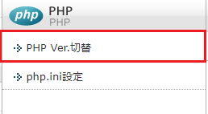
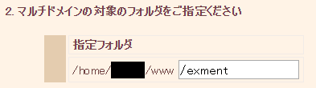

# レンタルサーバーによる環境構築
手軽に環境を構築し、運用を行う場合、レンタルサーバーという選択肢があります。  
本ページでは、レンタルサーバーでExmentを構築する手順を記載します。  

## レンタルサーバーで構築を行う際の注意点
- Exmentは、以下の環境が必要になります。
    1. PHP 7.1.3以上 **7.4未満**
    1. MySQL 5.7.8以上、8.0.0未満  
    または MariaDB 10.2.7以上  
  特にMySQLのバージョンが、レンタルサーバーによっては条件を満たしていない場合があります。  
  お使いのレンタルサーバーが条件を満たしているか、事前に確認をお願いします。

- レンタルサーバーにおける構築では、SSH通信後、最初にcomposerを導入し、Exmentをインストールするという流れが基本になります。  

- レンタルサーバーごとに、publicにWeb公開するパスが指定されています（/home/username/www や、 /public_html など）。  
このフォルダ直下に、Exmentをインストールしたフォルダをそのまま入れないでください。データベースの設定値や、メールのパスワードなどが記載された設置ファイルなどが外部公開され、致命的な情報流出に繋がります。  
本手順では、公開べき対象のフォルダのみ、public公開するための手順を記載しておりますので、この手順に従い、Web公開を行ってください。

- レンタルサーバーの環境や、レンタルサーバー側のサーバーのバージョンなどにより、本手順では正常に設定できない場合がございます。

- 本手順では、Exmentをレンタルサーバーで動作させるための手順のみの記載となります。  
SSHやデータベース作成、Linuxコマンドなど、一般的なIT系のナレッジについては記載致しておりません。ご了承ください。  

## レンタルサーバーによるインストール手順

### Xserverの場合
※X10プランで動作確認を行っています。

<iframe width="560" height="420" src="https://www.youtube.com/embed/RB6i0F2fev0" frameborder="0" allow="accelerometer; autoplay; encrypted-media; gyroscope; picture-in-picture" allowfullscreen></iframe>

- あらかじめ、Exment用のMySQLを作成しておきます。

- PHPのバージョンを変更します。  
Xserverの場合、管理画面から設定するPHPのバージョンと、SSH接続を行ってコマンド実行した場合のPHPが、バージョンが異なる場合があります。  
  
そこで、コマンド時のXserverのバージョンを設定します。

- Xserverの管理画面から、「PHP Ver.切替」をクリックします。  
その後、対象のドメインを選択します。  
  
  

- 「PHPバージョン切替」より、現在のバージョンが記載されておりますので、バージョンをメモします。  
  

- XserverにSSH接続します。  

- 以下のコマンドで、Xserverで設定されているPHPバージョンを確認します。  
コマンドの結果から、管理画面よりメモを行ったPHPのバージョンへのパスをコピーします。  

~~~ bash
find /opt/php-*/bin -type f -name 'php'

## /opt/php-7.1.2/bin/php
## /opt/php-7.1.3/bin/php
## /opt/php-7.1.4/bin/php
## /opt/php-7.2.1/bin/php
## /opt/php-7.2.14/bin/php
## /opt/php-7.2.6/bin/php ←今回の例ではこちら
## /opt/php-7.2/bin/php
~~~

- フォルダを作成し、PHPへのシンボリックリンクを作成します。  

~~~
mkdir $HOME/bin
ln -s /opt/php-7.2.6/bin/php $HOME/bin/php
~~~

- bashrcファイルを修正し、上記PHPバージョンへのパスを通します。  

~~~ bash
vi ~/.bashrc

## 以下を最終行に記載し、「:wq!」で保存する
export PATH=$HOME/bin:$PATH

## 修正を反映させる
source ~/.bashrc
~~~

- 最新のPHPが正常に反映されているかどうか確認します。  
管理画面に記載のバージョンになっていれば完了です。

~~~ bash
php --version
~~~

  

- composerをインストールします。

~~~ bash
cd ~
curl -sS https://getcomposer.org/installer | php -- --install-dir=$HOME/bin/
## 名前変更
mv $HOME/bin/composer.phar $HOME/bin/composer
## 確認
composer --version
# Composer version 1.8.5 2019-04-09 17:46:47
~~~

- Exmentのインストールを行います。ここで、決して「$HOME/(ドメイン名)/public_html」フォルダ直下にはインストールを行わないでください。データベースの設定値や、メールのパスワードなどが記載された設置ファイルなどが外部公開され、致命的な情報流出に繋がります。  
今回は、「$HOME/(ドメイン名)/laravel」フォルダを作成し、その中にExmentをインストールします。

~~~ bash
cd ~/(ドメイン名)
mkdir laravel
cd laravel
wget https://exment.net/downloads/ja/exment.zip
unzip exment.zip
rm exment.zip
~~~

- 「$HOME/(ドメイン名)/public_html」フォルダに、先ほど作成した「$HOME/(ドメイン名)/laravel/exment/public」フォルダのシンボリックリンクを作成します。  
シンボリックリンクを作成することで、Laravel本体や設定値は、Web公開のフォルダにない場合でも、laravelのpublicフォルダがpublic_htmlフォルダ内に存在することになります。

~~~ bash
## デフォルトのpublic_htmlの削除
rm -r $HOME/(ドメイン名)/public_html
ln -s $HOME/(ドメイン名)/laravel/exment/public $HOME/(ドメイン名)/public_html
~~~

- これで、Exmentにアクセスするための準備が整います。  
[インストール手順](/ja/quickstart)に従い、設定を完了してください。  
※Exmentにアクセスを行いたい場合、URLの末尾に「/admin」を追加してください。  

### さくらインターネットの場合
※スタンダードプランで動作確認を行っています。  
※さくらインターネットの場合、「composer」実施時に、途中で終了してしまう場合があります。  
そのため、「nice -n 20 composer」と、「nice -n 20」と付けて実行します。

- あらかじめ、Exment用のMySQLを作成しておきます。

- さくらインターネットの「ドメイン/SSL設定」より、パスを変更します。  
管理メニューの「ドメイン/SSL設定」より、変更を行いたいドメインを選択します。
  

「マルチドメインの対象のフォルダ」から、指定フォルダを変更します。ここでは「/exment」とします。
  

- お使いのIDパスワードを使用し、SSH通信をおこないます。  

- シェルを変更します。  

~~~
which bash
#  /usr/local/bin/bash

chsh -s /usr/local/bin/bash
# Password:  ## パスワード入力する
# chsh: user information updated
~~~

- バッチを修正します。

~~~ bash
vi .bash_profile

## 以下を記載し、「:wq!」で保存する
PATH=$PATH:$HOME/bin:$HOME/usr/local/bin
export PATH
~~~

- 一度SSH通信を終了し、再度SSH通信を実行します。

- composerをインストールします。

~~~ bash
cd ~
mkdir -p usr/local/bin/
curl -sS https://getcomposer.org/installer | php -- --install-dir=usr/local/bin/
## 名前変更
mv usr/local/bin/composer.phar usr/local/bin/composer
## 確認
nice -n 20 composer --version
# composer version 1.8.5 2019-04-09 17:46:47
~~~

- Exmentのインストールを行います。ここで、決して「$HOME/www/」フォルダ直下にはインストールを行わないでください。データベースの設定値や、メールのパスワードなどが記載された設置ファイルなどが外部公開され、致命的な情報流出に繋がります。  
今回は、「$HOME/laravel」フォルダを作成し、その中にExmentをインストールします。

~~~ bash
cd ~
mkdir laravel
cd laravel
wget https://exment.net/downloads/ja/exment.zip
unzip exment.zip
rm exment.zip
~~~

- 「$HOME/www/exment」フォルダに、先ほど作成した「$HOME/laravel/exment/public」フォルダのシンボリックリンクを作成します。  
シンボリックリンクを作成することで、Laravel本体や設定値は、Web公開のフォルダにない場合でも、laravelのpublicフォルダがwwwフォルダ内に存在することになります。

~~~
ln -s $HOME/laravel/exment/public $HOME/www/exment
~~~

- これで、Exmentにアクセスするための準備が整います。  
[インストール手順](/ja/quickstart)に従い、設定を完了してください。  
※Exmentにアクセスを行いたい場合、URLの末尾に「/admin」を追加してください。  

