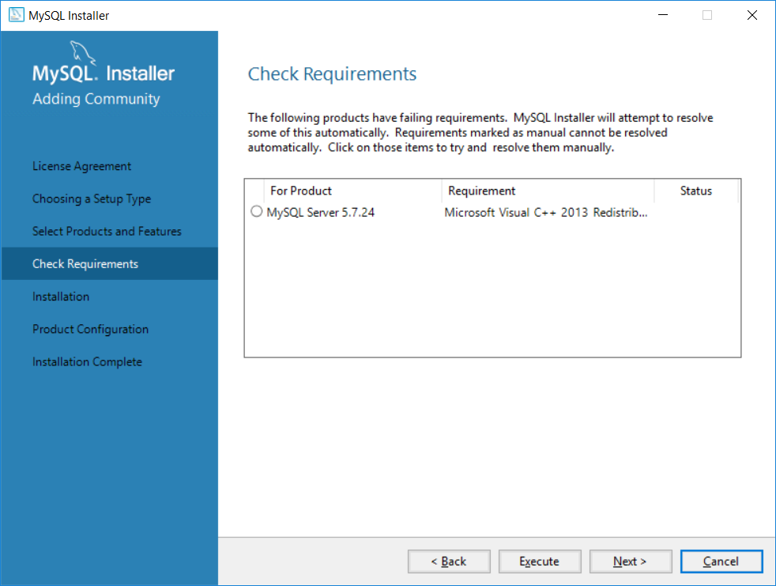

# XAMPPによる環境構築
PHPやApache、MySQLのある環境構築を、開発環境としてはじめから構築する場合、XAMPPをおすすめしております。  
XAMPPは本来、PHPやApache、MySQLなどを一括でインストールすることができる仕組みです。  
ただし、XAMPPに同梱しているMySQLは、実際にはMariaDBとなっており、**かつExmentに非対応のバージョン**となっております。（2019/03/15現在）  
そのため、以下の流れでインストールする必要があります。
1. XAMPPを、**MySQL(MariaDB)を除外して**インストールする
2. その後、MySQL5.7を個別にインストールする

なお、本マニュアルではWindowsの場合でご紹介しております。

- その他お問い合わせは、お気軽にこちらの[無料お問い合わせ](https://exment.net/inquiry)にてお願いいたします。

## インストール手順

### XAMPPインストール手順
- 以下のサイトにアクセスし、XAMPPをダウンロードします。  
下記のページから、「PHP7.1」以上となっているものを選択し、ダウンロードを行ってください。  
[XAMPPダウンロード](https://www.apachefriends.org/jp/download.html)  

- その後、XAMPPのインストールを進めます。

- 途中、XAMPPのコンポーネントを選択する画面になりますが、**MySQLのチェックを外して**「Next」をクリックします。  
※それ以外は、任意にチェックを行ってください  

- 以降は画面に従い、インストールを完了させます。

- インストールが完了したら、XAMPPコントロールパネルを起動します。  

- 一番上の「Apache」の行の、「Start」をクリックしてください。

- ファイアウォール設定が表示された場合、「許可」をクリックしてください。

- これでApacheが起動します。

※なお、OSを再起動した場合、再度XAMPPコントロールパネルを起動し、Apacheを起動し直す必要があります。

### MySQLインストール手順
- 以下のサイトにアクセスし、MySQLをダウンロードします。  
[MySQLダウンロード](https://downloads.mysql.com/archives/installer/)  

- Product Versionが「5.7.X」となっている、最新版のものを選択します。  

- ファイル名に「web」が"入っていない"方の行で、容量が大きい行の「Download」をクリックし、ダウンロードします。  

- ダウンロードしたファイルを実行し、インストールを進めます。  

- 「Choosing a Setup type」では、「Custom」を選択します。  
  

- 「Select Products and Features」では、「MySQL Servers > MySQL Server > MySQL Server 5.7」をクリックすると、MySQL Server X64とX86が表示されます。  
ご利用のOSのバージョンに合わせ、1行クリックし、真ん中の「→」をクリックしてください。    
  

- (任意)MySQLのワークベンチを導入したい場合、「Apploications > MySQL Workbench > MySQL Workbench 8.0」をクリックすると、「MySQL Workbench」が表示されます。  
この行をクリックし、真ん中の「→」をクリックしてください。    
※MySQL Workbenchは、MySQLのデータをGUIからアクセスしやすくするためのアプリケーションです。  
  

- 「Check Requirements」が表示することがあります。  
そのときには、「Execute」をクリックしたら、コンポーネントなどを関連してインストールします。
  

- 完了するまで「Yes」や「Install」をクリックします。  
  

- 「Installation」ページで、「Execute」をクリックして、インストール完了させます。
  

- 完了したら、「Next」をクリックします。
  

- 「Group Replication」や「Type and Networking」では、既定の設定とします。
  
  

- rootユーザーのパスワードを入力します。  
今後ExmentなどでMySQLを使用する場合に必要ですので、必ず覚えておいてください。  
  

- その後はウィザードに従い、「Next」を何回か押下して、インストールを進めていきます。
  
  

- インストールが完了しました。
  

### (補足)コマンドプロンプトなどからmysqlを実行する場合
コマンドプロンプトからmysqlを実行する場合、「環境変数」にパスを通す必要があります。  

- エクスプローラから、「PC」を右クリックし、「プロパティ」をクリックします。

- 「システムの詳細設定」をクリックします。

- 「環境変数」をクリックします。

- 「ユーザー環境変数」の「Path」をクリックし、「編集」をクリックします。  

- 「新規」をクリックし、以下の行を追加します。  

~~~
C:\Program Files\MySQL\MySQL Server 5.7\bin  
~~~

- 入力を行ったら、起動したダイアログをすべて「OK」をクリックし、完了させます。  

これで、Apache、PHP、MySQLをインストールすることができました。  

### Exmentインストール
Exmentの[インストール手順](/ja/quickstart)に従って、Exmentのインストールを行います。  
Exmentのインストールは、通常"C:\xampp\htdocs"フォルダ内で行います。  
ここでは、"C:\xampp\htdocs\exment"フォルダ内にインストールを行ったものとします。  

### サブドメイン設定
現在Exmentは、サブディレクトリで構築することができません。  
通常のxamppの設定だと、"http://localhost/exment" のように、サブディレクトリでのURLになってしまいます。  
そこで、XAMPPのサブドメイン設定を行います。これにより、 http://exment.localhost のようなURLを構成することができます。

- "C:\xampp\apache\conf\extra\httpd-vhosts.conf"を開きます。

- 行の末尾に、以下の記述を追加します。**※DocumentRootの末尾に「/public」が必要になります**  

~~~
<VirtualHost *:80>
    DocumentRoot "C:/xampp/htdocs"
    ServerName localhost
</VirtualHost>

<VirtualHost *:80>
  DocumentRoot "C:/xampp/htdocs/exment/public"
  ServerName exment.localhost
</VirtualHost>
~~~

- "C:\WINDOWS\system32\drivers\etc\hosts"を開き、編集します。  
※このファイルは直接編集できないので、デスクトップなどにコピーし、編集を行った後、元の場所で上書きを行ってください。  

~~~
127.0.0.1       localhost
127.0.0.1       exment.localhost
~~~

- XAMPPコントロールパネルで、Apacheを再起動します。  

## 証明書の追加
"C:\xampp\apache\bin"に、"curl-ca-bundle.crt"というファイルがあるかどうかを確認します。  
ない場合、以下の対応を行ってください。

- こちらのサイトにアクセスを行い、「cacert.pem」をダウンロードします。  
https://curl.haxx.se/docs/caextract.html

- ダウンロードした「cacert.pem」を、「curl-ca-bundle.crt」にリネームします。  

- リネームした「curl-ca-bundle.crt」を、「C:\xampp\apache\bin」に配置します。  

- apacheを再起動します。  

  
## 完了
これで、以下のURLでExmentにアクセスできるようになります。  
http://exment.localhost/admin