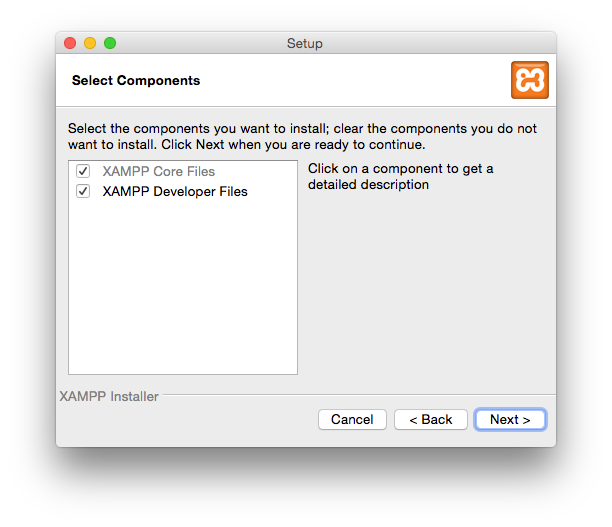
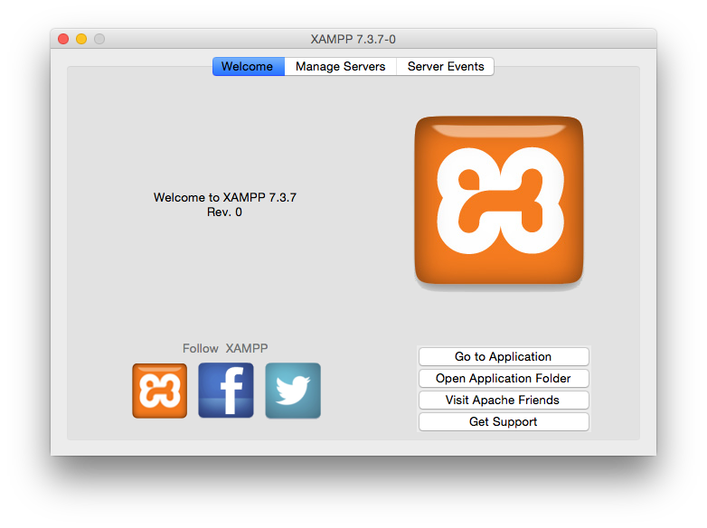
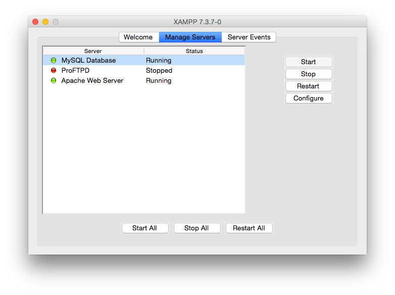
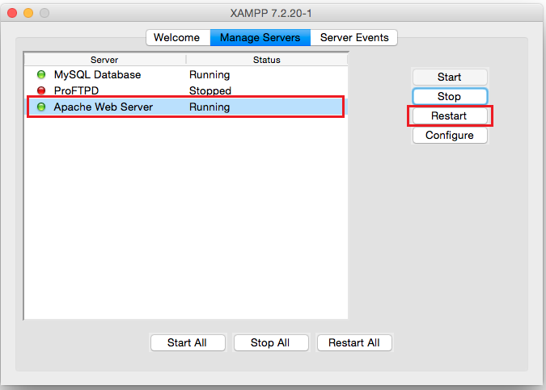
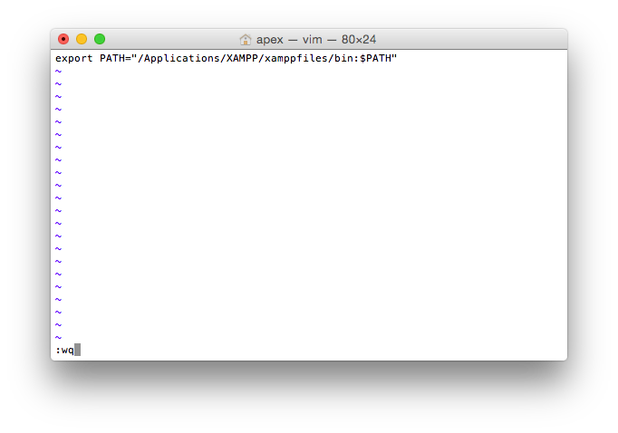

# XAMPPによる環境構築
PHPやApache、MySQLのある環境構築を、開発環境としてはじめから構築する場合、XAMPPをおすすめしております。  
なお、本マニュアルではMacの場合でご紹介しております。

## 注意点
- **XAMPPでのインストールは、開発・検証としてのみご利用ください。本番環境としては利用しないことをおすすめします。** 

## インストール手順

### XAMPPインストール手順
- 以下のサイトにアクセスし、XAMPPをダウンロードします。  
[XAMPPダウンロード](https://www.apachefriends.org/jp/download.html)  

- OS X向けXAMPPとある項目の中から、「PHP8.2」となっているものを選択し、ダウンロードを行ってください。  

- その後、XAMPPのインストールを進めます。  

- XAMPPのコンポーネントを選択する画面では、両方ともチェックをしてNextを押します。

- その他も画面に従い、Nextを押してインストールを完了させます。
- インストールが完了したら、LaunchPadのXAMPP（その他）にmanager-osxというアプリがありますので、そこからXAMPPを起動することができます。

- XAMPPを起動したらManage Serversをクリックします。

- MySQLやApacheのStartボタンをクリックし、StatusをRunnigにしてください。

#### 【注意点】
- OSを再起動した場合、再度XAMPPコントロールパネルを起動し、Apacheを起動し直す必要があります。

### 環境変数追加
- ターミナルからmysqlを実行する場合、ターミナルの設定ファイル.bash_profileにPathを追記します。

- Pathを通す為に、次のコマンドを打って.bash_profileを編集します。
~~~
vi .bash_profile
~~~

- 開いた画面でキーボードのiを押して、入力モード（左下にINSERTと表示されます）にした上で、次のようにPathを入力します。
~~~
export PATH="/Applications/XAMPP/xamppfiles/bin:$PATH"
~~~

- 設定を保存して閉じるために、キーボードのEscを押してから、:wqと入力します。

- 最後に、次のコマンドで.bash_profileを実行し、Pathを通します。
~~~
source ~/.bash_profile
~~~

#### データベースを作成
- XAMPPコントロールパネルを起動後、WEBブラウザで下記のURLを入力し、phpMyadminにアクセスします。

http://localhost/phpmyadmin/index.php  

- 左メニューの「新規作成」をクリックします。  

-「データベースを作成する」行で、任意のデータベース名を英数字で入力し、「作成」をクリックします。  

これで、データベース作成が完了します。

### サブドメイン設定
通常の設定だと、"/Applications/XAMPP/htdocs"フォルダ内にExmentのプロジェクトファイルを配置することで、Exmentをご利用いただけます。
ですが、例えば[http://localhost/exment/.env](http://localhost/exment/.env)のURLにアクセスすることで、データベース情報を含めた設定ファイルが画面に表示されるなど、大きな問題があります。  
そのため、これらの問題が発生しないための設定を強くおすすめします。以下の手順で設定を行ってください。  

- フォルダ「/Applications/XAMPP」に、フォルダ「local」を作成します。

- "/Applications/XAMPP/xamppfiles/etc/extra/httpd-xampp.conf"を開きます。

- 行の末尾に、以下の記述を追加します。**※DocumentRootの末尾に「/public」が必要になります**  

~~~
<VirtualHost *:80>
    DocumentRoot "/Applications/XAMPP/xamppfiles/htdocs"
    ServerName localhost
</VirtualHost>

<VirtualHost *:80>
  DocumentRoot "/Applications/XAMPP/local/exment/public"
  ServerName exment.localapp
</VirtualHost>

<Directory "/Applications/XAMPP/local/exment/public">
  Allow from all
  AllowOverride All
  Require all granted
</Directory>  
~~~

- "/Applications/XAMPP/xamppfiles/etc/httpd.conf"を編集します。  
その後、文字列検索を行い、以下の記述を探します。

~~~
User daemon
Group daemon
</IfModule>
~~~

この記述を、以下のように修正します。  

~~~
User (Macのログインユーザー名)
Group daemon
</IfModule>
~~~

- "/etc/hosts"を開き、編集します。  
ターミナルで、以下のコマンドを入力します。  
※パスワードを求められますので、ログインユーザーのパスワードを入力してください

~~~
sudo vi /etc/hosts
~~~

hostsファイルを編集します。以下の項目を追加してください。

~~~
127.0.0.1       localhost
127.0.0.1       exment.localapp
~~~

- XAMPPコントロールパネルで、Apacheを再起動します。  

### Exmentインストール
Exmentの[インストール手順](/ja/quickstart)に従って、Exmentのインストールを行います。  
Exmentのインストールは、通常"/Applications/XAMPP/local"フォルダ内で行います。  
ここでは、"/Applications/XAMPP/local/exment"フォルダ内にインストールを行ったものとします。  

- 今後のExmentのインストールで、データベースの設定を記入する画面がありますが、以下のように入力してください。  
    - データベース種類：MariaDB
    - ホスト名：127.0.0.1
    - ポート：3306
    - データベース：（上記で作成したデータベース名）
    - ユーザー名：root
    - パスワード：(空欄)

